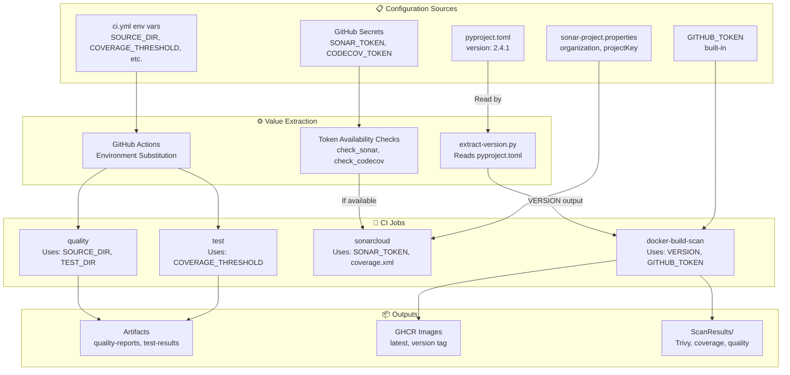

# SparseTagging Build Process Documentation

## Overview

This document provides a comprehensive guide to the CI/CD pipeline, external service integrations, and development workflow for the SparseTagging project. It covers everything from initial repository setup to deployment and troubleshooting.

**Intended Audience:**
- New contributors setting up local development environment
- DevOps engineers configuring CI/CD infrastructure
- Maintainers understanding the complete build pipeline

## Table of Contents

- [Configuration Flow](#configuration-flow)
- [External Service Setup](#external-service-setup)
  - [GitHub Repository Settings](#github-repository-settings)
  - [SonarCloud](#sonarcloud)
  - [CodeCov](#codecov)
  - [GitHub Container Registry (GHCR)](#github-container-registry-ghcr)
  - [GitHub Actions](#github-actions)
- [Development Workflow](#development-workflow)
- [Contributor Setup](#contributor-setup)
- [CI/CD Pipeline Deep Dive](#cicd-pipeline-deep-dive)
- [Troubleshooting](#troubleshooting)
- [Reference](#reference)

## Prerequisites

- **GitHub account** with repository access
- **Python 3.10+** installed locally
- **Git** configured with user credentials
- **Docker** (optional, for local container builds)
- **(Optional)** SonarCloud and CodeCov accounts for full CI features

---

## Configuration Flow

This section illustrates how configuration values flow from various sources into the CI/CD pipeline.



### Configuration Sources Explained

#### 1. pyproject.toml
**Location:** Repository root
**Purpose:** Single source of truth for version number

The version is dynamically extracted at build time by `.github/scripts/extract-version.py`:
```python
# Reads: data.get("project", {}).get("version")
# Current value: "2.4.1"
```

Used in:
- Docker image tags (`ghcr.io/cgbraun/sparsetagging:2.4.1`)
- Artifact summaries
- Docker image labels

#### 2. ci.yml Environment Variables
**Location:** `.github/workflows/ci.yml` lines 9-22
**Purpose:** Centralized configuration for paths and thresholds

```yaml
env:
  SOURCE_DIR: "src"
  TEST_DIR: "tests"
  COVERAGE_THRESHOLD: "85"
  ARTIFACT_RETENTION_DAYS: "90"
  IMAGE_RETENTION_DAYS: "30"
  PRIMARY_PYTHON_VERSION: "3.11"
```

These variables are substituted throughout the workflow using `${{ env.SOURCE_DIR }}` syntax.

#### 3. GitHub Secrets
**Location:** Repository Settings → Secrets and variables → Actions
**Purpose:** Secure storage of authentication tokens

- `SONAR_TOKEN` - SonarCloud authentication
- `CODECOV_TOKEN` - CodeCov upload token
- `GITHUB_TOKEN` - Built-in GitHub Actions token (automatic)

#### 4. sonar-project.properties
**Location:** Repository root
**Purpose:** SonarCloud project configuration

Key settings:
```properties
sonar.organization=cgbraun
sonar.projectKey=cgbraun_SparseTagging
sonar.sources=src
sonar.tests=tests
sonar.python.coverage.reportPaths=coverage.xml
```

#### 5. Graceful Degradation
The pipeline checks token availability before using optional services:
- If `SONAR_TOKEN` is missing → SonarCloud scan skipped (warning logged)
- If `CODECOV_TOKEN` is missing → CodeCov upload skipped (warning logged)
- Pipeline continues successfully in both cases

---

## External Service Setup

This section provides step-by-step setup instructions for all external services integrated with the CI/CD pipeline.

### GitHub Repository Settings

#### Required Secrets

| Secret Name | Purpose | How to Get | Required? |
|-------------|---------|------------|-----------|
| `SONAR_TOKEN` | SonarCloud authentication | Generate at [SonarCloud Security](https://sonarcloud.io/account/security) | Optional* |
| `CODECOV_TOKEN` | Coverage upload | Get from [CodeCov Settings](https://app.codecov.io/gh/cgbraun/SparseTagging/settings) | Optional* |

*Optional means the CI pipeline will skip these services gracefully if tokens are missing.

**Setup Steps:**
1. Navigate to repository **Settings**
2. Go to **Secrets and variables** → **Actions**
3. Click **"New repository secret"**
4. Add each secret with exact name shown above
5. Paste token value (will be masked automatically)
6. Click **"Add secret"**

#### Environment Configuration

The workflow uses a protected environment named `CGB` for the sonarcloud job.

**Setup Steps:**
1. Go to **Settings** → **Environments**
2. Click **"New environment"**
3. Name it exactly `CGB`
4. (Optional) Add deployment protection rules:
   - Required reviewers (select maintainers)
   - Wait timer (e.g., 5 minutes)
   - Deployment branches: `main` only

**Why use environments?**
- Adds approval gates for production deployments
- Separates secrets by environment (dev/staging/prod)
- Provides deployment history and audit logs

#### GitHub Actions Permissions

Ensure the following permissions are enabled:

**Settings → Actions → General → Workflow permissions:**
- ✅ **Read and write permissions** (allows committing scan results)
- ✅ **Allow GitHub Actions to create and approve pull requests**

**Settings → Code security and analysis:**
- ✅ **GitHub Actions** (allows SARIF security uploads)

**Settings → Packages (for GHCR):**
- Packages inherit repository visibility by default
- To make images public: Go to package settings → "Change visibility"

---

### SonarCloud

**Purpose:** Code quality and security analysis with quality gates.

**Official Documentation:** https://docs.sonarcloud.io/

#### Account Setup

**1. Create SonarCloud Account**
- Go to https://sonarcloud.io/
- Click **"Log in"** → **"With GitHub"**
- Authorize SonarCloud to access your GitHub account
- Accept permissions request

**2. Create Organization**
- Click **"+"** → **"Analyze new project"**
- Import organization from GitHub: `cgbraun`
- Choose organization name (must match): `cgbraun`
- Organization will be linked to your GitHub org

**3. Create Project**
- Click **"Analyze new project"**
- Select repository: `SparseTagging`
- Project Key (auto-generated): `cgbraun_SparseTagging`
- Click **"Set Up"**

**4. Generate Token**
- Go to **Account** → **Security**: https://sonarcloud.io/account/security
- Click **"Generate Tokens"**
- Token Name: `SparseTagging-CI`
- Type: **Global Analysis Token**
- Expiration: **No expiration** (or set to 90 days and rotate regularly)
- Click **"Generate"**
- **Copy token immediately** (won't be shown again)
- Add to GitHub repository secrets as `SONAR_TOKEN`

**5. Configure Project** (already done)
File exists: `sonar-project.properties`

Key settings:
```properties
sonar.organization=cgbraun
sonar.projectKey=cgbraun_SparseTagging
sonar.projectName=SparseTag
sonar.projectVersion=2.4.1
sonar.sources=src
sonar.tests=tests
sonar.python.version=3.10,3.11,3.12,3.13
sonar.python.coverage.reportPaths=coverage.xml
sonar.qualitygate.wait=true
sonar.qualitygate.timeout=300
sonar.newCode.referenceBranch=main
```

#### Quality Gate Configuration

- **Default quality gate** is used (SonarWay)
- Configured in SonarCloud UI: **Project** → **Quality Gates**

**Current requirements:**
- Coverage on new code: ≥85%
- Duplicated lines on new code: ≤3%
- Maintainability rating: A
- Reliability rating: A
- Security rating: A
- Security review rating: A

**To customize:**
1. Go to **Quality Gates** in SonarCloud
2. Click **"Create"** or edit existing gate
3. Add/modify conditions
4. Assign to project

#### Viewing Results

- **Dashboard:** https://sonarcloud.io/project/overview?id=cgbraun_SparseTagging
- **In PRs:** Results appear automatically as PR checks
- Click **"Details"** next to "SonarCloud" check to view full report
- Review issues categorized as: Bugs, Vulnerabilities, Code Smells, Security Hotspots

---

### CodeCov

**Purpose:** Code coverage visualization and tracking over time.

**Official Documentation:** https://docs.codecov.com/

#### Account Setup

**1. Link GitHub Account**
- Go to https://codecov.io/
- Click **"Sign Up"** → **"Sign up with GitHub"**
- Authorize Codecov to access your repositories
- Accept permissions

**2. Add Repository**
- Click **"Add new repository"**
- Select `cgbraun/SparseTagging` from list
- Click **"Setup repo"**
- Copy the **repository upload token** displayed

**3. Configure GitHub Secret**
- Go to GitHub repository **Settings** → **Secrets**
- Add secret: `CODECOV_TOKEN`
- Paste token from step 2
- Click **"Add secret"**

#### Configuration

**No codecov.yml needed** - project uses defaults.

**Coverage upload settings** (configured in ci.yml):
- **OS:** ubuntu-latest only (avoid duplicate uploads)
- **Python:** 3.11 only (primary version)
- **Branch:** All branches (PR and main)
- **Format:** XML (coverage.xml from pytest-cov)

**Why only one matrix combination uploads?**
- Avoids duplicate coverage reports (all Python versions test same code)
- Reduces API quota usage
- Faster CI execution

#### Viewing Results

- **Dashboard:** https://app.codecov.io/gh/cgbraun/SparseTagging
- **Coverage trends** over time (graphs)
- **File-level coverage** browser
- **PR comments** with coverage diff (shows +/- changes)
- **Commit history** with coverage percentages

**Understanding coverage metrics:**
- **Line coverage:** Percentage of code lines executed
- **Branch coverage:** Percentage of conditional branches taken
- **Complexity:** Cyclomatic complexity score

---

### GitHub Container Registry (GHCR)

**Purpose:** Host Docker images for distribution.

**Official Documentation:** https://docs.github.com/en/packages

#### Setup

**No manual setup required!** GHCR uses the built-in `GITHUB_TOKEN`.

#### Permissions Required

- Workflow must have `packages: write` permission (✅ already configured in ci.yml line 273)
- Personal account must have package access (automatic for repo maintainers)
- Repository visibility determines package visibility (public repo = public packages by default)

#### Image Naming Convention

Images are pushed with two tags:
- `ghcr.io/cgbraun/sparsetagging:latest` - Always points to latest main branch build
- `ghcr.io/cgbraun/sparsetagging:2.4.1` - Version-specific tag (from pyproject.toml)

**Tag strategy:**
- `latest` - Rolling tag, updated on every main branch build
- `<version>` - Immutable tag, never overwritten
- `<sha>` - Git commit SHA (used internally in CI, not pushed)

#### Accessing Images

**Public images** (if repository is public):
```bash
# Pull latest
docker pull ghcr.io/cgbraun/sparsetagging:latest

# Pull specific version
docker pull ghcr.io/cgbraun/sparsetagging:2.4.1

# Run container
docker run --rm ghcr.io/cgbraun/sparsetagging:latest
```

**Private images** (requires authentication):
```bash
# Create personal access token (PAT) with read:packages scope
# Go to: Settings → Developer settings → Personal access tokens

# Login to GHCR
echo $GITHUB_TOKEN | docker login ghcr.io -u USERNAME --password-stdin

# Pull image
docker pull ghcr.io/cgbraun/sparsetagging:latest
```

#### Viewing Images

1. Go to repository main page
2. Look for **"Packages"** section in right sidebar
3. Click on `sparsetagging` package name
4. View versions, tags, and metadata
5. See download statistics and vulnerability scans

**Package settings:**
- Change visibility (public/private/internal)
- Delete versions
- View security advisories
- Configure access permissions

---

### GitHub Actions

**Purpose:** CI/CD automation platform (built into GitHub).

**Official Documentation:** https://docs.github.com/en/actions

#### No External Setup Required

GitHub Actions is built-in and requires no additional accounts or subscriptions.

**Free tier limits:**
- Public repositories: Unlimited minutes
- Private repositories: 2,000 minutes/month (Free plan)

#### GITHUB_TOKEN

The `GITHUB_TOKEN` is automatically provided to every workflow run.

**Key characteristics:**
- Automatically created at workflow start
- Scoped to repository access only
- Expires when workflow completes
- No manual configuration needed

**Permissions configured per-job:**
- `sonarcloud` job: `contents: read`, `pull-requests: read`
- `docker-build-scan` job: `contents: write`, `packages: write`, `security-events: write`, `actions: read`

**Used for:**
- Checking out code (`actions/checkout`)
- Uploading/downloading artifacts
- Pushing to GHCR
- Uploading SARIF security results
- Committing scan results to repository

**Security best practice:**
- Use minimal permissions per job (principle of least privilege)
- Never expose token in logs
- Use `${{ secrets.GITHUB_TOKEN }}` syntax (GitHub masks it automatically)

#### Artifact Storage

**Default retention:** 90 days (configurable: `ARTIFACT_RETENTION_DAYS` env var)

**Artifacts stored:**
- `quality-reports/` - ruff-lint.txt, ruff-format.txt, mypy-report.txt
- `test-results/` - pytest-output.txt, pytest-results.xml (per matrix combination)
- `coverage-report/` - coverage.xml
- `docker-image/` - sparsetagging.tar (30-day retention)
- `trivy-scan/` - trivy-results.sarif, trivy-report.txt, sbom.spdx.json

**Storage limits:**
- Public repositories: 500 MB per artifact, unlimited total
- Private repositories: 500 MB per artifact, depends on plan

#### Viewing Workflow Runs

1. Go to repository → **Actions** tab
2. See list of workflow runs (shows status: success/failure/running)
3. Click on run to see jobs and summary
4. Click on job name to see step logs
5. Expand steps to see detailed output
6. Download artifacts from run summary page (bottom right)

**Filtering runs:**
- By workflow name
- By branch
- By actor (who triggered it)
- By status (success, failure, cancelled)

---

## Development Workflow

This section illustrates the complete development lifecycle from local changes to production deployment.

```mermaid
graph LR
    %% Local Development
    subgraph Local["💻 Local Development"]
        EDIT[Edit Code]
        TEST_LOCAL[Run Tests Locally<br/>pytest tests/]
        COMMIT[Git Commit]
    end

    %% Push & PR
    subgraph GitHub["🌐 GitHub"]
        PUSH[Git Push]
        CREATE_PR[Create Pull Request]
    end

    %% PR CI Pipeline
    subgraph PR_CI["🔬 PR CI Pipeline"]
        PR_QUALITY[quality job<br/>ruff, mypy]
        PR_TEST[test job<br/>8x matrix]
        PR_SONAR[sonarcloud job<br/>quality gate]
        PR_HEALTH[service-health-check]
        PR_DOCKER_BUILD[docker-build-scan<br/>Build only, no push]
    end

    %% Review & Merge
    subgraph Review["👀 Code Review"]
        REVIEW[Review PR]
        APPROVE[Approve & Merge]
    end

    %% Main Branch CI
    subgraph Main_CI["🚀 Main Branch CI"]
        MAIN_QUALITY[quality job]
        MAIN_TEST[test job]
        MAIN_SONAR[sonarcloud job]
        MAIN_DOCKER[docker-build-scan<br/>FULL PIPELINE]
    end

    %% Artifacts & Outputs
    subgraph Outputs["📦 Outputs & Artifacts"]
        SCAN_DIR[ScanResults/<br/>timestamp/]
        GHCR[GHCR Images<br/>latest + version]
        ARTIFACTS[GitHub Artifacts<br/>90-day retention]
    end

    %% Flow
    EDIT --> TEST_LOCAL
    TEST_LOCAL --> COMMIT
    COMMIT --> PUSH
    PUSH --> CREATE_PR

    CREATE_PR --> PR_QUALITY
    PR_QUALITY --> PR_TEST
    PR_TEST --> PR_SONAR
    PR_QUALITY --> PR_HEALTH
    PR_TEST --> PR_DOCKER_BUILD

    PR_SONAR --> REVIEW
    PR_DOCKER_BUILD --> REVIEW
    REVIEW --> APPROVE

    APPROVE --> MAIN_QUALITY
    MAIN_QUALITY --> MAIN_TEST
    MAIN_TEST --> MAIN_SONAR
    MAIN_QUALITY --> MAIN_DOCKER
    MAIN_TEST --> MAIN_DOCKER

    MAIN_DOCKER --> SCAN_DIR
    MAIN_DOCKER --> GHCR
    MAIN_DOCKER --> ARTIFACTS
```



### Development Workflow Stages

#### Stage 1: Local Development

**Activities:**
- Edit source code in `src/` directory
- Add/modify tests in `tests/` directory
- Run tests locally: `pytest tests/`
- Run linting: `ruff check src/ tests/`
- Run formatting: `ruff format src/ tests/`
- Run type checking: `mypy src/`

**Best practices:**
- Write tests before implementing features (TDD)
- Run full test suite before committing
- Fix all linting/type errors locally
- Use meaningful commit messages

**Local commands:**
```bash
# Run all checks (same as CI)
pytest tests/
ruff check src/ tests/
ruff format --check src/ tests/
mypy src/sparsetag.py src/cache_manager.py src/exceptions.py

# Run with coverage report
pytest --cov=src --cov-report=html tests/
# View coverage: open htmlcov/index.html
```

#### Stage 2: Push & Create PR

**Activities:**
- Push feature branch to GitHub
- Create Pull Request targeting `main`
- Fill in PR description (what/why/how)
- Add reviewers

**Commands:**
```bash
git push origin feature/your-feature-name
```

**PR triggers CI automatically:**
- Workflow triggers on `pull_request` to `main`
- All quality checks run
- Status checks appear at bottom of PR
- Cannot merge until all checks pass

#### Stage 3: PR CI Pipeline

**Jobs that run on PR:**

✅ **quality** (5 min timeout)
- Ruff linting (exits with code if issues found)
- Ruff formatting check
- Mypy type checking
- Uploads: quality-reports artifact

✅ **test** (5 min timeout × 8 jobs)
- Matrix: 2 OS × 4 Python versions = 8 parallel jobs
  - ubuntu-latest: Python 3.10, 3.11, 3.12, 3.13
  - windows-latest: Python 3.10, 3.11, 3.12, 3.13
- Runs pytest with coverage
- Uploads: test-results artifact (per matrix job)
- CodeCov upload: Only ubuntu-latest + Python 3.11

✅ **sonarcloud** (5 min timeout)
- Depends on: quality job
- Runs pytest with coverage (again, for SonarCloud)
- Uploads coverage.xml to SonarCloud
- Quality gate check (blocks if fails)

✅ **service-health-check** (5 min timeout)
- Independent job (no dependencies)
- Checks: PyPI, Docker Hub, SonarCloud, GHCR
- Logs warnings if services unavailable
- Never fails CI (continue-on-error: true)

✅ **docker-build-scan** (5 min timeout)
- Depends on: quality, test
- Builds Docker image (tagged with git SHA)
- Runs 3× Trivy security scans:
  - SARIF format (CRITICAL + HIGH only)
  - Table format (CRITICAL + HIGH + MEDIUM)
  - SBOM (Software Bill of Materials)
- Uploads SARIF to GitHub Security tab

**Jobs that DON'T run on PR:**
- ❌ GHCR push (main branch only)
- ❌ Scan results commit (main branch only)
- ❌ Docker smoke tests (main branch only)
- ❌ Artifact downloads from previous jobs (main branch only)

**What you see:**
- Green checkmarks ✅ if all pass
- Red X ❌ if any fail
- Yellow circle 🟡 if running
- Click **"Details"** to see logs for each job
- SonarCloud posts comment with quality gate result

#### Stage 4: Code Review & Approval

**Reviewer activities:**
- Examine code changes (diff view)
- Check CI results (all must be green)
- Review SonarCloud quality gate
- Test locally if needed
- Request changes or approve

**Merge strategies:**
- **Squash and merge** (recommended) - Combines all commits into one
- **Merge commit** - Preserves all commits with merge commit
- **Rebase and merge** - Replays commits on top of main

**Pre-merge checklist:**
- ✅ All CI checks passed
- ✅ SonarCloud quality gate passed
- ✅ Code review approved
- ✅ Branch up to date with main
- ✅ No merge conflicts

#### Stage 5: Main Branch CI (Full Pipeline)

**Triggered on:** Merge to `main` or direct push to `main`

**All same jobs as PR, PLUS additional steps:**

**quality job:**
- Same as PR (no changes)

**test job:**
- Same as PR (no changes)

**sonarcloud job:**
- Same as PR (no changes)

**docker-build-scan job (ENHANCED):**
- ✅ Extract version from pyproject.toml
- ✅ Build Docker image
- ✅ Run Trivy scans
- ✅ **Download artifacts** from quality/test jobs (NEW)
- ✅ **Save scan results** to `ScanResults/YYYY-MM-DD_HH-MM-SS/` (NEW)
- ✅ **Commit results** to repository (NEW)
- ✅ **Verify Docker image exists** (NEW)
- ✅ **Run smoke tests** (3 tests: import, version, functionality) (NEW)
- ✅ **Login to GHCR** (NEW)
- ✅ **Push to GHCR** (NEW)
  - `ghcr.io/cgbraun/sparsetagging:latest`
  - `ghcr.io/cgbraun/sparsetagging:2.4.1`

**Duration:** ~5-7 minutes total (parallel execution)

#### Stage 6: Outputs & Artifacts

**Generated on every run (PR and main):**

Artifacts (90-day retention):
- `quality-reports/` - ruff-lint.txt, ruff-format.txt, mypy-report.txt
- `test-results/` - pytest outputs (8 jobs)
- `coverage-report/` - coverage.xml

**Generated on main branch only:**

**ScanResults directory** (committed to repo):
```
ScanResults/
└── 2026-01-08_14-30-45/
    ├── README.md                    # Vulnerability summary
    ├── trivy-results.sarif          # Machine-readable security findings
    ├── trivy-report.txt             # Human-readable security report
    ├── sbom.spdx.json               # Software Bill of Materials
    ├── coverage.xml                 # Code coverage data
    ├── ruff-lint.txt                # Linting results
    ├── ruff-format.txt              # Formatting check results
    ├── mypy-report.txt              # Type checking results
    └── test-results/                # Test outputs from all matrix jobs
        ├── test-results-ubuntu-latest-3.10/
        ├── test-results-ubuntu-latest-3.11/
        └── ...
```

**GHCR Docker images:**
- `ghcr.io/cgbraun/sparsetagging:latest` (overwritten each push)
- `ghcr.io/cgbraun/sparsetagging:2.4.1` (immutable, version-specific)

**GitHub Security tab:**
- Trivy SARIF upload creates security alerts
- View at: Security → Code scanning alerts

**Package page:**
- View at: https://github.com/cgbraun?tab=packages
- Shows version history, pull commands, vulnerability scans

---

## Contributor Setup

This section guides new contributors through setting up their local development environment.

### Prerequisites

- **Git** installed and configured
- **Python 3.10+** installed (3.11 recommended)
- **GitHub account** with repository access
- **Text editor** or IDE (VS Code, PyCharm, etc.)

### Step 1: Clone Repository

```bash
# Clone via HTTPS
git clone https://github.com/cgbraun/SparseTagging.git
cd SparseTagging

# OR clone via SSH (if SSH keys configured)
git clone git@github.com:cgbraun/SparseTagging.git
cd SparseTagging
```

**Verify clone:**
```bash
ls -la
# Should see: src/, tests/, .github/, pyproject.toml, etc.
```

### Step 2: Configure Git (First Time Only)

```bash
# Set your name and email (appears in commits)
git config --global user.name "Your Name"
git config --global user.email "your.email@example.com"

# Verify configuration
git config --global --list

# Optional: Set default branch name
git config --global init.defaultBranch main
```

**Why this matters:**
- Git requires user.name and user.email for commits
- CI pipeline commits scan results on main branch
- Git will fail if these aren't configured

### Step 3: Set Up Python Environment

#### Option A: Using venv (Recommended)

**Windows:**
```bash
# Create virtual environment
python -m venv .venv

# Activate environment
.venv\Scripts\activate

# Verify activation (prompt should show (.venv))
```

**Linux/Mac:**
```bash
# Create virtual environment
python3 -m venv .venv

# Activate environment
source .venv/bin/activate

# Verify activation (prompt should show (.venv))
```

**Deactivate when done:**
```bash
deactivate
```

#### Option B: Using conda

```bash
# Create environment
conda create -n sparsetagging python=3.11

# Activate environment
conda activate sparsetagging

# Verify Python version
python --version  # Should show Python 3.11.x
```

### Step 4: Install Dependencies

```bash
# Ensure virtual environment is activated

# Install package in editable mode (changes reflect immediately)
pip install -e .

# Install development dependencies
pip install -r requirements-dev.txt
```

**Development dependencies include:**
- `pytest` - Testing framework
- `pytest-cov` - Coverage plugin
- `ruff` - Linting and formatting
- `mypy` - Type checking
- `pre-commit` - Git hook framework (optional)

**Verify installation:**
```bash
pip list | grep -E "pytest|ruff|mypy|sparsetagging"
```

### Step 5: Verify Installation

Run the same checks as CI to ensure everything works:

```bash
# Run tests (should pass all)
pytest tests/

# Run linter (should show no errors)
ruff check src/ tests/

# Check formatting (should show no changes needed)
ruff format --check src/ tests/

# Run type checker (should show no type errors)
mypy src/sparsetag.py src/cache_manager.py src/exceptions.py
```

**Expected output:**
- pytest: Green passing tests
- ruff check: `All checks passed!`
- ruff format: No files would be reformatted
- mypy: `Success: no issues found in X source files`

**If tests fail:**
- Check Python version (`python --version`)
- Ensure dependencies installed (`pip list`)
- Check for platform-specific issues (Windows vs Linux)

### Step 6: Optional: Set Up Pre-commit Hooks

Pre-commit hooks automatically run quality checks before each commit.

```bash
# Install pre-commit (if not already in requirements-dev.txt)
pip install pre-commit

# Install git hooks
pre-commit install

# Test hooks on all files (optional)
pre-commit run --all-files
```

**Configured hooks** (see `.pre-commit-config.yaml`):
- Ruff linting and formatting
- Mypy type checking
- Trailing whitespace removal
- End-of-file fixer
- YAML syntax check
- Large file check (prevents committing >1MB files)

**How it works:**
- Runs automatically on `git commit`
- If checks fail, commit is aborted
- Fix issues and try commit again
- Skip hooks with `git commit --no-verify` (not recommended)

**Disable pre-commit hooks:**
```bash
pre-commit uninstall
```

### Step 7: Development Workflow

#### Create Feature Branch

```bash
# Update main branch
git checkout main
git pull origin main

# Create feature branch (use descriptive name)
git checkout -b feature/add-caching
# OR for bug fixes
git checkout -b fix/handle-empty-arrays
```

**Branch naming conventions:**
- `feature/description` - New features
- `fix/description` - Bug fixes
- `docs/description` - Documentation changes
- `refactor/description` - Code refactoring
- `test/description` - Adding/updating tests

#### Make Changes & Test

```bash
# Edit code in src/ or tests/
# ...

# Run tests
pytest tests/

# Run specific test file
pytest tests/test_sparsetag.py

# Run specific test function
pytest tests/test_sparsetag.py::test_query_single_column

# Run with coverage
pytest --cov=src tests/

# Generate HTML coverage report
pytest --cov=src --cov-report=html tests/
# Open htmlcov/index.html in browser
```

**Test-driven development (TDD):**
1. Write test first (it fails - red)
2. Implement feature (test passes - green)
3. Refactor code (tests still pass)
4. Repeat

#### Commit & Push

```bash
# Stage changes
git add src/sparsetag.py tests/test_sparsetag.py

# OR stage all changes
git add .

# Commit with message
git commit -m "feat: add query result caching"

# Push to GitHub
git push origin feature/add-caching
```

**Commit message format:**
```
<type>: <short description>

<optional detailed description>

<optional footer: issue references, breaking changes>
```

**Types:**
- `feat` - New feature
- `fix` - Bug fix
- `docs` - Documentation changes
- `test` - Adding/updating tests
- `refactor` - Code refactoring (no functional change)
- `chore` - Maintenance tasks (dependencies, configs)
- `perf` - Performance improvements

**Examples:**
```
feat: add LRU cache eviction policy

Implements least-recently-used eviction when cache reaches max size.
Improves memory management for long-running applications.

Closes #42
```

```
fix: handle empty sparse matrices in query operations

Previously threw IndexError on empty matrices. Now returns empty
QueryResult instead.

Fixes #38
```

#### Create Pull Request

1. Go to GitHub repository page
2. Click **"Pull requests"** tab
3. Click **"New pull request"**
4. **Base:** `main` ← **Compare:** `feature/add-caching`
5. Fill in PR description:
   - **What:** What changes were made
   - **Why:** Why changes were needed
   - **How:** How changes were implemented
   - **Testing:** How to test the changes
6. Click **"Create pull request"**
7. Wait for CI checks to complete (~3-5 minutes)
8. Request review from maintainer
9. Address review feedback if needed
10. Merge when approved and CI passes

**PR template tips:**
- Link related issues (`Closes #123`)
- Include screenshots for UI changes
- Mention breaking changes
- List testing performed locally

### Step 8: Understanding CI Feedback

#### Green Checkmarks ✅

**Meaning:** All checks passed
- Quality checks passed (ruff, mypy)
- All tests passed (8 matrix combinations)
- SonarCloud quality gate passed
- Docker build succeeded
- Ready for review

**Next steps:**
- Request code review
- Address review feedback
- Merge when approved

#### Red X ❌ Failed Checks

**quality job failed:**

**Symptoms:**
- ❌ Red X next to "quality" check

**How to debug:**
1. Click **"Details"** next to failed check
2. See which step failed (ruff lint, ruff format, or mypy)
3. View error output in logs

**How to fix:**
```bash
# If ruff lint failed
ruff check src/ tests/
# Fix reported issues
ruff check --fix src/ tests/  # Auto-fix some issues

# If ruff format failed
ruff format src/ tests/
# Commit formatting changes

# If mypy failed
mypy src/sparsetag.py src/cache_manager.py src/exceptions.py
# Fix type errors in code
```

4. Commit fix and push
5. CI automatically re-runs

**test job failed:**

**Symptoms:**
- ❌ Red X next to "test" check
- May show matrix job that failed (e.g., "ubuntu-latest, Python 3.10")

**How to debug:**
1. Click **"Details"**
2. Find failed matrix job (e.g., windows-latest, Python 3.13)
3. View pytest output to see which test failed
4. Look for error message and traceback

**How to fix:**
```bash
# Run tests locally (same Python version if possible)
pytest tests/ -v

# Run specific failing test
pytest tests/test_sparsetag.py::test_name -v

# Debug with prints
pytest tests/ -v -s  # -s shows print statements

# Check for platform-specific issues (Windows vs Linux)
```

5. Fix test or code
6. Commit and push

**sonarcloud job failed:**

**Symptoms:**
- ❌ Red X next to "SonarCloud" check
- Comment on PR with quality gate failure

**How to debug:**
1. Click **"Details"** → Opens SonarCloud dashboard
2. View issues categorized as:
   - **Bugs** - Potential runtime errors
   - **Code Smells** - Maintainability issues
   - **Security Hotspots** - Security-sensitive code to review
   - **Vulnerabilities** - Known security issues
3. Click on issue to see:
   - Issue description
   - Why it's a problem
   - How to fix it
   - Code location

**How to fix:**
- Address critical issues (blockers and critical severity)
- Review security hotspots (mark as safe if intentional)
- Fix code smells to improve maintainability
- Commit fixes and push
- SonarCloud re-analyzes automatically

**docker-build-scan job failed:**

**Symptoms:**
- ❌ Red X next to "docker-build-scan" check

**Common causes:**
- Docker build failed (syntax error in Dockerfile)
- Trivy scan found CRITICAL vulnerabilities
- Image verification failed

**How to debug:**
1. Click **"Details"**
2. Find failed step (Build Docker image, Trivy scan, etc.)
3. View error logs

**How to fix:**
```bash
# Test Docker build locally
docker build -t sparsetagging:test .

# Run Trivy scan locally
docker run --rm aquasec/trivy image sparsetagging:test

# Fix Dockerfile or update base image
# Commit and push
```

#### Yellow Circle 🟡 Running

**Meaning:** CI checks in progress

**Duration:** Usually 3-5 minutes for full pipeline

**What's happening:**
- Jobs running in parallel
- View progress by clicking on check name
- Live logs available (auto-refreshes)

**Patience:**
- Wait for completion
- Do NOT force-push while CI runs (cancels jobs)
- If taking >10 minutes, check for hung jobs

### Step 9: Local Development Best Practices

**Before committing:**
1. ✅ Run tests: `pytest tests/`
2. ✅ Run linter: `ruff check src/ tests/`
3. ✅ Run formatter: `ruff format src/ tests/`
4. ✅ Run type checker: `mypy src/`
5. ✅ Review changes: `git diff`

**During development:**
- Commit frequently (small, logical commits)
- Write descriptive commit messages
- Keep commits focused (one concern per commit)
- Avoid committing commented-out code
- Don't commit debug print statements
- Update tests when changing behavior

**Code style:**
- Follow PEP 8 (enforced by ruff)
- Use type hints (required for new code)
- Write docstrings for public functions
- Keep functions small and focused
- Prefer explicit over implicit
- Use descriptive variable names

**Testing:**
- Aim for ≥85% code coverage
- Test edge cases and error conditions
- Use meaningful test names (`test_query_returns_empty_result_for_no_matches`)
- Organize tests by feature/module
- Use fixtures for common setup (pytest fixtures)

**Performance:**
- Profile before optimizing
- Benchmark performance-critical code
- Use `src/benchmark.py` for comprehensive benchmarks
- Document performance characteristics

---

## CI/CD Pipeline Deep Dive

This section provides a detailed job-by-job breakdown of the CI/CD pipeline.

### Pipeline Overview

**Workflow file:** `.github/workflows/ci.yml`
**Triggers:** Push to `main`, Pull Request to `main`
**Total jobs:** 5 (quality, test, sonarcloud, service-health-check, docker-build-scan)
**Average duration:** 3-5 minutes (parallel execution)

### Job 1: quality

**Purpose:** Run code quality checks (linting, formatting, type checking)

**Configuration:**
- **Runs on:** ubuntu-latest
- **Timeout:** 5 minutes
- **Python version:** 3.11 (from `PRIMARY_PYTHON_VERSION` env var)
- **Dependencies:** None (runs independently)

**Steps:**
1. Checkout code (`actions/checkout@v4.3.1`)
2. Set up Python 3.11 with pip cache
3. Install dependencies (pip install -e . + requirements-dev.txt)
4. **Lint with ruff** (continue-on-error: true)
   - Runs: `ruff check src/ tests/`
   - Exit code captured in ruff-lint.txt
5. **Check formatting with ruff** (continue-on-error: true)
   - Runs: `ruff format --check src/ tests/`
   - Exit code captured in ruff-format.txt
6. **Type check with mypy** (continue-on-error: true)
   - Runs: `mypy src/sparsetag.py src/cache_manager.py src/exceptions.py`
   - Exit code captured in mypy-report.txt
7. Upload quality-reports artifact (90-day retention)

**Exit code capture:**
```bash
set +e  # Disable immediate exit on error
ruff check src/ tests/ > ruff-lint.txt 2>&1
EXIT_CODE=$?
echo "Exit code: ${EXIT_CODE}" >> ruff-lint.txt
exit ${EXIT_CODE}
```
This preserves real exit codes while allowing `continue-on-error` to work.

**Outputs:**
- Artifact: `quality-reports/` (ruff-lint.txt, ruff-format.txt, mypy-report.txt)

### Job 2: test

**Purpose:** Run test suite across multiple Python versions and operating systems

**Configuration:**
- **Runs on:** Matrix of 8 combinations
  - OS: ubuntu-latest, windows-latest
  - Python: 3.10, 3.11, 3.12, 3.13
- **Timeout:** 5 minutes per matrix job
- **Dependencies:** None (runs independently)
- **Strategy:** fail-fast: false (all jobs run even if one fails)

**Steps:**
1. Checkout code
2. Set up Python (matrix version) with pip cache
3. Install dependencies
4. **Run pytest with coverage** (continue-on-error: true)
   - Runs: `pytest tests/ --cov=src --cov-report=xml --cov-fail-under=85`
   - Exit code captured in pytest-output.txt
   - Generates: pytest-results.xml, coverage.xml
5. Upload test-results artifact (per matrix job)
6. **Check CODECOV_TOKEN availability** (only ubuntu-latest + Python 3.11)
7. **Upload coverage to CodeCov** (conditional)
   - Only if: ubuntu-latest + Python 3.11 + CODECOV_TOKEN available
   - Uses: `codecov/codecov-action@v4`

**Why test matrix?**
- Ensures compatibility across Python versions
- Catches platform-specific bugs (Windows vs Linux)
- Tests on environments users will use

**Why only one CodeCov upload?**
- Avoids duplicate coverage data
- All Python versions test same code (coverage is identical)
- Saves API quota and CI time

**Outputs:**
- Artifacts: `test-results/` (8 directories, one per matrix job)
- CodeCov: coverage.xml uploaded (only one job)

### Job 3: sonarcloud

**Purpose:** Run SonarCloud code quality and security analysis

**Configuration:**
- **Runs on:** ubuntu-latest
- **Timeout:** 5 minutes
- **Depends on:** quality job (needs: quality)
- **Environment:** CGB (protected environment)
- **Permissions:**
  - contents: read
  - pull-requests: read

**Steps:**
1. Checkout code (with full git history: fetch-depth: 0)
2. Set up Python 3.11
3. Install dependencies
4. **Run pytest with coverage**
   - Runs: `pytest tests/ --cov=src --cov-report=xml`
   - Generates coverage.xml for SonarCloud
5. **Check SONAR_TOKEN availability**
   - Verifies secret exists before proceeding
6. **SonarCloud Scan** (conditional on token)
   - Uses: `SonarSource/sonarcloud-github-action@ffc3010689...`
   - Reads config from: `sonar-project.properties`
   - Uploads: source code, test results, coverage data
   - Waits for quality gate (5 min timeout)
7. Upload coverage artifact

**Why full git history?**
- SonarCloud needs git history for blame information
- Identifies new code vs existing code
- Applies different quality standards (stricter for new code)

**Why separate pytest run?**
- SonarCloud needs its own coverage.xml
- Test job might not have run yet (parallel execution)
- Ensures fresh coverage data

**Quality gate:**
- Blocks merge if gate fails (red X)
- Posts comment on PR with results
- Links to detailed SonarCloud dashboard

**Outputs:**
- Artifact: `coverage-report/` (coverage.xml)
- SonarCloud: Analysis results, quality gate status

### Job 4: service-health-check

**Purpose:** Check availability of external services (PyPI, Docker Hub, SonarCloud, GHCR)

**Configuration:**
- **Runs on:** ubuntu-latest
- **Timeout:** 5 minutes
- **Dependencies:** None (runs independently)
- **Continue on error:** true (never fails CI)

**Steps:**
1. **Check external service availability**
   - Checks PyPI (https://pypi.org/simple/)
   - Checks Docker Hub (https://hub.docker.com/)
   - Checks SonarCloud (https://sonarcloud.io/)
   - Checks GHCR (https://ghcr.io/)

**Health check logic:**
```bash
STATUS=$(curl -s -o /dev/null -w "%{http_code}" https://pypi.org/simple/)
if [[ "$STATUS" =~ ^(200|3[0-9]{2})$ ]]; then
  echo "✅ PyPI is reachable (HTTP $STATUS)"
else
  echo "::warning::PyPI returned HTTP $STATUS"
fi
```

Accepts HTTP 200, 3xx redirects, and 405 (Method Not Allowed) as healthy.

**Why this job?**
- Early detection of service outages
- Helps debug CI failures (is it our code or external service?)
- Logs warnings but doesn't block CI

**Outputs:**
- None (logs only)

### Job 5: docker-build-scan

**Purpose:** Build Docker image, run security scans, push to GHCR (main branch only)

**Configuration:**
- **Runs on:** ubuntu-latest
- **Timeout:** 5 minutes
- **Depends on:** quality, test
- **Permissions:**
  - contents: write (for committing scan results)
  - packages: write (for GHCR push)
  - security-events: write (for SARIF upload)
  - actions: read (for artifact download)

**Steps:**

**Phase 1: Setup & Build (runs on all branches)**
1. Checkout code
2. Set up Python 3.11
3. Install tomllib (for version extraction)
4. **Extract version from pyproject.toml**
   - Runs: `python3 .github/scripts/extract-version.py`
   - Outputs: VERSION (e.g., "2.4.1")
5. **Build Docker image**
   - Uses: `docker/build-push-action@v6.10.0`
   - Tags: `sparsetagging:${{ github.sha }}`
   - Build arg: `APP_VERSION=${{ steps.get_version.outputs.version }}`
   - Push: false (load to local docker only)

**Phase 2: Security Scanning (runs on all branches)**

6. **Trivy scan - SARIF format**
   - Severities: CRITICAL,HIGH only
   - Output: trivy-results.sarif
   - For: GitHub Security tab upload

7. **Upload Trivy SARIF to GitHub Security**
   - Uses: `github/codeql-action/upload-sarif@v3`
   - Creates security alerts in Security tab

8. **Trivy scan - Table format**
   - Severities: CRITICAL,HIGH,MEDIUM
   - Output: trivy-report.txt
   - For: Human-readable report

9. **Trivy scan - SBOM**
   - Format: SPDX JSON
   - Output: sbom.spdx.json
   - Lists all dependencies with versions

10. Upload trivy-scan artifact

**Phase 3: Artifact Collection & Results Commit (main branch only)**

11. **Download quality-reports artifact** (if: main branch)
12. **Download coverage-report artifact** (if: main branch)
13. **Download test-results artifacts** (if: main branch)
    - Downloads all 8 matrix job artifacts

14. **Save security scan results to repository** (if: main branch)
    - Creates: `ScanResults/YYYY-MM-DD_HH-MM-SS/`
    - Copies: Trivy results, coverage, quality reports, test results
    - Generates: README.md with summary

15. **Generate comprehensive README** (if: main branch)
    - Parses vulnerability counts from SARIF
    - Parses quality gate exit codes
    - Counts test matrix pass/fail
    - Includes Docker smoke test results (if available)
    - Links to workflow run, security findings

16. **Commit and push scan results** (if: main branch)
    - Configures git user (github-actions[bot])
    - Commits ScanResults directory
    - Pushes to main branch

**Phase 4: Docker Image Validation & Push (main branch only)**

17. **Verify Docker image exists** (if: main branch)
    - Checks: `docker image inspect sparsetagging:${{ github.sha }}`
    - Fails if image not found

18. **Test Docker image (smoke tests)** (if: main branch)
    - Test 1: Import verification (`import sparsetagging`)
    - Test 2: Version check (reads APP_VERSION env var)
    - Test 3: Basic functionality (create random sparse matrix)
    - Results saved to docker-smoke-test-results.txt

19. **Login to GHCR** (if: main branch)
    - Uses: `docker/login-action@v3.3.0`
    - Registry: ghcr.io
    - Username: ${{ github.actor }}
    - Password: ${{ secrets.GITHUB_TOKEN }}

20. **Push to GHCR** (if: main branch)
    - Tags and pushes:
      - `ghcr.io/cgbraun/sparsetagging:latest`
      - `ghcr.io/cgbraun/sparsetagging:2.4.1`

21. Upload docker-image artifact (main branch only, 30-day retention)

**Why so many Trivy scans?**
- SARIF: Machine-readable format for GitHub Security integration
- Table: Human-readable format for README
- SBOM: Software bill of materials for supply chain security
- Each format serves different purpose

**Why conditional steps?**
- Artifact download: No artifacts available on PR (previous jobs didn't upload)
- Scan results commit: Don't commit to PR branches (pollutes history)
- GHCR push: Only deploy from main branch (stable releases)
- Smoke tests: Only test before pushing to registry

**Outputs:**
- Artifact: `trivy-scan/` (trivy-results.sarif, trivy-report.txt, sbom.spdx.json)
- Artifact: `docker-image/` (sparsetagging.tar - main branch only)
- Artifact: `docker-smoke-test-results.txt` (main branch only)
- ScanResults: Committed directory (main branch only)
- GHCR: Docker images (main branch only)

---

## Troubleshooting

This section provides solutions to common issues encountered during development and CI/CD.

### Token and Authentication Issues

#### Issue: "SonarCloud may be unavailable" warning

**Symptoms:**
- Warning in service-health-check job logs
- SonarCloud scan skipped

**Possible causes:**
1. SonarCloud service is actually down (rare)
2. Network connectivity issue
3. SONAR_TOKEN missing or invalid

**How to fix:**
1. **Check SonarCloud status:**
   - Visit https://sonarcloud.io/
   - Check status page: https://sonarcloud.statuspage.io/

2. **Verify SONAR_TOKEN exists:**
   - Go to repository Settings → Secrets → Actions
   - Check if `SONAR_TOKEN` is listed
   - If missing, regenerate at https://sonarcloud.io/account/security

3. **Check token validity:**
   - Generate new token in SonarCloud
   - Update GitHub secret
   - Re-run workflow

4. **If service is down:**
   - Wait for SonarCloud to recover
   - CI will skip scan gracefully (warning only)
   - Merge PR anyway (scan not blocking)

#### Issue: "CODECOV_TOKEN is empty" warning

**Symptoms:**
- Warning in test job logs
- Coverage upload skipped
- No CodeCov comment on PR

**Possible causes:**
1. CODECOV_TOKEN not configured in repository secrets
2. Token expired or revoked

**How to fix:**
1. **Check if token exists:**
   - Go to repository Settings → Secrets → Actions
   - Look for `CODECOV_TOKEN`

2. **Get token from CodeCov:**
   - Go to https://app.codecov.io/gh/cgbraun/SparseTagging
   - Click Settings → General
   - Copy "Repository Upload Token"

3. **Add/update token:**
   - Go to GitHub repository Settings → Secrets
   - Add or update `CODECOV_TOKEN`
   - Paste token value
   - Re-run workflow

4. **Verify upload:**
   - Check CodeCov dashboard for recent uploads
   - Look for PR comment with coverage diff

#### Issue: "GHCR push failed: authentication required"

**Symptoms:**
- docker-build-scan job fails on main branch
- Error: `unauthorized: authentication required`

**Possible causes:**
1. `packages: write` permission missing in workflow
2. GITHUB_TOKEN doesn't have package scope
3. Repository/package visibility mismatch

**How to fix:**
1. **Verify workflow permissions:**
   - Check `.github/workflows/ci.yml` line 273
   - Should have: `packages: write`

2. **Check repository settings:**
   - Settings → Actions → General → Workflow permissions
   - Select "Read and write permissions"
   - Check "Allow GitHub Actions to create and approve pull requests"

3. **Check package permissions:**
   - Go to package page (Packages tab)
   - Click on sparsetagging package
   - Settings → Manage Actions access
   - Ensure workflow has write access

4. **Re-run workflow:**
   - Go to Actions tab
   - Click on failed workflow run
   - Click "Re-run failed jobs"

### Test Failures

#### Issue: Tests pass locally but fail in CI

**Symptoms:**
- pytest passes on local machine
- CI shows test failures
- Error messages mention platform-specific behavior

**Possible causes:**
1. Platform differences (Windows vs Linux)
2. Python version differences
3. Missing test dependencies
4. Hardcoded paths or assumptions
5. Timezone or locale differences

**How to debug:**
1. **Check which matrix job failed:**
   - Look at job name (e.g., "ubuntu-latest, Python 3.10")
   - Note OS and Python version

2. **Reproduce locally:**
   ```bash
   # If failed on Windows + Python 3.13
   # Test on Windows machine with Python 3.13
   python --version  # Verify version
   pytest tests/ -v

   # OR use docker to test on Linux
   docker run -it --rm python:3.13 bash
   # Clone repo and run tests inside container
   ```

3. **Check for platform-specific code:**
   - Path separators (`/` vs `\`)
   - Line endings (LF vs CRLF)
   - File system case sensitivity
   - Available system libraries

4. **Use platform markers:**
   ```python
   import pytest
   import sys

   @pytest.mark.skipif(sys.platform == "win32", reason="Windows-specific issue")
   def test_something():
       pass
   ```

5. **Check dependencies:**
   ```bash
   # In CI logs, verify all dependencies installed
   # Look for version mismatches
   ```

**Common fixes:**
- Use `pathlib.Path` instead of string paths
- Use `os.linesep` instead of `\n`
- Mock platform-specific behavior
- Add conditional tests for different platforms

#### Issue: Tests fail with "ModuleNotFoundError"

**Symptoms:**
- Error: `ModuleNotFoundError: No module named 'sparsetag'`
- Happens in CI but not locally

**Possible causes:**
1. Package not installed in editable mode
2. Import path incorrect
3. Missing `__init__.py` in src directory

**How to fix:**
1. **Verify installation step in CI:**
   - Check `.github/workflows/ci.yml`
   - Should have: `pip install -e .`

2. **Check import statements:**
   ```python
   # Correct
   from sparsetag import SparseTag

   # Incorrect
   from src.sparsetag import SparseTag
   ```

3. **Ensure __init__.py exists:**
   ```bash
   ls -la src/
   # Should see: __init__.py
   ```

4. **Test locally:**
   ```bash
   # In fresh virtual environment
   pip install -e .
   python -c "import sparsetagging; print(sparsetagging.__version__)"
   ```

#### Issue: Flaky tests (pass sometimes, fail sometimes)

**Symptoms:**
- Tests pass on re-run without code changes
- Intermittent failures
- Error messages mention timing, random values, or order

**Possible causes:**
1. Race conditions (threading)
2. Non-deterministic behavior (random seeds not set)
3. Test order dependency
4. External resource dependency (network, filesystem)

**How to fix:**
1. **Set random seeds:**
   ```python
   import numpy as np
   import random

   def test_something():
       np.random.seed(42)
       random.seed(42)
       # ... test code
   ```

2. **Use fixtures for clean state:**
   ```python
   @pytest.fixture
   def clean_cache():
       cache = QueryCacheManager()
       yield cache
       cache.clear()
   ```

3. **Run tests in random order:**
   ```bash
   pytest tests/ --random-order
   # If fails, tests have order dependency
   ```

4. **Mock external dependencies:**
   ```python
   from unittest.mock import patch

   @patch('requests.get')
   def test_api_call(mock_get):
       mock_get.return_value.status_code = 200
       # ... test code
   ```

### Docker Build Failures

#### Issue: Docker build fails with "COPY failed"

**Symptoms:**
- Error: `COPY failed: file not found in build context`
- Docker build step fails in CI

**Possible causes:**
1. File path incorrect in Dockerfile
2. File not committed to repository
3. .dockerignore excluding needed files

**How to fix:**
1. **Check Dockerfile COPY statements:**
   ```dockerfile
   # Make sure file exists at path
   COPY src/ /app/src/
   COPY requirements.txt /app/
   ```

2. **Verify files exist:**
   ```bash
   ls -la src/
   ls -la requirements.txt
   ```

3. **Check .dockerignore:**
   ```bash
   cat .dockerignore
   # Make sure needed files NOT excluded
   ```

4. **Test build locally:**
   ```bash
   docker build -t sparsetagging:test .
   # Should build successfully
   ```

#### Issue: Docker image too large

**Symptoms:**
- Image size >1GB
- Slow push to GHCR
- Warning about large artifact

**Possible causes:**
1. Using full Python image (not slim)
2. Build artifacts included in final image
3. Large dependencies (numpy, scipy)

**How to fix:**
1. **Use multi-stage build** (already implemented)
2. **Use slim base image** (already using python:3.11-slim)
3. **Check image layers:**
   ```bash
   docker history sparsetagging:test
   # Look for large layers
   ```

4. **Remove unnecessary files:**
   ```dockerfile
   RUN pip install --no-cache-dir -r requirements.txt
   # --no-cache-dir reduces size
   ```

5. **Use .dockerignore:**
   ```
   .git
   .venv
   __pycache__
   *.pyc
   tests/
   docs/
   ```

### GHCR Push Failures

#### Issue: "error pushing to registry: denied"

**Symptoms:**
- GHCR push step fails on main branch
- Error: `denied: permission_denied: write_package`

**Possible causes:**
1. Workflow doesn't have packages:write permission
2. GitHub token scopes insufficient
3. Package already exists with different ownership

**How to fix:**
1. **Check workflow permissions:**
   ```yaml
   # In .github/workflows/ci.yml
   permissions:
     packages: write  # Must be present
   ```

2. **Verify repository settings:**
   - Settings → Actions → General
   - Workflow permissions: "Read and write permissions"

3. **Check package ownership:**
   - Go to Packages tab
   - If package exists, ensure it's owned by cgbraun
   - If orphaned, delete and recreate

4. **Re-run workflow:**
   - Actions → Failed workflow → Re-run all jobs

### Service Health Check Warnings

#### Issue: "Service may be unavailable" warnings for all services

**Symptoms:**
- Multiple warnings: PyPI, Docker Hub, SonarCloud, GHCR
- All health checks failing

**Possible causes:**
1. GitHub Actions runner network issue
2. Firewall blocking outbound connections
3. DNS resolution failure

**How to fix:**
1. **This is informational only** - doesn't block CI
2. **Check if CI jobs succeeded anyway:**
   - Look at other job results
   - If quality/test/docker jobs passed, ignore warnings

3. **If persistent:**
   - Report to GitHub Support
   - Check GitHub Actions status: https://www.githubstatus.com/

4. **Temporary workaround:**
   - Skip health check job (edit workflow)
   - Or comment out health checks

### General CI Issues

#### Issue: CI stuck or running too long

**Symptoms:**
- Jobs running >10 minutes (timeout: 5 min)
- Jobs stuck in "queued" state
- Workflow never starts

**Possible causes:**
1. GitHub Actions service degradation
2. No available runners
3. Concurrent job limit reached
4. Job dependency deadlock

**How to fix:**
1. **Check timeout:**
   - Each job has 5-minute timeout
   - Should auto-cancel if stuck

2. **Cancel and re-run:**
   - Go to Actions tab
   - Click on running workflow
   - Click "Cancel workflow"
   - Click "Re-run all jobs"

3. **Check GitHub status:**
   - Visit https://www.githubstatus.com/
   - Look for Actions incidents

4. **If recurring:**
   - Increase timeout (line: `timeout-minutes: 10`)
   - Check for infinite loops in code

#### Issue: "Resource not accessible by integration"

**Symptoms:**
- Error in workflow logs
- Step fails with permission error

**Possible causes:**
1. Workflow permissions insufficient
2. GITHUB_TOKEN scope too restrictive
3. Protected branch rules blocking action

**How to fix:**
1. **Check required permissions:**
   ```yaml
   permissions:
     contents: write      # For committing
     packages: write      # For GHCR
     security-events: write  # For SARIF
     actions: read        # For artifacts
   ```

2. **Verify token usage:**
   ```yaml
   - uses: actions/checkout@v4
     with:
       token: ${{ secrets.GITHUB_TOKEN }}  # Correct
   ```

3. **Check protected branch:**
   - Settings → Branches → main
   - Branch protection rules
   - Allow GitHub Actions to push (if committing)

---

## Reference

Quick reference for secrets, environment variables, configuration files, and action versions.

### Secrets and Tokens

| Name | Purpose | Source | Scope | Required |
|------|---------|--------|-------|----------|
| `SONAR_TOKEN` | SonarCloud authentication | [SonarCloud Security](https://sonarcloud.io/account/security) | Global Analysis Token | Optional |
| `CODECOV_TOKEN` | CodeCov upload | [CodeCov Settings](https://app.codecov.io) | Repository upload token | Optional |
| `GITHUB_TOKEN` | GitHub Actions authentication | Auto-generated | Repository access | Auto |

### Environment Variables

Defined in `.github/workflows/ci.yml` lines 9-22:

| Variable | Value | Usage |
|----------|-------|-------|
| `SOURCE_DIR` | `"src"` | Source code directory |
| `TEST_DIR` | `"tests"` | Test directory |
| `COVERAGE_THRESHOLD` | `"85"` | Minimum coverage percentage |
| `ARTIFACT_RETENTION_DAYS` | `"90"` | Artifact retention period |
| `IMAGE_RETENTION_DAYS` | `"30"` | Docker image retention |
| `PRIMARY_PYTHON_VERSION` | `"3.11"` | Python for quality/sonarcloud |

### Configuration Files

| File | Purpose | Key Settings |
|------|---------|--------------|
| `pyproject.toml` | Package metadata | `version = "2.4.1"` |
| `sonar-project.properties` | SonarCloud config | `sonar.organization`, `sonar.projectKey` |
| `.github/workflows/ci.yml` | CI/CD pipeline | Jobs, triggers, matrix |
| `.github/scripts/extract-version.py` | Version extraction | Reads pyproject.toml |
| `.dockerignore` | Docker build exclusions | `.git`, `.venv`, `tests/` |
| `Dockerfile` | Container image build | Multi-stage, Python 3.11-slim |

### GitHub Action Versions (Pinned SHAs)

Security best practice: Pin actions to specific commit SHAs.

| Action | Version | SHA | Usage |
|--------|---------|-----|-------|
| `actions/checkout` | v4.3.1 | `34e114876b0b11c390a56381ad16ebd13914f8d5` | Code checkout |
| `actions/setup-python` | v5.6.0 | `a26af69be951a213d495a4c3e4e4022e16d87065` | Python setup |
| `actions/upload-artifact` | v4.5.0 | `6f51ac03b9356f520e9adb1b1b7802705f340c2b` | Artifact upload |
| `actions/download-artifact` | v4.1.8 | `fa0a91b85d4f404e444e00e005971372dc801d16` | Artifact download |
| `docker/build-push-action` | v6.10.0 | (uses @vX.X.X tag) | Docker build |
| `docker/login-action` | v3.3.0 | `9780b0c442fbb1117ed29e0efdff1e18412f7567` | GHCR login |
| `aquasecurity/trivy-action` | (latest) | `18f2510ee396bbf400402947b394f2dd8c87dbb0` | Trivy scan |
| `github/codeql-action/upload-sarif` | v3 | (uses @vX tag) | SARIF upload |
| `SonarSource/sonarcloud-github-action` | (latest) | `ffc3010689be73b8e5ae0c57ce35968afd7909e8` | SonarCloud |
| `codecov/codecov-action` | v4 | `b9fd7d16f6d7d1b5d2bec1a2887e65ceed900238` | CodeCov |

**Updating action versions:**
1. Check for updates at https://github.com/actions
2. Find latest release SHA
3. Update in workflow: `uses: actions/checkout@<NEW_SHA>`
4. Test in PR before merging

### Test Matrix

**Configuration:** `.github/workflows/ci.yml` lines 195-199

```yaml
strategy:
  matrix:
    os: [ubuntu-latest, windows-latest]
    python-version: ["3.10", "3.11", "3.12", "3.13"]
```

**Total combinations:** 8 (2 OS × 4 Python versions)

| OS | Python Versions |
|----|-----------------|
| ubuntu-latest | 3.10, 3.11, 3.12, 3.13 |
| windows-latest | 3.10, 3.11, 3.12, 3.13 |

**CodeCov upload:** Only `ubuntu-latest` + Python `3.11`

### ScanResults Directory Structure

Generated on main branch only:

```
ScanResults/
└── YYYY-MM-DD_HH-MM-SS/     # Timestamp directory
    ├── README.md             # Vulnerability summary, links
    ├── trivy-results.sarif   # SARIF format (CRITICAL + HIGH)
    ├── trivy-report.txt      # Table format (CRITICAL + HIGH + MEDIUM)
    ├── sbom.spdx.json        # Software Bill of Materials
    ├── coverage.xml          # Code coverage (XML format)
    ├── ruff-lint.txt         # Linting results with exit code
    ├── ruff-format.txt       # Formatting check results with exit code
    ├── mypy-report.txt       # Type checking results with exit code
    └── test-results/         # Test results from all matrix jobs
        ├── test-results-ubuntu-latest-3.10/
        │   ├── pytest-output.txt
        │   └── pytest-results.xml
        ├── test-results-ubuntu-latest-3.11/
        ├── ... (8 total)
```

### GHCR Image Tags

**Registry:** `ghcr.io`
**Repository:** `cgbraun/sparsetagging`

**Tags pushed on main branch:**
- `latest` - Rolling tag (always latest main build)
- `2.4.1` - Version-specific tag (from pyproject.toml)

**Internal tags (not pushed):**
- `${{ github.sha }}` - Git commit SHA (used during build)

**Pull commands:**
```bash
# Latest
docker pull ghcr.io/cgbraun/sparsetagging:latest

# Specific version
docker pull ghcr.io/cgbraun/sparsetagging:2.4.1
```

### Useful Links

**Project:**
- Repository: https://github.com/cgbraun/SparseTagging
- Packages: https://github.com/cgbraun?tab=packages
- Actions: https://github.com/cgbraun/SparseTagging/actions

**External Services:**
- SonarCloud: https://sonarcloud.io/project/overview?id=cgbraun_SparseTagging
- CodeCov: https://app.codecov.io/gh/cgbraun/SparseTagging
- GHCR Package: `ghcr.io/cgbraun/sparsetagging:latest` (pull with docker)

**Documentation:**
- GitHub Actions: https://docs.github.com/en/actions
- SonarCloud: https://docs.sonarcloud.io/
- CodeCov: https://docs.codecov.com/
- Trivy: https://aquasecurity.github.io/trivy/
- Docker: https://docs.docker.com/

**Status Pages:**
- GitHub: https://www.githubstatus.com/
- SonarCloud: https://sonarcloud.statuspage.io/

---

## Summary

This documentation covers the complete build process for SparseTagging:

- **Configuration Flow:** How values flow from sources (pyproject.toml, secrets, env vars) into CI jobs
- **External Services:** Step-by-step setup for GitHub, SonarCloud, CodeCov, GHCR
- **Development Workflow:** Complete lifecycle from local changes to production deployment
- **Contributor Setup:** Getting started with local development environment
- **CI/CD Pipeline:** Detailed job-by-job breakdown of all pipeline stages
- **Troubleshooting:** Solutions to common issues and errors
- **Reference:** Quick lookup for secrets, variables, configs, and versions

**For new contributors:**
1. Start with [Contributor Setup](#contributor-setup)
2. Follow [Development Workflow](#development-workflow)
3. Reference [Troubleshooting](#troubleshooting) when needed

**For DevOps/maintainers:**
1. Review [External Service Setup](#external-service-setup)
2. Study [CI/CD Pipeline Deep Dive](#cicd-pipeline-deep-dive)
3. Keep [Reference](#reference) section handy for configurations

**For questions or improvements:**
- Open an issue: https://github.com/cgbraun/SparseTagging/issues
- Submit a PR with documentation updates

---

*Last updated: 2026-01-08*
*CI/CD Pipeline version: See `.github/workflows/ci.yml` commit history*
