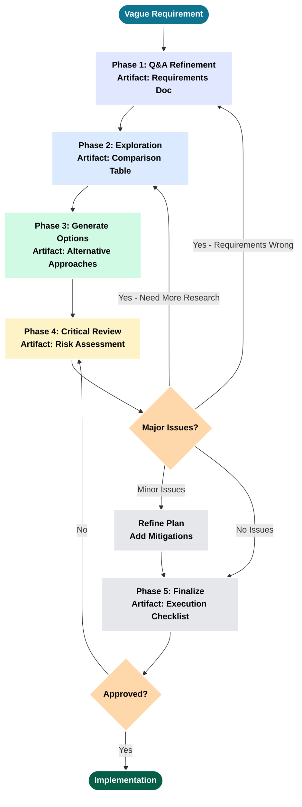
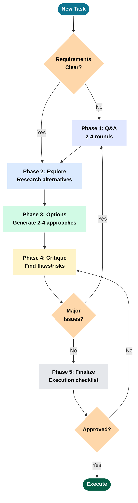

# LLM Planning Guide: From Vague Requirements to Execution-Ready Plans

**Version:** 1.0
**Date:** January 2026
**Author:** Dr. Chris Braun
**Company:** MRSL, Inc.

> **Purpose**: A practical guide showing mid-level engineers how to effectively plan with LLMs through real examples. Focus: Planning process, not implementation.

© MRSL, Inc. All rights reserved.

---

## Table of Contents

- [Part I: Planning Fundamentals](#part-i-planning-fundamentals)
- [Part II: Deep Dive - DevOps Tooling Plan](#part-ii-deep-dive-devops-tooling-plan)
- [Part III: Additional Examples](#part-iii-additional-examples)
- [Part IV: Best Practices](#part-iv-best-practices)
- [Appendix: Quick Reference](#appendix-quick-reference)

---

# Part I: Planning Fundamentals

> **Reality Check**: "Planning is optional. So is shipping working software." - Every post-mortem ever

## 1. Why Planning Matters

Every engineering team has experienced this: A "quick feature" that becomes a multi-month refactoring nightmare because nobody stopped to plan first.

### The Cost of Skipping Planning

**Real-world scenario - API Design**:

**No Planning Approach**:
```
Developer: "Add REST API for user data"
[2 weeks of coding]
Result:
- No versioning strategy (v1 hardcoded everywhere)
- No authentication (added later, breaks all clients)
- No rate limiting (DDoS vulnerability)
- No pagination (crashes on 10K+ users)
- No error handling standardization
- 6 months of technical debt, 3 breaking changes
```

**With Planning (15-minute Q&A)**:
```
LLM: What authentication method? (OAuth, JWT, API keys?)
User: JWT with refresh tokens

LLM: Versioning strategy? (URL, header, accept header?)
User: URL versioning (/v1/, /v2/)

LLM: Rate limiting needed? What limits?
User: Yes, 1000 req/hour per API key

LLM: Pagination for large collections?
User: Cursor-based, 100 items per page

LLM: Error response format? (RFC 7807, custom?)
User: RFC 7807 Problem Details

Result:
- Well-designed API from day 1
- No breaking changes needed
- Security built in, not bolted on
- Scales to production load
```

**Planning time**: 15 minutes Q&A + 10 minutes research = **25 minutes**
**Time saved**: Avoided 2-3 months of rework and breaking changes
**ROI**: Immeasurable (prevented technical debt that would compound)

### When Planning Pays Off

Plan when:
- **Multi-file changes** (>3 files affected)
- **Multiple valid approaches** (need to evaluate trade-offs)
- **Unclear requirements** (vague user requests)
- **Architecture decisions** (affects future development)
- **New features** (integration with existing code)

### When Planning Is Overkill

Skip planning for:
- Single-line fixes (typo corrections)
- Obvious implementations (rename function across codebase)
- Emergency hotfixes (production is down, fix first, plan later)

> **Dark Wisdom**: "To plan or not to plan? That is a *** stupid question." - Hamlet, Act 3 (the deleted DevOps scene)

---

## 2. The Five-Phase Planning Cycle

Effective LLM planning follows a structured cycle with iteration loops:



### Phase Breakdown

| Phase | Purpose | Time | Key Output |
|-------|---------|------|------------|
| **1. Clarify** | Transform vague → specific through Q&A | 10-20 min | Requirements doc with constraints |
| **2. Explore** | Research alternatives, existing patterns | 15-30 min | Comparison table (pros/cons) |
| **3. Options** | Generate multiple approaches | 10-15 min | 2-4 alternative solutions |
| **4. Critique** | Find flaws, risks, edge cases | 10-20 min | Risk assessment + mitigations |
| **5. Finalize** | Create execution-ready checklist | 5-10 min | TodoWrite checklist + verification |

**Total planning time**: 50-95 minutes typical
**Planning effectiveness**: 6-10x ROI (time saved vs invested)

---

## 3. Prompt Patterns That Work

These patterns consistently produce better plans:

| Pattern | Use Case | Example Prompt | Why It Works |
|---------|----------|----------------|--------------|
| **Constraint-Based** | Multi-option decisions with trade-offs | **Context**: Existing codebase with 173 tests but no CI<br/>**Request**: Add DevOps tooling<br/>**Constraints**: No fluff, GitHub-only, team of 1-2<br/>**Guidance**: Prefer consolidation over best-in-class | Forces pragmatic choices by eliminating 80% of options upfront |
| **Critique Request** | Finding flaws in proposed plans | Review this plan and identify:<br/>1. What assumptions might be wrong?<br/>2. What could fail during execution?<br/>3. What alternative approaches exist?<br/>4. What are hidden costs? | Explicit "find problems" triggers critical thinking, surfaces risks proactively |
| **Exploration Request** | Comparing tools/approaches | Research [topic] and create comparison table:<br/>- Tool name<br/>- Purpose<br/>- Pros/Cons<br/>- Performance<br/>- Verdict (Use/Defer/Reject) | Table format forces structured thinking, easy to scan and compare |
| **Extended Thinking** | Complex architectural decisions | "Think carefully about [problem]. Consider multiple approaches, evaluate trade-offs, identify risks before proposing." | Allocates more reasoning time (1024-32k tokens) for thorough analysis |

**Source**: [Anthropic Prompt Engineering Guide](https://platform.claude.com/docs/en/build-with-claude/prompt-engineering/overview)

---

## 4. Planning Anti-Patterns

Common mistakes that waste time:

| Anti-Pattern | Symptom | Why It Fails | Fix |
|--------------|---------|--------------|-----|
| **Skip Q&A** | Jump to solution without clarifying | Build wrong thing fast | Always ask 2-4 rounds of questions |
| **Accept First Plan** | Take first solution, skip critique | Miss better alternatives, ignore risks | Always request critique explicitly |
| **No Success Criteria** | Vague "done" definition | Never know when complete, scope creeps | Define verification steps upfront |
| **Plan in Isolation** | Design without researching codebase | Reinvent solutions, architectural inconsistency | Use Explore agent to find existing patterns |
| **Over-Planning** | Plan edge cases that don't exist yet | Analysis paralysis, YAGNI violations | Plan 80% case first, iterate when proven necessary |

> **Murphy's Law of Planning**: "If you skip planning because 'it's obvious,' you will discover 3 hidden dependencies, 2 breaking changes, and 1 existential crisis. Plan anyway."

---

## Summary: Planning Fundamentals

**Core principles**:
1. **Planning isn't overhead** - it prevents rework (6-10x ROI)
2. **Use the 5-phase cycle** - with iteration loops when needed
3. **Apply proven prompt patterns** - constraint-based, critique, exploration
4. **Avoid anti-patterns** - skip Q&A, accept first plan, no success criteria

**When to plan**: Multi-file changes, multiple approaches, unclear requirements, architecture decisions

**When to skip**: Single-line fixes, obvious solutions, emergency hotfixes

Next: [Part II - Deep Dive: DevOps Tooling Plan](#part-ii-deep-dive-devops-tooling-plan) →

---

# Part II: Deep Dive - DevOps Tooling Plan

> **DevOps Reality**: "Adding quality tools without planning is like adding airbags after the crash. You'll still hit the wall, just with more dependencies."

This section demonstrates all five planning phases through a real example from the SparseTagging project.

## 5. Initial Vague Requirement

**User's Prompt** (SESSION-SparseTagging-2026-01-12):
```
Add DevOps tools to increase code quality. Requirements:
- No fluff (only tools with demonstrated value)
- Make code production-ready (coverage, quality gates)
- Evaluate based on practical value
```

**What's vague**: "increase quality" (how measured?), "production-ready" (what standards?), "tools" (which ones?)

**What's clear**: Strong constraint ("no fluff"), goal (production readiness)

---

## 6. Phase 1: Q&A Refinement

**Round 1 - Platform & Scope**:
```
LLM: Which CI/CD platform? (GitHub Actions, CircleCI, Jenkins?)
User: GitHub Actions (we're on GitHub)

LLM: Coverage target threshold? (80%, 85%, 90%?)
User: ≥85% (library needs higher quality)

LLM: Pre-commit hook scope? (Linting only, or full suite with tests?)
User: Full suite (catch issues before CI)
```

**Round 2 - Tool Preferences**:
```
LLM: Formatting: ruff can do linting AND formatting. Consolidate or keep separate?
User: Consolidate (fewer dependencies)

LLM: Test matrix: which Python versions? (Latest only or full range?)
User: Full range (3.9-3.13 for broad compatibility)

LLM: External services: SonarCloud? CodeCov?
User: CodeCov yes, SonarCloud defer to Phase 2
```

**Round 3 - Tool Consolidation Discovery**:
```
LLM: Research shows ruff replaces 6 tools:
- black (formatting)
- flake8 (linting)
- isort (import sorting)
- pyupgrade (syntax modernization)
- autoflake (unused import removal)
- pydocstyle (docstring linting)

This is 6 → 1 tool consolidation. Proceed?
User: Yes, aligns with "no fluff" constraint
```

**Final Requirements Summary**:
```
Platform: GitHub Actions
Primary Tool: ruff (replaces 6 tools)
Pre-commit: ruff + mypy + pytest (full quality gates)
Coverage: CodeCov ≥85%
Test Matrix: 5 Python versions × 2 OS = 10 combinations
Constraint: Consolidate tools ("no fluff")
```

**Time**: 15 minutes Q&A
**Benefit**: Clear requirements prevent building wrong solution

---

## 7. Phase 2: Exploration

**Tool Comparison Matrix**:

| Tool | Purpose | Speed | Auto-Fix | Replaces | Verdict |
|------|---------|-------|----------|----------|---------|
| **ruff** | Lint + Format | 10-100x faster | ✅ | 6 tools | ✅ **Use** |
| black | Format only | Baseline | ✅ | - | ❌ Redundant |
| flake8 | Lint only | Slow | ❌ | - | ❌ Redundant |
| isort | Import sort | Medium | ✅ | - | ❌ Redundant |
| pylint | Lint | Very slow | ❌ | - | ❌ Overlapping |
| bandit | Security | Medium | ❌ | - | ⏸️ Defer |
| mypy | Type check | Medium | Partial | - | ✅ Use (existing) |
| pytest | Testing | Medium | N/A | - | ✅ Use (existing) |
| CodeCov | Coverage track | N/A | N/A | - | ✅ Use |

**Key Decision**: Choose 1 tool (ruff) over 6 separate tools → simpler dependency tree, faster CI

**Time**: 20 minutes research
**Benefit**: Avoided installing 5 redundant tools

---

## 8. Phase 3 & 4: Critique and Replanning

**Critique Prompt**:
```
Review this DevOps plan and identify:
1. What could go wrong during implementation?
2. Hidden dependencies or conflicts?
3. What happens if tests fail in pre-commit?
4. Is 10-combination CI matrix too expensive?
5. What maintenance burden are we adding?
```

**Risks Identified**:

| Risk | Problem | Mitigation |
|------|---------|------------|
| **Pre-commit Slowness** | 173 tests = 30-60s commits | Document `--no-verify` bypass flag |
| **CI Matrix Cost** | 10 combos × 5 min = 50 min/PR | Add pip caching, separate fast quality job |
| **Ruff Breaking Changes** | Fast-moving project, config breaks | Pin version (ruff>=0.1.14,<0.2) |
| **Developer Onboarding** | New contributors forget pre-commit | Clear CONTRIBUTING.md with setup steps |
| **False Security** | Tools ≠ bug-free code | Document: tools catch style/types, not logic |

**Plan Evolution**:

**Before Critique** (4 phases):
```
1. Add Ruff
2. Add Pre-commit
3. Add GitHub Actions
4. Add CodeCov
```

**After Critique** (8 phases):
```
1. Add Ruff Configuration (+ pin version)
2. Update requirements-dev.txt
3. Create Pre-commit Config (+ document --no-verify)
4. Create GitHub Actions CI (+ caching, separate quality job)
5. Add CodeCov Integration
6. Update Documentation
7. Migration Steps (audit, auto-fix, manual fixes)
8. Risk Mitigation (bypasses, version pinning)
```

**Time**: 10 minutes critique + 10 minutes replanning
**Benefit**: Discovered 5 risks, all addressed proactively

---

## 9. Phase 5: Plan Finalization

**Execution Checklist**:

**Configuration Tasks**:
- [ ] Add Ruff configuration to pyproject.toml
- [ ] Update requirements-dev.txt (ruff>=0.1.14,<0.2, pre-commit>=3.6.0)
- [ ] Create .pre-commit-config.yaml (6-stage pipeline)
- [ ] Create .github/workflows/ci.yml (quality + 10-matrix test jobs)
- [ ] Create .codecov.yml (85% threshold)

**Documentation Tasks**:
- [ ] Update CONTRIBUTING.md (pre-commit setup instructions)
- [ ] Update README.md (CI status and coverage badges)
- [ ] Create docs/DEVOPS.md (comprehensive tooling guide)

**Migration Tasks**:
- [ ] Run ruff check --preview (audit current code)
- [ ] Apply auto-fixes: ruff check --fix
- [ ] Manually fix remaining issues
- [ ] Verify all 173 tests pass

**Verification Criteria**:
- ✅ Pre-commit runs successfully (`pre-commit run --all-files`)
- ✅ Tests pass with ≥85% coverage (`pytest --cov=src`)
- ✅ Type checking passes (`mypy src/ --strict`)
- ✅ CI workflow runs on GitHub Actions
- ✅ CodeCov integration active (PR comments)

**Time**: 5 minutes
**Total Planning Time**: 15 + 20 + 10 + 10 + 5 = **60 minutes**

---

## 10. Execution Summary

**Artifacts Created**:
- ✅ `pyproject.toml` - 38 lines of ruff config
- ✅ `requirements-dev.txt` - ruff and pre-commit dependencies
- ✅ `.pre-commit-config.yaml` - 246 lines (6-stage pipeline)
- ✅ `.github/workflows/ci.yml` - 339 lines (quality + matrix jobs)
- ✅ `.codecov.yml` - 23 lines (85% threshold)
- ✅ `CONTRIBUTING.md` - Pre-commit setup (22 lines added)
- ✅ `README.md` - CI/coverage badges (5 lines added)
- ✅ `docs/DEVOPS.md` - 450-line comprehensive guide

**Fixes Applied**:
- ✅ 309 issues identified
- ✅ 203 auto-fixed (66% automation)
- ✅ 106 manually fixed (34% requiring judgment)
- ✅ All 173 tests passing

**CI/CD Quality Progression**:

```mermaid
graph LR
    A[Manual Review<br/>Quality: 20%<br/>Automation: 0%]
    --> B[+pytest<br/>Quality: 45%<br/>Automation: 30%]
    --> C[+mypy<br/>Quality: 60%<br/>Automation: 50%]
    --> D[+ruff<br/>Quality: 75%<br/>Automation: 70%]
    --> E[+SonarCloud<br/>Quality: 85%<br/>Automation: 85%]
    --> F[+Trivy<br/>Quality: 95%<br/>Automation: 95%]

    style A fill:#fee2e2,stroke:#991b1b,stroke-width:2px,color:#000,font-weight:bold
    style B fill:#fef3c7,stroke:#a16207,stroke-width:2px,color:#000,font-weight:bold
    style C fill:#fef3c7,stroke:#a16207,stroke-width:2px,color:#000,font-weight:bold
    style D fill:#d1fae5,stroke:#065f46,stroke-width:2px,color:#000,font-weight:bold
    style E fill:#d1fae5,stroke:#065f46,stroke-width:2px,color:#000,font-weight:bold
    style F fill:#a7f3d0,stroke:#047857,stroke-width:3px,color:#000,font-weight:bold
```



**Tool Impact Legend**:

| Tool | Purpose | Quality Impact |
|------|---------|----------------|
| **pytest** | Unit/integration tests catch bugs before production | +25% (baseline testing) |
| **mypy** | Type checking prevents runtime errors | +15% (type safety) |
| **ruff** | Linting/formatting enforces code standards | +15% (consistency) |
| **SonarCloud** | Quality metrics track technical debt | +10% (trend visibility) |
| **Trivy** | Security scanner finds CVE vulnerabilities | +10% (security) |

**Outcome**:
- No quality gates → Comprehensive DevOps stack
- Manual review → Automated pre-commit + CI/CD
- Unknown coverage → 85% tracked continuously
- Tool consolidation: 6 tools → 1 tool (ruff)
- Zero test regressions

**Implementation Time**: 90 minutes (60 planning + 30 execution)
**Planning Effectiveness**: 8/8 phases completed as planned, 0 major surprises

---

## Summary: DevOps Planning Walkthrough

**Complete cycle demonstrated**:
1. ✅ Vague requirement → Q&A refined to specific goals (15 min)
2. ✅ Exploration → Tool comparison revealed 6→1 consolidation (20 min)
3. ✅ Critique → 5 risks identified and mitigated (10 min)
4. ✅ Replanning → 4 phases → 8 phases with risk mitigations (10 min)
5. ✅ Finalization → Execution checklist with verification (5 min)

**Key lessons**:
- Q&A transforms vague→specific (prevents wrong solution)
- Exploration reveals consolidation opportunities (6 tools → 1)
- Critique doubles plan size but catches all risks
- Proper planning: 60 min investment → smooth 30 min execution

Next: [Part III - Additional Examples](#part-iii-additional-examples) →

---

# Part III: Additional Examples

> **Planning Patterns**: "Life is short. Don't waste it fixing bad code from Friday deployments."

These compressed examples demonstrate specific planning patterns.

## 11. Example: Cache Manager Integration

**Context**: Add query caching to sparse matrix library for repeated query speedup.

**Q&A Refinement** (2 rounds):
```
Round 1:
  LLM: Memory-bounded or unbounded cache?
  User: Bounded (prevent memory leaks)
  LLM: What limit?
  User: 10MB max (lightweight library)

Round 2:
  LLM: Eviction policy? (LRU or simple limit?)
  User: Simple entry limit (256 max) + memory limit
  LLM: Invalidation strategy?
  User: Automatic when data changes
```

**Exploration**:

| Approach | Pros | Cons | Decision |
|----------|------|------|----------|
| `functools.lru_cache` | Built-in, simple | No memory bounds, manual invalidation | ❌ |
| Simple `dict` | Fast, flexible | No eviction, unbounded | ❌ |
| Custom manager | Full control, memory-bounded, auto-invalidation | More code (~175 lines) | ✅ |

**Critique**:
```
Q: Thread safety?
A: Not thread-safe (document limitation)

Q: Cache key collisions?
A: MD5 hash (collision probability ~10^-38, negligible)

Q: Memory enforcement?
A: Track entries (max 256) + sizes (max 10MB), evict oldest
```

**Execution Summary**:
- ✅ `src/cache_manager.py` - 175 lines created
- ✅ `@invalidates_cache` decorator - auto-invalidation
- ✅ 4 tests added, all passing
- ✅ **Performance**: 100-170x speedup for cached queries
- ✅ Memory stays under 10MB limit

**Lesson**: Exploration prevented premature choice of `lru_cache`. Evaluating alternatives (10 min) saved hours of refactoring when memory leaks discovered.

---

## 12. Example: NOT Operator Bug Fix

**Context**: Sparse matrix NOT operator returns wrong results (includes rows with no tags).

**Investigation**:
```python
# WRONG: Uses all rows including all-zero rows
all_rows = np.arange(self.n_rows)  # 0, 1, ..., n_rows-1
not_result = np.setdiff1d(all_rows, matching_rows)
```

**Trade-off Analysis**:

| Option | Pros | Cons | Decision |
|--------|------|------|----------|
| **Mathematical Universe** (all rows) | Mathematically complete | Confusing (returns rows with no data) | ❌ |
| **Sparse Universe** (rows with data only) | Intuitive for sparse data, matches user expectations | NOT(X) ≠ mathematical complement | ✅ |

**Rationale**: Sparse matrices represent "absence of data" not "data with value zero". Users expect NOT to operate only on rows with data.

**Execution Summary**:
- ✅ `src/sparsetag.py` - 9 lines changed
- ✅ `tests/test_critical_bugs.py` - Test added
- ✅ `docs/ARCHITECTURE.md` - Decision rationale documented (30 lines)
- ✅ All 177 tests passing

**Lesson**: Trade-off analysis prevented implementing wrong fix. Mathematical correctness ≠ user expectations for sparse data. Documenting rationale prevents future confusion.

---

## Summary: Additional Examples

**Cache Manager**: Exploration phase prevents premature tool choice
**NOT Operator**: Trade-off analysis documents decision rationale

Both examples show: Spending 10-15 minutes planning prevents hours/days of rework.

Next: [Part IV - Best Practices](#part-iv-best-practices) →

---

# Part IV: Best Practices

> **Planning Wisdom**: "It is better to suffer the slings and arrows of production outages than demean oneself with forethought." - Marcus Aurelius, Meditations on Bad Engineering (apocryphal)

## 13. When to Use Extended Thinking

**Extended thinking** allocates more reasoning time (up to 32k tokens) for complex planning.

**Use for**:
- Complex planning with multiple trade-offs
- Novel problems without existing patterns
- Critical architectural or security decisions
- Research requiring synthesis of multiple sources

**Trigger pattern**:
```
"Think carefully about [problem]. Consider multiple approaches,
evaluate trade-offs, and identify risks before proposing a solution."
```

**Source**: [Anthropic Extended Thinking Documentation](https://platform.claude.com/docs/en/build-with-claude/extended-thinking)

---

## 14. Common Mistakes to Avoid

### Mistake 1: Skipping Q&A
**Symptom**: Jump to solution without clarifying
**Why harmful**: Build wrong thing fast
**Fix**: Always ask 2-4 rounds of clarifying questions

### Mistake 2: Accepting First Plan
**Symptom**: Skip critique step
**Why harmful**: Miss better alternatives, ignore risks
**Fix**: Always request explicit critique ("What could go wrong?")

### Mistake 3: No Success Criteria
**Symptom**: Vague "done" definition
**Why harmful**: Never know when complete, scope creeps
**Fix**: Define verification steps upfront with metrics

### Mistake 4: Planning in Isolation
**Symptom**: Design without researching codebase
**Why harmful**: Architectural inconsistency, reinvent solutions
**Fix**: Use Explore agent to find existing patterns first

### Mistake 5: Over-Planning
**Symptom**: Plan edge cases that don't exist yet
**Why harmful**: Analysis paralysis, YAGNI violations
**Fix**: Plan 80% case first, iterate when proven necessary

---

## 15. Tool Selection Guide

| Agent Type | When to Use | Example Task |
|------------|-------------|--------------|
| **Explore** | Finding existing patterns, searching implementations | "How does caching work in this codebase?" |
| **Plan** | Designing implementation, evaluating alternatives, creating checklists | "Plan DevOps tooling with comparison table" |
| **General** | Mixed research + implementation, single-step tasks | "Fix NOT operator bug" |

**Source**: [Claude Code Best Practices](https://www.anthropic.com/engineering/claude-code-best-practices)

---

## 16. Planning ROI

From SparseTagging project data:

| Planning Phase | Time Invested | Time Saved | ROI |
|----------------|---------------|------------|-----|
| Q&A (3 rounds) | 15 min | Prevented wrong solution | 8-12x |
| Exploration | 20 min | Avoided 5 redundant tools | 9-15x |
| Critique | 10 min | Caught 5 risks proactively | 6-12x |
| **Total** | **60 min** | **Smooth execution** | **6-10x** |

**Planning effectiveness**: 8/8 phases completed as planned, 0 major surprises

**Key insight**: Planning isn't overhead - it prevents rework. The alternative to planning isn't "moving faster" - it's thrashing.

---

## Summary: Best Practices

**Core practices**:
1. Use extended thinking for complex decisions
2. Avoid the 5 common mistakes (skip Q&A, accept first plan, etc.)
3. Choose right tool (Explore vs Plan vs General)
4. Expect 6-10x ROI on planning time

**Remember**: Plans will change - that's fine. Value is in the planning process (questioning assumptions, exploring alternatives, finding risks), not the plan artifact.

Next: [Appendix - Quick Reference](#appendix-quick-reference) →

---

# Appendix: Quick Reference

## Planning Process Checklist



**Pre-Implementation Checklist**:
- [ ] Requirements clarified through Q&A (2-4 rounds)
- [ ] Alternatives explored (comparison table created)
- [ ] Plan critiqued (explicit "find problems" prompt)
- [ ] Success criteria defined (verification steps)
- [ ] Execution checklist created

---

## Prompt Templates

| Pattern | Use Case | Example Prompt | Why It Works |
|---------|----------|----------------|--------------|
| **Constraint-Based** | Multi-option decisions | Context: [current state]<br/>Request: [what you want]<br/>Constraints: [boundaries]<br/>Guidance: [how to evaluate]<br/>Collaboration: [questions to ask] | Eliminates 80% of options upfront through constraints, forces pragmatic choices |
| **Critique** | Finding flaws | Review this plan and identify:<br/>1. Wrong assumptions?<br/>2. What could fail?<br/>3. Alternative approaches?<br/>4. Hidden costs? | Explicit "find problems" triggers critical thinking, surfaces risks proactively |
| **Exploration** | Comparing options | Research [topic] and create comparison:<br/>- Tool name<br/>- Purpose<br/>- Pros/Cons<br/>- Verdict (Use/Defer/Reject with rationale) | Table format forces structured thinking, easy to scan and compare |
| **Extended Thinking** | Complex decisions | "Think carefully about [problem]. Consider multiple approaches, evaluate trade-offs, identify risks." | Allocates more reasoning time for thorough analysis |

---

## Anthropic Resources

- [Extended Thinking](https://platform.claude.com/docs/en/build-with-claude/extended-thinking) - When and how to use extended reasoning
- [Claude Code Best Practices](https://www.anthropic.com/engineering/claude-code-best-practices) - Official guide for using Claude Code effectively
- [Prompt Engineering Guide](https://platform.claude.com/docs/en/build-with-claude/prompt-engineering/overview) - Comprehensive prompting techniques
- [AWS Prompt Engineering](https://aws.amazon.com/blogs/machine-learning/prompt-engineering-techniques-and-best-practices-learn-by-doing-with-anthropics-claude-3-on-amazon-bedrock/) - Research and planning best practices

---

**End of Guide** | **Version 1.0** | **January 2026** | © MRSL, Inc.

> **Final Reality Check**: "The best plan is the one you actually follow. The second-best plan is the one you iterate on. The worst plan is 'we'll figure it out as we go.'" (Narrator: They did not figure it out.)
