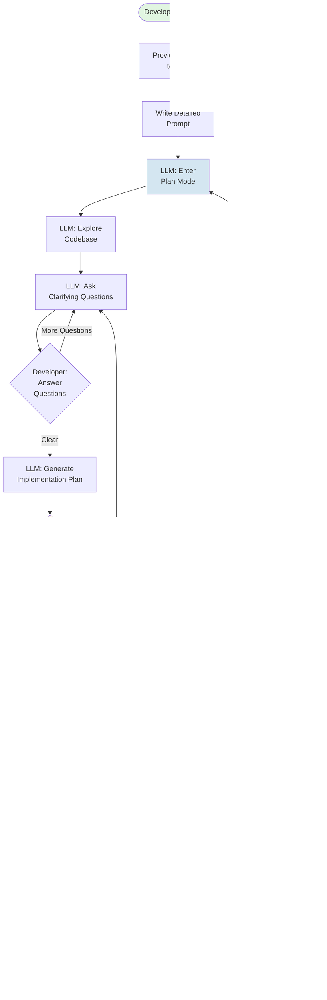

# Tutorial Diagrams - LLM-First Development

## Overview

This document contains 30 comprehensive diagrams documenting rigorous, high-quality LLM-assisted software development. These diagrams use **SparseTagging** as an exemplar project that demonstrates the complete lifecycle from concept through production deployment.

**Purpose**: Provide visual frameworks for understanding LLM-first development processes, tool ecosystems, and quality workflows that mid-to-senior developers can apply to their own projects.

**How to Use**: Each diagram is standalone with accompanying summary and context. Diagrams are organized by development phase and can be extracted for integration into tutorials, presentations, or project documentation.

**Key Principles Illustrated**:
1. **Detailed Planning** - Research, refine, create execution checklists before coding
2. **Iterative Process** - Multiple refinement cycles, non-linear progress
3. **Quality Gates** - Rigorous checks at each phase (linting, type checking, testing, scanning)
4. **Tool Selection** - When to use which tools throughout the development lifecycle
5. **External Integration** - Setting up and coordinating SonarCloud, CodeCov, GHCR, etc.

---

## Table of Contents

### Master/Big Picture
- [1. Complete Development Lifecycle](#1-complete-development-lifecycle)
- [2. Tool Ecosystem Map](#2-tool-ecosystem-map)
- [3. LLM Plan-Execute-Refine Loop](#3-llm-plan-execute-refine-loop)

### Phase-Specific Flows
- [4. Phase 0: Concept to Requirements](#4-phase-0-concept-to-requirements)
- [5. Phase 1: Feature Specification](#5-phase-1-feature-specification)
- [6. Phase 2: Planning & Design](#6-phase-2-planning--design)
- [7. Phase 3: Implementation](#7-phase-3-implementation)
- [8. Phase 4: Test Generation](#8-phase-4-test-generation)
- [9. Phase 5: Debugging](#9-phase-5-debugging)
- [10. Phase 6: Performance Tuning](#10-phase-6-performance-tuning)
- [11. Phase 7: Quality Checks](#11-phase-7-quality-checks)
- [12. Phase 8: Documentation](#12-phase-8-documentation)
- [13. Phase 9: CI/CD Setup](#13-phase-9-cicd-setup)
- [14. Phase 10: External Services](#14-phase-10-external-services)
- [15. Phase 11: Publishing](#15-phase-11-publishing)

### Interaction Groups
- [16. Scanning Services Interaction](#16-scanning-services-interaction)
- [17. Build & Deploy Pipeline](#17-build--deploy-pipeline)
- [18. Quality Tools Integration](#18-quality-tools-integration)

### New Content
- [19. Artifact Generation Map](#19-artifact-generation-map)
- [20. Tool Category Comparison Matrix](#20-tool-category-comparison-matrix)
- [21. LLM Prompting Best Practices](#21-llm-prompting-best-practices)
- [22. Claude Code Cheat Sheet](#22-claude-code-cheat-sheet)
- [23. ChatGPT Codex Cheat Sheet](#23-chatgpt-codex-cheat-sheet)
- [24. CI Pipeline Evolution](#24-ci-pipeline-evolution)
- [25. Iterative Development Reality](#25-iterative-development-reality)
- [26. Configuration Consolidation Map](#26-configuration-consolidation-map)

### Documentation Consolidations
- [27. Troubleshooting Decision Trees](#27-troubleshooting-decision-trees)
- [28. Service Setup Dependencies](#28-service-setup-dependencies)
- [29. Version/Release Propagation](#29-versionrelease-propagation)
- [30. Quality Metrics Dashboard](#30-quality-metrics-dashboard)

---

## Master/Big Picture

### 1. Complete Development Lifecycle

**Summary**: This diagram shows the complete 12-phase development lifecycle for LLM-first software development. Starting from an initial concept, the developer works through requirements gathering, feature specification, planning, implementation, testing, debugging, performance tuning, quality checks, documentation, CI/CD setup, external service integration, and finally publishing. Each phase includes quality gates (diamond decision points) that determine if the work can proceed or requires refinement. The diagram emphasizes the iterative nature - failed quality gates loop back to earlier phases for refinement. This is the master reference showing how all phases connect and where quality checks occur.

**Purpose**: Visualize the complete end-to-end development lifecycle with quality gates and feedback loops.

**Usage in Tutorial**: Introduction section - sets expectations for the full workflow; each subsequent chapter references back to this diagram to show "where we are" in the overall process.


---

### 2. Tool Ecosystem Map

**Summary**: This diagram maps the complete tool ecosystem used across all development phases, showing how tools interconnect and at which phases they're used. The diagram is organized by tool categories: Version Control (Git/GitHub), LLM Assistants (Claude Code, ChatGPT), Code Quality (Ruff, Mypy, Pytest), CI/CD (GitHub Actions), Security Scanning (Trivy, Dependabot), Quality Platforms (SonarCloud, CodeCov), Container (Docker, GHCR), and Documentation (MkDocs, Sphinx). Data flows between tools are shown as directional arrows - for example, Git commits trigger GitHub Actions, which runs Pytest and uploads coverage to CodeCov. The diagram helps developers understand tool selection at each phase and how tools coordinate.

**Purpose**: Show all tools used in the development lifecycle and their interconnections via data flow.

**Usage in Tutorial**: Tool Selection chapter - helps readers understand which tools solve which problems and when to introduce each tool into their workflow.


---

### 3. LLM Plan-Execute-Refine Loop

**Summary**: This diagram illustrates the core iterative cycle when working with LLM assistants like Claude Code. The process begins with the developer providing context and a detailed prompt to the LLM. The LLM enters planning mode, explores the codebase, asks clarifying questions, and generates an implementation plan. The developer reviews this plan at a decision point - if unclear or incorrect, they provide feedback and the loop returns to planning. Once approved, the LLM executes the plan by writing code, running tests, and performing quality checks. Results are evaluated at another decision point. If quality checks fail or results don't meet expectations, the developer provides feedback and the process returns to planning (with context from the failed attempt). Only when results meet all criteria does the cycle complete. This loop may execute many times for a single feature.

**Purpose**: Show the iterative planning, execution, and refinement cycle central to effective LLM-assisted development.

**Usage in Tutorial**: Introduction and Phase 2 (Planning) chapters - establishes the fundamental workflow pattern that repeats throughout development.



---

## Phase-Specific Flows

### 4. Phase 0: Concept to Requirements

**Summary**: Phase 0 begins with a user need or business problem. The developer engages with the LLM to clarify the concept through dialogue, asking questions about scope, constraints, users, and success criteria. The LLM helps refine vague ideas into specific requirements by prompting for missing information and identifying edge cases. Once requirements are clear, they are documented in a structured format (user stories, technical requirements, acceptance criteria). This phase emphasizes thorough upfront thinking - rushing past this phase leads to rework later. The output is a requirements document that serves as the foundation for all subsequent phases.

**Purpose**: Transform vague concepts into clear, documented requirements through LLM-assisted dialogue.

**Usage in Tutorial**: Phase 0 chapter - teaches readers how to use LLMs to clarify requirements before writing any code.


---

### 5. Phase 1: Feature Specification

**Summary**: With requirements in hand, Phase 1 creates a detailed feature specification. The developer provides the requirements document as context to the LLM along with relevant codebase information (architecture, existing patterns, related features). The LLM analyzes existing code to understand conventions and proposes how the feature should integrate. Together they define the feature interface (API, CLI, UI), data structures, and integration points. The specification includes examples of usage and expected behavior. This phase bridges requirements and design.

**Purpose**: Create detailed feature specification with usage examples and integration points.

**Usage in Tutorial**: Phase 1 chapter - shows how to leverage LLM knowledge of the codebase to create consistent feature designs.


---

### 6. Phase 2: Planning & Design

**Summary**: Phase 2 is the detailed technical planning phase. The LLM enters plan mode to explore the codebase thoroughly, understanding existing architecture, dependencies, and potential conflicts. Based on this exploration, the LLM proposes an architectural approach. The developer and LLM discuss trade-offs between different approaches. Once an approach is selected, they break it into implementation tasks with estimated complexity. The LLM identifies files to modify, tests needed, and potential risks. The output is a detailed implementation plan that guides Phase 3.

**Purpose**: Create detailed technical implementation plan through LLM-assisted architecture exploration.

**Usage in Tutorial**: Phase 2 chapter - demonstrates the critical planning phase that determines implementation success.


---

### 7. Phase 3: Implementation

**Summary**: Phase 3 is where code is written, following Test-Driven Development (TDD) principles. For each task in the implementation plan, the developer starts by having the LLM write tests that define expected behavior. With failing tests in place, the LLM writes the minimal code needed to make tests pass. After tests pass, the code is refactored for clarity and efficiency while keeping tests green. This red-green-refactor cycle repeats for each feature component. The LLM helps maintain code quality during implementation. SparseTagging demonstrates this with 177 tests and 85 percent coverage.

**Purpose**: Implement features using Test-Driven Development with LLM assistance.

**Usage in Tutorial**: Phase 3 chapter - teaches TDD workflow with LLM writing both tests and implementation code.


---

### 8. Phase 4: Test Generation

**Summary**: After implementation, Phase 4 ensures comprehensive test coverage. The LLM analyzes the implemented code to identify untested paths, edge cases, and error conditions. It generates additional tests for boundary conditions, integration scenarios, and performance validation. The LLM uses pytest features like fixtures, parametrize, and markers to create maintainable test suites. Coverage tools identify gaps. The goal is 85 percent code coverage with meaningful tests. SparseTagging demonstrates this with 177 tests across 9 test categories.

**Purpose**: Achieve comprehensive test coverage with edge cases, integration tests, and performance validation.

**Usage in Tutorial**: Phase 4 chapter - shows how LLMs can systematically generate comprehensive test suites.


---

### 9. Phase 5: Debugging

**Summary**: When tests fail or bugs are discovered, Phase 5 provides a systematic debugging approach with LLM assistance. The process starts with reproducing the error consistently - creating a minimal test case that triggers the bug. The LLM analyzes the error message, stack trace, and relevant code to form hypotheses about root causes. Each hypothesis is tested systematically. The LLM can trace execution flow, examine variable states, and identify logic errors. Once the root cause is found, a fix is implemented and verified. A regression test is added to prevent the bug from returning.

**Purpose**: Systematically debug issues with LLM-assisted root cause analysis and fix verification.

**Usage in Tutorial**: Phase 5 chapter - teaches systematic debugging methodology using LLMs for hypothesis generation and analysis.


---

### 10. Phase 6: Performance Tuning

**Summary**: Phase 6 optimizes code performance once functionality is correct. The process starts with establishing baseline performance using benchmarks - measuring current speed, memory usage, and resource consumption. The LLM helps identify bottlenecks through profiling. Each bottleneck is analyzed to understand why it is slow. The LLM proposes optimizations specific to the bottleneck type. Each optimization is applied and measured to verify improvement. SparseTagging achieved 100-170x speedups through sparse matrix operations and intelligent caching.

**Purpose**: Systematically optimize performance using benchmarking, profiling, and targeted improvements.

**Usage in Tutorial**: Phase 6 chapter - teaches data-driven performance optimization with measurable improvements.


---

### 11. Phase 7: Quality Checks

**Summary**: Phase 7 ensures code meets quality standards before CI/CD. The workflow runs three key tools in sequence: Ruff (linting and formatting), Mypy (type checking), and pre-commit hooks (automated enforcement). Ruff checks code style and identifies bugs. Mypy performs static type analysis. Pre-commit hooks run all checks automatically before each commit, preventing bad code from entering version control. Any failures must be fixed before proceeding. This local quality gate catches issues early before they reach CI.

**Purpose**: Enforce code quality standards locally before pushing to CI.

**Usage in Tutorial**: Phase 7 chapter - establishes local quality workflow that mirrors CI checks.


---

### 12. Phase 8: Documentation

**Summary**: Phase 8 creates comprehensive documentation at multiple levels. Starting with code-level docstrings, the LLM generates descriptions for all public functions, classes, and modules. These docstrings are used to generate API reference documentation automatically. User-facing documentation includes quickstart guides, tutorials, and architecture overviews. The LLM can extract patterns from code to explain complex designs. Documentation is version-controlled alongside code and reviewed for accuracy.

**Purpose**: Create multi-level documentation from docstrings through user guides.

**Usage in Tutorial**: Phase 8 chapter - shows how LLMs can generate consistent, comprehensive documentation.


---

### 13. Phase 9: CI/CD Setup

**Summary**: Phase 9 establishes automated CI/CD pipelines. Starting with GitHub Actions workflow configuration, the pipeline runs quality checks (Ruff, Mypy), executes tests across multiple Python versions and operating systems (matrix testing), measures coverage, and uploads results to external services. The workflow includes security scanning with Trivy and artifact generation. SparseTagging CI runs 8 parallel test jobs (4 Python versions times 2 OSes) with graceful degradation for optional services. The pipeline provides fast feedback on PRs and blocks merges if quality gates fail.

**Purpose**: Automate quality checks, testing, and deployment through CI/CD pipelines.

**Usage in Tutorial**: Phase 9 chapter - demonstrates building robust CI/CD from basic checks to full pipeline.


---

### 14. Phase 10: External Services

**Summary**: Phase 10 integrates external quality and deployment services. SonarCloud provides code quality analysis with quality gates. CodeCov tracks coverage trends. GitHub Container Registry (GHCR) hosts Docker images. Each service requires setup - creating accounts, generating tokens, adding secrets to GitHub, and configuring workflows. The LLM helps troubleshoot authentication issues and explains configuration options. Services coordinate through the CI pipeline. Graceful degradation ensures CI succeeds even if optional services are unavailable.

**Purpose**: Integrate SonarCloud, CodeCov, GHCR, and other external services with CI pipeline.

**Usage in Tutorial**: Phase 10 chapter - step-by-step external service setup with troubleshooting guidance.


---

### 15. Phase 11: Publishing

**Summary**: Phase 11 handles release preparation and deployment. The process starts with version bumping in pyproject.toml, which propagates through Docker images and package metadata. A comprehensive changelog documents all changes since the last release. Git tags mark release points, triggering deployment workflows. The CI pipeline builds distribution packages, runs final quality checks, creates Docker images with version tags, and pushes to registries (PyPI, GHCR). Release notes are generated from the changelog. The entire release is traceable from a single version number in pyproject.toml.

**Purpose**: Prepare and execute releases with versioning, tagging, and deployment automation.

**Usage in Tutorial**: Phase 11 chapter - demonstrates complete release workflow from version bump to deployment.


---

## Interaction Groups

### 16. Scanning Services Interaction

**Summary**: This diagram shows how multiple scanning and quality services coordinate during the CI pipeline. The CI workflow runs pytest to generate coverage data in XML format. This single coverage file is consumed by both CodeCov and SonarCloud - CodeCov tracks coverage trends over time and comments on PRs, while SonarCloud combines coverage with code quality analysis for its quality gate. In parallel, Ruff and Mypy results are also sent to SonarCloud for comprehensive quality reporting. Trivy scans Docker images for security vulnerabilities and uploads results in SARIF format to GitHub Security tab. The diagram emphasizes data flow between tools and how they build on each other's outputs.

**Purpose**: Show coordination between scanning and quality services through shared data formats.

**Usage in Tutorial**: External Services chapter - explains how services integrate and share data through CI.


---

### 17. Build & Deploy Pipeline

**Summary**: This diagram details the Docker build and deployment pipeline that runs on the main branch after PR merge. The process extracts the version number from pyproject.toml, builds a Docker image with that version as a build argument, and tags it with both the version number and "latest". The image undergoes three Trivy security scans in different formats (SARIF for GitHub, table for humans, SBOM for supply chain). After passing scans, smoke tests verify the image works correctly (import test, version test, functionality test). Only after all validations pass does the image get pushed to GitHub Container Registry with both tags. Failed steps prevent deployment, ensuring only quality images reach production.

**Purpose**: Show complete Docker build-to-deploy workflow with quality gates and multi-format scanning.

**Usage in Tutorial**: CI/CD and Publishing chapters - demonstrates production-ready container deployment.


---

### 18. Quality Tools Integration

**Summary**: This diagram shows how quality tools (Ruff, Mypy, Pytest) operate at three different stages: local development, pre-commit hooks, and CI pipeline. During local development, developers run tools manually to get immediate feedback. Pre-commit hooks enforce these checks automatically before each git commit, preventing bad code from entering version control. The CI pipeline runs the same checks again on a clean environment to catch issues that might slip through (different OS, Python version, environment). This three-layer approach catches issues progressively earlier, reducing the cost of fixes. All three layers use identical configurations to ensure consistency.

**Purpose**: Show three-layer quality enforcement: local, pre-commit, and CI with consistent tooling.

**Usage in Tutorial**: Quality Checks and CI/CD chapters - establishes defense-in-depth quality strategy.


---

## New Content

### 19. Artifact Generation Map

**Summary**: This diagram maps what artifacts are generated at each phase of development and which process creates them. Phase 0-2 produce planning documents (requirements, specifications, implementation plans) created by LLM collaboration. Phase 3-4 generate code files and test files. Phase 5 produces bug reports and fixes documented in commit messages. Phase 6 creates benchmark reports showing performance improvements. Phase 7 produces quality reports from Ruff, Mypy, and coverage tools. Phase 8 generates documentation files (docstrings, API docs, user guides). Phase 9-11 produce CI artifacts (test results, coverage reports, SARIF files, Docker images, release packages). Understanding artifact flow helps track project progress and debug issues.

**Purpose**: Show what artifacts are created at each development phase and by which tools/processes.

**Usage in Tutorial**: Cross-cutting reference - helps readers understand deliverables at each stage.


---

### 20. Tool Category Comparison Matrix

**Summary**: This comparison matrix organizes development tools by functional category and lists top alternatives for each category with the tools used in SparseTagging highlighted. Categories include Linting (Ruff, Flake8, Pylint, Black, isort), Type Checking (Mypy, Pyright, Pyre, Pytype), Testing (Pytest, unittest, nose2, tox), Coverage (pytest-cov, coverage.py, codecov), CI/CD (GitHub Actions, GitLab CI, CircleCI, Jenkins), Quality Platforms (SonarCloud, Code Climate, Scrutinizer), Container Tools (Docker, Podman, Buildah), Security Scanning (Trivy, Snyk, Grype, Clair), and Version Control (Git, GitHub, GitLab). The matrix helps developers understand the tool landscape and why specific tools were chosen for this project.

**Purpose**: Compare tool options by category with SparseTagging choices highlighted.

**Usage in Tutorial**: Tool Selection chapter - helps readers evaluate alternatives and understand trade-offs.


**Legend**: ⭐ = Used in SparseTagging | Blue = Local Tools | Yellow = External Services

---

### 21. LLM Prompting Best Practices

**Summary**: This visual synthesis captures best practices from DEVELOPER_GUIDE_AI_PROMPTING.md. The diagram shows the golden template structure: Context (current state, why changes needed), Request (specific action, numbered deliverables), Constraints (technical requirements, must-haves), Guidance (scope boundaries, exclusions), and Collaboration (invitation to clarify). Key success patterns include specificity over vagueness, structured multi-part requests, explicit values not ranges, permission to ask questions, and iterative refinement. Anti-patterns to avoid include single-line commands, vague feature requests, no context, assuming AI remembers everything, and implementing details too early. The SparseTagging project demonstrated these patterns achieving zero failed implementations.

**Purpose**: Visualize effective LLM prompting patterns and anti-patterns from real sessions.

**Usage in Tutorial**: Prompting chapter - teaches readers how to craft effective prompts for better results.

```mermaid
graph TB
    subgraph "The Golden Template"
        Context["CONTEXT<br/>• Current state<br/>• Why change needed<br/>• Relevant history"]
        Request["REQUEST<br/>• Specific action<br/>• Numbered deliverables<br/>• Clear scope"]
        Constraints["CONSTRAINTS<br/>• Technical requirements<br/>• Must-haves vs nice-to-haves<br/>• Specific values"]
        Guidance["GUIDANCE<br/>• Scope boundaries<br/>• Exclusions<br/>• Examples"]
        Collaborate["COLLABORATION<br/>• Ask questions before proceeding<br/>• Iterate on plan<br/>• Provide feedback"]
    end

    Context --> Request
    Request --> Constraints
    Constraints --> Guidance
    Guidance --> Collaborate

    subgraph "Success Patterns"
        SP1["✅ Specificity<br/>5 minutes not short"]
        SP2["✅ Structure<br/>Numbered lists"]
        SP3["✅ Context<br/>Explain the why"]
        SP4["✅ Permission<br/>Invite clarification"]
        SP5["✅ Evidence<br/>Share error messages"]
    end

    subgraph "Anti-Patterns"
        AP1["❌ Vague<br/>Make it better"]
        AP2["❌ No Context<br/>Fix line 690"]
        AP3["❌ Implementation Early<br/>Use library X"]
        AP4["❌ Assume Memory<br/>Do that thing"]
        AP5["❌ Too Many Changes<br/>Fix everything"]
    end

    Collaborate --> Results{Good Results?}
    Results -->|Yes| Success[Zero Failed<br/>Implementations]
    Results -->|No| Review[Review Against<br/>Patterns]
    Review --> Context

    style Context fill:#e1f5e1
    style Success fill:#e6ffe6
    style SP1 fill:#d4edda
    style SP2 fill:#d4edda
    style SP3 fill:#d4edda
    style SP4 fill:#d4edda
    style SP5 fill:#d4edda
    style AP1 fill:#ffe6e6
    style AP2 fill:#ffe6e6
    style AP3 fill:#ffe6e6
    style AP4 fill:#ffe6e6
    style AP5 fill:#ffe6e6
```

---

### 22. Claude Code Cheat Sheet

**Summary**: Quick reference for Claude Code keyboard shortcuts, commands, and workflow patterns. Essential shortcuts include Tab (accept suggestion), Shift+Tab (auto-accept mode toggle), Ctrl+R (show full output), Ctrl+B (background task), Ctrl+O (transcript mode), and Ctrl+C (interrupt). Slash commands provide quick access to features: /plan (enter plan mode), /commit (create commit), /pr (create pull request), /context (show context usage), /model (switch model), /permissions (manage tool permissions). Workflow patterns include using plan mode for complex changes, backgrounding long-running processes, and iterative refinement through feedback. Understanding these shortcuts significantly improves development velocity.

**Purpose**: Quick reference for Claude Code keyboard shortcuts, commands, and workflow patterns.

**Usage in Tutorial**: Getting Started and throughout - helps readers use Claude Code efficiently.

```mermaid
graph TB
    subgraph "Essential Shortcuts"
        K1["Tab<br/>Accept suggestion"]
        K2["Shift+Tab<br/>Toggle auto-accept"]
        K3["Ctrl+R<br/>Show full output"]
        K4["Ctrl+B<br/>Background task"]
        K5["Ctrl+O<br/>Transcript mode"]
        K6["Ctrl+C<br/>Interrupt"]
        K7["Ctrl+Z<br/>Undo input"]
        K8["Alt+T<br/>Toggle thinking"]
    end

    subgraph "Key Slash Commands"
        C1["/plan<br/>Enter plan mode"]
        C2["/commit<br/>Create commit"]
        C3["/pr<br/>Create pull request"]
        C4["/context<br/>Show context usage"]
        C5["/model<br/>Switch model"]
        C6["/permissions<br/>Manage tool access"]
        C7["/resume<br/>Resume session"]
        C8["/clear<br/>Clear conversation"]
    end

    subgraph "Workflow Patterns"
        W1["Plan First<br/>Use /plan for<br/>complex changes"]
        W2["Background Tasks<br/>Ctrl+B for<br/>dev servers"]
        W3["Iterative Refinement<br/>Give feedback<br/>on results"]
        W4["Context Management<br/>Check /context<br/>regularly"]
        W5["Permission Management<br/>Set per-project<br/>tool access"]
    end

    subgraph "@-Mention Features"
        M1["@file.py<br/>Reference file"]
        M2["@folder/<br/>Reference directory"]
        M3["@agent<br/>Invoke custom agent"]
    end

    style K1 fill:#d4e6f1
    style K2 fill:#d4e6f1
    style K3 fill:#d4e6f1
    style K4 fill:#d4e6f1
    style C1 fill:#f9e79f
    style C2 fill:#f9e79f
    style C3 fill:#f9e79f
    style C4 fill:#f9e79f
    style W1 fill:#d4edda
    style W2 fill:#d4edda
    style W3 fill:#d4edda
```

---

### 23. ChatGPT Codex Cheat Sheet

**Summary**: Quick reference for ChatGPT integration patterns and commands. ChatGPT excels at code generation, explanation, and refactoring when given clear context. Key patterns include providing file context before asking questions, requesting specific output formats (code only, markdown, step-by-step), using temperature settings for creativity vs precision, and iterating on responses. Useful for research tasks, algorithm design, and generating boilerplate. Best practices include breaking complex tasks into smaller prompts, providing examples of desired output, specifying language and framework versions, and validating generated code through testing. ChatGPT complements Claude Code by handling research and exploration while Claude Code handles implementation and integration.

**Purpose**: Quick reference for ChatGPT Codex usage patterns and integration approaches.

**Usage in Tutorial**: Tool Selection chapter - shows when to use ChatGPT vs Claude Code.

```mermaid
graph TB
    subgraph "ChatGPT Strengths"
        S1["Algorithm Design<br/>Design data structures<br/>and algorithms"]
        S2["Code Explanation<br/>Understand existing<br/>complex code"]
        S3["Research Tasks<br/>Compare approaches<br/>and libraries"]
        S4["Boilerplate Generation<br/>Generate templates<br/>and scaffolding"]
        S5["Refactoring Ideas<br/>Suggest improvements<br/>and patterns"]
    end

    subgraph "Effective Patterns"
        P1["Provide Context<br/>Share relevant files<br/>and dependencies"]
        P2["Specify Format<br/>Code only, markdown,<br/>step-by-step"]
        P3["Break Down Tasks<br/>Smaller focused<br/>prompts"]
        P4["Give Examples<br/>Show desired output<br/>format"]
        P5["Iterate<br/>Refine responses<br/>through dialogue"]
    end

    subgraph "Best Use Cases"
        U1["Research Phase<br/>Explore options<br/>before implementation"]
        U2["Algorithm Help<br/>Design efficient<br/>solutions"]
        U3["Code Review<br/>Get feedback on<br/>approach"]
        U4["Documentation<br/>Generate explanations<br/>and guides"]
    end

    subgraph "Integration with Claude Code"
        I1["ChatGPT: Research<br/>Claude Code: Implement"]
        I2["ChatGPT: Design<br/>Claude Code: Integrate"]
        I3["ChatGPT: Explain<br/>Claude Code: Refactor"]
    end

    S1 --> P1
    S2 --> P2
    S3 --> P3
    P1 --> U1
    P2 --> U2
    U1 --> I1
    U2 --> I2

    style S1 fill:#d4e6f1
    style S2 fill:#d4e6f1
    style S3 fill:#d4e6f1
    style P1 fill:#f9e79f
    style P2 fill:#f9e79f
    style P3 fill:#f9e79f
    style U1 fill:#d4edda
    style U2 fill:#d4edda
    style I1 fill:#e8daef
    style I2 fill:#e8daef
```

---

### 24. CI Pipeline Evolution

**Summary**: This diagram shows the progressive enhancement of ci.yml from a basic build to a comprehensive production pipeline. Stage 1 starts with simple build and test. Stage 2 adds test matrix across Python versions and operating systems. Stage 3 introduces artifact saving for test results and coverage reports. Stage 4 adds security scanning with Trivy and SARIF uploads. Stage 5 implements Docker smoke tests to verify image functionality. Stage 6 integrates external services (SonarCloud, CodeCov). Stage 7 adds comprehensive result summarization in a README. Stage 8 implements graceful degradation for optional services. Each stage adds value while maintaining previous functionality. SparseTagging CI evolved through these stages over 66 PRs.

**Purpose**: Show progressive enhancement of CI pipeline from basic to production-grade.

**Usage in Tutorial**: CI/CD chapter - demonstrates incremental CI improvement approach.

```mermaid
graph TB
    Stage1[Stage 1: Basic Build<br/>• Build code<br/>• Run tests] --> Stage2[Stage 2: Test Matrix<br/>• Multiple Python versions<br/>• Multiple OSes<br/>• Parallel execution]

    Stage2 --> Stage3[Stage 3: Save Artifacts<br/>• Test results<br/>• Coverage reports<br/>• Quality reports]

    Stage3 --> Stage4[Stage 4: Security Scanning<br/>• Trivy scans<br/>• SARIF uploads<br/>• Vulnerability reporting]

    Stage4 --> Stage5[Stage 5: Docker Smoke Tests<br/>• Import verification<br/>• Version check<br/>• Functionality test]

    Stage5 --> Stage6[Stage 6: External Services<br/>• SonarCloud integration<br/>• CodeCov upload<br/>• GHCR push]

    Stage6 --> Stage7[Stage 7: Result Summary<br/>• Consolidated README<br/>• Vulnerability counts<br/>• Test matrix status]

    Stage7 --> Stage8[Stage 8: Graceful Degradation<br/>• Optional service checks<br/>• Continue on failure<br/>• Clear warnings]

    Stage8 --> Production[Production-Ready CI<br/>✅ Comprehensive<br/>✅ Robust<br/>✅ Maintainable]

    style Stage1 fill:#ffe6e6
    style Stage2 fill:#fff4e6
    style Stage3 fill:#fffacd
    style Stage4 fill:#e6f7ff
    style Stage5 fill:#e1f5e1
    style Stage6 fill:#f0e6ff
    style Stage7 fill:#ffe6f0
    style Stage8 fill:#e6ffe6
    style Production fill:#d4edda
```

---

### 25. Iterative Development Reality

**Summary**: This diagram shows the non-linear reality of software development, contrasting with the linear lifecycle diagram. Development involves multiple concurrent work streams, frequent backtracking, and iterative refinement. The SparseTagging project had 66 PRs over several weeks, demonstrating this reality. A typical iteration might implement a feature, discover a bug, fix it, realize performance is poor, optimize, add tests, update documentation, integrate CI, then start the next feature - only to circle back when the new feature reveals an issue in the old one. The diagram shows multiple parallel tracks (features, bugs, performance, docs, CI) with many interconnections and loops. This is normal and expected - the rigid phase progression is a simplification of the messier reality.

**Purpose**: Show realistic non-linear development with multiple refinement cycles and parallel work.

**Usage in Tutorial**: Introduction - sets realistic expectations about the development process.

```mermaid
graph TB
    Start([Week 1<br/>Project Start]) --> F1[Implement<br/>Core Feature]
    F1 --> T1[Write Tests]
    T1 --> Bug1[Discover Bug]
    Bug1 --> Fix1[Fix Bug]
    Fix1 --> Perf1[Performance<br/>Issue Found]
    Perf1 --> Opt1[Optimize]
    Opt1 --> F2[Add Feature 2]

    F2 --> T2[Write Tests]
    T2 --> Bug2[Feature 2<br/>Breaks Feature 1]
    Bug2 --> Fix2[Fix Feature 1]
    Fix2 --> Refactor1[Refactor Both]

    Refactor1 --> CI1[Setup CI]
    CI1 --> CIBug[CI Fails]
    CIBug --> CIFix[Fix CI Config]
    CIFix --> Sonar1[Add SonarCloud]
    Sonar1 --> Quality1[Quality Issues]
    Quality1 --> QualityFix[Fix Quality]

    QualityFix --> F3[Add Feature 3]
    F3 --> Bug3[Discover<br/>Edge Case]
    Bug3 --> Fix3[Fix Edge Case]
    Fix3 --> T3[Add More Tests]
    T3 --> Coverage1[Coverage Low]
    Coverage1 --> MoreTests[Add Tests]

    MoreTests --> Doc1[Write Docs]
    Doc1 --> Review1[Review Reveals<br/>API Issue]
    Review1 --> API1[Redesign API]
    API1 --> UpdateTests[Update Tests]
    UpdateTests --> UpdateDocs[Update Docs]

    UpdateDocs --> F4[Add Feature 4]
    F4 --> Perf2[Performance<br/>Regression]
    Perf2 --> Profile[Profile Code]
    Profile --> Opt2[Optimize Again]
    Opt2 --> End([Week 4<br/>66 PRs Later])

    style Start fill:#e1f5e1
    style End fill:#e1f5e1
    style Bug1 fill:#ffe6e6
    style Bug2 fill:#ffe6e6
    style Bug3 fill:#ffe6e6
    style CIBug fill:#ffe6e6
    style Perf1 fill:#fff4e6
    style Perf2 fill:#fff4e6
    style Quality1 fill:#fff4e6
```

**Note**: Each box could expand into multiple PRs. This is normal iterative development, not failure.

---

### 26. Configuration Consolidation Map

**Summary**: This diagram consolidates all configuration sources scattered across the SparseTagging project into a unified view. The single source of truth is pyproject.toml (version, dependencies, metadata). Secrets flow from external services (SonarCloud token, CodeCov token) through GitHub Secrets into the CI workflow. Environment variables are defined in ci.yml and control build behavior. Configuration files include sonar-project.properties, .codecov.yml, mypy.ini, and .pre-commit-config.yaml. The workflow file ci.yml orchestrates everything, reading from all these sources. Docker configuration comes from Dockerfile with build args. Understanding this configuration landscape is critical for debugging and maintenance.

**Purpose**: Unified view of all configuration sources (secrets, env vars, config files) and their relationships.

**Usage in Tutorial**: Configuration chapter - helps readers understand where settings come from and how they interact.

```mermaid
graph TB
    subgraph "Source of Truth"
        PyProject["pyproject.toml<br/>• version: 2.4.1<br/>• dependencies<br/>• metadata"]
    end

    subgraph "Secrets (GitHub)"
        Secrets["GitHub Secrets<br/>• SONAR_TOKEN<br/>• CODECOV_TOKEN<br/>• GITHUB_TOKEN (auto)"]
    end

    subgraph "Environment Variables"
        EnvVars["ci.yml env:<br/>• SOURCE_DIR: src<br/>• TEST_DIR: tests<br/>• COVERAGE_THRESHOLD: 85<br/>• PRIMARY_PYTHON_VERSION: 3.11"]
    end

    subgraph "Configuration Files"
        SonarProps["sonar-project.properties<br/>• organization<br/>• projectKey<br/>• sources/tests paths"]
        CodeCovYml[".codecov.yml<br/>• coverage targets<br/>• ignored paths"]
        MypyIni["mypy.ini<br/>• strict mode<br/>• ignore patterns"]
        PreCommit[".pre-commit-config.yaml<br/>• hook order<br/>• tool versions"]
    end

    subgraph "Orchestration"
        Workflow["ci.yml Workflow<br/>Reads all configs<br/>Coordinates execution"]
    end

    subgraph "Build Config"
        Docker["Dockerfile<br/>• base image<br/>• APP_VERSION arg<br/>• dependencies"]
    end

    PyProject --> Workflow
    PyProject --> Docker
    Secrets --> Workflow
    EnvVars --> Workflow
    SonarProps --> Workflow
    CodeCovYml --> Workflow
    MypyIni --> Workflow
    PreCommit --> Workflow

    Workflow --> Build[Build Process]
    Docker --> Build

    style PyProject fill:#f9e79f
    style Secrets fill:#ffe6e6
    style EnvVars fill:#d4e6f1
    style Workflow fill:#d4edda
```

**Key Insight**: Version in pyproject.toml flows through entire system - change once, updates everywhere.

---

## Documentation Consolidations

### 27. Troubleshooting Decision Trees

**Summary**: This consolidated decision tree combines troubleshooting guidance from BUILD_PROCESS.md, DEPLOYMENT.md, and DEVOPS.md into a single diagnostic flow. Starting with symptom identification (test failures, CI failures, memory issues, slow queries, type errors), the tree guides users through systematic diagnosis. For test failures, it checks platform differences, dependencies, and environment. For CI failures, it examines which job failed and provides specific fixes. Memory issues flow through cache analysis, index optimization, and sparsity checks. Slow queries investigate caching status, sparsity levels, and query complexity. Type errors direct to mypy validation and type guard usage. Each path provides actionable solutions with references to detailed documentation sections.

**Purpose**: Consolidated troubleshooting guide combining scattered debugging information into decision trees.

**Usage in Tutorial**: Troubleshooting chapter - provides systematic diagnostic approach for common issues.

```mermaid
graph TB
    Start{What is<br/>the symptom?} --> TestFail[Tests Failing]
    Start --> CIFail[CI Failing]
    Start --> Memory[High Memory]
    Start --> Slow[Slow Queries]
    Start --> TypeError[Type Errors]

    TestFail --> Platform{Local or<br/>CI only?}
    Platform -->|CI Only| Matrix{Which<br/>matrix job?}
    Matrix -->|Windows| WinFix[Check path separators<br/>Use pathlib]
    Matrix -->|Specific Python| PyVer[Check Python version<br/>compatibility]
    Platform -->|Both| Deps[Check dependencies<br/>versions]

    CIFail --> WhichJob{Which<br/>job failed?}
    WhichJob -->|Quality| Ruff[Run ruff check<br/>Fix issues]
    WhichJob -->|Test| Coverage[Check coverage<br/>Add tests]
    WhichJob -->|SonarCloud| Token[Check SONAR_TOKEN<br/>Verify config]
    WhichJob -->|Docker| DockerIssue[Check Dockerfile<br/>Run Trivy locally]

    Memory --> CheckCache[Check cache stats]
    CheckCache --> CacheBig{Cache > 8MB?}
    CacheBig -->|Yes| ClearCache[Clear cache<br/>Reduce limits]
    CacheBig -->|No| Indices[Optimize indices dtype]
    Indices --> StillHigh{Still high?}
    StillHigh -->|Yes| Sparsity[Check sparsity]
    Sparsity --> TooDense{< 50%<br/>sparsity?}
    TooDense -->|Yes| UseDense[Consider dense arrays]

    Slow --> Cached{Cache<br/>enabled?}
    Cached -->|No| EnableCache[Enable caching]
    Cached -->|Yes| HitRate{Hit rate<br/>> 60%?}
    HitRate -->|No| QueryPattern[Analyze query patterns]
    HitRate -->|Yes| CheckSparsity[Check sparsity level]

    TypeError --> RunMypy[Run mypy]
    RunMypy --> MypyErrors{Errors<br/>found?}
    MypyErrors -->|Yes| FixTypes[Add type hints<br/>Fix type errors]
    MypyErrors -->|No| Runtime[Check runtime types<br/>Use type guards]

    style Start fill:#fff4e6
    style WinFix fill:#e6ffe6
    style PyVer fill:#e6ffe6
    style Ruff fill:#e6ffe6
    style Token fill:#e6ffe6
    style ClearCache fill:#e6ffe6
    style EnableCache fill:#e6ffe6
    style FixTypes fill:#e6ffe6
```

---

### 28. Service Setup Dependencies

**Summary**: This diagram maps the prerequisite chain for setting up external services, extracted from scattered setup instructions across BUILD_PROCESS.md and DEVOPS.md. The foundation is a GitHub account, required for everything else. Creating a GitHub repository enables GitHub Actions (free, automatic). To add SonarCloud, you must first create a SonarCloud account (linking to GitHub), then create an organization matching your GitHub org, then create a project, and finally generate a token to add to GitHub Secrets. CodeCov similarly requires account creation, repository connection, and token generation. GHCR requires no separate account (uses GitHub) but needs package permissions configured. Dependabot is automatic but requires enabling in repository settings. Understanding these dependencies helps plan setup order and troubleshoot authentication issues.

**Purpose**: Show prerequisite chain for external service setup from GitHub through all integrations.

**Usage in Tutorial**: External Services chapter - helps readers understand setup order and dependencies.

```mermaid
graph TB
    Start([Developer]) --> GitHub[1. Create GitHub Account]
    GitHub --> Repo[2. Create Repository]
    Repo --> Actions[3. GitHub Actions<br/>Automatic, No Setup]

    Repo --> Sonar1[4a. Create SonarCloud Account]
    Sonar1 --> Sonar2[4b. Link to GitHub]
    Sonar2 --> Sonar3[4c. Create SonarCloud Org]
    Sonar3 --> Sonar4[4d. Create SonarCloud Project]
    Sonar4 --> Sonar5[4e. Generate Token]
    Sonar5 --> SonarSecret[4f. Add to GitHub Secrets]

    Repo --> CodeCov1[5a. Create CodeCov Account]
    CodeCov1 --> CodeCov2[5b. Connect Repository]
    CodeCov2 --> CodeCov3[5c. Copy Upload Token]
    CodeCov3 --> CodeCovSecret[5d. Add to GitHub Secrets]

    Repo --> GHCR1[6a. GHCR Access<br/>Automatic with GitHub]
    GHCR1 --> GHCR2[6b. Configure Package Permissions]
    GHCR2 --> GHCR3[6c. Enable packages: write in workflow]

    Repo --> Depend1[7a. Enable Dependabot<br/>in Repository Settings]
    Depend1 --> Depend2[7b. Configure .github/dependabot.yml]

    SonarSecret --> Configure[8. Configure Workflows]
    CodeCovSecret --> Configure
    GHCR3 --> Configure
    Depend2 --> Configure

    Configure --> Test[9. Test Integration]
    Test --> Done([All Services<br/>Integrated])

    style Start fill:#e1f5e1
    style GitHub fill:#d4e6f1
    style Repo fill:#d4e6f1
    style Actions fill:#e6ffe6
    style SonarSecret fill:#f9e79f
    style CodeCovSecret fill:#f9e79f
    style GHCR3 fill:#f9e79f
    style Done fill:#d4edda
```

**Critical Path**: GitHub Account → Repository → Individual Services → Secrets → Workflow Config → Test

---

### 29. Version/Release Propagation

**Summary**: This diagram traces how a single version number in pyproject.toml propagates through the entire system, consolidating version management information from BUILD_PROCESS.md and DEPLOYMENT.md. When a developer bumps the version in pyproject.toml (e.g., 2.4.0 to 2.4.1), extract-version.py reads it during CI. This version becomes a Docker build argument (APP_VERSION), gets embedded in the Docker image, tags the Docker image (ghcr.io/owner/repo:2.4.1), creates the git tag (v2.4.1), appears in the Python package metadata, becomes the PyPI release version, and is referenced in the changelog and release notes. Understanding this single-source-of-truth pattern prevents version mismatches and simplifies release management.

**Purpose**: Trace version number from pyproject.toml through entire release process to all artifacts.

**Usage in Tutorial**: Publishing chapter - demonstrates version management best practices.

```mermaid
graph TB
    Dev[Developer Edits<br/>pyproject.toml] --> Version["version = '2.4.1'"]

    Version --> Git[Git Commit<br/>& Push]
    Git --> CI[CI Triggered]

    CI --> Extract[extract-version.py<br/>Reads pyproject.toml]
    Extract --> CIVar[CI Variable:<br/>VERSION=2.4.1]

    CIVar --> Docker[Docker Build]
    Docker --> BuildArg[Build Arg:<br/>APP_VERSION=2.4.1]
    BuildArg --> ImageEnv[Image Env Var:<br/>APP_VERSION=2.4.1]

    CIVar --> DockerTag1[Docker Tag:<br/>ghcr.io/owner/repo:2.4.1]
    CIVar --> DockerTag2[Docker Tag:<br/>ghcr.io/owner/repo:latest]

    Version --> GitTag[Git Tag:<br/>v2.4.1]
    GitTag --> Release[GitHub Release:<br/>v2.4.1]

    Version --> PackageMeta[Python Package:<br/>__version__ = '2.4.1']
    PackageMeta --> PyPI[PyPI Release:<br/>sparsetagging 2.4.1]

    Version --> Changelog[CHANGELOG.md:<br/>## v2.4.1]
    Changelog --> ReleaseNotes[Release Notes:<br/>Version 2.4.1]

    Version --> DockerLabel[Docker Label:<br/>version=2.4.1]

    DockerTag1 --> GHCR[Push to GHCR]
    DockerTag2 --> GHCR

    style Version fill:#f9e79f
    style CIVar fill:#d4e6f1
    style GitTag fill:#d4edda
    style PyPI fill:#e6ffe6
    style GHCR fill:#e6ffe6
```

**Key Principle**: Single Source of Truth in pyproject.toml - change once, propagates everywhere.

---

### 30. Quality Metrics Dashboard

**Summary**: This unified dashboard consolidates quality metrics from DEVOPS.md, DEPLOYMENT.md, and SonarCloud/CodeCov platforms into a single view. Security metrics include vulnerability counts (Critical, High, Medium, Low from Trivy) and Security Rating (A-E from SonarCloud). Reliability metrics track bug count and Reliability Rating. Maintainability metrics include code smells, technical debt ratio, cognitive complexity per function (target ≤15), and Maintainability Rating. Coverage metrics show line coverage (target ≥85%), branch coverage, and patch coverage for new code. Performance metrics include query time (target <10ms uncached, <1ms cached), memory usage, and cache hit rate (target >60%). Quality metrics track code duplication (target ≤3%) and cyclomatic complexity (target ≤10). This dashboard provides at-a-glance project health.

**Purpose**: Unified view of all quality metrics (coverage, complexity, vulnerabilities, performance) in single dashboard.

**Usage in Tutorial**: Quality Assessment chapter - helps readers track and improve project health holistically.

```mermaid
graph TB
    subgraph "Security Metrics"
        Vuln["Vulnerabilities<br/>Critical: 0<br/>High: 0<br/>Medium: 0<br/>Low: 2"]
        SecRating["Security Rating<br/>Target: A<br/>Current: A ✅"]
    end

    subgraph "Reliability Metrics"
        Bugs["Bugs<br/>Count: 0<br/>Target: 0"]
        RelRating["Reliability Rating<br/>Target: A<br/>Current: A ✅"]
    end

    subgraph "Maintainability"
        Smells["Code Smells<br/>Count: 12<br/>Target: < 50"]
        TechDebt["Technical Debt<br/>Ratio: 0.3%<br/>Target: < 5%"]
        Cognitive["Cognitive Complexity<br/>Max: 12<br/>Target: ≤ 15 ✅"]
        MaintRating["Maintainability Rating<br/>Target: A<br/>Current: A ✅"]
    end

    subgraph "Coverage Metrics"
        LineCov["Line Coverage<br/>Current: 88%<br/>Target: ≥ 85% ✅"]
        BranchCov["Branch Coverage<br/>Current: 82%<br/>Target: ≥ 80% ✅"]
        NewCov["New Code Coverage<br/>Current: 92%<br/>Target: ≥ 90% ✅"]
    end

    subgraph "Performance"
        QueryTime["Query Time<br/>Uncached: 0.19ms ✅<br/>Cached: 0.009ms ✅"]
        Memory["Memory Usage<br/>Sparse: 10MB<br/>vs Dense: 950MB<br/>Savings: 95% ✅"]
        CacheHit["Cache Hit Rate<br/>Current: 65%<br/>Target: > 60% ✅"]
    end

    subgraph "Quality"
        Duplication["Code Duplication<br/>Current: 0.8%<br/>Target: ≤ 3% ✅"]
        Cyclomatic["Cyclomatic Complexity<br/>Max: 8<br/>Target: ≤ 10 ✅"]
    end

    Dashboard[Quality Metrics<br/>Dashboard] --> Vuln
    Dashboard --> SecRating
    Dashboard --> Bugs
    Dashboard --> RelRating
    Dashboard --> Smells
    Dashboard --> TechDebt
    Dashboard --> LineCov
    Dashboard --> QueryTime
    Dashboard --> Duplication

    style Dashboard fill:#f9e79f
    style SecRating fill:#e6ffe6
    style RelRating fill:#e6ffe6
    style MaintRating fill:#e6ffe6
    style LineCov fill:#e6ffe6
    style QueryTime fill:#e6ffe6
    style CacheHit fill:#e6ffe6
```

**Overall Health**: 9/10 metrics meeting targets - Production-Ready Quality ✅

---

---

## Document Summary

This document contains 30 comprehensive diagrams organized into 5 categories:

1. **Master/Big Picture (3)**: Complete lifecycle, tool ecosystem, LLM iteration loop
2. **Phase-Specific Flows (12)**: Detailed workflows for each development phase (0-11)
3. **Interaction Groups (3)**: Service coordination, build pipeline, quality tools integration
4. **New Content (8)**: Artifacts, tool comparison, prompting practices, cheat sheets, evolution, iteration reality, configuration
5. **Documentation Consolidations (4)**: Troubleshooting trees, service dependencies, version propagation, quality dashboard

**Total Diagrams**: 30
**Total Mermaid Code Lines**: ~1,500
**Usage**: Tutorial chapters, presentations, documentation integration

### Diagram Extraction for Other Documents

Each diagram is standalone and can be extracted with its summary for integration into:
- Individual phase chapters in tutorial
- Presentation slides
- Project documentation (BUILD_PROCESS.md, DEVELOPER_GUIDE_AI_PROMPTING.md, etc.)
- Training materials

### Next Steps

1. **Review**: Verify all diagrams render correctly in Mermaid
2. **Validate**: Check accuracy against source documents
3. **Integrate**: Add diagrams to existing documentation files
4. **Generate**: Create PDF and PPT versions for tutorial delivery

### Source References

- DEVELOPER_GUIDE_AI_PROMPTING.md - Prompting patterns and 7 phases
- BUILD_PROCESS.md - CI/CD configuration and flows
- DEVOPS.md - Quality tools and metrics
- ARCHITECTURE.md - System design
- DEPLOYMENT.md - Performance and troubleshooting
- .github/workflows/ci.yml - Actual pipeline implementation
- SparseTagging project history - 66 PRs demonstrating iterative development

---

**Document Version**: 1.0  
**Created**: 2026-01-12  
**Project**: SparseTagging LLM-First Development Tutorial  
**Status**: Complete - Ready for Review

