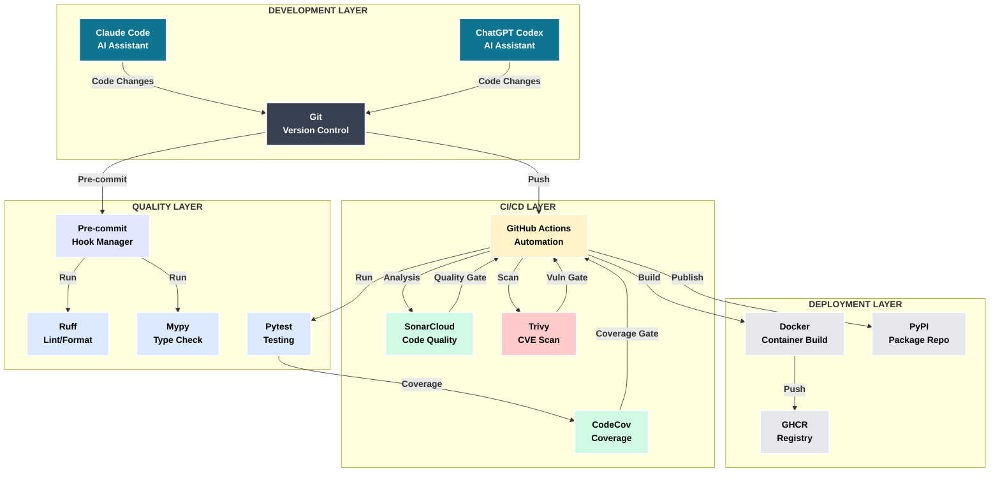
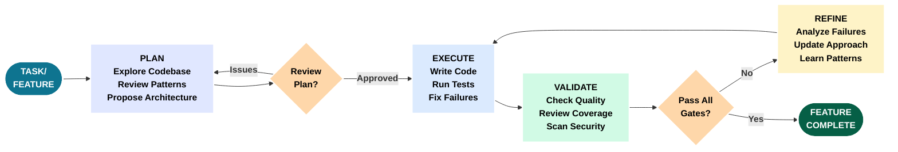

# Tutorial Diagrams - LLM-First Development (Slide-Optimized)

## Overview

This document contains slide-optimized versions of the tutorial diagrams, formatted for standard 8x10 PPT 4:3 layout with:
- **Minimum font size**: 14pt bold (16pt+ preferred)
- **Layout**: 4:3 aspect ratio, horizontal/landscape orientation
- **Color palette**: Academic/Technical (neutral tones with accent colors)
- **Text**: Always bold; white text on dark backgrounds, black text on light backgrounds
- **Borders**: White outlines for visibility on dark backgrounds

## Color Palette

- **Primary Actions**: Dark Blue/Cyan (#0e7490) - **WHITE BOLD TEXT**
- **Success/Complete**: Dark Green (#065f46) - **WHITE BOLD TEXT**
- **Decisions**: Muted Orange (#b45309) - **WHITE BOLD TEXT**
- **Light Backgrounds**: Pastels - **BLACK BOLD TEXT**
- **Borders**: White (2-3px) for shape outlines

## Table of Contents

### Master/Big Picture
1. [Complete Development Lifecycle](#1-complete-development-lifecycle)
2. [Tool Ecosystem Map](#2-tool-ecosystem-map)
3. [LLM Plan-Execute-Refine Loop](#3-llm-plan-execute-refine-loop)

---

## Master/Big Picture

### 1. Complete Development Lifecycle

**Summary**: This diagram shows the complete 12-phase development lifecycle organized in four horizontal rows stacked vertically for optimal 4:3 slide format. The flow progresses from top-to-bottom and left-to-right within each row. The first section covers concept through core development, the second handles testing through CI/CD, the third covers quality tools through documentation, and the fourth completes with Docker build, deployment, and publishing. Each phase includes quality gates (decision points) that determine whether work proceeds or requires refinement.

The lifecycle follows logical progression but shows the reality of development: failed tests trigger refactoring, security issues force architectural changes, and documentation gaps reveal requirements ambiguities. Feedback loops connect upward to earlier phases when quality gates fail, routing around intermediate sections. This represents the rigorous, quality-focused approach where LLM assistance accelerates iteration speed without compromising standards.

**Purpose**: Provide 10,000-foot view of entire development process with quality checkpoints.

**Usage**: Tutorial introduction to show complete journey from idea to published package.

```mermaid
graph TB
    subgraph CONCEPT["<b>CONCEPT TO CORE DEVELOPMENT</b>"]
        direction LR
        Start([<b>CONCEPT</b>]) --> P0[<b>PHASE 0</b><br/><b>Requirements</b>]
        P0 --> QG0{<b>Clear?</b>}
        QG0 -->|<b>No</b>| P0
        QG0 -->|<b>Yes</b>| P1[<b>PHASE 1</b><br/><b>Architecture</b>]
        P1 --> QG1{<b>Viable?</b>}
        QG1 -->|<b>No</b>| P1
        QG1 -->|<b>Yes</b>| P2[<b>PHASE 2</b><br/><b>Core Dev</b>]
    end

    subgraph TESTING["<b>TESTING TO CI/CD</b>"]
        direction LR
        P3[<b>PHASE 3</b><br/><b>Testing</b>] --> QG2{<b>Pass?</b>}
        QG2 -->|<b>Yes</b>| P4[<b>PHASE 4</b><br/><b>Integration</b>]
        P4 --> P5[<b>PHASE 5</b><br/><b>CI/CD</b>]
        P5 --> QG3{<b>Healthy?</b>}
        QG3 -->|<b>No</b>| P4
    end

    subgraph QUALITY["<b>QUALITY TO DOCUMENTATION</b>"]
        direction LR
        P6[<b>PHASE 6</b><br/><b>Quality</b>] --> QG4{<b>Standards<br/>Met?</b>}
        QG4 -->|<b>Yes</b>| P7[<b>PHASE 7</b><br/><b>Security</b>]
        P7 --> QG5{<b>Secure?</b>}
        QG5 -->|<b>Yes</b>| P8[<b>PHASE 8</b><br/><b>Docs</b>]
    end

    subgraph DEPLOY["<b>BUILD TO RELEASE</b>"]
        direction LR
        P9[<b>PHASE 9</b><br/><b>Docker</b>] --> QG6{<b>Built?</b>}
        QG6 -->|<b>No</b>| P9
        QG6 -->|<b>Yes</b>| P10[<b>PHASE 10</b><br/><b>Deploy</b>]
        P10 --> QG7{<b>Works?</b>}
        QG7 -->|<b>No</b>| P10
        QG7 -->|<b>Yes</b>| P11[<b>PHASE 11</b><br/><b>Publish</b>]
        P11 --> End([<b>RELEASED</b>])
    end

    P2 --> P3
    QG2 -->|<b>No</b>| P2
    QG3 -->|<b>Yes</b>| P6
    QG4 -->|<b>No</b>| P2
    QG5 -->|<b>No</b>| P1
    P8 --> P9

    style Start fill:#0e7490,stroke:#fff,stroke-width:3px,color:#fff
    style End fill:#065f46,stroke:#fff,stroke-width:3px,color:#fff
    style P0 fill:#e0e7ff,stroke:#fff,stroke-width:2px,color:#000
    style P1 fill:#e0e7ff,stroke:#fff,stroke-width:2px,color:#000
    style P2 fill:#dbeafe,stroke:#fff,stroke-width:2px,color:#000
    style P3 fill:#dbeafe,stroke:#fff,stroke-width:2px,color:#000
    style P4 fill:#cffafe,stroke:#fff,stroke-width:2px,color:#000
    style P5 fill:#cffafe,stroke:#fff,stroke-width:2px,color:#000
    style P6 fill:#d1fae5,stroke:#fff,stroke-width:2px,color:#000
    style P7 fill:#d1fae5,stroke:#fff,stroke-width:2px,color:#000
    style P8 fill:#e5e7eb,stroke:#fff,stroke-width:2px,color:#000
    style P9 fill:#e5e7eb,stroke:#fff,stroke-width:2px,color:#000
    style P10 fill:#fef3c7,stroke:#fff,stroke-width:2px,color:#000
    style P11 fill:#fef3c7,stroke:#fff,stroke-width:2px,color:#000
    style QG0 fill:#fed7aa,stroke:#fff,stroke-width:2px,color:#000
    style QG1 fill:#fed7aa,stroke:#fff,stroke-width:2px,color:#000
    style QG2 fill:#fed7aa,stroke:#fff,stroke-width:2px,color:#000
    style QG3 fill:#fed7aa,stroke:#fff,stroke-width:2px,color:#000
    style QG4 fill:#fed7aa,stroke:#fff,stroke-width:2px,color:#000
    style QG5 fill:#fed7aa,stroke:#fff,stroke-width:2px,color:#000
    style QG6 fill:#fed7aa,stroke:#fff,stroke-width:2px,color:#000
    style QG7 fill:#fed7aa,stroke:#fff,stroke-width:2px,color:#000
```

---

### 2. Tool Ecosystem Map

**Summary**: This diagram maps the complete tool ecosystem organized by functional layers, showing how tools interconnect through data flows and API integrations. The foundation layer contains development tools (Claude Code, ChatGPT) that interact with version control (Git/GitHub). The quality layer shows how code flows through pre-commit hooks (Ruff, Mypy) before reaching CI/CD, which then coordinates with external scanning services (SonarCloud, CodeCov, Trivy). The deployment layer shows the build-publish pipeline from Docker to GHCR, with security validation at each step.

The diagram emphasizes data flow and interdependencies: test results flow to CodeCov, code flows to SonarCloud, vulnerabilities flow from Trivy to PR checks. This helps developers understand which tools to configure first and how changes propagate through the system.

**Purpose**: Show interconnected tool landscape organized by functional layers and data flows.

**Usage**: Architecture overview to understand tool selection, configuration order, and integration points.

---

### 3. LLM Plan-Execute-Refine Loop

**Summary**: This diagram captures the iterative cycle at the heart of LLM-first development: detailed planning before execution, rigorous validation after execution, and learning-driven refinement. Unlike traditional "code first, fix later" approaches, this workflow emphasizes upfront planning where the LLM explores the codebase, reviews existing patterns, and proposes architecture before writing any code. The execution phase involves TDD cycles with continuous testing, and validation checks code quality, test coverage, and security standards.

The refinement loop is critical: failed validation triggers analysis and learning rather than abandonment. The LLM examines what went wrong and refines the implementation. This cycle repeats until all quality gates pass. LLM speed makes multiple iterations practical - what would take hours manually takes minutes with AI assistance.

**Purpose**: Show iterative planning-execution-validation cycle with learning feedback loops.

**Usage**: Core methodology section explaining how LLM assistance enables rigorous iterative development.

---

