# Tutorial Diagrams - LLM-First Development (Slide-Optimized)

## Overview

This document contains slide-optimized versions of the tutorial diagrams, formatted for standard 8x10 PPT 4:3 layout with:
- **Minimum font size**: 14pt bold (16pt+ preferred)
- **Layout**: 4:3 aspect ratio, horizontal/landscape orientation
- **Color palette**: Academic/Technical (neutral tones with accent colors)
- **Text**: Always bold; white text on dark backgrounds, black text on light backgrounds
- **Borders**: White outlines for visibility on dark backgrounds

## Color Palette

- **Primary Actions**: Dark Blue/Cyan (#0e7490) - **WHITE BOLD TEXT**
- **Success/Complete**: Dark Green (#065f46) - **WHITE BOLD TEXT**
- **Decisions**: Muted Orange (#b45309) - **WHITE BOLD TEXT**
- **Light Backgrounds**: Pastels - **BLACK BOLD TEXT**
- **Borders**: White (2-3px) for shape outlines

## Table of Contents

### Master/Big Picture
1. [Complete Development Lifecycle](#1-complete-development-lifecycle)
2. [Tool Ecosystem Map](#2-tool-ecosystem-map)
3. [LLM Plan-Execute-Refine Loop](#3-llm-plan-execute-refine-loop)

---

## Master/Big Picture

### 1. Complete Development Lifecycle

**Summary**: This diagram shows the complete 12-phase development lifecycle organized in four horizontal rows stacked vertically for optimal 4:3 slide format. The flow progresses from top-to-bottom and left-to-right within each row. The first section covers concept through core development, the second handles testing through CI/CD, the third covers quality tools through documentation, and the fourth completes with Docker build, deployment, and publishing. Each phase includes quality gates (decision points) that determine whether work proceeds or requires refinement.

The lifecycle follows logical progression but shows the reality of development: failed tests trigger refactoring, security issues force architectural changes, and documentation gaps reveal requirements ambiguities. Feedback loops connect upward to earlier phases when quality gates fail, routing around intermediate sections. This represents the rigorous, quality-focused approach where LLM assistance accelerates iteration speed without compromising standards.

**Purpose**: Provide 10,000-foot view of entire development process with quality checkpoints.

**Usage**: Tutorial introduction to show complete journey from idea to published package.

---

### 2. Tool Ecosystem Map

**Summary**: This diagram maps the complete tool ecosystem organized by functional layers, showing how tools interconnect through data flows and API integrations. The foundation layer contains development tools (Claude Code, ChatGPT) that interact with version control (Git/GitHub). The quality layer shows how code flows through pre-commit hooks (Ruff, Mypy) before reaching CI/CD, which then coordinates with external scanning services (SonarCloud, CodeCov, Trivy). The deployment layer shows the build-publish pipeline from Docker to GHCR, with security validation at each step.

The diagram emphasizes data flow and interdependencies: test results flow to CodeCov, code flows to SonarCloud, vulnerabilities flow from Trivy to PR checks. This helps developers understand which tools to configure first and how changes propagate through the system.

**Purpose**: Show interconnected tool landscape organized by functional layers and data flows.

**Usage**: Architecture overview to understand tool selection, configuration order, and integration points.

---

### 3. LLM Plan-Execute-Refine Loop

**Summary**: This diagram captures the iterative cycle at the heart of LLM-first development: detailed planning before execution, rigorous validation after execution, and learning-driven refinement. Unlike traditional "code first, fix later" approaches, this workflow emphasizes upfront planning where the LLM explores the codebase, reviews existing patterns, and proposes architecture before writing any code. The execution phase involves TDD cycles with continuous testing, and validation checks code quality, test coverage, and security standards.

The refinement loop is critical: failed validation triggers analysis and learning rather than abandonment. The LLM examines what went wrong and refines the implementation. This cycle repeats until all quality gates pass. LLM speed makes multiple iterations practical - what would take hours manually takes minutes with AI assistance.

**Purpose**: Show iterative planning-execution-validation cycle with learning feedback loops.

**Usage**: Core methodology section explaining how LLM assistance enables rigorous iterative development.

---

## Phase-Specific Flows

### 4. Phase 0: Concept to Requirements

**Summary**: Phase 0 begins with a user need or business problem. The developer engages with the LLM to clarify the concept through dialogue, asking questions about scope, constraints, users, and success criteria. The LLM helps refine vague ideas into specific requirements by prompting for missing information and identifying edge cases. Once requirements are clear, they are documented in a structured format. This phase emphasizes thorough upfront thinking to avoid rework later.

**Purpose**: Transform vague concepts into clear, documented requirements through LLM-assisted dialogue.

**Usage**: Phase 0 chapter - teaches readers how to use LLMs to clarify requirements before writing code.

---

### 5. Phase 1: Feature Specification

**Summary**: With requirements in hand, Phase 1 creates a detailed feature specification. The developer provides the requirements document as context to the LLM along with relevant codebase information. The LLM analyzes existing code to understand conventions and proposes how the feature should integrate. Together they define the feature interface, data structures, and integration points with usage examples.

**Purpose**: Create detailed feature specification with usage examples and integration points.

**Usage**: Phase 1 chapter - shows how to leverage LLM knowledge of codebase to create consistent designs.

---

### 6. Phase 2: Planning & Design

**Summary**: Phase 2 is the detailed technical planning phase. The LLM enters plan mode to explore the codebase thoroughly, understanding existing architecture, dependencies, and potential conflicts. Based on this exploration, the LLM proposes an architectural approach. The developer and LLM discuss trade-offs between different approaches. Once an approach is selected, they break it into implementation tasks, identify files to modify, plan test strategy, and identify risks.

**Purpose**: Create detailed technical implementation plan through LLM-assisted architecture exploration.

**Usage**: Phase 2 chapter - demonstrates the critical planning phase that determines implementation success.

---

### 7. Phase 3: Implementation (TDD Cycle)

**Summary**: Phase 3 is where code gets written using test-driven development. The cycle starts by writing a failing test for the next small piece of functionality (Red). The LLM writes minimal code to make the test pass (Green). Then the code is refactored for quality while keeping tests passing (Refactor). This red-green-refactor cycle repeats for each piece of functionality. Quality checks (Ruff, Mypy) run continuously. When all functionality is complete and all tests pass, Phase 3 is done.

**Purpose**: Show test-driven development cycle with LLM writing tests and implementation code.

**Usage**: Phase 3 chapter - demonstrates rigorous TDD approach with immediate quality feedback.

---

### 8. Phase 4: Integration Testing

**Summary**: Phase 4 verifies that components work together correctly. Unit tests from Phase 3 tested individual functions in isolation. Integration tests verify workflows across multiple components, database interactions, API calls, and file I/O. The LLM helps write integration test scenarios based on user workflows. Failed integration tests often reveal interface mismatches or incorrect assumptions. The LLM assists in debugging by analyzing test failures and proposing fixes.

**Purpose**: Validate cross-component interactions and end-to-end workflows.

**Usage**: Phase 4 chapter - shows how to design and debug integration tests with LLM assistance.

```mermaid
graph LR
    Start([<b>IMPLEMENTATION<br/>COMPLETE</b>]) --> Identify[<b>Identify Integration<br/>Scenarios</b>]
    Identify --> WriteTests[<b>Write Integration<br/>Tests</b>]
    WriteTests --> RunTests[<b>Run Integration<br/>Tests</b>]
    RunTests --> Results{<b>All Pass?</b>}
    Results -->|<b>No</b>| Analyze[<b>LLM: Analyze<br/>Failures</b>]
    Analyze --> Debug[<b>Debug Integration<br/>Issues</b>]
    Debug --> Fix[<b>Fix Code/Tests</b>]
    Fix --> RunTests
    Results -->|<b>Yes</b>| Coverage[<b>Check Coverage</b>]
    Coverage --> CovGate{<b>Coverage<br/>≥85%?</b>}
    CovGate -->|<b>No</b>| Identify
    CovGate -->|<b>Yes</b>| Complete([<b>INTEGRATION<br/>VERIFIED</b>])

    style Start fill:#0e7490,stroke:#fff,stroke-width:3px,color:#fff
    style Complete fill:#065f46,stroke:#fff,stroke-width:3px,color:#fff
    style Results fill:#fed7aa,stroke:#fff,stroke-width:2px,color:#000
    style CovGate fill:#fed7aa,stroke:#fff,stroke-width:2px,color:#000
    style Identify fill:#e0e7ff,stroke:#fff,stroke-width:2px,color:#000
    style WriteTests fill:#dbeafe,stroke:#fff,stroke-width:2px,color:#000
    style RunTests fill:#dbeafe,stroke:#fff,stroke-width:2px,color:#000
    style Analyze fill:#fef3c7,stroke:#fff,stroke-width:2px,color:#000
    style Debug fill:#fef3c7,stroke:#fff,stroke-width:2px,color:#000
    style Fix fill:#fef3c7,stroke:#fff,stroke-width:2px,color:#000
    style Coverage fill:#d1fae5,stroke:#fff,stroke-width:2px,color:#000
```

---

### 9. Phase 5: CI/CD Setup

**Summary**: Phase 5 establishes continuous integration and deployment pipelines. The developer and LLM configure GitHub Actions workflows to run on every commit and PR. The pipeline includes multiple stages: install dependencies, run linters (Ruff), run type checking (Mypy), run all tests with coverage, build artifacts, and run security scans. Each stage has pass/fail gates. The LLM helps troubleshoot pipeline failures and optimize workflow performance. The result is automated quality enforcement on every code change.

**Purpose**: Establish automated testing, quality checks, and deployment pipelines.

**Usage**: Phase 5 chapter - demonstrates setting up robust CI/CD with multiple quality gates.

---
### 10. Phase 6: Performance Tuning

**Summary**: Phase 6 optimizes code performance once functionality is correct. The process starts with establishing baseline performance using benchmarks - measuring current speed, memory usage, and resource consumption. The LLM helps identify bottlenecks through profiling. Each bottleneck is analyzed to understand why it is slow. The LLM proposes optimizations specific to the bottleneck type. Each optimization is applied and measured to verify improvement. SparseTagging achieved 100-170x speedups through sparse matrix operations and intelligent caching.

**Purpose**: Systematically optimize performance using benchmarking, profiling, and targeted improvements.

**Usage**: Phase 6 chapter - teaches data-driven performance optimization with measurable improvements.

---

### 11. Phase 7: Quality Checks

**Summary**: Phase 7 ensures code meets quality standards before CI/CD. The workflow runs three key tools in sequence: Ruff (linting and formatting), Mypy (type checking), and pre-commit hooks (automated enforcement). Ruff checks code style and identifies bugs. Mypy performs static type analysis. Pre-commit hooks run all checks automatically before each commit, preventing bad code from entering version control. Any failures must be fixed before proceeding.

**Purpose**: Enforce code quality standards locally before pushing to CI.

**Usage**: Phase 7 chapter - establishes local quality workflow that mirrors CI checks.

---

### 12. Phase 8: Documentation

**Summary**: Phase 8 creates comprehensive documentation at multiple levels. Starting with code-level docstrings, the LLM generates descriptions for all public functions, classes, and modules. These docstrings are used to generate API reference documentation automatically. User-facing documentation includes quickstart guides, tutorials, and architecture overviews. The LLM can extract patterns from code to explain complex designs.

**Purpose**: Create multi-level documentation from docstrings through user guides.

**Usage**: Phase 8 chapter - shows how LLMs can generate consistent, comprehensive documentation.

---

### 13. Phase 9: Docker Containerization

**Summary**: Phase 9 packages the application in a Docker container for consistent deployment. The process starts with creating a Dockerfile that defines the container image. The image uses multi-stage builds to minimize size - build dependencies are separate from runtime dependencies. The LLM helps optimize layer caching and choose base images. Security scanning with Trivy checks for vulnerabilities before deployment. Smoke tests verify the container works correctly. The final image is tagged with version numbers and pushed to a registry.

**Purpose**: Create production-ready Docker containers with security validation.

**Usage**: Phase 9 chapter - demonstrates containerization best practices and security scanning.

---

### 14. Phase 10: External Services Integration

**Summary**: Phase 10 integrates external quality and deployment services. SonarCloud provides code quality analysis with quality gates. CodeCov tracks coverage trends. GitHub Container Registry (GHCR) hosts Docker images. Each service requires setup - creating accounts, generating tokens, adding secrets to GitHub, and configuring workflows. The LLM helps troubleshoot authentication issues and explains configuration options. Services coordinate through the CI pipeline with graceful degradation.

**Purpose**: Integrate SonarCloud, CodeCov, GHCR, and other external services with CI pipeline.

**Usage**: Phase 10 chapter - step-by-step external service setup with troubleshooting guidance.

---

### 15. Phase 11: Publishing and Release

**Summary**: Phase 11 handles release preparation and deployment. The process starts with version bumping in pyproject.toml, which propagates through Docker images and package metadata. A comprehensive changelog documents all changes since the last release. Git tags mark release points, triggering deployment workflows. The CI pipeline builds distribution packages, runs final quality checks, creates Docker images with version tags, and pushes to registries (PyPI, GHCR). Release notes are generated from the changelog.

**Purpose**: Prepare and execute releases with versioning, tagging, and deployment automation.

**Usage**: Phase 11 chapter - demonstrates complete release workflow from version bump to deployment.

---
