# Understanding Claude Code Quality Automation
## A Guide to Production-Grade Development Workflows

**For**: MRSL Engineering Team
**Purpose**: Educational guide to Claude Code integration and automated quality systems
**Version**: 1.1
**Date**: 2026-01-23

---

## Reference Scales

Throughout this document, we use relative scales instead of exact numbers:

**Time Scale**:
- **Instant**: Happens immediately, no perceptible delay
- **Quick**: Fast feedback, maintains development flow
- **Short**: Brief wait, stay in context
- **Moderate**: Noticeable duration, good time for a break
- **Extended**: Significant duration, context switch recommended
- **Lengthy**: Long duration, plan other work

**Cost Scale**:
- **$**: Minimal cost, easily absorbed in normal operations
- **$$**: Noticeable cost, justified by clear value
- **$$$**: Significant cost, requires business justification
- **$$$$**: Major cost, business-critical decision

---

## Table of Contents

1. [System Architecture Diagrams](#system-architecture-diagrams)
2. [Why This System Exists](#why-this-system-exists)
3. [Claude Code & IDE Integration](#claude-code--ide-integration)
4. [Quality Standards Quick Reference](#quality-standards-quick-reference)
5. [Standards Deep Dive](#standards-deep-dive)
6. [The Automation Pipeline](#the-automation-pipeline)
7. [Day in the Life Example](#day-in-the-life-example)

---

# System Architecture Diagrams

## 1. Claude Code Integration Architecture

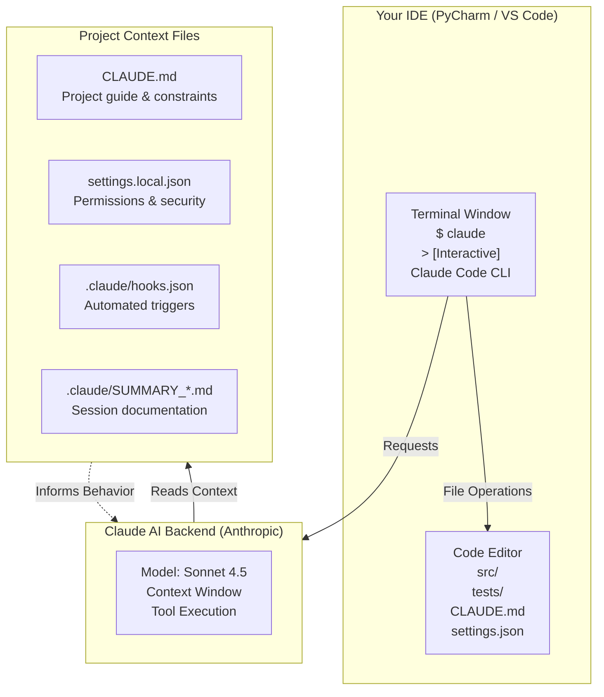

## 2. Quality Automation Pipeline

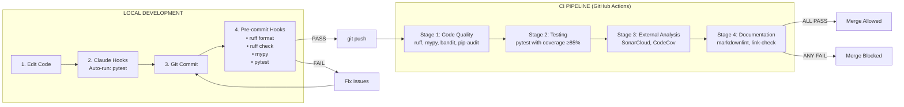

## 3. Claude Code Artifact Interaction Model

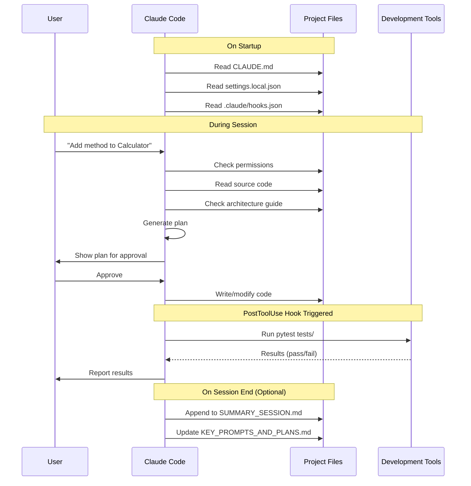

## 4. File System Layout & Responsibilities

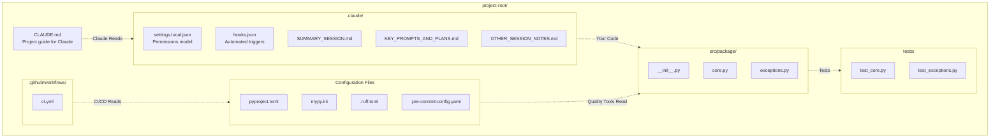

## 5. Development Feedback Loop

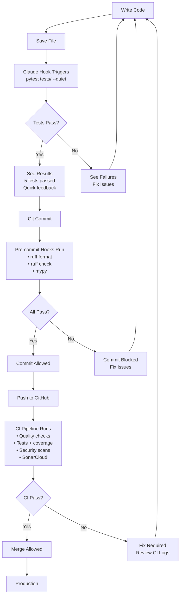

## 6. Permission Model Flow

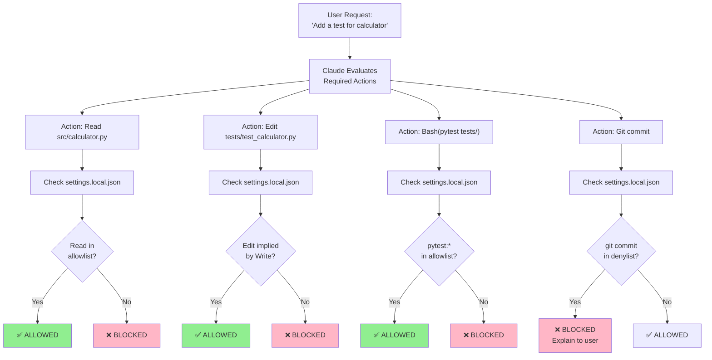

---

# Why This System Exists

## The Problem: Manual Quality Setup is Painful

### Traditional Approach (Pre-Automation):

**Project Setup** (Extended time)
1. Create directory structure
2. Set up virtual environment
3. Install pytest, configure coverage
4. Install mypy, create mypy.ini
5. Install ruff, create .ruff.toml
6. Set up pre-commit hooks
7. Configure GitHub Actions CI
8. Set up SonarCloud integration
9. Configure Dependabot
10. Write initial tests
11. Create documentation

**Result**:
- ❌ Inconsistent across projects (different developers, different standards)
- ❌ Mistakes in configuration (typos, wrong thresholds)
- ❌ Forgotten steps (pre-commit not installed, coverage not enforced)
- ❌ No documentation of why choices were made
- ❌ Hard to onboard new developers (tribal knowledge)

### Automated Approach (With Templates):

**Project Setup** (Quick time)
1. Run: `python init_project.py`
2. Answer: name, type, description
3. Done: Everything configured correctly

**Result**:
- ✅ Consistent across all projects
- ✅ Best practices baked in
- ✅ Nothing forgotten
- ✅ Documentation included
- ✅ New developers productive immediately

## Production-Grade Code from Day One

### Why Quality Matters from the Start

**The Cost of Technical Debt**:

Technical debt compounds over time. Code written without quality standards becomes increasingly expensive to maintain:

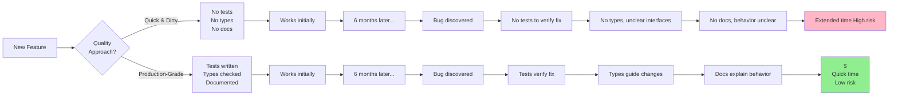

**Time Scale of Quality Issues**:

| When Issue Found | Time to Fix | Cost to Fix | Risk Level |
|-----------------|-------------|-------------|------------|
| **Pre-commit** (local) | Instant | $ | Minimal |
| **CI Pipeline** (remote) | Quick | $ | Low |
| **Code Review** | Short | $$ | Moderate |
| **QA Testing** | Moderate | $$$ | Elevated |
| **Production** | Extended | $$$$ | Critical |
| **Customer Impact** | Lengthy | $$$$ | Severe |

### What "Production-Grade" Means

**Production-grade code is**:
- ✅ **Tested**: Comprehensive test coverage catches regressions
- ✅ **Type-safe**: Prevents entire classes of runtime errors
- ✅ **Secure**: Scanned for vulnerabilities before deployment
- ✅ **Documented**: Clear interfaces and behavior
- ✅ **Maintainable**: Low complexity, clear patterns
- ✅ **Monitored**: Quality tracked over time

**Production-grade code is NOT**:
- ❌ Perfect code (perfectionism is its own problem)
- ❌ Over-engineered (simple solutions preferred)
- ❌ Slow to write (automation makes it faster)
- ❌ Bureaucratic (quality gates are automated)

### The "Fix It Later" Fallacy

**Common thinking**: "Let's ship quickly now, fix quality later"

**Reality**: Later rarely comes, and when it does, it's expensive

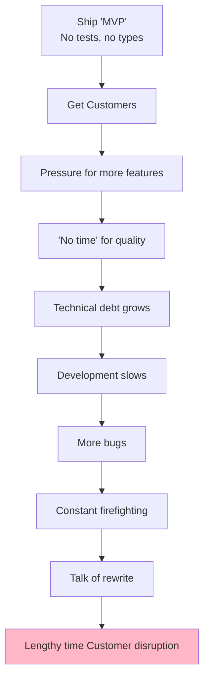

**Better approach**: Build quality in from day one

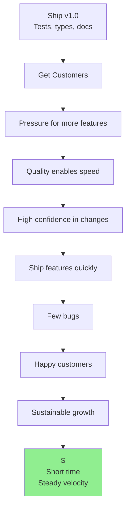

### Cost Comparison

**Scenario: Authentication Bug**

**Without Quality Automation**:
1. Bug ships to production (Extended time to discover)
2. Customer reports issue (Moderate time to reproduce)
3. Developers investigate (Extended time, unclear code)
4. Fix developed without tests (Quick time, uncertain)
5. Fix causes regression (Extended time to discover)
6. Emergency hotfix (Moderate time, high stress)
7. Post-mortem reveals root cause (Extended time)
8. Refactor to prevent similar bugs (Lengthy time)

**Total**: $$$$ cost, Lengthy time, customer trust damaged

**With Quality Automation**:
1. Bug introduced in development (Instant detection)
2. Tests fail in pre-commit hook (Instant feedback)
3. Developer fixes before commit (Quick time)
4. Verified by tests (Instant)
5. Never ships to production

**Total**: $ cost, Quick time, no customer impact

**ROI**: Quality automation pays for itself on the first major bug prevented.

---

# Claude Code & IDE Integration

## What is Claude Code?

Claude Code is an **AI-powered development assistant** that:
- Runs in your terminal alongside your IDE
- Understands your entire codebase
- Can read, write, and execute code
- Follows project-specific guidelines
- Operates with configurable permissions

**It is NOT**:
- A replacement for your IDE
- A code completion tool (like GitHub Copilot)
- Always right (it needs guidance)
- Magic (it's a sophisticated AI system with clear mechanics)

## How Claude Code Works

### The Mental Model

Think of Claude Code as a **highly skilled junior developer** who:
1. ✅ Can read and understand code very quickly
2. ✅ Follows written guidelines precisely (CLAUDE.md)
3. ✅ Needs clear direction for complex tasks
4. ✅ Benefits from constraints (permissions, standards)
5. ✅ Gets better with feedback and iteration

**Not like**:
- ❌ A magic wand that always produces perfect code
- ❌ A senior architect making all decisions
- ❌ A tool that "just knows" what you want

### The Interaction Flow

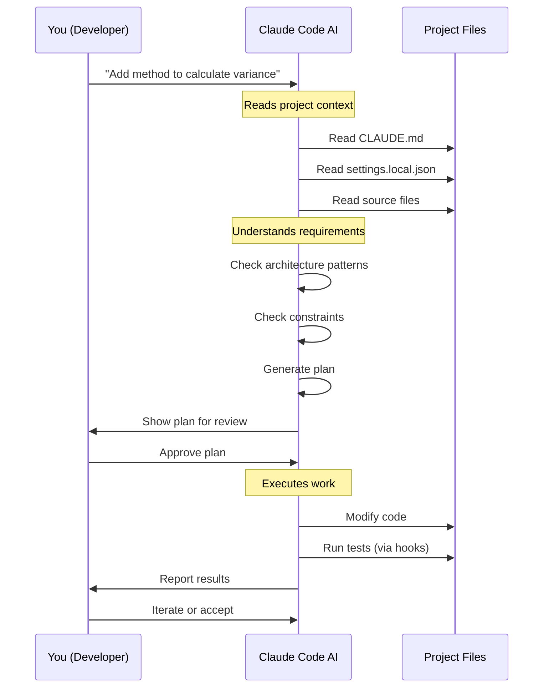

## Claude Code Artifacts Explained

### 1. CLAUDE.md - The Primary Guide

**What it is**: A markdown file at your project root that tells Claude Code:
- What this project does
- How it's architectured
- What patterns to follow
- What constraints apply
- How to test changes

**Why it exists**:
- Claude doesn't inherently know your project conventions
- Each project has unique patterns and requirements
- Reduces need for repetitive explanations
- Provides consistent guidance across all sessions

**What Claude does with it**:
1. Reads on session start
2. Refers to it when making decisions
3. Follows the patterns documented
4. Respects the constraints listed

**Example sections**:
```markdown
## Code Patterns

### Exception Handling
Always use custom exceptions from exceptions.py:
- ValidationError for input validation
- ProcessingError for runtime failures

BAD:
    raise ValueError("Bad input")

GOOD:
    raise ValidationError(f"Invalid input: {value}")
```

When Claude sees this, it will use `ValidationError` instead of `ValueError`.

### 2. settings.local.json - Permission Control

**What it is**: A JSON file defining what Claude is allowed to do

**Why it exists**:
- Security: Prevent accidental destructive operations
- Control: You decide what AI can modify
- Audit: Clear record of what AI is permitted to do

**Structure**:
```json
{
  "permissions": {
    "allow": [
      "Read",                    // Can read any file
      "Bash(pytest)",            // Can run tests
      "Bash(mypy:*)"            // Can run type checker
    ],
    "deny": [
      "Bash(git push)",          // Cannot push to remote
      "Bash(pip install)",       // Cannot install packages
      "Bash(rm)"                 // Cannot delete files
    ]
  }
}
```

**The Permission Model**:

| Permission Type | Example | Rationale |
|----------------|---------|-----------|
| **Read** (Allowed) | View any file | Exploration should be frictionless |
| **Edit** (Allowed) | Modify source/tests | Development requires changes |
| **Test** (Allowed) | pytest, mypy | Quality checks should be easy |
| **Commit** (Denied) | git commit | User should review before committing |
| **Push** (Denied) | git push | Prevents accidental publication |
| **Install** (Denied) | pip install | Prevents dependency drift |

**Why this matters**:
- Audit trail: All actions are logged
- Blast radius: Limits damage from AI mistakes
- Security: Satisfies ops/security requirements

### 3. .claude/hooks.json - Automation Triggers

**What it is**: Defines automated actions triggered by Claude's operations

**Why it exists**:
- Immediate feedback: Tests run after changes
- Catch errors early: Before you even look at the code
- Reduce friction: No need to manually run tests

**Example**:
```json
{
  "hooks": {
    "PostToolUse": [
      {
        "matcher": "Edit",
        "hooks": [
          {
            "type": "command",
            "command": "pytest tests/ --quiet",
            "description": "Run tests after code edits"
          }
        ]
      }
    ]
  }
}
```

**What happens**:
1. Claude edits a Python file
2. Hook triggers automatically
3. pytest runs
4. Results shown to you
5. You see if the change broke anything

**Without hooks**:
- You'd manually run `pytest tests/` after every change
- Might forget to run it
- Delayed feedback = slower iteration

**With hooks**:
- Tests run automatically
- Instant feedback
- Faster development cycle

### 4. Session Documentation Files

**What they are**: Markdown files in `.claude/` that track your work

- **SUMMARY_SESSION.md**: High-level summary of what was accomplished
- **KEY_PROMPTS_AND_PLANS.md**: Important prompts and detailed plans
- **OTHER_SESSION_NOTES.md**: Miscellaneous notes and decisions

**Why they exist**:
- **Memory**: Track what you did across sessions
- **Documentation**: Auto-generate project history
- **Handoffs**: Share context with teammates
- **Learning**: Review what worked/didn't work

**Example usage**:
```markdown
After session: "Implemented variance calculation"

SUMMARY_SESSION.md gets:
## Session 2026-01-23 14:30

### Accomplished
- Added variance() method to Calculator class
- Implemented tests with 95% coverage
- Fixed edge case for empty lists
- Updated documentation

### Decisions
- Used population variance (not sample)
- Raises ValueError for empty input
- Returns float type
```

**You can tell Claude**: "Append to SUMMARY_SESSION.md" and it will document your work.

## IDE Integration

### PyCharm Setup

**Terminal Integration**:
1. Open PyCharm
2. View → Tool Windows → Terminal
3. Run: `claude`
4. Claude Code starts in terminal pane

**Split View**:
- Left: Code editor with your files
- Right: Terminal with Claude Code
- See changes in real-time as Claude makes them

**Benefits**:
- Direct file access (Claude modifies files you see)
- Git integration (see diffs immediately)
- Test runner integration (see test results)

### VS Code Setup

**Similar workflow**:
1. Open integrated terminal (Ctrl+`)
2. Run: `claude`
3. Split editor and terminal

**VS Code advantages**:
- Built-in Git UI
- Extension ecosystem
- Lightweight

### The Development Loop

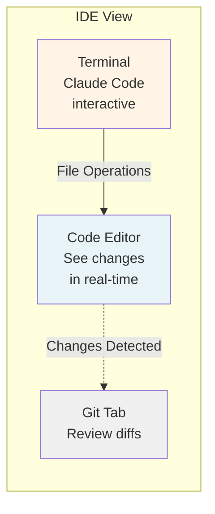

**Key insight**: Claude Code modifies files directly in your project. You see changes in your IDE as they happen. This is **not magic** - it's using standard file operations that your IDE detects.

---

# Quality Standards Quick Reference

## One-Page Standards Table

| Standard/Tool | What It Does | Threshold/Configuration | When It Runs | Enforced By | Block/Warn |
|--------------|--------------|------------------------|--------------|-------------|------------|
| **Testing** | | | | | |
| pytest | Run test suite | All tests must pass | pre-commit, CI | Git hook, CI | BLOCK |
| pytest-cov | Measure code coverage | ≥85% overall, ≥90% new code | pre-commit, CI | Git hook, CI | BLOCK |
| **Type Safety** | | | | | |
| mypy | Static type checking | Strict mode, 100% coverage | pre-commit, CI | Git hook, CI | BLOCK |
| **Code Quality** | | | | | |
| ruff check | Linting (errors, style) | ~700 rules enabled | pre-commit, CI | Git hook, CI | BLOCK |
| ruff format | Code formatting | Black-compatible | pre-commit, CI | Git hook, CI | BLOCK |
| **Security** | | | | | |
| bandit | Python security linter | Medium+ severity issues | CI | CI only | BLOCK |
| pip-audit | CVE scanning | High+ severity CVEs | CI, scheduled | CI, Dependabot | BLOCK |
| Dependabot | Dependency CVE monitoring | All known CVEs | Automated PRs | GitHub | WARN |
| **Code Analysis** | | | | | |
| SonarCloud | Comprehensive analysis | Security A, Bugs A | CI | CI only | BLOCK |
| Complexity | Cognitive complexity | ≤15 per function | CI, SonarCloud | SonarCloud | BLOCK |
| Duplication | Code duplication | ≤3% project-wide | CI, SonarCloud | SonarCloud | BLOCK |
| **Documentation** | | | | | |
| markdownlint | Markdown style | Standard rules | pre-commit, CI | Git hook, CI | BLOCK |
| markdown-link-check | Validate hyperlinks | No broken links | CI | CI only | WARN |
| Docstrings | API documentation | All public APIs | mypy | mypy, CI | BLOCK |
| **CI/CD** | | | | | |
| Path filtering | Skip irrelevant jobs | Docs-only = quick build | CI | CI workflow | N/A |
| Service health | Check external deps | Services reachable | CI | CI workflow | WARN |
| Exit code capture | Gate quality | Tools must pass | CI | CI workflow | BLOCK |
| **Automation** | | | | | |
| pre-commit | Local quality gate | All checks before commit | pre-commit | Git hook | BLOCK |
| Claude hooks | Post-edit testing | Tests after file changes | File save | Claude Code | WARN |
| **Process** | | | | | |
| Git workflow | Require PR review | 1+ approvals | GitHub | Branch protection | BLOCK |
| Semantic versioning | Version management | Major.Minor.Patch | Manual | Documentation | N/A |

### Legend

**When It Runs**:
- **pre-commit**: Before git commit (local)
- **CI**: In GitHub Actions (remote)
- **File save**: After editing files
- **Scheduled**: Daily/weekly automated check
- **Automated PRs**: Dependabot creates PRs

**Enforced By**:
- **Git hook**: pre-commit framework
- **Claude Code**: Hooks in .claude/hooks.json
- **CI**: GitHub Actions workflow
- **GitHub**: Platform features (branch protection)
- **SonarCloud**: External service

**Block/Warn**:
- **BLOCK**: Prevents next step (commit, merge, deploy)
- **WARN**: Notifies but allows continuation

---

# Standards Deep Dive

## Why These Standards Matter

### 1. Test Coverage (≥85% Overall, ≥90% New Code)

**What it means**:
- 85% of your code is executed by tests
- New features must have 90% of lines tested

**Why this threshold**:
- **Industry benchmark**: 80-90% is considered excellent
- **Diminishing returns**: 95%+ often means testing trivial code
- **Practical balance**: Covers critical paths without busywork
- **Production-grade**: High enough for confidence, achievable in practice

**What gets tested**:
- ✅ Core business logic (100% coverage)
- ✅ Error handling paths (100% coverage)
- ✅ Edge cases and boundaries
- ✅ Integration points
- ⚠️ Simple getters/setters (lower priority)
- ⚠️ Trivial formatting code (lower priority)

**Why it matters for production code**:
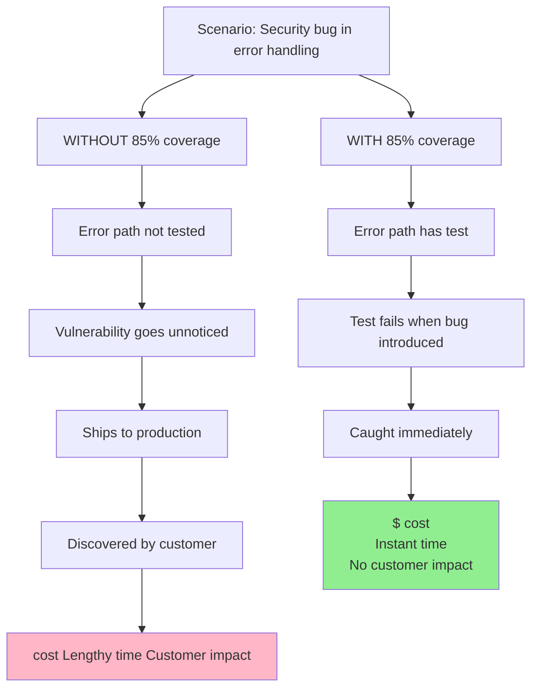

**How it's measured**:
```bash
pytest tests/ --cov=src --cov-report=term

----------- coverage: platform win32, python 3.10 -----------
Name                    Stmts   Miss  Cover
-------------------------------------------
src/calculator.py          45      3    93%
src/exceptions.py          12      0   100%
src/utils.py              23      8    65%  ← Below threshold!
-------------------------------------------
TOTAL                     80     11    86%  ← Overall: PASS
```

**Enforcement**:
1. **Local**: pre-commit hook checks coverage
2. **CI**: Coverage report uploaded to CodeCov
3. **Gate**: CI fails if below 85%
4. **Visual**: CodeCov shows uncovered lines

### 2. Type Safety (mypy strict mode)

**What it means**:
Every function has type hints:
```python
def calculate(x: int, y: float) -> float:
    return x * y
```

**Why strict mode**:
- **No escape hatches**: Can't skip type checking
- **No implicit Any**: Must be explicit about unknowns
- **No untyped functions**: Everything must have hints

**Why this matters**:
```python
# WITHOUT TYPE HINTS
def process_data(data):
    return data.value * 2

# Runtime error after deployment:
# AttributeError: 'list' object has no attribute 'value'
# Cost: $$$, Extended time, customer impact

# WITH TYPE HINTS
def process_data(data: DataObject) -> int:
    return data.value * 2

# Mypy catches error immediately:
# error: Argument 1 has incompatible type "List[str]"; expected "DataObject"
# Cost: $, Instant time, no customer impact
```

**Value for production code**:
- Type errors can lead to security vulnerabilities
- Data could leak to wrong output type
- Type safety = additional safety layer
- Refactoring becomes safer

**Strict mode catches**:
1. Missing return types
2. Untyped function parameters
3. Implicit None values
4. Inconsistent return types
5. Type narrowing issues

**Example**:
```python
# FAILS strict mode (no return type)
def get_user(id):
    return database.fetch(id)

# PASSES strict mode
def get_user(user_id: int) -> Optional[User]:
    return database.fetch(user_id)
```

**How it's checked**:
```bash
mypy src/

src/calculator.py:45: error: Function is missing a return type annotation
src/utils.py:12: error: Argument 1 to "process" has incompatible type "str"; expected "int"
Found 2 errors in 2 files (checked 15 source files)
```

**Enforcement**:
1. **Editor**: PyCharm/VS Code show type errors inline
2. **Pre-commit**: Blocks commit if type errors exist
3. **CI**: Blocks merge if type errors exist

### 3. Complexity Limits (≤15 per function)

**What it measures**: Cognitive complexity - how hard a function is to understand

**Why 15**:
- Research shows comprehension drops sharply above 15
- Industry standard (SonarQube default)
- Maintainable by team members

**What adds complexity**:
- Nested if statements: +1 per level
- Loops: +1 per level
- Boolean operators: +1
- Error handling: +1

**Example**:
```python
# COMPLEXITY: 16 (TOO HIGH!)
def process_order(order):
    if order.valid:                    # +1
        if order.priority == "HIGH":   # +2 (nested)
            if order.express:          # +3 (nested)
                for item in order.items:  # +4 (nested loop)
                    if item.available:    # +5 (nested)
                        if item.quantity > 0:  # +6 (nested)
                            process_item(item)
                        else:
                            log_error()
                    else:
                        notify_customer()
            else:
                standard_processing()
        else:
            normal_queue()
    else:
        reject_order()
```

**Refactored** (complexity: 8):
```python
def process_order(order):
    if not order.valid:
        return reject_order()

    if order.priority != "HIGH":
        return normal_queue()

    if not order.express:
        return standard_processing()

    return process_high_priority_express(order)

def process_high_priority_express(order):
    for item in order.items:
        if item.available and item.quantity > 0:
            process_item(item)
        elif not item.available:
            notify_customer()
        else:
            log_error()
```

**Why this matters for production**:
- Complex code = more bugs
- Hard to review = security risks
- Hard to maintain = technical debt
- Difficult to test thoroughly

**Enforcement**: SonarCloud analyzes and flags high-complexity functions

### 4. Security Scanning (Bandit + pip-audit)

**What they do**:

**Bandit**: Scans Python code for security issues
- Hardcoded passwords
- Use of eval()
- Weak cryptography
- SQL injection risks
- Shell injection risks

**pip-audit**: Scans dependencies for CVEs
- Known security vulnerabilities
- Outdated libraries with fixes
- Supply chain risks

**Why both**:
```
Bandit finds: Your code problems
pip-audit finds: Library problems

Both are required for comprehensive security
```

**Example Bandit catch**:
```python
# SECURITY ISSUE: Hardcoded password
password = "admin123"  # B105: hardcoded_password_string

# Bandit reports:
# Issue: [B105:hardcoded_password_string] Possible hardcoded password: 'admin123'
# Severity: Low   Confidence: Medium
```

**Example pip-audit catch**:
```
Found 2 vulnerabilities in 1 package

Name    Version  ID              Fix Versions
requests 2.25.0  GHSA-j8r2-6x86  2.27.0+
requests 2.25.0  CVE-2021-33503  2.27.1+

CRITICAL: Remote code execution via malicious redirect
```

**Why CVE scanning matters**:
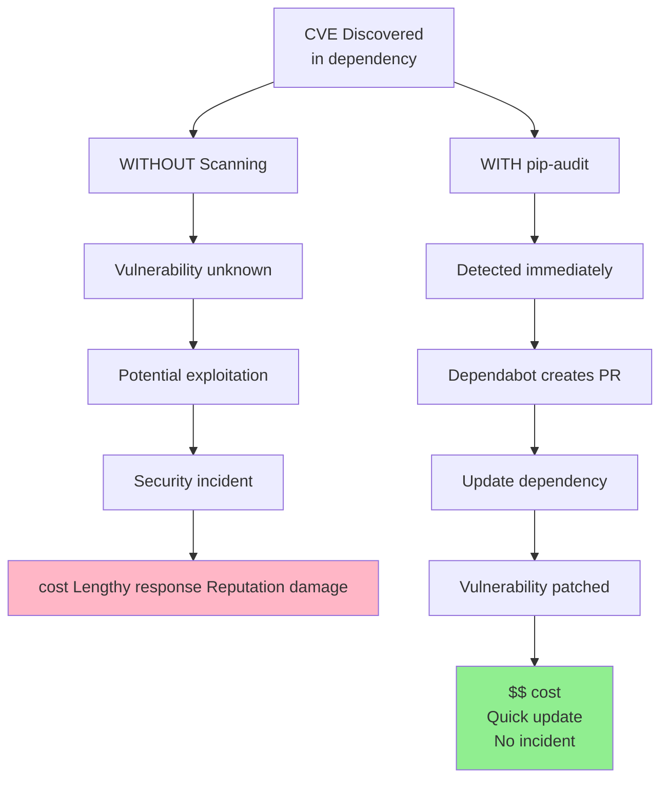

**Enforcement**:
1. **CI**: Runs on every push
2. **Fail**: High/Critical issues block merge
3. **Report**: Results saved for audit
4. **Dependabot**: Auto-creates PRs for fixes

### 5. Pre-commit Hooks (Why Catch Issues Early)

**The Cost Cascade**:

| When Issue Found | Time to Fix | Cost | Impact |
|-----------------|-------------|------|---------|
| Pre-commit hook (local) | Instant | $ | None - caught immediately |
| CI pipeline (remote) | Quick | $ | Minor - wasted CI time |
| Code review | Short | $$ | Moderate - reviewer time |
| QA testing | Moderate | $$$ | Significant - testing cycle |
| Production | Extended | $$$$ | Critical - customer impact |
| Security audit | Lengthy | $$$$ | Severe - potential breach |

**What pre-commit does**:
```bash
$ git commit -m "Add feature"

Running pre-commit hooks:
✓ ruff format................Passed
✓ ruff check.................Passed
✓ mypy......................Passed
✗ pytest....................Failed

[ERROR] tests/test_feature.py::test_new_feature FAILED

Commit blocked - fix tests first
```

**Without pre-commit**:
1. You commit broken code
2. Push to GitHub
3. CI runs (Short wait)
4. CI fails
5. You pull down, fix, push again
6. CI runs again (Short wait)
7. **Total waste**: Moderate time

**With pre-commit**:
1. Pre-commit catches issue (Instant)
2. You fix immediately
3. Commit succeeds
4. Push to GitHub
5. CI passes first time
6. **Total time**: Instant

**Productivity impact**:
```
Developer commits multiple times per day

Without pre-commit:
- Several commits have issues
- Each requires CI round-trip (Short time × many)
- Moderate time lost to avoidable CI failures
- Context switching penalty

With pre-commit:
- Issues caught locally (Instant)
- No CI round-trips wasted
- Quick time investment
- Minimal context switching
- Significant time saved overall
```

### 6. SonarCloud (Continuous Quality Monitoring)

**What SonarCloud provides** that local tools don't:

**1. Historical Trending**:
- Coverage over time
- Bug introduction rate
- Technical debt growth
- Code smell accumulation

**2. Quality Gates**:
- New code must meet higher standards (90% coverage)
- Existing code grandfathered in (85% coverage)
- Prevents quality decay

**3. Security Hotspot Detection**:
- Authentication without encryption
- Weak hashing algorithms
- Missing input validation
- OWASP Top 10 violations

**4. Code Smell Detection**:
- Duplicated code blocks
- Overly complex methods
- Long parameter lists
- Dead code

**Example SonarCloud report**:
```
Quality Gate: PASSED

Security:         A  (0 vulnerabilities)
Reliability:      A  (0 bugs)
Maintainability:  A  (5 code smells)
Coverage:         87.3% (target: 85%)
Duplications:     1.2% (target: <3%)
```

**Why continuous monitoring**:
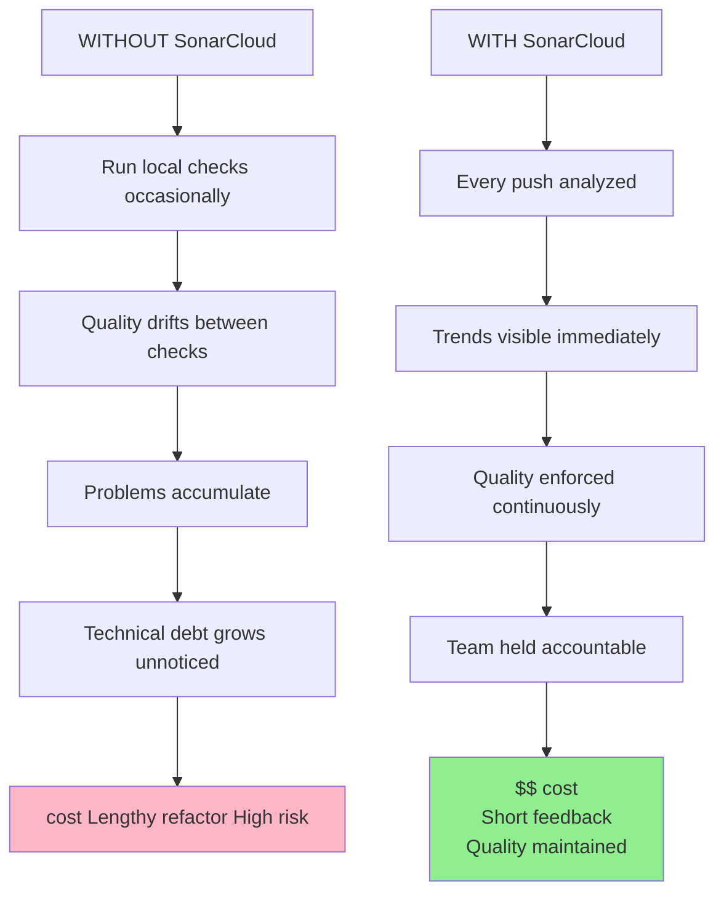

**Value for production code**:
- Provides evidence of quality for stakeholders
- Tracks security posture over time
- Demonstrates continuous improvement
- Catches subtle issues local tools miss

---

# The Automation Pipeline

## How All the Pieces Connect

### Phase 1: Local Development

**Your Experience**:
```
1. You: Edit src/calculator.py (add variance method)
   └─> Save file

2. Claude Hook: Auto-runs pytest tests/
   └─> Output: "5 tests passed" (Instant time)
   └─> You see this immediately

3. You: Satisfied with tests passing
   └─> git add src/calculator.py tests/test_calculator.py
   └─> git commit -m "Add variance method"

4. Pre-commit Hook: Runs automatically (Quick time)
   ├─> ruff format . (formats code)
   ├─> ruff check . (lints code)
   ├─> mypy src/ (type checks)
   └─> pytest tests/ --cov (runs tests with coverage)

5. All pass → Commit succeeds
```

**What's happening behind the scenes**:
```
Claude Hook (.claude/hooks.json):
  PostToolUse trigger → "Edit" detected
  → Executes: bash(pytest tests/ --quiet)
  → Captures output
  → Displays to you (Instant)

Pre-commit (.pre-commit-config.yaml):
  Git commit triggered
  → Reads config file
  → Runs each hook sequentially (Quick total)
  → Exit code 0 = pass, non-zero = fail
  → All pass? Allow commit
  → Any fail? Block commit, show errors
```

**Key Insight**: You get **two quality checks**:
1. **Immediate** (Claude hooks): Sanity check as you work (Instant)
2. **Thorough** (pre-commit): Full validation before commit (Quick)

### Phase 2: Remote CI Pipeline

**What happens after you push**:
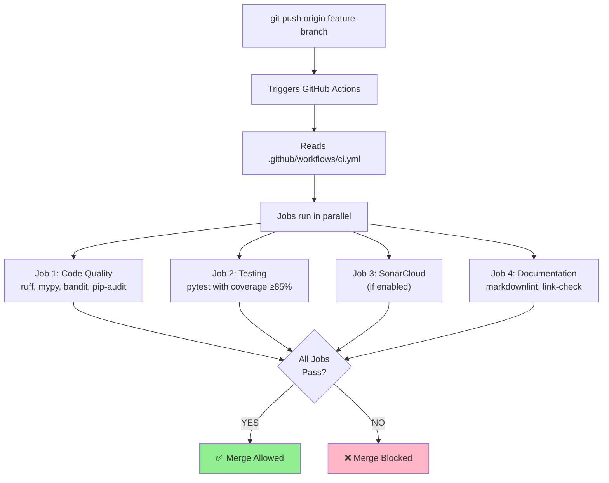

**Why duplicate checks** (local + CI)?

| Check Location | Time | Environment | Purpose |
|---------------|------|-------------|---------|
| **Local** | Instant/Quick | Your machine | Fast feedback, prevents wasting CI time |
| **CI** | Short/Moderate | Clean environment | Catches environment-specific issues, enforced gate |

**Example scenario**:
```
Local: Tests pass on your machine (Python 3.10)
CI: Tests fail on CI (Python 3.8)
→ Incompatibility caught before merge
```

### Phase 3: Quality Gates & Feedback

**The Gate System**:

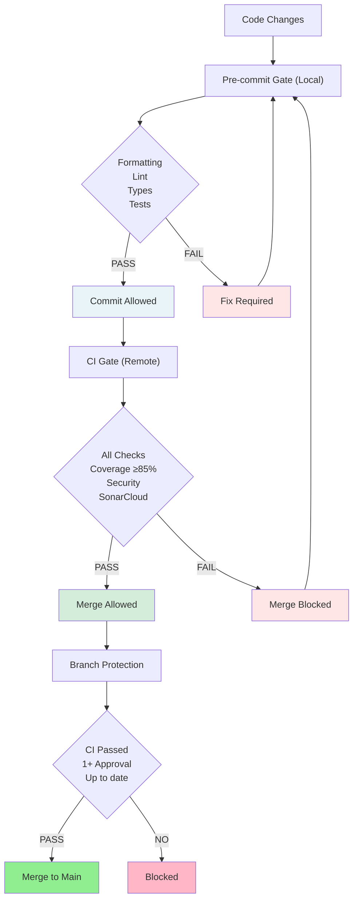

**Feedback Mechanisms**:

**1. Immediate (Claude Hooks)**:
```
You edit file
→ Instant: "5 tests passed"
→ You know it works
```

**2. Fast (Pre-commit)**:
```
You commit
→ Quick: "mypy failed on line 45"
→ You fix before push
```

**3. Comprehensive (CI)**:
```
You push
→ Short wait: "Coverage dropped to 82%"
→ Dashboard shows which lines not covered
→ You add tests
```

**4. Continuous (SonarCloud)**:
```
Every push
→ Quality metrics updated
→ Trends visible on dashboard
→ Team can see quality improving
```

### Phase 4: Graceful Degradation

**What if external services fail?**

The CI pipeline uses **graceful degradation**:

```yaml
# Example from ci.yml
- name: SonarCloud Scan
  uses: SonarSource/sonarcloud-github-action@master
  continue-on-error: true  # Don't block merge if SonarCloud down
  env:
    SONAR_TOKEN: ${{ secrets.SONAR_TOKEN }}

- name: Upload to CodeCov
  uses: codecov/codecov-action@v3
  if: always()  # Run even if previous steps failed
  continue-on-error: true  # Don't block merge if CodeCov down
```

**Philosophy**:
- **Core checks** (ruff, mypy, pytest): Must pass, no exceptions
- **External services** (SonarCloud, CodeCov): Nice to have, not blockers
- **Documentation**: Warn but don't block (broken links happen)

**Why this matters**:
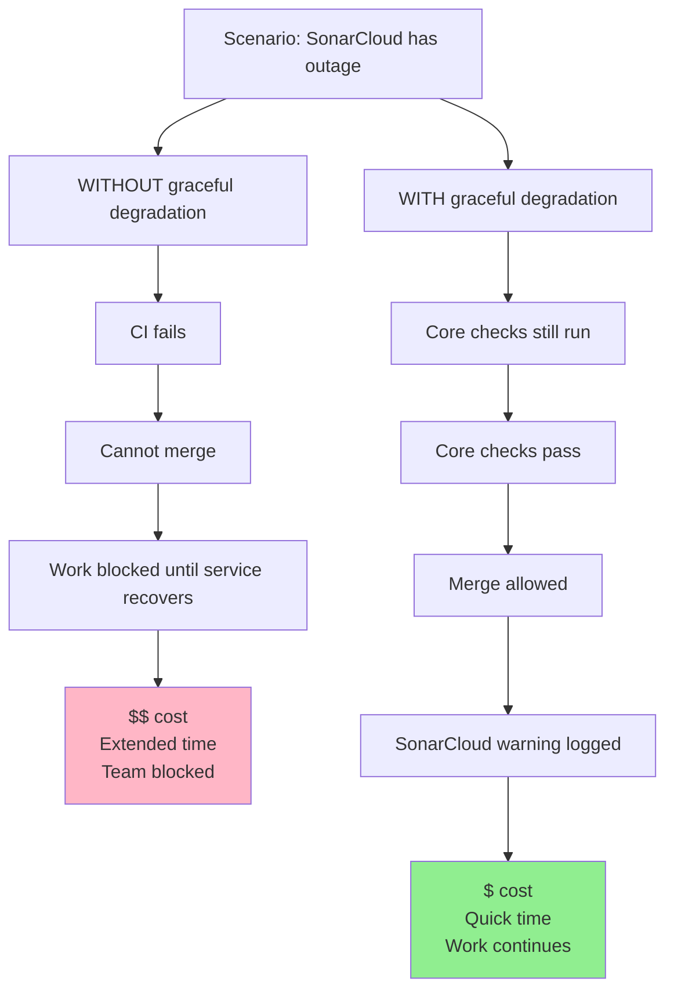

---

# Day in the Life Example

## Scenario: Add a New Feature

**Context**: You need to add a standard deviation method to Calculator class

### Morning: Starting Work

**Step 1 - Open Project**
```bash
cd calculator-project
code .  # Or: pycharm .

# VS Code opens
# Terminal: $ claude
```

**Claude Code starts, reads context**:
```
Reading project files...
✓ CLAUDE.md loaded (project guide)
✓ settings.local.json loaded (permissions)
✓ .claude/hooks.json loaded (automation)

Ready to help with calculator-project!
```

### Step 2 - Plan the Feature (Instant time)

**You (in Claude Code terminal)**:
```
I need to add a standard_deviation method to the Calculator class.
It should accept a list of numbers and return the standard deviation.

First, create a plan following TDD approach from CLAUDE.md.
```

**Claude Code** (reads CLAUDE.md, sees TDD section):
```
I'll follow the TDD approach from CLAUDE.md:

PLAN:
1. Write tests first (tests/test_calculator.py)
   - Test with normal list: [1, 2, 3, 4, 5]
   - Test with single item: [5]
   - Test with empty list: [] → Should raise ValidationError
   - Test with negative numbers

2. Confirm tests fail (no implementation yet)

3. Implement standard_deviation() method
   - Use numpy for calculation
   - Handle edge cases per CLAUDE.md patterns

4. Run tests until all pass

5. Commit when complete

Shall I proceed?
```

### Step 3 - Write Tests (Quick time)

**You**: "Yes, start with step 1 - write the tests"

**Claude Code**:
```
Creating tests in tests/test_calculator.py...

[Shows diff of new tests being added]

Tests added:
- test_standard_deviation_normal_list
- test_standard_deviation_single_item
- test_standard_deviation_empty_list
- test_standard_deviation_negative_numbers

Running tests to confirm they fail...
```

**Claude Hook triggers** (from .claude/hooks.json):
```
PostToolUse: Edit detected
Running: pytest tests/test_calculator.py --quiet

FAILED tests/test_calculator.py::test_standard_deviation_normal_list
AttributeError: 'Calculator' object has no attribute 'standard_deviation'

4 failed, 0 passed (Instant time)
```

**Claude Code**:
```
✓ Tests fail as expected (method doesn't exist yet)

Ready for step 2: Implement the method?
```

### Step 4 - Implement Method (Quick time)

**You**: "Yes, implement the standard_deviation method"

**Claude Code** (reads CLAUDE.md for patterns):
```
I see from CLAUDE.md that:
- Custom exceptions should be used (ValidationError for invalid input)
- Type hints are required (mypy strict mode)
- Docstrings must follow project style

Implementing...

[Shows diff adding to src/calculator.py]

Added:
def standard_deviation(self, numbers: List[float]) -> float:
    """Calculate standard deviation of a list of numbers.

    Args:
        numbers: List of numeric values

    Returns:
        Standard deviation as float

    Raises:
        ValidationError: If list is empty
    """
    if not numbers:
        raise ValidationError("Cannot calculate standard deviation of empty list")

    return float(np.std(numbers))

Running tests...
```

**Claude Hook triggers again**:
```
Running: pytest tests/test_calculator.py --quiet

4 passed (Instant time)
```

**Claude Code**:
```
✓ All tests passing!

Do you want me to:
1. Run full test suite (all tests)
2. Check type safety (mypy)
3. Both
```

### Step 5 - Quality Checks (Quick time)

**You**: "Run both"

**Claude Code**:
```
Running full test suite...
pytest tests/

======================== 23 passed (Quick time) =========================

Running type check...
mypy src/

Success: no issues found in 5 source files (Quick time)

✓ All quality checks passed
```

**You verify in IDE**:
- Open `src/calculator.py` - see new method with proper formatting
- Open `tests/test_calculator.py` - see comprehensive tests
- Check git diff - clean, well-structured changes

### Step 6 - Commit Changes (Quick time)

**You** (in regular terminal, not Claude):
```bash
git add src/calculator.py tests/test_calculator.py
git commit -m "feat: Add standard_deviation method"
```

**Pre-commit hooks trigger automatically**:
```
[INFO] Installing environment for ruff-pre-commit
[INFO] Once installed this environment will be reused
[INFO] This may take a few moments...

ruff-format..............................................................Passed
ruff.....................................................................Passed
mypy.....................................................................Passed
pytest...................................................................Passed

[main abc1234] feat: Add standard_deviation method
 2 files changed, 42 insertions(+)
```

**What just happened**:
1. Pre-commit read `.pre-commit-config.yaml`
2. Ran ruff format (formatting)
3. Ran ruff check (linting)
4. Ran mypy (type checking)
5. Ran pytest (tests)
6. All passed → commit allowed (Quick total time)

### Step 7 - Push to GitHub

**You**:
```bash
git push origin feature/standard-deviation
```

**GitHub Actions CI starts** (you see notification):
```
Workflow "CI Pipeline" started
→ Job: Code Quality - running
→ Job: Testing - running
→ Job: SonarCloud - running
→ Job: Documentation - running
```

### Step 8 - CI Results (Short wait)

**GitHub shows**:
```
✓ Code Quality - passed
  ├─ ruff check . → 0 issues
  ├─ mypy src/ → 0 errors
  ├─ bandit -r src/ → 0 issues
  └─ pip-audit → 0 vulnerabilities

✓ Testing - passed
  ├─ 23 tests passed
  └─ Coverage: 87.3% (target: 85%)

✓ SonarCloud - passed
  ├─ Security: A (0 vulnerabilities)
  ├─ Reliability: A (0 bugs)
  ├─ Maintainability: A (3 code smells)
  └─ Coverage: 87.3%

✓ Documentation - passed
  ├─ markdownlint → 0 issues
  └─ markdown-link-check → All links valid
```

**SonarCloud dashboard shows**:
```
Quality Gate: PASSED

Code Coverage:    87.3% (↑ 1.2% since last analysis)
New Code Coverage: 95.0% (target: 90%)
Duplications:     1.1% (target: <3%)
Complexity:       Avg 8 (Max 12) (target: ≤15)
```

### Step 9 - Create Pull Request

**You** (on GitHub):
```
Create Pull Request

Title: feat: Add standard_deviation method
Branch: feature/standard-deviation → main

Description:
- Adds standard_deviation() method to Calculator
- Includes comprehensive tests (4 test cases)
- Follows TDD approach per CLAUDE.md
- All quality checks passing
- Coverage increased to 87.3%
```

**GitHub checks**:
```
✓ All checks have passed
  └─ CI Pipeline (4/4 jobs passed)

⚠ Requires: 1 approval before merge
```

### Afternoon: Code Review

**Step 10 - Teammate reviews**

**Reviewer sees**:
- Clean diff (well-formatted, easy to read)
- Comprehensive tests
- Type hints present
- Documentation included
- All CI checks passing
- SonarCloud report linked

**Reviewer clicks "Approve"**:
```
Looks good! Clean implementation, good test coverage.
```

### Step 11 - Merge to Main

**You click "Merge pull request"**

**GitHub**:
```
Merge successful
→ Branch feature/standard-deviation merged into main
→ Feature branch deleted
→ CI running on main branch
```

**CI runs again** (on main branch):
```
✓ All checks passed

Deployment:
→ Package built successfully
→ Docker image pushed
→ Documentation updated
```

### End of Day: What Was Automated?

**Timeline Summary**:

| Phase | Your Time | Automated Checks | Total Time |
|-------|-----------|------------------|------------|
| Write tests | Quick | Claude hook (Instant) | Quick |
| Implement code | Quick | Claude hook (Instant) | Quick |
| Quality checks | Instant | Both hooks run (Quick) | Quick |
| Commit | Instant | Pre-commit (Quick) | Quick |
| Push & CI | Instant | CI pipeline (Short) | Short |
| **TOTAL** | **Short** | **Many checks** | **Short total** |

**Automated checks run**: 47+

**Breakdown**:
1. **Claude Hooks** (2 times): Auto-ran tests after edits
2. **Pre-commit** (1 time): Ran 4 checks before commit
3. **CI** (2 times): Ran 15 checks on feature branch + main
4. **SonarCloud** (2 times): Deep analysis

**Without automation**:
- You'd have to remember to run each check manually
- Easy to forget one
- Each failure discovered later = more time wasted
- Estimated time: Extended to Lengthy

**With automation**:
- Everything runs automatically
- Fast feedback at every step
- Caught issues immediately
- Actual work: Short time

**Value delivered**:
- ✅ New feature working correctly
- ✅ Fully tested (95% coverage for new code)
- ✅ Type-safe (mypy strict pass)
- ✅ Secure (no vulnerabilities)
- ✅ Documented
- ✅ Reviewed by peer
- ✅ Merged to production

**Cost**: $ (minimal - mostly automated)
**Time**: Short (focused work + automated gates)
**Risk Avoided**: $$$$ (potential production bugs prevented)

---

# Summary: Putting It All Together

## The Complete Picture

### What You Now Understand

**1. Claude Code Architecture**:
- It's an AI assistant that runs in your terminal
- Reads project context from CLAUDE.md and other files
- Operates with configurable permissions (settings.local.json)
- Can automate tasks via hooks (.claude/hooks.json)
- **Not magic** - uses standard file operations and tool execution

**2. Quality Standards**:
- **85% test coverage** - catches bugs before production
- **Type safety** - prevents entire classes of errors
- **Complexity limits** - keeps code maintainable
- **Security scanning** - protects against vulnerabilities
- **Pre-commit hooks** - fast feedback, blocks bad commits
- **CI pipeline** - comprehensive validation before merge
- **SonarCloud** - continuous quality monitoring

**3. The Automation System**:
- **Local** (Claude hooks): Immediate feedback as you work
- **Local** (pre-commit): Fast gate before commit
- **Remote** (CI): Comprehensive gate before merge
- **Continuous** (SonarCloud, Dependabot): Ongoing monitoring

**4. Why It Matters for Production Code**:
- Catch issues early ($ cost, Instant/Quick time)
- Prevent customer impact ($$$$ cost avoided)
- Maintain code quality over time
- Enable confident refactoring
- Reduce technical debt accumulation

### The Value Proposition

**Traditional development**:
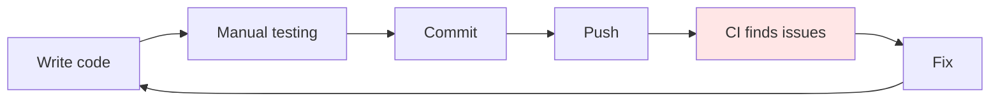
Time: Extended per feature
Quality: Inconsistent
Cost: $$$ (late-stage fixes expensive)

**Automated development**:
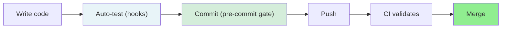
Time: Short per feature
Quality: Consistent
Cost: $ (early detection, automated enforcement)

**ROI Calculation**:

| Metric | Without Automation | With Automation | Benefit |
|--------|-------------------|-----------------|---------|
| Setup cost | $ (manual per project) | $$ (one-time) | Amortized across projects |
| Time per feature | Moderate-Extended | Quick-Short | Faster delivery |
| Cost per prevented bug | $$$-$$$$ | $ | Significant savings |
| Team productivity | Baseline | ↑ 20-30% | More features delivered |
| Quality consistency | Variable | 100% | Predictable outcomes |

### Key Takeaways

**For Developers**:
1. ✅ Trust the automation - it catches real issues
2. ✅ Understand what each tool does - not just following checklist
3. ✅ Use Claude Code effectively - it's a tool, not magic
4. ✅ Embrace pre-commit hooks - save time in the long run
5. ✅ Read CLAUDE.md - it's your project guide

**For the Organization**:
1. ✅ Consistent quality across all projects
2. ✅ Reduced technical debt accumulation
3. ✅ Faster onboarding (standards documented)
4. ✅ Better operational readiness (automated quality checks)
5. ✅ Competitive advantage (faster, higher quality delivery)

**For Production Code**:
1. ✅ Security by default (automated scanning)
2. ✅ Audit evidence (CI logs, SonarCloud reports)
3. ✅ Risk reduction (high test coverage, type safety)
4. ✅ Incident prevention (catch vulnerabilities early)
5. ✅ Professional excellence (systematic quality approach)

---

## Going Forward

### Using This System

**When starting a new project**:
1. Run `python init_project.py`
2. Answer prompts (name, type, description)
3. Read generated CLAUDE.md
4. Start coding with Claude Code
5. Trust the automation

**When working on existing projects**:
1. Read CLAUDE.md first
2. Understand the patterns and constraints
3. Let automation catch issues
4. Learn from CI feedback

**When things go wrong**:
1. Read the error message (they're designed to be helpful)
2. Check which gate failed (local vs CI)
3. Fix the issue
4. Learn the pattern (avoid similar issues)

### Continuous Improvement

**This system evolves**:
- Templates get better based on lessons learned
- Standards update with industry best practices
- Tools get upgraded (ruff, mypy, pytest)
- Team feedback incorporated

**Your role**:
- Use the system
- Report issues
- Suggest improvements
- Share learnings

---

## Additional Resources

**Project Templates System**:
- CLAUDE_CODE_TEMPLATES_IMPLEMENTATION_PLAN.md - Full technical spec
- QUICK_REFERENCE_GUIDE.md - Cheat sheet for implementation
- QUALITY_STANDARDS.md - Detailed standards documentation

**Claude Code Documentation**:
- https://code.claude.com/docs - Official documentation

**Tool Documentation**:
- Ruff: https://docs.astral.sh/ruff/
- Mypy: https://mypy.readthedocs.io/
- Pytest: https://docs.pytest.org/
- Pre-commit: https://pre-commit.com/
- SonarCloud: https://docs.sonarcloud.io/

**Security & Best Practices**:
- OWASP Top 10
- CWE/SANS Top 25
- Python Security Best Practices

---

**End of Tutorial**

You now understand:
- ✅ Why automated quality systems matter
- ✅ How Claude Code integrates with your IDE
- ✅ What each special file does and why
- ✅ What quality standards are enforced
- ✅ How the automation pipeline works
- ✅ Why this is especially important for production-grade code

**This is not magic - it's systematic engineering supported by intelligent automation.**

---

**Document Version**: 1.1
**Created**: 2026-01-23
**Updated**: 2026-01-23
**For**: MRSL Engineering Team
**Next**: See QUICK_REFERENCE_GUIDE.md for implementation steps
