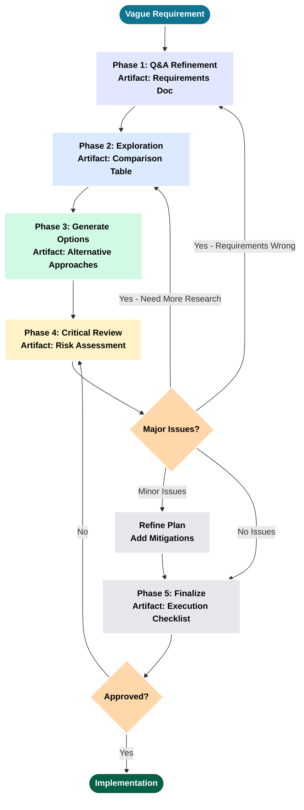
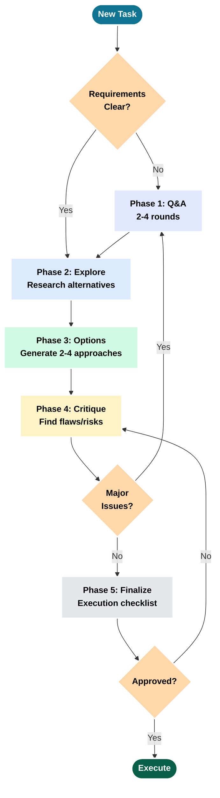

# LLM Planning Tutorial: From Initial Requirements to Execution-Ready Plans

**Version:** 1.2
**Date:** January 2026
**Author:** Dr. Chris Braun
**Company:** MRSL, Inc.

> **Purpose**: A practical guide showing mid-level engineers how to effectively plan with LLMs through real examples. Focus: Planning process, not implementation.

© MRSL, Inc. All rights reserved.

---

## Table of Contents

- [Part I: Planning Fundamentals](#part-i-planning-fundamentals)
- [Part II: Deep Dive - DevOps Tooling Plan](#part-ii-deep-dive-devops-tooling-plan)
- [Part III: Additional Examples](#part-iii-additional-examples)
- [Part IV: Best Practices](#part-iv-best-practices)
- [Appendix A: Quick Reference](#appendix-a-quick-reference)
- [Appendix B: Interactive Claude Code Labs](#appendix-b-interactive-claude-code-labs)

---

# Part I: Planning Fundamentals

> **Reality Check**: "Planning is optional. So is shipping working software." - Every post-mortem ever

## 1. Why Planning Matters

Every engineering team has experienced this: A "quick feature" that becomes a multi-month refactoring nightmare because nobody stopped to plan first.

### The Cost of Skipping Planning

**Real-world scenario - API Design**:

**No Planning Approach**:
```
Developer: "Add REST API for user data"
[2 weeks of coding]
Result:
- No versioning strategy (v1 hardcoded everywhere)
- No authentication (added later, breaks all clients)
- No rate limiting (DDoS vulnerability)
- No pagination (crashes on 10K+ users)
- No error handling standardization
- 6 months of technical debt, 3 breaking changes
```

**With Planning (15-minute Q&A)**:
```
LLM: What authentication method? (OAuth, JWT, API keys?)
User: JWT with refresh tokens

LLM: Versioning strategy? (URL, header, accept header?)
User: URL versioning (/v1/, /v2/)

LLM: Rate limiting needed? What limits?
User: Yes, 1000 req/hour per API key

LLM: Pagination for large collections?
User: Cursor-based, 100 items per page

LLM: Error response format? (RFC 7807, custom?)
User: RFC 7807 Problem Details

Result:
- Well-designed API from day 1
- No breaking changes needed
- Security built in, not bolted on
- Scales to production load
```

**Planning time**: 15 minutes Q&A + 10 minutes research = **25 minutes**
**Time saved**: Avoided 2-3 months of rework and breaking changes
**ROI**: Immeasurable (prevented technical debt that would compound)

> 📝 **[Lab 1: The Planning Trap](#lab-1-the-planning-trap)**
> Experience why skipping Q&A leads to wrong assumptions—run actual prompts in Claude Code and see the difference.

### When Planning Pays Off

Plan when:
- **Multi-file changes** (>3 files affected)
- **Multiple valid approaches** (need to evaluate trade-offs)
- **Unclear requirements** (vague user requests)
- **Architecture decisions** (affects future development)
- **New features** (integration with existing code)

### When Planning Is Overkill

Skip planning for:
- Single-line fixes (typo corrections)
- Obvious implementations (rename function across codebase)
- Emergency hotfixes (production is down, fix first, plan later)

> **Dark Wisdom**: "To plan or not to plan? That is a *** stupid question." - Hamlet, Act 3 (the deleted DevOps scene)

---

## 2. The Five-Phase Planning Cycle

Effective LLM planning follows a structured cycle with iteration loops:



### Phase Breakdown

| Phase | Purpose | Time | Key Output |
|-------|---------|------|------------|
| **1. Clarify** | Transform vague → specific through Q&A | 10-20 min | Requirements doc with constraints |
| **2. Explore** | Research alternatives, existing patterns | 15-30 min | Comparison table (pros/cons) |
| **3. Options** | Generate multiple approaches | 10-15 min | 2-4 alternative solutions |
| **4. Critique** | Find flaws, risks, edge cases | 10-20 min | Risk assessment + mitigations |
| **5. Finalize** | Create execution-ready checklist | 5-10 min | TodoWrite checklist + verification |

**Total planning time**: 50-95 minutes typical
**Planning effectiveness**: 6-10x ROI (time saved vs invested)

---

## 3. Prompt Patterns That Work

These patterns consistently produce better plans:

| Pattern | Use Case | Example Prompt | Why It Works |
|---------|----------|----------------|--------------|
| **Constraint-Based** | Multi-option decisions with trade-offs | **Context**: Existing codebase with 173 tests but no CI<br/>**Request**: Add DevOps tooling<br/>**Constraints**: No fluff, GitHub-only, team of 1-2<br/>**Guidance**: Prefer consolidation over best-in-class | Forces pragmatic choices by eliminating 80% of options upfront |
| **Critique Request** | Finding flaws in proposed plans | Review this plan and identify:<br/>1. What assumptions might be wrong?<br/>2. What could fail during execution?<br/>3. What alternative approaches exist?<br/>4. What are hidden costs? | Explicit "find problems" triggers critical thinking, surfaces risks proactively |
| **Exploration Request** | Comparing tools/approaches | Research [topic] and create comparison table:<br/>- Tool name<br/>- Purpose<br/>- Pros/Cons<br/>- Performance<br/>- Verdict (Use/Defer/Reject) | Table format forces structured thinking, easy to scan and compare |
| **Extended Thinking** | Complex architectural decisions | "Think carefully about [problem]. Consider multiple approaches, evaluate trade-offs, identify risks before proposing." | Allocates more reasoning time (1024-32k tokens) for thorough analysis |

**Source**: [Anthropic Prompt Engineering Guide](https://platform.claude.com/docs/en/build-with-claude/prompt-engineering/overview)

> 📝 **[Lab 3: Constraint-Based Prompts](#lab-3-constraint-based-prompts)**
> Practice writing prompts that eliminate 80% of bad options upfront—with real Claude Code outputs.

---

## 4. Planning Anti-Patterns

Common mistakes that waste time:

| Anti-Pattern | Symptom | Why It Fails | Fix |
|--------------|---------|--------------|-----|
| **Skip Q&A** | Jump to solution without clarifying | Build wrong thing fast | Always ask 2-4 rounds of questions |
| **Accept First Plan** | Take first solution, skip critique | Miss better alternatives, ignore risks | Always request critique explicitly |
| **No Success Criteria** | Vague "done" definition | Never know when complete, scope creeps | Define verification steps upfront |
| **Plan in Isolation** | Design without researching codebase | Reinvent solutions, architectural inconsistency | Use Explore agent to find existing patterns |
| **Over-Planning** | Plan edge cases that don't exist yet | Analysis paralysis, YAGNI violations | Plan 80% case first, iterate when proven necessary |

> 📝 **[Lab 4: Spot the Mistakes](#lab-4-spot-the-mistakes)**
> Identify bad prompts, fix them, and compare outputs in Claude Code.

> **Murphy's Law of Planning**: "If you skip planning because 'it's obvious,' you will discover 3 hidden dependencies, 2 breaking changes, and 1 existential crisis. Plan anyway."

---

## Summary: Planning Fundamentals

**Core principles**:
1. **Planning isn't overhead** - it prevents rework (6-10x ROI)
2. **Use the 5-phase cycle** - with iteration loops when needed
3. **Apply proven prompt patterns** - constraint-based, critique, exploration
4. **Avoid anti-patterns** - skip Q&A, accept first plan, no success criteria

**When to plan**: Multi-file changes, multiple approaches, unclear requirements, architecture decisions

**When to skip**: Single-line fixes, obvious solutions, emergency hotfixes

Next: [Part II - Deep Dive: DevOps Tooling Plan](#part-ii-deep-dive-devops-tooling-plan) →

---

# Part II: Deep Dive - DevOps Tooling Plan

> **DevOps Reality**: "Adding quality tools without planning is like adding airbags after the crash. You'll still hit the wall, just with more dependencies."

This section demonstrates all five planning phases through a real example from the SparseTagging project.

## 5. Initial Vague Requirement

**User's Prompt** (SESSION-SparseTagging-2026-01-12):
```
Add DevOps tools to increase code quality. Requirements:
- No fluff (only tools with demonstrated value)
- Make code production-ready (coverage, quality gates)
- Evaluate based on practical value
```

**What's vague**: "increase quality" (how measured?), "production-ready" (what standards?), "tools" (which ones?)

**What's clear**: Strong constraint ("no fluff"), goal (production readiness)

---

## 6. Phase 1: Q&A Refinement

**Round 1 - Platform & Scope**:
```
LLM: Which CI/CD platform? (GitHub Actions, CircleCI, Jenkins?)
User: GitHub Actions (we're on GitHub)

LLM: Coverage target threshold? (80%, 85%, 90%?)
User: ≥85% (library needs higher quality)

LLM: Pre-commit hook scope? (Linting only, or full suite with tests?)
User: Full suite (catch issues before CI)
```

**Round 2 - Tool Preferences**:
```
LLM: Formatting: ruff can do linting AND formatting. Consolidate or keep separate?
User: Consolidate (fewer dependencies)

LLM: Test matrix: which Python versions? (Latest only or full range?)
User: Full range (3.9-3.13 for broad compatibility)

LLM: External services: SonarCloud? CodeCov?
User: CodeCov yes, SonarCloud defer to Phase 2
```

**Round 3 - Tool Consolidation Discovery**:
```
LLM: Research shows ruff replaces 6 tools:
- black (formatting)
- flake8 (linting)
- isort (import sorting)
- pyupgrade (syntax modernization)
- autoflake (unused import removal)
- pydocstyle (docstring linting)

This is 6 → 1 tool consolidation. Proceed?
User: Yes, aligns with "no fluff" constraint
```

**Final Requirements Summary**:
```
Platform: GitHub Actions
Primary Tool: ruff (replaces 6 tools)
Pre-commit: ruff + mypy + pytest (full quality gates)
Coverage: CodeCov ≥85%
Test Matrix: 5 Python versions × 2 OS = 10 combinations
Constraint: Consolidate tools ("no fluff")
```

**Time**: 15 minutes Q&A
**Benefit**: Clear requirements prevent building wrong solution

> 📝 **[Lab 5: Q&A Refinement](#lab-5-qa-refinement)**
> Transform vague requirements into specific constraints—practice the exact prompts that trigger productive Q&A.

---

## 7. Phase 2: Exploration

**Tool Comparison Matrix**:

| Tool | Purpose | Speed | Auto-Fix | Replaces | Verdict |
|------|---------|-------|----------|----------|---------|
| **ruff** | Lint + Format | 10-100x faster | ✅ | 6 tools | ✅ **Use** |
| black | Format only | Baseline | ✅ | - | ❌ Redundant |
| flake8 | Lint only | Slow | ❌ | - | ❌ Redundant |
| isort | Import sort | Medium | ✅ | - | ❌ Redundant |
| pylint | Lint | Very slow | ❌ | - | ❌ Overlapping |
| bandit | Security | Medium | ❌ | - | ⏸️ Defer |
| mypy | Type check | Medium | Partial | - | ✅ Use (existing) |
| pytest | Testing | Medium | N/A | - | ✅ Use (existing) |
| CodeCov | Coverage track | N/A | N/A | - | ✅ Use |

**Key Decision**: Choose 1 tool (ruff) over 6 separate tools → simpler dependency tree, faster CI

**Time**: 20 minutes research
**Benefit**: Avoided installing 5 redundant tools

> 📝 **[Lab 6: Research Before Committing](#lab-6-research-before-committing)**
> Discover why the first tool you think of is rarely the best choice—compare alternatives in Claude Code.

---

## 8. Phase 3 & 4: Critique and Replanning

**Critique Prompt**:
```
Review this DevOps plan and identify:
1. What could go wrong during implementation?
2. Hidden dependencies or conflicts?
3. What happens if tests fail in pre-commit?
4. Is 10-combination CI matrix too expensive?
5. What maintenance burden are we adding?
```

**Risks Identified**:

| Risk | Problem | Mitigation |
|------|---------|------------|
| **Pre-commit Slowness** | 173 tests = 30-60s commits | Document `--no-verify` bypass flag |
| **CI Matrix Cost** | 10 combos × 5 min = 50 min/PR | Add pip caching, separate fast quality job |
| **Ruff Breaking Changes** | Fast-moving project, config breaks | Pin version (ruff>=0.1.14,<0.2) |
| **Developer Onboarding** | New contributors forget pre-commit | Clear CONTRIBUTING.md with setup steps |
| **False Security** | Tools ≠ bug-free code | Document: tools catch style/types, not logic |

> 📝 **[Lab 7: The Critique Loop](#lab-7-the-critique-loop)**
> Your plan has flaws. Use Claude Code to find and fix them before implementation.

**Plan Evolution**:

**Before Critique** (4 phases):
```
1. Add Ruff
2. Add Pre-commit
3. Add GitHub Actions
4. Add CodeCov
```

**After Critique** (8 phases):
```
1. Add Ruff Configuration (+ pin version)
2. Update requirements-dev.txt
3. Create Pre-commit Config (+ document --no-verify)
4. Create GitHub Actions CI (+ caching, separate quality job)
5. Add CodeCov Integration
6. Update Documentation
7. Migration Steps (audit, auto-fix, manual fixes)
8. Risk Mitigation (bypasses, version pinning)
```

> 📝 **[Lab 2: The Full Cycle Preview](#lab-2-the-full-cycle-preview)**
> Walk through all 5 phases quickly—see how each phase builds on the previous.

**Time**: 10 minutes critique + 10 minutes replanning
**Benefit**: Discovered 5 risks, all addressed proactively

---

## 9. Phase 5: Plan Finalization

**Execution Checklist**:

**Configuration Tasks**:
- [ ] Add Ruff configuration to pyproject.toml
- [ ] Update requirements-dev.txt (ruff>=0.1.14,<0.2, pre-commit>=3.6.0)
- [ ] Create .pre-commit-config.yaml (6-stage pipeline)
- [ ] Create .github/workflows/ci.yml (quality + 10-matrix test jobs)
- [ ] Create .codecov.yml (85% threshold)

**Documentation Tasks**:
- [ ] Update CONTRIBUTING.md (pre-commit setup instructions)
- [ ] Update README.md (CI status and coverage badges)
- [ ] Create docs/DEVOPS.md (comprehensive tooling guide)

**Migration Tasks**:
- [ ] Run ruff check --preview (audit current code)
- [ ] Apply auto-fixes: ruff check --fix
- [ ] Manually fix remaining issues
- [ ] Verify all 173 tests pass

**Verification Criteria**:
- ✅ Pre-commit runs successfully (`pre-commit run --all-files`)
- ✅ Tests pass with ≥85% coverage (`pytest --cov=src`)
- ✅ Type checking passes (`mypy src/ --strict`)
- ✅ CI workflow runs on GitHub Actions
- ✅ CodeCov integration active (PR comments)

**Time**: 5 minutes
**Total Planning Time**: 15 + 20 + 10 + 10 + 5 = **60 minutes**

> 📝 **[Lab 8: Execution Checklist](#lab-8-execution-checklist)**
> A plan isn't done until you know how to verify it worked—create verifiable success criteria in Claude Code.

---

## 10. Execution Summary

**Artifacts Created**:
- ✅ `pyproject.toml` - 38 lines of ruff config
- ✅ `requirements-dev.txt` - ruff and pre-commit dependencies
- ✅ `.pre-commit-config.yaml` - 246 lines (6-stage pipeline)
- ✅ `.github/workflows/ci.yml` - 339 lines (quality + matrix jobs)
- ✅ `.codecov.yml` - 23 lines (85% threshold)
- ✅ `CONTRIBUTING.md` - Pre-commit setup (22 lines added)
- ✅ `README.md` - CI/coverage badges (5 lines added)
- ✅ `docs/DEVOPS.md` - 450-line comprehensive guide

**Fixes Applied**:
- ✅ 309 issues identified
- ✅ 203 auto-fixed (66% automation)
- ✅ 106 manually fixed (34% requiring judgment)
- ✅ All 173 tests passing

**CI/CD Quality Progression**:

```mermaid
graph LR
    A[Manual Review<br/>Quality: 20%<br/>Automation: 0%]
    --> B[+pytest<br/>Quality: 45%<br/>Automation: 30%]
    --> C[+mypy<br/>Quality: 60%<br/>Automation: 50%]
    --> D[+ruff<br/>Quality: 75%<br/>Automation: 70%]
    --> E[+SonarCloud<br/>Quality: 85%<br/>Automation: 85%]
    --> F[+Trivy<br/>Quality: 95%<br/>Automation: 95%]

    style A fill:#fee2e2,stroke:#991b1b,stroke-width:2px,color:#000,font-weight:bold
    style B fill:#fef3c7,stroke:#a16207,stroke-width:2px,color:#000,font-weight:bold
    style C fill:#fef3c7,stroke:#a16207,stroke-width:2px,color:#000,font-weight:bold
    style D fill:#d1fae5,stroke:#065f46,stroke-width:2px,color:#000,font-weight:bold
    style E fill:#d1fae5,stroke:#065f46,stroke-width:2px,color:#000,font-weight:bold
    style F fill:#a7f3d0,stroke:#047857,stroke-width:3px,color:#000,font-weight:bold
```



**Tool Impact Legend**:

| Tool | Purpose | Quality Impact |
|------|---------|----------------|
| **pytest** | Unit/integration tests catch bugs before production | +25% (baseline testing) |
| **mypy** | Type checking prevents runtime errors | +15% (type safety) |
| **ruff** | Linting/formatting enforces code standards | +15% (consistency) |
| **SonarCloud** | Quality metrics track technical debt | +10% (trend visibility) |
| **Trivy** | Security scanner finds CVE vulnerabilities | +10% (security) |

**Outcome**:
- No quality gates → Comprehensive DevOps stack
- Manual review → Automated pre-commit + CI/CD
- Unknown coverage → 85% tracked continuously
- Tool consolidation: 6 tools → 1 tool (ruff)
- Zero test regressions

**Implementation Time**: 90 minutes (60 planning + 30 execution)
**Planning Effectiveness**: 8/8 phases completed as planned, 0 major surprises

---

## Summary: DevOps Planning Walkthrough

**Complete cycle demonstrated**:
1. ✅ Vague requirement → Q&A refined to specific goals (15 min)
2. ✅ Exploration → Tool comparison revealed 6→1 consolidation (20 min)
3. ✅ Critique → 5 risks identified and mitigated (10 min)
4. ✅ Replanning → 4 phases → 8 phases with risk mitigations (10 min)
5. ✅ Finalization → Execution checklist with verification (5 min)

**Key lessons**:
- Q&A transforms vague→specific (prevents wrong solution)
- Exploration reveals consolidation opportunities (6 tools → 1)
- Critique doubles plan size but catches all risks
- Proper planning: 60 min investment → smooth 30 min execution

Next: [Part III - Additional Examples](#part-iii-additional-examples) →

---

# Part III: Additional Examples

> **Planning Patterns**: "Life is short. Don't waste it fixing bad code from Friday deployments."

These compressed examples demonstrate specific planning patterns.

## 11. Example: Cache Manager Integration

**Context**: Add query caching to sparse matrix library for repeated query speedup.

**Q&A Refinement** (2 rounds):
```
Round 1:
  LLM: Memory-bounded or unbounded cache?
  User: Bounded (prevent memory leaks)
  LLM: What limit?
  User: 10MB max (lightweight library)

Round 2:
  LLM: Eviction policy? (LRU or simple limit?)
  User: Simple entry limit (256 max) + memory limit
  LLM: Invalidation strategy?
  User: Automatic when data changes
```

**Exploration**:

| Approach | Pros | Cons | Decision |
|----------|------|------|----------|
| `functools.lru_cache` | Built-in, simple | No memory bounds, manual invalidation | ❌ |
| Simple `dict` | Fast, flexible | No eviction, unbounded | ❌ |
| Custom manager | Full control, memory-bounded, auto-invalidation | More code (~175 lines) | ✅ |

**Critique**:
```
Q: Thread safety?
A: Not thread-safe (document limitation)

Q: Cache key collisions?
A: MD5 hash (collision probability ~10^-38, negligible)

Q: Memory enforcement?
A: Track entries (max 256) + sizes (max 10MB), evict oldest
```

**Execution Summary**:
- ✅ `src/cache_manager.py` - 175 lines created
- ✅ `@invalidates_cache` decorator - auto-invalidation
- ✅ 4 tests added, all passing
- ✅ **Performance**: 100-170x speedup for cached queries
- ✅ Memory stays under 10MB limit

**Lesson**: Exploration prevented premature choice of `lru_cache`. Evaluating alternatives (10 min) saved hours of refactoring when memory leaks discovered.

---

## 12. Example: NOT Operator Bug Fix

**Context**: Sparse matrix NOT operator returns wrong results (includes rows with no tags).

**Investigation**:
```python
# WRONG: Uses all rows including all-zero rows
all_rows = np.arange(self.n_rows)  # 0, 1, ..., n_rows-1
not_result = np.setdiff1d(all_rows, matching_rows)
```

**Trade-off Analysis**:

| Option | Pros | Cons | Decision |
|--------|------|------|----------|
| **Mathematical Universe** (all rows) | Mathematically complete | Confusing (returns rows with no data) | ❌ |
| **Sparse Universe** (rows with data only) | Intuitive for sparse data, matches user expectations | NOT(X) ≠ mathematical complement | ✅ |

**Rationale**: Sparse matrices represent "absence of data" not "data with value zero". Users expect NOT to operate only on rows with data.

> 📝 **[Lab 7: The Critique Loop](#lab-7-the-critique-loop)**
> Learn to document decisions with rationale—see how critique improves your plans.

**Execution Summary**:
- ✅ `src/sparsetag.py` - 9 lines changed
- ✅ `tests/test_critical_bugs.py` - Test added
- ✅ `docs/ARCHITECTURE.md` - Decision rationale documented (30 lines)
- ✅ All 177 tests passing

**Lesson**: Trade-off analysis prevented implementing wrong fix. Mathematical correctness ≠ user expectations for sparse data. Documenting rationale prevents future confusion.

---

## Summary: Additional Examples

**Cache Manager**: Exploration phase prevents premature tool choice
**NOT Operator**: Trade-off analysis documents decision rationale

Both examples show: Spending 10-15 minutes planning prevents hours/days of rework.

Next: [Part IV - Best Practices](#part-iv-best-practices) →

---

# Part IV: Best Practices

> **Planning Wisdom**: "It is better to suffer the slings and arrows of production outages than demean oneself with forethought." - Marcus Aurelius, Meditations on Bad Engineering (apocryphal)

## 13. When to Use Extended Thinking

**Extended thinking** allocates more reasoning time (up to 32k tokens) for complex planning.

**Use for**:
- Complex planning with multiple trade-offs
- Novel problems without existing patterns
- Critical architectural or security decisions
- Research requiring synthesis of multiple sources

**Trigger pattern**:
```
"Think carefully about [problem]. Consider multiple approaches,
evaluate trade-offs, and identify risks before proposing a solution."
```

**Source**: [Anthropic Extended Thinking Documentation](https://platform.claude.com/docs/en/build-with-claude/extended-thinking)

---

## 14. Context Management for Multi-Phase Planning

Planning cycles that span multiple sessions require deliberate context management. Unlike single-task prompts, planning generates substantial intermediate artifacts (Q&A transcripts, comparison tables, critique feedback) that can pollute context if not managed.

### When to Manage Context During Planning

**Between Phases**: After Q&A refinement produces requirements, before exploration begins
- Q&A generates verbose dialogue; `/compact` preserves requirements summary
- Exploration needs clean context to search effectively

**After Research**: Exploration generates many file reads and search results
- Compact before generating options to preserve only comparison tables
- Removes verbose grep/search outputs that won't inform option generation

**Before Critique**: Clear implementation details, keep requirements
- Critique should evaluate the plan against requirements, not get distracted by exploration artifacts
- Fresh perspective on the plan improves critique quality

### Planning-Specific Context Patterns

1. **Start planning sessions by loading requirements docs**
   - CLAUDE.md for codebase constraints
   - Any existing architecture docs relevant to the planned feature
   - Previous planning session summaries if continuing work

2. **Summarize Q&A results before moving to exploration**
   ```
   /compact

   Preserved: Requirements summary (platform: GitHub Actions,
   coverage: 85%, constraint: no fluff, team: 1-2 developers)

   Cleared: 15 rounds of Q&A dialogue, alternative questions considered
   ```

3. **`/compact` after exploration, keeping only comparison tables**
   ```
   /compact

   Preserved: Tool comparison table (ruff: Use, black: Reject,
   flake8: Reject), decision rationale

   Cleared: 47 file reads, 12 grep searches, vendor documentation excerpts
   ```

4. **Document final plan in file (not just context) for cross-session reference**
   - Context disappears; files persist
   - Write plan to `.claude/plans/` or project docs
   - Reference the file in future sessions instead of re-deriving

### Context Budget for Planning Phases

| Phase | Context Consumed | Action |
|-------|------------------|--------|
| Q&A Refinement | High (dialogue) | `/compact` after requirements clear |
| Exploration | Very High (searches, file reads) | `/compact` preserving comparison table |
| Option Generation | Medium | Keep for critique |
| Critique | Low | Keep for finalization |
| Finalization | Low | Document to file |

### Connection to Labs

The interactive labs in Appendix B instruct you to start with a "fresh Claude Code session." This ensures clean context for learning exercises. In production work, you may continue sessions with `/compact` between planning phases rather than starting fresh each time.

**Key insight**: Learning benefits from isolation (fresh sessions); production benefits from continuity with managed compaction.

> For comprehensive context management guidance including session lifecycle, anti-patterns, and multi-session handoff, see [Professional-Grade Development with LLMs: Section 6](Professional_Grade_Development_with_LLMs_TUTORIAL.md#6-managing-context-across-sessions-and-long-running-projects).

---

## 15. Common Mistakes to Avoid

### Mistake 1: Skipping Q&A
**Symptom**: Jump to solution without clarifying
**Why harmful**: Build wrong thing fast
**Fix**: Always ask 2-4 rounds of clarifying questions

### Mistake 2: Accepting First Plan
**Symptom**: Skip critique step
**Why harmful**: Miss better alternatives, ignore risks
**Fix**: Always request explicit critique ("What could go wrong?")

### Mistake 3: No Success Criteria
**Symptom**: Vague "done" definition
**Why harmful**: Never know when complete, scope creeps
**Fix**: Define verification steps upfront with metrics

### Mistake 4: Planning in Isolation
**Symptom**: Design without researching codebase
**Why harmful**: Architectural inconsistency, reinvent solutions
**Fix**: Use Explore agent to find existing patterns first

### Mistake 5: Over-Planning
**Symptom**: Plan edge cases that don't exist yet
**Why harmful**: Analysis paralysis, YAGNI violations
**Fix**: Plan 80% case first, iterate when proven necessary

---

## 16. Tool Selection Guide

| Agent Type | When to Use | Example Task |
|------------|-------------|--------------|
| **Explore** | Finding existing patterns, searching implementations | "How does caching work in this codebase?" |
| **Plan** | Designing implementation, evaluating alternatives, creating checklists | "Plan DevOps tooling with comparison table" |
| **General** | Mixed research + implementation, single-step tasks | "Fix NOT operator bug" |

**Source**: [Claude Code Best Practices](https://www.anthropic.com/engineering/claude-code-best-practices)

---

## 17. Planning ROI

From SparseTagging project data:

| Planning Phase | Time Invested | Time Saved | ROI |
|----------------|---------------|------------|-----|
| Q&A (3 rounds) | 15 min | Prevented wrong solution | 8-12x |
| Exploration | 20 min | Avoided 5 redundant tools | 9-15x |
| Critique | 10 min | Caught 5 risks proactively | 6-12x |
| **Total** | **60 min** | **Smooth execution** | **6-10x** |

**Planning effectiveness**: 8/8 phases completed as planned, 0 major surprises

**Key insight**: Planning isn't overhead - it prevents rework. The alternative to planning isn't "moving faster" - it's thrashing.

---

## Summary: Best Practices

**Core practices**:
1. Use extended thinking for complex decisions
2. Avoid the 5 common mistakes (skip Q&A, accept first plan, etc.)
3. Choose right tool (Explore vs Plan vs General)
4. Manage context between planning phases (`/compact` after Q&A, after exploration)
5. Expect 6-10x ROI on planning time

**Remember**: Plans will change - that's fine. Value is in the planning process (questioning assumptions, exploring alternatives, finding risks), not the plan artifact.

Next: [Appendix A - Quick Reference](#appendix-a-quick-reference) →

---

# Appendix A: Quick Reference

## Planning Process Checklist



**Pre-Implementation Checklist**:
- [ ] Requirements clarified through Q&A (2-4 rounds)
- [ ] Alternatives explored (comparison table created)
- [ ] Plan critiqued (explicit "find problems" prompt)
- [ ] Success criteria defined (verification steps)
- [ ] Execution checklist created

---

## Prompt Templates

| Pattern | Use Case | Example Prompt | Why It Works |
|---------|----------|----------------|--------------|
| **Constraint-Based** | Multi-option decisions | Context: [current state]<br/>Request: [what you want]<br/>Constraints: [boundaries]<br/>Guidance: [how to evaluate]<br/>Collaboration: [questions to ask] | Eliminates 80% of options upfront through constraints, forces pragmatic choices |
| **Critique** | Finding flaws | Review this plan and identify:<br/>1. Wrong assumptions?<br/>2. What could fail?<br/>3. Alternative approaches?<br/>4. Hidden costs? | Explicit "find problems" triggers critical thinking, surfaces risks proactively |
| **Exploration** | Comparing options | Research [topic] and create comparison:<br/>- Tool name<br/>- Purpose<br/>- Pros/Cons<br/>- Verdict (Use/Defer/Reject with rationale) | Table format forces structured thinking, easy to scan and compare |
| **Extended Thinking** | Complex decisions | "Think carefully about [problem]. Consider multiple approaches, evaluate trade-offs, identify risks." | Allocates more reasoning time for thorough analysis |

---

## Anthropic Resources

- [Extended Thinking](https://platform.claude.com/docs/en/build-with-claude/extended-thinking) - When and how to use extended reasoning
- [Claude Code Best Practices](https://www.anthropic.com/engineering/claude-code-best-practices) - Official guide for using Claude Code effectively
- [Prompt Engineering Guide](https://platform.claude.com/docs/en/build-with-claude/prompt-engineering/overview) - Comprehensive prompting techniques
- [AWS Prompt Engineering](https://aws.amazon.com/blogs/machine-learning/prompt-engineering-techniques-and-best-practices-learn-by-doing-with-anthropics-claude-3-on-amazon-bedrock/) - Research and planning best practices

> 📝 **[Appendix B: Interactive Claude Code Labs](#appendix-b-interactive-claude-code-labs)**
> Put it all together: 8 hands-on labs with real prompts, outputs, and reflection questions.

---

**End of Appendix A** | Continue to [Appendix B: Interactive Claude Code Labs](#appendix-b-interactive-claude-code-labs) →

---

# Appendix B: Interactive Claude Code Labs

> **Learning by Doing**: "I hear and I forget. I see and I remember. I do and I understand." - Confucius (who clearly worked in software)

These labs are **interactive tutorials** designed for Claude Code. Instead of reading about planning, you'll:
1. Run actual prompts in Claude Code
2. See real outputs (good and bad)
3. Reflect on differences via guided questions
4. Iterate toward better solutions

**Scenario**: All labs use the same project—building a **CLI File Organizer** tool. This requirement has natural ambiguity that makes it perfect for practicing planning skills.

**Setup for All Labs**:
- Open Claude Code in a fresh session (or start a new conversation)
- Have a project folder ready (can be empty)
- Follow each step in order—don't skip ahead

---

## Lab 1: The Planning Trap

> **Section Link**: Returns to [1. Why Planning Matters](#1-why-planning-matters)

### Why This Matters
Most developers jump straight to coding. This lab shows you exactly what goes wrong when you skip planning—and how one simple change fixes it.

### What You'll Learn
- How many assumptions you make without realizing
- Why vague prompts produce vague (wrong) results
- How to trigger Claude to ask questions first

### Setup
- Open Claude Code in a fresh session
- No project files needed (this is a planning exercise)

---

### Step 1: The Naive Prompt

**Context**: You've been asked to build a file organizer tool. Your instinct is to just ask Claude to build it.

**Your Task**: Copy this prompt into Claude Code:

```
Build a CLI file organizer tool that helps me keep my [FOLDER_NAME] folder clean.
```

(Replace `[FOLDER_NAME]` with "Downloads" or another folder you use)

**Run this prompt before continuing.**

<details>
<summary>Step 1: Example Output & Reflection</summary>

#### What Claude Might Produce
Claude will likely produce:
- A Python script with `click` or `argparse`
- File categorization by extension (Documents, Images, Videos, etc.)
- Code that MOVES files (not copies)
- No conflict handling (or silent overwrite)
- Single platform assumed

#### What to Notice
Count the **assumptions** Claude made without asking:
- [ ] What "clean" means (by type? by date? by size?)
- [ ] Move vs copy vs symlink
- [ ] What to do on filename conflicts
- [ ] Which operating system
- [ ] Subdirectories or top-level only
- [ ] Hidden files included or excluded
- [ ] Files currently in use
- [ ] Undo/rollback capability

#### Reflection Questions
1. How many of these assumptions match what YOU actually wanted?
2. Which assumption could cause the most damage if wrong? (Hint: data loss)
3. Did Claude ask you ANY questions before coding?

#### The Problem
Claude produced working code for a **specific interpretation** of your vague request. But that interpretation might be completely wrong for your needs. If you built this and deployed it, you might:
- Lose files (silent overwrite)
- Break symlinks
- Corrupt files in use
- Have no way to undo

</details>

---

### Step 2: Force Questions First

**Your Task**: Try this modified prompt:

```
I need to build a CLI file organizer tool for my [FOLDER_NAME] folder.

Before proposing any solution, ask me clarifying questions about:
- What "organized" means to me
- How to handle edge cases
- Platform and performance requirements

Ask at least 5 questions before suggesting an approach.
```

**Run this and notice the difference.**

<details>
<summary>Step 2: Example Output & Reflection</summary>

#### What Changed
Claude now asks questions like:
- "Should files be moved, copied, or symlinked?"
- "How should I handle filename conflicts?"
- "What operating systems need support?"
- "Should subdirectories be processed?"
- "Do you need undo/rollback capability?"

#### What to Notice
- Claude didn't write any code yet
- The questions surface YOUR assumptions
- You now have to think about requirements you hadn't considered

#### Key Insight
**The same tool, built two different ways:**
- Step 1: Code based on Claude's assumptions
- Step 2: Questions that reveal YOUR actual needs

The 2-minute Q&A investment prevents hours of building the wrong thing.

</details>

---

### Step 3: Answer and Compare

**Your Task**: Answer Claude's questions from Step 2. Be specific. For example:

```
Answers:
1. Move files (to save disk space)
2. On conflict: rename with timestamp suffix (never overwrite)
3. Windows 11 only for now
4. Top-level only, no subdirectories
5. Yes, I need undo capability - keep a log of moves
```

Then ask: "Now create a plan for this tool based on my answers."

**Compare this plan to the code from Step 1.**

<details>
<summary>Step 3: Example Output & Reflection</summary>

#### What Changed
The plan now includes:
- Conflict handling with timestamp suffix
- Undo log for rollback
- Windows-specific path handling
- Explicit scope (top-level only)
- No dangerous assumptions

#### Side-by-Side Comparison

| Aspect | Step 1 (No Q&A) | Step 3 (With Q&A) |
|--------|-----------------|-------------------|
| Conflict handling | Silent overwrite | Timestamp rename |
| Undo capability | None | Log-based rollback |
| Platform | Assumed current OS | Explicit Windows |
| Scope | Recursive (maybe?) | Top-level only |

#### Key Insight
**15 minutes of Q&A prevented:**
- Data loss from overwrites
- No rollback on mistakes
- Cross-platform bugs discovered late
- Scope creep into subdirectories

</details>

---

### Summary: What You Learned

1. **Vague prompts → vague (wrong) results**: Claude fills in blanks with assumptions
2. **Explicit Q&A request changes behavior**: "Ask questions before solving"
3. **2 minutes of questions saves hours of rework**: ROI is massive

**Pattern to remember**: *"Ask me 5 questions before proposing a solution"*

---

## Lab 2: The Full Cycle Preview

> **Section Link**: Returns to [2. The Five-Phase Planning Cycle](#2-the-five-phase-planning-cycle)

### Why This Matters
The 5-phase cycle isn't just theory—it's a practical workflow. This lab walks you through all 5 phases quickly so you understand how they connect.

### What You'll Learn
- How each phase builds on the previous
- What artifacts each phase produces
- Why skipping phases creates problems

### Setup
- Continue from Lab 1, or start a new session
- Reference the file organizer scenario

---

### Step 1: Phase 1 - Clarify Requirements

**Your Task**: Start with this prompt:

```
I want to build a CLI file organizer. Let's start Phase 1: Requirements Clarification.

Ask me questions in 3 rounds:
1. Scope & Platform (4-5 questions)
2. Rules & Behavior (4-5 questions)
3. Quality & Risk (4-5 questions)

After each round, summarize my answers before moving to the next round.
```

Answer each round honestly based on your actual needs.

<details>
<summary>Step 1: Example Output & Reflection</summary>

#### What Claude Produces
Three structured rounds of questions, with summaries like:
```
Round 1 Summary:
- Platform: Windows 11
- Source: User-specified directory
- Action: Move (not copy)
- Scope: Top-level only
```

#### Key Insight
Notice how the rounds build:
- Round 1: Boundaries (what's in/out of scope)
- Round 2: Functionality (what it does)
- Round 3: Quality (how to verify it works)

**Artifact produced**: Requirements summary document

</details>

---

### Step 2: Phase 2 - Explore Alternatives

**Your Task**: Now explore options:

```
Phase 2: Exploration. Based on my requirements, research alternatives and create a comparison table for:

1. Language choice (Python vs Go vs Rust)
2. CLI framework (if Python: argparse vs click vs typer)
3. Config format (JSON vs YAML vs TOML)

For each, evaluate: Pros, Cons, Testability, and give a Verdict (Use/Defer/Reject).
```

<details>
<summary>Step 2: Example Output & Reflection</summary>

#### What Claude Produces
Comparison tables like:

| Language | Pros | Cons | Testability | Verdict |
|----------|------|------|-------------|---------|
| Python | Cross-platform, rapid dev | Slower | pytest excellent | **Use** |
| Go | Fast binary | Learning curve | go test good | Defer |
| Rust | Very fast | Steep learning | cargo test | Reject (overkill) |

#### Key Insight
**Exploration prevents premature commitment.** Your first instinct might not be the best choice. Spending 10 minutes researching saves days of rework.

**Artifact produced**: Comparison tables with decisions

</details>

---

### Step 3: Phase 3 - Generate Options

**Your Task**: Generate architectural approaches:

```
Phase 3: Generate Options. Create 3 distinct architectural approaches for the file organizer:

For each option, describe:
- Core concept (2-3 sentences)
- Key components/modules
- Trade-offs (what you gain vs give up)

Don't evaluate yet - just describe each fully.
```

<details>
<summary>Step 3: Example Output & Reflection</summary>

#### What Claude Produces
Three approaches like:
- **Option A: Simple Scanner** - Single-pass, extension-based
- **Option B: Rule Engine** - Configurable rules, flexible
- **Option C: Pipeline Architecture** - Modular, pluggable stages

#### Key Insight
Having multiple options reveals trade-offs you wouldn't see with just one approach. Even if you choose the "obvious" option, you now know WHY it's the right choice.

**Artifact produced**: 2-4 alternative approaches

</details>

---

### Step 4: Phase 4 - Critique

**Your Task**: Now critique the options:

```
Phase 4: Critical Review. Take my recommended option and challenge it:

1. What assumptions might be wrong?
2. What could fail during execution?
3. What edge cases are missing?
4. What's the worst-case failure scenario?
5. What hidden costs exist (testing, docs, maintenance)?

Be harsh - find problems now, not during implementation.
```

<details>
<summary>Step 4: Example Output & Reflection</summary>

#### What Claude Produces
Risk assessment like:

| Risk | Likelihood | Impact | Mitigation |
|------|------------|--------|------------|
| Data loss on move failure | Medium | High | Atomic operations |
| Permission denied | Medium | Medium | Pre-check permissions |
| Disk full mid-operation | Low | High | Check space first |

#### Key Insight
**Critique doubles plan quality.** The risks you find now are bugs you prevent later. Notice how the plan needs to change based on critique.

**Artifact produced**: Risk assessment with mitigations

</details>

---

### Step 5: Phase 5 - Finalize

**Your Task**: Create the execution checklist:

```
Phase 5: Finalize. Create an execution checklist with:

1. Design tasks (what to decide before coding)
2. Implementation tasks (what to build)
3. Documentation tasks (what to write)
4. Risk mitigations (from critique)
5. Verification criteria (how to prove each requirement is met)

Make each item checkable - I should know exactly when it's done.
```

<details>
<summary>Step 5: Example Output & Reflection</summary>

#### What Claude Produces
Checklist like:
```
### Implementation Tasks
- [ ] Implement config loader (TOML parsing)
- [ ] Implement directory scanner (with filtering)
- [ ] Implement safe mover (atomic operations)
- [ ] Implement CLI (organize, undo, dry-run commands)

### Verification Criteria
| Requirement | Test Method | Pass Criteria |
|-------------|-------------|---------------|
| Files organized | 20-file test | All in correct folders |
| No data loss | Checksum compare | 100% match |
| Conflicts handled | 5 same-name files | All renamed, none lost |
```

#### Key Insight
**A plan isn't done until you know how to verify it.** Each requirement needs a test method and pass criteria. Without this, you never know when you're "done."

**Artifact produced**: Execution checklist with verification

</details>

---

### Summary: What You Learned

1. **Each phase produces an artifact**: Requirements → Comparisons → Options → Risks → Checklist
2. **Phases build on each other**: Skipping phases creates gaps
3. **Total planning time**: ~45-60 minutes for this example
4. **ROI**: Prevents weeks of rework from wrong assumptions and missed risks

**Pattern to remember**: *"Clarify → Explore → Generate → Critique → Finalize"*

---

## Lab 3: Constraint-Based Prompts

> **Section Link**: Returns to [3. Prompt Patterns That Work](#3-prompt-patterns-that-work)

### Why This Matters
Constraints eliminate 80% of bad options upfront. Instead of sifting through irrelevant suggestions, you get focused recommendations that match your actual situation.

### What You'll Learn
- How to structure constraint-based prompts
- Why constraints produce better results than open-ended requests
- The template that works every time

### Setup
- Fresh Claude Code session
- File organizer scenario

---

### Step 1: The Unconstrained Prompt

**Your Task**: Try this open-ended prompt:

```
What's the best way to organize files automatically?
```

**Run this and note the response.**

<details>
<summary>Step 1: Example Output & Reflection</summary>

#### What Claude Might Produce
A generic list covering:
- macOS: Hazel, Automator
- Windows: PowerShell scripts, File Juggler
- Cross-platform: Python scripts, organize-cli
- Cloud-based: Zapier, IFTTT integrations
- Enterprise: M-Files, SharePoint

#### The Problem
This is overwhelming and unhelpful. Which one is right for you? Claude doesn't know because you didn't tell it your constraints.

</details>

---

### Step 2: Add Structure with Constraints

**Your Task**: Now use the constraint template:

```
Context: I have a messy [FOLDER_NAME] folder with ~500 files accumulated over months.
Files include PDFs, images, videos, archives, and random downloads. No existing organization.

Request: Plan a CLI tool to organize files by type into subfolders.

Constraints:
- [YOUR_OS] only (don't need cross-platform)
- Must handle files currently in use (skip gracefully)
- Never overwrite existing files (rename on conflict)
- Complete in under 30 seconds for 1000 files
- Python only (I'm most comfortable with it)

Guidance: Prioritize data safety over speed. Simple is better than clever.

Collaboration: Ask me about edge cases before making assumptions.
```

**Run this and compare to Step 1.**

<details>
<summary>Step 2: Example Output & Reflection</summary>

#### What Changed
Claude now gives:
- A focused Python-based solution
- Specific library recommendations (click for CLI)
- Conflict handling strategy (timestamp suffix)
- Skip-on-error behavior for locked files
- Questions about remaining uncertainties

#### Why It Works
The constraints eliminated:
- Cross-platform complexity (not needed)
- Other languages (Python only)
- Speed-at-cost-of-safety approaches
- Overengineered solutions

**Pattern**: Context + Request + Constraints + Guidance + Collaboration

</details>

---

### Step 3: Compare Different Constraints

**Your Task**: Change ONE constraint and see how the solution changes:

```
Same context, but now:
- Cross-platform required (Windows, macOS, Linux)

How does your recommendation change?
```

<details>
<summary>Step 3: Example Output & Reflection</summary>

#### What Changed
- Path handling becomes more complex (`pathlib` required)
- Testing now needs 3 OS matrix
- Some libraries ruled out (Windows-only options)
- More edge cases to handle (different permission models)

#### Key Insight
**Constraints shape solutions.** When you change constraints, the "best" answer changes. This is why specifying constraints upfront produces better results than asking open-ended questions.

</details>

---

### Summary: What You Learned

1. **Unconstrained prompts produce overwhelming, generic answers**
2. **The template works**: Context + Request + Constraints + Guidance + Collaboration
3. **Constraints eliminate 80% of irrelevant options** before you even see them
4. **Different constraints = different solutions**: Be explicit about your situation

**Pattern to remember**: *"Context, Request, Constraints, Guidance, Collaboration"*

---

## Lab 4: Spot the Mistakes

> **Section Link**: Returns to [4. Planning Anti-Patterns](#4-planning-anti-patterns)

### Why This Matters
Recognizing bad prompts is as important as writing good ones. This lab trains your pattern recognition on common mistakes.

### What You'll Learn
- The 5 most common prompt anti-patterns
- How to fix each one
- Why each anti-pattern fails

### Setup
- Fresh Claude Code session
- You'll analyze and fix broken prompts

---

### Step 1: Identify the Anti-Patterns

**Your Task**: For each prompt below, identify what's wrong, then run the FIXED version to see the difference.

**Prompt A** (run this first):
```
Build a file organizer in Python. Use the best libraries.
```

<details>
<summary>Prompt A: Analysis</summary>

#### Anti-Pattern: Skip Q&A
- "Best" is undefined
- No source/target specified
- No conflict handling mentioned
- No platform specified

#### Fixed Version (try this):
```
Context: I need to organize my Downloads folder (Windows 11). Currently has ~500 files.

Request: Plan a CLI file organizer in Python.

Constraints:
- Organize by file type (Documents, Images, Videos, Archives)
- Handle conflicts by adding timestamp suffix
- Skip files currently in use
- Use click for CLI (I'm familiar with it)

Ask clarifying questions if anything is unclear.
```

#### What Changed
The fixed version produces a focused plan instead of generic suggestions.

</details>

---

**Prompt B** (run this):
```
Plan every possible extension mapping, handle every error type, support all operating systems, add plugin architecture, comprehensive logging, metrics collection, cloud storage sync, scheduled runs, machine learning classification...
```

<details>
<summary>Prompt B: Analysis</summary>

#### Anti-Pattern: Over-Planning (YAGNI)
- Analysis paralysis
- Most features aren't needed for v1
- You'll never finish planning, let alone building

#### Fixed Version (try this):
```
Plan a minimal file organizer (v1) with:
- 5 categories: Documents, Images, Videos, Audio, Other
- Windows only (macOS in v2)
- Basic error handling (skip problem files, log warning)

Explicitly defer to v2: plugins, cloud sync, scheduling, ML classification.
Focus on the 80% case. What's the simplest thing that could work?
```

#### What Changed
The fixed version defines a shippable v1 instead of an imaginary perfect system.

</details>

---

**Prompt C** (run this):
```
Here's my plan: 1) Scan files 2) Move files 3) Done.

Build it.
```

<details>
<summary>Prompt C: Analysis</summary>

#### Anti-Pattern: Accept First Plan (No Critique)
- No verification criteria
- No error handling
- What if move fails halfway?
- What if disk full?

#### Fixed Version (try this):
```
Here's my draft plan:
1. Scan source directory for files
2. Categorize by extension
3. Move files to target folders

Before I proceed, critique this plan:
- What error scenarios am I missing?
- What verification steps should I add?
- What rollback capability do I need?
- What edge cases could cause data loss?
```

#### What Changed
The fixed version explicitly requests critique before accepting the plan.

</details>

---

### Step 2: Test Your Recognition

**Your Task**: For each prompt below, identify the anti-pattern WITHOUT looking at the answer first.

**Prompt D**:
```
Create a file organizer from scratch. Don't look at any existing tools - I want something completely original.
```

**Prompt E**:
```
The file organizer should work properly when it's finished.
```

<details>
<summary>Prompts D & E: Analysis</summary>

#### Prompt D Anti-Pattern: Plan in Isolation
Ignoring 30+ years of file management tools means reinventing solved problems badly.

**Fixed**: "Before designing, research how existing tools (Hazel, organize-cli) handle edge cases. What patterns should I adopt?"

#### Prompt E Anti-Pattern: No Success Criteria
"Work properly" is untestable. When is it done? How do you verify?

**Fixed**: Add specific success criteria:
```
Success criteria:
- [ ] Moves 100 test files to correct folders (verify with test)
- [ ] Handles 5 conflict scenarios correctly
- [ ] Skips locked files without crashing
- [ ] Completes 1000-file directory in <30 seconds
```

</details>

---

### Summary: What You Learned

| Anti-Pattern | Symptom | Fix |
|--------------|---------|-----|
| Skip Q&A | "Build X with best Y" | Add constraints, request questions |
| Over-Planning | Feature list never ends | Define minimal v1, defer rest |
| Accept First Plan | No critique step | Explicitly request critique |
| Plan in Isolation | "Don't look at existing" | Research first, then design |
| No Success Criteria | "Should work properly" | Define testable verification |

**Pattern to remember**: *"If you can't test it, you can't ship it"*

---

## Lab 5: Q&A Refinement

> **Section Link**: Returns to [6. Phase 1: Q&A Refinement](#6-phase-1-qa-refinement)

### Why This Matters
Q&A transforms vague requirements into specific, testable constraints. This is the highest-ROI phase—15 minutes of questions prevents weeks of rework.

### What You'll Learn
- How to structure Q&A in rounds
- What questions to ask in each round
- How to summarize answers into requirements

### Setup
- Fresh Claude Code session
- Imagine a real project you want to build

---

### Step 1: Vague to Specific

**Your Task**: Start with this prompt:

```
I want to build: [DESCRIBE YOUR REAL PROJECT IN ONE VAGUE SENTENCE]

Help me clarify this requirement through 3 rounds of Q&A:

Round 1: Scope & Boundaries (5 questions)
- What's in scope vs out of scope?
- What platforms/environments?
- What constraints exist?

After I answer, summarize before Round 2.
```

Answer the questions based on a real project you're considering.

<details>
<summary>Step 1: Example Output & Reflection</summary>

#### What Claude Produces
Structured questions like:
1. "What's the primary use case? (Daily use, occasional, one-time?)"
2. "What operating systems need support?"
3. "What's the expected scale? (10 files? 10,000?)"
4. "What's explicitly NOT in scope for v1?"
5. "What existing tools have you tried?"

Then a summary:
```
Round 1 Summary:
- Primary use: Daily batch processing
- Platform: Windows 11 only
- Scale: Up to 1,000 files
- Out of scope: Cloud sync, ML classification
- Previous attempts: Manual sorting (too slow)
```

#### Key Insight
The summary locks in decisions. You can refer back to it when scope creep threatens.

</details>

---

### Step 2: Deepen with Behavior Questions

**Your Task**: Continue with Round 2:

```
Round 1 answers confirmed. Now Round 2: Rules & Behavior (5 questions)
- How should the core functionality work?
- What happens in edge cases?
- What errors are acceptable vs fatal?

After I answer, summarize before Round 3.
```

<details>
<summary>Step 2: Example Output & Reflection</summary>

#### What Claude Produces
Questions like:
1. "What action on each file? (Move, copy, symlink, report only?)"
2. "How to handle filename conflicts?"
3. "What about files without extensions?"
4. "Should hidden/system files be processed?"
5. "What happens if a file is locked/in use?"

Then a summary:
```
Round 2 Summary:
- Action: Move (save disk space)
- Conflicts: Rename with timestamp (never overwrite)
- No extension: Put in "Unknown" folder
- Hidden files: Skip
- Locked files: Skip and log warning
```

#### Key Insight
Round 2 reveals edge cases. Every "what if" question you answer now is a bug you prevent later.

</details>

---

### Step 3: Quality and Verification

**Your Task**: Complete with Round 3:

```
Round 2 answers confirmed. Final Round 3: Quality & Verification (5 questions)
- How will you know it's working correctly?
- What testing/verification is needed?
- What documentation is required?

After I answer, create a final requirements document.
```

<details>
<summary>Step 3: Example Output & Reflection</summary>

#### What Claude Produces
Questions like:
1. "How to verify organization worked correctly?"
2. "Do you need undo/rollback capability?"
3. "What logging level? (Errors only, verbose, audit trail?)"
4. "Performance requirements? (Time limits, file count limits?)"
5. "What documentation is needed? (README, --help, man page?)"

Then a complete requirements document:
```
File Organizer v1.0 Requirements

Platform: Windows 11 only
Source: User-specified directory
Action: Move files
Mode: Interactive CLI
Scope: Top-level files only

Organization Rules:
- Categorize by extension (Documents, Images, Videos, Audio, Archives, Unknown)
- Skip hidden files
- Skip locked files (log warning)

Conflict Resolution:
- Never overwrite
- Rename with timestamp: file_20260115_143022.ext

Safety Features:
- Dry-run mode (--dry-run)
- Operation log for undo
- Audit trail with timestamps

Verification:
- Target: 1,000 files in <30 seconds
- All operations logged
- Undo reverses last batch
```

#### Key Insight
This document is your contract. Anyone (including future you) can read this and know exactly what to build.

</details>

---

### Summary: What You Learned

1. **3 rounds cover all bases**: Scope → Behavior → Quality
2. **Summaries lock in decisions**: Reference them when scope creeps
3. **Every edge case question = bug prevented**
4. **Final document is your contract**: Testable, unambiguous

**Pattern to remember**: *"Scope, then behavior, then verification—always in that order"*

---

## Lab 6: Research Before Committing

> **Section Link**: Returns to [7. Phase 2: Exploration](#7-phase-2-exploration)

### Why This Matters
The first tool you think of is rarely the best choice. Exploration reveals alternatives you didn't know existed and trade-offs you didn't consider.

### What You'll Learn
- How to structure comparison research
- What criteria matter for tool selection
- How to make decisions you won't regret

### Setup
- Fresh Claude Code session
- File organizer scenario with Python decision made

---

### Step 1: Your First Instinct

**Your Task**: Before researching, write down your gut instinct:

```
For a Python CLI file organizer, I'd use:
- CLI library: [YOUR FIRST THOUGHT]
- Config format: [YOUR FIRST THOUGHT]
- File operations: [YOUR FIRST THOUGHT]

Why? [YOUR REASONING]
```

Don't research yet—just write what comes to mind.

<details>
<summary>Step 1: Reflection</summary>

#### Why This Matters
Your instinct is based on:
- What you've used before (familiarity bias)
- What you've heard about (popularity bias)
- What's top of mind (recency bias)

None of these guarantee it's the best choice for THIS project.

</details>

---

### Step 2: Structured Research

**Your Task**: Now research properly:

```
I'm building a Python CLI file organizer. Research these options and create comparison tables:

Table 1: CLI Libraries
Compare: argparse, click, typer
Criteria: Learning curve, Testing support, Auto-complete, Maturity

Table 2: Config Formats
Compare: JSON, YAML, TOML
Criteria: Human readability, Comments support, Error messages, Python stdlib support

For each, give a Verdict: Use / Defer / Reject with rationale.
```

<details>
<summary>Step 2: Example Output & Reflection</summary>

#### What Claude Produces
Tables like:

**CLI Libraries**
| Library | Learning Curve | Testing | Auto-complete | Maturity | Verdict |
|---------|---------------|---------|---------------|----------|---------|
| argparse | Low (stdlib) | Manual mocking | No | High | **Defer** (verbose) |
| click | Medium | CliRunner built-in | Yes (plugin) | High | **Use** |
| typer | Low (type hints) | Inherits click | Yes | Medium | **Consider v2** |

**Config Formats**
| Format | Readability | Comments | Errors | Stdlib | Verdict |
|--------|-------------|----------|--------|--------|---------|
| JSON | Medium | No | Poor | Yes | **Reject** |
| YAML | High | Yes | Medium | PyYAML | **Defer** |
| TOML | High | Yes | Good | Yes (3.11+) | **Use** |

#### Compare to Your Instinct
- Did your first choice win?
- What did research reveal that you didn't know?
- Would your instinct have caused problems later?

</details>

---

### Step 3: Justify Your Decision

**Your Task**: Make and document your decision:

```
Based on the research:

My decision: [LIBRARY/FORMAT]

Rationale:
- Why this over alternatives: [REASON]
- What trade-offs I'm accepting: [TRADE-OFFS]
- When I'd reconsider: [CONDITIONS]
```

<details>
<summary>Step 3: Example Output & Reflection</summary>

#### Sample Decision Document
```
CLI Library Decision: click

Rationale:
- Why this over alternatives: Built-in testing support (CliRunner)
  saves mocking complexity. Declarative syntax is readable.
- Trade-offs accepted: Extra dependency (not stdlib). Slightly
  higher learning curve than argparse.
- When to reconsider: If package size becomes critical (embedded
  systems), or if type hints become more important (switch to typer).
```

#### Key Insight
**Documenting decisions prevents second-guessing.** Future you (or teammates) can see WHY you chose this, not just WHAT you chose.

</details>

---

### Summary: What You Learned

1. **First instinct ≠ best choice**: Research reveals options you didn't consider
2. **Comparison tables force structured thinking**: Easier to evaluate objectively
3. **Document the WHY, not just the WHAT**: Prevents future second-guessing
4. **10 minutes of research saves days of regret**

**Pattern to remember**: *"Research 3 options minimum before committing"*

---

## Lab 7: The Critique Loop

> **Section Link**: Returns to [8. Phase 3 & 4: Critique and Replanning](#8-phase-3--4-critique-and-replanning)

### Why This Matters
Every plan has flaws. The critique loop finds them before implementation, when they're cheap to fix. Plans that survive critique are plans that survive reality.

### What You'll Learn
- How to request effective critique
- What to do with critique feedback
- How plans evolve through iteration

### Setup
- Continue with file organizer plan from previous labs
- Or create a simple plan to critique

---

### Step 1: Create a Plan to Critique

**Your Task**: First, create a simple plan:

```
Here's my plan for the file organizer:

1. Read all files from source directory
2. Categorize each file by extension
3. Create target folders if needed
4. Move files to target folders
5. Print summary of what was moved

This seems complete to me. Build it.
```

<details>
<summary>Step 1: Reflection</summary>

#### What's Missing?
Before continuing, try to spot problems yourself:
- What if a move fails?
- What if disk is full?
- What if files have the same name?
- What if a file is locked?
- How do you undo mistakes?

If you found 0-2 problems, you NEED the critique step.
If you found 3+, you're learning—but critique will find more.

</details>

---

### Step 2: Request Explicit Critique

**Your Task**: Now request critique:

```
Wait - before building, critique this plan harshly:

1. What assumptions might be wrong?
2. What could fail during execution?
3. What edge cases are missing?
4. What's the worst-case failure scenario?
5. What hidden costs exist?

Find at least 5 problems. Be ruthless.
```

<details>
<summary>Step 2: Example Output & Reflection</summary>

#### What Claude Produces
Critique like:

**Assumptions That Might Be Wrong:**
- Assumes source directory exists and is readable
- Assumes target directory is writable
- Assumes enough disk space for moves

**Failure Scenarios:**
- Move fails halfway → partial organization, hard to recover
- Two files with same name → which wins?
- File is locked by another process → operation fails

**Edge Cases Missing:**
- Files without extensions
- Hidden files (starting with .)
- Symbolic links
- Very long filenames (>255 chars)
- Unicode filenames

**Worst-Case Failure:**
- Silent overwrite of existing file → data loss
- No way to undo → permanent damage

**Hidden Costs:**
- Testing all edge cases
- Documentation for error messages
- Support when users lose files

#### Key Insight
This 2-minute critique found 10+ problems that would have become bugs or support tickets.

</details>

---

### Step 3: Update the Plan

**Your Task**: Now iterate:

```
Good critique. Update the plan to address these issues:

For each risk identified, add either:
- A mitigation step (how to prevent it)
- A detection step (how to notice it)
- A recovery step (how to fix it)

Show me the updated plan with new steps highlighted.
```

<details>
<summary>Step 3: Example Output & Reflection</summary>

#### What Claude Produces
Evolved plan:

```
File Organizer Plan v2 (post-critique)

Pre-flight Checks: [NEW]
1. Validate source directory exists and is readable
2. Validate target directory writable
3. Check available disk space > total file size
4. Create operation log file for undo

Execution:
5. Scan source directory (skip hidden files, symlinks)
6. Categorize each file by extension
7. Handle conflicts: rename with timestamp suffix [UPDATED]
8. For each file:
   a. Check if file is locked → skip and log [NEW]
   b. Move using atomic operation (temp → rename) [NEW]
   c. Log operation for undo [NEW]
9. Verify each move succeeded [NEW]

Post-flight:
10. Print summary
11. Save undo log [NEW]
```

#### Plan Comparison

| Original | Post-Critique |
|----------|---------------|
| 5 steps | 11 steps |
| No error handling | Skip locked files |
| Silent conflicts | Timestamp suffix |
| No undo | Full undo log |
| No validation | Pre-flight checks |

#### Key Insight
**Critique doubled the plan size but made it production-ready.** The extra steps aren't overhead—they're the difference between a toy and a tool.

</details>

---

### Step 4: Iterate Again

**Your Task**: Do one more critique round:

```
Critique the updated plan. What did we miss? Are any mitigations insufficient?
```

<details>
<summary>Step 4: Example Output & Reflection</summary>

#### What Claude Might Find
- Atomic move might not work across drives (need copy-then-delete)
- Disk space check should include overhead for temp files
- Undo log format needs to handle filename conflicts in reverse

#### Key Insight
**Critique is iterative.** Two rounds catches more than one. Diminishing returns after 2-3 rounds for most plans.

</details>

---

### Summary: What You Learned

1. **Every plan has blind spots**: Critique reveals them
2. **Explicit critique request works**: "Find 5 problems" produces problems
3. **Plans evolve through critique**: Original → Revised → Production-ready
4. **2 rounds is usually enough**: Diminishing returns after that

**Pattern to remember**: *"Critique twice, build once"*

---

## Lab 8: Execution Checklist

> **Section Link**: Returns to [9. Phase 5: Plan Finalization](#9-phase-5-plan-finalization)

### Why This Matters
A plan without verification criteria is just a wish list. The execution checklist turns your plan into something you can actually track and complete.

### What You'll Learn
- How to create verifiable tasks
- How to define "done" for each requirement
- How to set up quality gates

### Setup
- Have your critiqued plan from Lab 7 ready
- Or use the file organizer plan

---

### Step 1: Convert Plan to Checklist

**Your Task**: Transform your plan into checkable items:

```
Convert this plan into an execution checklist. Each item must be:
- Specific (no vague terms like "implement X properly")
- Checkable (clear done/not-done state)
- Independent (can be completed without waiting for others when possible)

Group into:
1. Design decisions (what to decide before coding)
2. Implementation tasks (what to build)
3. Documentation tasks (what to write)
4. Risk mitigations (from critique)
```

<details>
<summary>Step 1: Example Output & Reflection</summary>

#### What Claude Produces
```
### Design Decisions
- [ ] Define extension → category mapping (document in config schema)
- [ ] Choose timestamp format for conflicts (ISO 8601 or custom)
- [ ] Define log file format (JSON lines or plain text)
- [ ] Decide undo behavior (last batch only or full history)

### Implementation Tasks
- [ ] Implement config loader (TOML parsing, defaults, validation)
- [ ] Implement directory scanner (filter hidden, skip symlinks)
- [ ] Implement categorizer (extension lookup with "Unknown" fallback)
- [ ] Implement safe mover (atomic temp→rename, cross-drive fallback)
- [ ] Implement CLI commands (organize, undo, dry-run)
- [ ] Implement logger (file + console, configurable level)

### Documentation Tasks
- [ ] README with installation and basic usage
- [ ] --help output for all commands
- [ ] Example config file with comments
- [ ] Error message documentation (what each error means, how to fix)

### Risk Mitigations
- [ ] Pre-flight disk space check (fail fast if insufficient)
- [ ] Locked file detection (skip and warn, don't fail)
- [ ] Unicode filename testing (verify no encoding issues)
- [ ] Long filename handling (truncate preserving extension)
```

#### Key Insight
**Checkable items drive progress.** You can see exactly what's done and what's left. No ambiguity.

</details>

---

### Step 2: Add Verification Criteria

**Your Task**: For each requirement, define how to verify it:

```
For each major requirement, create a verification row:

| Requirement | Test Method | Pass Criteria |
|-------------|-------------|---------------|
| Files organized by type | ? | ? |
| No data loss | ? | ? |
| Conflicts handled | ? | ? |
| Undo works | ? | ? |
| Performance | ? | ? |

Fill in the test method and pass criteria. Each should be automatable or clearly measurable.
```

<details>
<summary>Step 2: Example Output & Reflection</summary>

#### What Claude Produces
```
| Requirement | Test Method | Pass Criteria |
|-------------|-------------|---------------|
| Files organized by type | Unit test: 20 files, 5 types | All files in correct folders |
| No data loss | Integration: checksum before/after | 100% checksum match |
| Conflicts handled | Test: 5 same-name files | All renamed with timestamp, none lost |
| Undo works | Test: organize then undo | Original state restored exactly |
| Performance | Benchmark: 1000 files | Complete in <30 seconds |
| Locked files | Test: organize with open file | File skipped, warning logged, no crash |
| Cross-drive moves | Test: source C:, target D: | Files moved correctly (copy+delete) |
```

#### Key Insight
**If you can't define the test, you don't understand the requirement.** Writing verification criteria often reveals ambiguity in requirements.

</details>

---

### Step 3: Define Quality Gates

**Your Task**: Create gates that must pass before shipping:

```
Define quality gates - checkpoints that must pass before the project is "done":

Pre-Implementation Gates:
- What must be true before you start coding?

Pre-Merge Gates:
- What must pass before code is merged?

Pre-Release Gates:
- What must pass before shipping to users?

Be specific - vague gates ("code review done") don't work.
```

<details>
<summary>Step 3: Example Output & Reflection</summary>

#### What Claude Produces
```
### Pre-Implementation Gates
- [ ] All design decisions documented (no TBDs in spec)
- [ ] Test cases defined for all requirements
- [ ] Risk mitigations have assigned approach
- [ ] Dependencies identified and version-locked

### Pre-Merge Gates
- [ ] All unit tests pass (pytest, no skipped tests)
- [ ] Coverage > 80% on new code
- [ ] Type checking passes (mypy --strict)
- [ ] Linting passes (ruff, zero warnings)
- [ ] Documentation updated (README, --help)

### Pre-Release Gates
- [ ] Integration tests pass on Windows
- [ ] Integration tests pass on macOS (if applicable)
- [ ] Performance benchmark passes (<30s for 1000 files)
- [ ] Manual smoke test completed
- [ ] Undo tested on real data (not just test fixtures)
```

#### Key Insight
**Gates prevent "it works on my machine" syndrome.** Each gate is a checkpoint that catches problems before they reach users.

</details>

---

### Summary: What You Learned

1. **Checklists make progress visible**: Know exactly what's done
2. **Verification criteria define "done"**: No ambiguity
3. **Quality gates catch problems early**: Before they reach users
4. **A plan without verification is a wish list**

**Pattern to remember**: *"If you can't verify it, you can't ship it"*

---

## Appendix Summary: Lab Quick Reference

| Lab | Core Skill | Key Pattern |
|-----|------------|-------------|
| **Lab 1** | Avoid assumptions | "Ask 5 questions before proposing" |
| **Lab 2** | Complete planning cycle | "Clarify → Explore → Generate → Critique → Finalize" |
| **Lab 3** | Constrained prompts | "Context, Request, Constraints, Guidance, Collaboration" |
| **Lab 4** | Spot anti-patterns | "If you can't test it, you can't ship it" |
| **Lab 5** | Q&A refinement | "Scope, behavior, verification—in that order" |
| **Lab 6** | Research alternatives | "Research 3 options minimum" |
| **Lab 7** | Critique loop | "Critique twice, build once" |
| **Lab 8** | Execution checklist | "If you can't verify it, you can't ship it" |

---

**End of Appendix B**

---

**End of Guide** | **Version 1.2** | **January 2026** | © MRSL, Inc.

> **Final Reality Check**: "The best plan is the one you actually follow. The second-best plan is the one you iterate on. The worst plan is 'we'll figure it out as we go.'" (Narrator: They did not figure it out.)
