# Professional-Grade Development with LLMs
## Using LLMs to Build Production-Ready Software Faster — Without Losing Professionalism

**Author:** Dr. Chris Braun
**Company:** MRSL, Inc.
**Version:** 2026-01 | v0.12 Draft
**Date:** January 2026

© MRSL, Inc. All rights reserved.

**Primary example repository:** https://github.com/cgbraun/SparseTagging/tree/main

> **NOTE**: This Markdown version embeds Mermaid diagrams directly (live-renderable in most Markdown viewers that support Mermaid).
> For the Word/PDF/PPT editions, these figures are rendered as PNGs (dark theme) and inserted as images.

---

## Table of Contents
- [Part I — Why This Document Exists](#part-i--why-this-document-exists)
- [Part II — Professional LLM Usage Starts with Planning](#part-ii--professional-llm-usage-starts-with-planning)
- [Part III — From Plan to Code](#part-iii--from-plan-to-code)
- [Part IV — DevSecOps Is Software Too](#part-iv--devsecops-is-software-too)
- [Part V — Human-Readable CI Evidence](#part-v--human-readable-ci-evidence)
- [Part VI — Industry Lessons and Reality Check](#part-vi--industry-lessons-and-reality-check)
- [Appendix A — Source Document Map](#appendix-a--source-document-map)
- [Appendix B — Local Diagram Rendering to PNG](#appendix-b--local-diagram-rendering-to-png)
- [List of Figures](#list-of-figures)

---

## List of Figures
- [Figure 1.1 — Complete Development Lifecycle](#figure-1-1)
- [Figure 1.2 — Tool Ecosystem Map](#figure-1-2)
- [Figure 2.1 — LLM Plan-Execute-Refine Loop](#figure-2-1)
- [Figure 2.2 — Session Lifecycle for Context Management](#figure-2-2)
- [Figure 3.1 — Phase 0: Concept to Requirements](#figure-3-1)
- [Figure 3.2 — Phase 1: Feature Specification](#figure-3-2)
- [Figure 3.3 — Phase 2: Planning & Design](#figure-3-3)
- [Figure 3.4 — Phase 3: Implementation (TDD Cycle)](#figure-3-4)
- [Figure 3.5 — Phase 4: Integration Testing](#figure-3-5)
- [Figure 4.1 — Phase 5: CI/CD Setup](#figure-4-1)
- [Figure 4.2 — Phase 6: Performance Tuning](#figure-4-2)
- [Figure 4.3 — Phase 7: Quality Checks](#figure-4-3)
- [Figure 4.4 — Phase 8: Documentation](#figure-4-4)
- [Figure 5.1 — Phase 9: Docker Containerization](#figure-5-1)
- [Figure 5.2 — Phase 10: External Services Integration](#figure-5-2)
- [Figure 5.3 — Phase 11: Publishing and Release](#figure-5-3)

---

# How to Read This Document

> **THEME**: This is not vibe coding. This is professional engineering with better tools.

This document is not a Git tutorial, not a YAML walkthrough, and not a SparseTagging user guide.
It is a practical, end-to-end pathway showing how LLMs can be used responsibly across a real development and DevSecOps lifecycle.

Audience: mid-level to senior engineers — including skeptics. If you’ve survived multiple hype cycles and have trust issues, welcome home.

> **WARNING**: If you don’t understand the output, you don’t ship it. The model will not attend the postmortem.

---

# Part I — Why This Document Exists

> **THEME**: LLMs don’t create new failure modes. They accelerate existing ones.

## 1. The Real Problem Isn’t LLMs
LLMs make engineering faster. That’s only good if you’re already doing the right things: planning, verification, tests, documentation, and readable evidence.

A disciplined engineer becomes faster at producing correct, testable, documented changes.
A sloppy engineer becomes faster at shipping mistakes with plausible explanations.

## 2. Why SparseTagging Is the Example
SparseTagging is used here as a public, inspectable case study of *method*:
- deliberate requirements engineering
- disciplined planning
- verification-first execution
- CI/CD designed as a system
- readable artifacts

We care far less about *what* SparseTagging does than *how it was built*.

<a id="figure-1-2"></a>

**Figure 1.2 — Tool Ecosystem Map**. This diagram maps the complete tool ecosystem organized by functional layers, showing how tools interconnect through data flows and API integrations. The foundation layer contains development tools (Claude Code, ChatGPT) that interact with version control (Git/GitHub). The quality layer shows how code flows through pre-commit hooks (Ruff, Mypy) before reaching CI/CD, which then coordinates with external scanning services (SonarCloud, CodeCov, Trivy). The deployment layer shows the build-publish pipeline from Docker to GHCR, with security validation at each step.

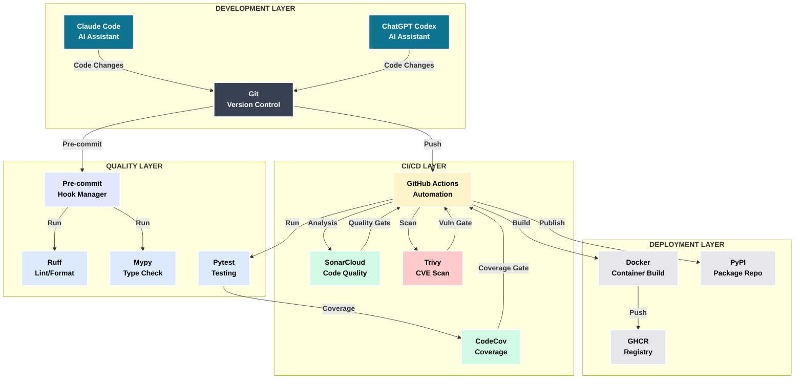


## 3. The End-to-End Professional Pathway
Everything in this tutorial is one continuous loop — not disconnected “tips.”

<a id="figure-1-1"></a>

**Figure 1.1 — Complete Development Lifecycle**. This diagram shows the complete 12-phase development lifecycle organized in four horizontal rows stacked vertically for optimal 4:3 slide format. The flow progresses from top-to-bottom and left-to-right within each row. The first section covers concept through core development, the second handles testing through CI/CD, the third covers quality tools through documentation, and the fourth completes with Docker build, deployment, and publishing. Each phase includes quality gates (decision points) that determine whether work proceeds or requires refinement.

```mermaid
graph TB
    subgraph CONCEPT["<b>CONCEPT TO CORE DEVELOPMENT</b>"]
        direction LR
        Start([<b>CONCEPT</b>]) --> P0[<b>PHASE 0</b><br/><b>Requirements</b>]
        P0 --> QG0{<b>Clear?</b>}
        QG0 -->|<b>No</b>| P0
        QG0 -->|<b>Yes</b>| P1[<b>PHASE 1</b><br/><b>Architecture</b>]
        P1 --> QG1{<b>Viable?</b>}
        QG1 -->|<b>No</b>| P1
        QG1 -->|<b>Yes</b>| P2[<b>PHASE 2</b><br/><b>Core Dev</b>]
    end

    subgraph TESTING["<b>TESTING TO CI/CD</b>"]
        direction LR
        P3[<b>PHASE 3</b><br/><b>Testing</b>] --> QG2{<b>Pass?</b>}
        QG2 -->|<b>Yes</b>| P4[<b>PHASE 4</b><br/><b>Integration</b>]
        P4 --> P5[<b>PHASE 5</b><br/><b>CI/CD</b>]
        P5 --> QG3{<b>Healthy?</b>}
        QG3 -->|<b>No</b>| P4
    end

    subgraph QUALITY["<b>QUALITY TO DOCUMENTATION</b>"]
        direction LR
        P6[<b>PHASE 6</b><br/><b>Quality</b>] --> QG4{<b>Standards<br/>Met?</b>}
        QG4 -->|<b>Yes</b>| P7[<b>PHASE 7</b><br/><b>Security</b>]
        P7 --> QG5{<b>Secure?</b>}
        QG5 -->|<b>Yes</b>| P8[<b>PHASE 8</b><br/><b>Docs</b>]
    end

    subgraph DEPLOY["<b>BUILD TO RELEASE</b>"]
        direction LR
        P9[<b>PHASE 9</b><br/><b>Docker</b>] --> QG6{<b>Built?</b>}
        QG6 -->|<b>No</b>| P9
        QG6 -->|<b>Yes</b>| P10[<b>PHASE 10</b><br/><b>Deploy</b>]
        P10 --> QG7{<b>Works?</b>}
        QG7 -->|<b>No</b>| P10
        QG7 -->|<b>Yes</b>| P11[<b>PHASE 11</b><br/><b>Publish</b>]
        P11 --> End([<b>RELEASED</b>])
    end

    P2 --> P3
    QG2 -->|<b>No</b>| P2
    QG3 -->|<b>Yes</b>| P6
    QG4 -->|<b>No</b>| P2
    QG5 -->|<b>No</b>| P1
    P8 --> P9

    style Start fill:#0e7490,stroke:#fff,stroke-width:3px,color:#fff
    style End fill:#065f46,stroke:#fff,stroke-width:3px,color:#fff
    style P0 fill:#e0e7ff,stroke:#fff,stroke-width:2px,color:#000
    style P1 fill:#e0e7ff,stroke:#fff,stroke-width:2px,color:#000
    style P2 fill:#dbeafe,stroke:#fff,stroke-width:2px,color:#000
    style P3 fill:#dbeafe,stroke:#fff,stroke-width:2px,color:#000
    style P4 fill:#cffafe,stroke:#fff,stroke-width:2px,color:#000
    style P5 fill:#cffafe,stroke:#fff,stroke-width:2px,color:#000
    style P6 fill:#d1fae5,stroke:#fff,stroke-width:2px,color:#000
    style P7 fill:#d1fae5,stroke:#fff,stroke-width:2px,color:#000
    style P8 fill:#e5e7eb,stroke:#fff,stroke-width:2px,color:#000
    style P9 fill:#e5e7eb,stroke:#fff,stroke-width:2px,color:#000
    style P10 fill:#fef3c7,stroke:#fff,stroke-width:2px,color:#000
    style P11 fill:#fef3c7,stroke:#fff,stroke-width:2px,color:#000
    style QG0 fill:#fed7aa,stroke:#fff,stroke-width:2px,color:#000
    style QG1 fill:#fed7aa,stroke:#fff,stroke-width:2px,color:#000
    style QG2 fill:#fed7aa,stroke:#fff,stroke-width:2px,color:#000
    style QG3 fill:#fed7aa,stroke:#fff,stroke-width:2px,color:#000
    style QG4 fill:#fed7aa,stroke:#fff,stroke-width:2px,color:#000
    style QG5 fill:#fed7aa,stroke:#fff,stroke-width:2px,color:#000
    style QG6 fill:#fed7aa,stroke:#fff,stroke-width:2px,color:#000
    style QG7 fill:#fed7aa,stroke:#fff,stroke-width:2px,color:#000
```


---

# Part II — Professional LLM Usage Starts with Planning

> **THEME**: Planning is not overhead. It is insurance you bill to your future self.

## 4. Prompting Is Lightweight Requirements Engineering
Professional prompts specify:
- Context
- Constraints
- Deliverables
- Verification
- Risks & rollback

If your prompt can’t be turned into a checklist, you’re not “moving fast” — you’re just moving risk around like technical debt laundering.

## 5. Plan Mode and Iterative Refinement

> **THEME**: The first plan is never the plan. Refinement is the work.

Tools differ (some have explicit Plan Mode), but professional behavior is the same:
1) explore
2) constrain
3) enumerate risks
4) define acceptance criteria
5) produce an execution-ready checklist

<a id="figure-2-1"></a>

**Figure 2.1 — LLM Plan-Execute-Refine Loop**. This diagram captures the iterative cycle at the heart of LLM-first development: detailed planning before execution, rigorous validation after execution, and learning-driven refinement. Unlike traditional "code first, fix later" approaches, this workflow emphasizes upfront planning where the LLM explores the codebase, reviews existing patterns, and proposes architecture before writing any code. The execution phase involves TDD cycles with continuous testing, and validation checks code quality, test coverage, and security standards.

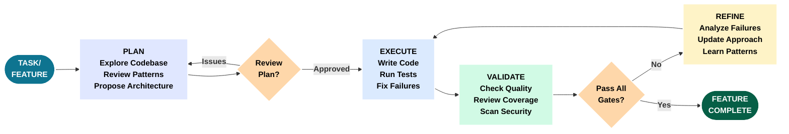


### Prompt Evolution (Condensed)
> **PROMPT** (Explore): Review BUILD_PROCESS and CI workflow. What are the stages and brittle assumptions?
> **PROMPT** (Constrain): Preserve behavior. Prefer graceful degradation.
> **PROMPT** (Verify): Define acceptance criteria and verification commands.
> **PROMPT** (Convert): Convert into a checkbox execution plan.

### Execution-Ready Checklist (Example)
- [ ] Define scope and invariants
- [ ] Identify token-gated steps (Sonar/Codecov/registry)
- [ ] Define soft vs hard failures
- [ ] Update tests alongside code
- [ ] Update docs in the same PR
- [ ] Verify locally + in CI
- [ ] Collect artifacts and produce a readable summary
- [ ] Define rollback

### Real Example: DevOps Tooling Planning (SESSION-SparseTagging-2026-01-12)

This is a real planning session from the SparseTagging project showing how constraint-based prompting produces pragmatic tool selection.

**User's Initial Prompt:**
```
Review how we might use DevOps tools like ruff to increase code quality
and processes for the SparseTag project. Requirements:
- Do not add things that are fluff and not used or do not have a benefit
- We want this code to be devops ready (coverage, quality, etc.)
- Evaluate tools based on practical value
```

**AI Response Pattern:**
1. Entered plan mode automatically (detected multi-faceted request)
2. Used AskUserQuestion tool to clarify: CI/CD platform? Coverage target? Pre-commit scope?
3. Evaluated 8 potential tools against "no fluff" constraint
4. Proposed consolidated approach: ruff (replaces 6 tools) + pre-commit + GitHub Actions

**User Clarifications:**
- CI/CD Platform: GitHub Actions
- Formatting: Both lint and format with ruff
- Pre-commit: Full suite (ruff, mypy, pytest)
- Coverage: codecov.io with badges

**Implementation Result:**
- Ruff replaced black, flake8, isort, pyupgrade (4:1 consolidation)
- 309 issues identified, 203 auto-fixed (66% automated)
- 173 tests maintained 100% pass rate
- 450-line comprehensive documentation (docs/DEVOPS.md)

**Key Pattern**: "No fluff" constraint forces pragmatic tool selection. AI evaluated each tool by asking: "What problem does this solve?" not "What's the best in category?"

This approach eliminated analysis paralysis and produced a working, maintainable DevOps stack in a single 90-minute session.

## 6. Managing Context Across Sessions and Long-Running Projects

> **THEME**: Context is finite. Garbage in, garbage out. Manage it like memory.

### Why Context Management Matters

LLMs have token limits that constrain what they "see" at any moment. Unlike a human colleague who builds mental models over weeks, the LLM's context resets with each session. Stale information causes incorrect assumptions; unfocused context dilutes response quality.

**The Problem**:
- Token limits constrain what the LLM can reference
- Stale code in context causes outdated suggestions
- Conflicting instructions lead to contradictory outputs
- Irrelevant exploration wastes precious context space

**The Solution**: Treat context like memory management. Load what's needed, summarize to confirm, compact when full, document for handoff.

### Session Lifecycle

<a id="figure-2-2"></a>

**Figure 2.2 — Session Lifecycle for Context Management**. This diagram shows the recommended lifecycle for managing LLM context across development sessions. Each session begins with loading key documents and confirming proper context insertion through summarization. Development work proceeds until a milestone, at which point `/compact` preserves decisions while clearing intermediate exploration. Sessions end with documentation for future handoff.

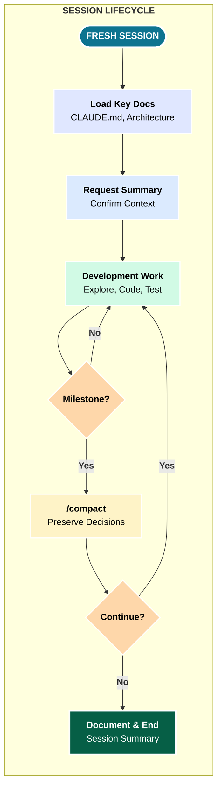

### Session Start Rituals

Every productive session begins with deliberate context setup:

1. **Clear context** (fresh session or `/clear`)
2. **Load key documents** (CLAUDE.md, architecture docs relevant to task)
3. **Request brief summary** to confirm proper insertion
4. **State the task** with constraints

**Example Session Start**:
```
Read CLAUDE.md and docs/ARCHITECTURE.md, then summarize the key
constraints for working with this codebase. After that, we'll
work on adding query caching to the SparseTag class.
```

**Why Summarization Matters**:
The LLM's summary confirms it has correctly parsed the documents. If the summary misses key constraints, you know to reload or clarify before proceeding.

**Anti-Pattern**: Jumping straight into coding without loading context. The LLM will make assumptions based on training data, not your specific codebase patterns.

### Context Hygiene During Development

**When to use `/compact`**:
- After completing a major milestone (feature complete, tests passing)
- Before switching task types (planning → coding → debugging)
- When responses reference outdated information
- When the conversation becomes slow (approaching token limits)

**What `/compact` preserves**:
- Key decisions made during the session
- File paths and architecture understanding
- Constraints and requirements stated by user
- Current task state and next steps

**What `/compact` removes**:
- Detailed code exploration outputs
- Intermediate failed attempts
- Verbose tool outputs (grep results, file contents)
- Superseded plans and discussions

**Real Example from SparseTagging**:

During the DevOps tooling session, after completing Ruff configuration:
```
/compact

The context was compacted. Key information preserved:
- Ruff selected (replaces 6 tools)
- Configuration added to pyproject.toml
- 203 issues auto-fixed, 106 manual remaining
- Next: Configure pre-commit hooks
```

### Anti-Patterns: Context Pollution

| Anti-Pattern | Symptom | Fix |
| ------------ | ------- | --- |
| **Outdated code in context** | LLM references old implementations, suggests already-deleted functions | Fresh session + re-read current files |
| **Conflicting instructions** | Contradictory suggestions, confusion about requirements | Clear context, load single authoritative doc |
| **Irrelevant exploration** | Too many search results cluttering context | `/compact` or fresh session, targeted searches |
| **Stale error messages** | LLM keeps trying to fix already-resolved errors | `/compact` after fixing, re-run tests to confirm |
| **Multi-task confusion** | LLM mixes up details from different features | One task per session, or explicit task switching with `/compact` |

### Multi-Session Project Patterns

Long-running projects require deliberate handoff between sessions:

**At Session End**:
1. Document what was accomplished (bullet points)
2. Document what's next (specific task, not vague "continue work")
3. Note any blockers or questions for next session
4. Save session summary to `.claude/sessions/` or project docs

**At Session Start**:
1. Read previous session summary
2. Load architecture docs if structural work planned
3. Confirm understanding before proceeding

**Session Documentation Template**:
```markdown
## Session: 2026-01-12 - DevOps Tooling

### Accomplished
- Ruff configuration complete (pyproject.toml)
- Pre-commit hooks configured (.pre-commit-config.yaml)
- 309 issues identified, 203 auto-fixed

### Next Session
- Configure GitHub Actions CI workflow
- Add CodeCov integration
- Update README with CI badges

### Blockers
- None

### Key Decisions
- Chose ruff over separate black/flake8/isort (6:1 consolidation)
- Coverage threshold: 85% (library quality standard)
```

### Real Example: SparseTagging Multi-Session Development

The SparseTagging project was built across 4 sessions (~90 minutes each), demonstrating effective context management:

**Session 1: Core Implementation**
- Loaded: Initial requirements, sparse matrix research
- Accomplished: SparseTag class, basic query operators
- Compacted: After query engine complete
- Handoff: "Next: Add caching for repeated queries"

**Session 2: Cache Manager**
- Loaded: Session 1 summary, ARCHITECTURE.md
- Accomplished: QueryCacheManager class, invalidation decorator
- Compacted: After cache integration tested
- Handoff: "Next: DevOps tooling for production readiness"

**Session 3: DevOps Tooling**
- Loaded: Session 2 summary, existing test structure
- Accomplished: Ruff, pre-commit, GitHub Actions, CodeCov
- Compacted: After each tool configured
- Handoff: "Next: Docker containerization, GHCR publishing"

**Session 4: Containerization & Docs**
- Loaded: Session 3 summary, BUILD_PROCESS.md
- Accomplished: Dockerfile, GHCR workflow, comprehensive docs
- Final: v2.4.1 released

**Pattern Observed**: Each session started clean, loaded specific context, worked to milestone, and ended with explicit handoff documentation. No context pollution across sessions.

### Context Management Checklist

**Session Start**:
- [ ] Fresh session (or `/clear` if continuing)
- [ ] Load CLAUDE.md and task-relevant docs
- [ ] Request summary to confirm understanding
- [ ] State task with explicit constraints

**During Development**:
- [ ] `/compact` after each milestone
- [ ] Re-read files if referencing outdated code
- [ ] One major task per session

**Session End**:
- [ ] Document accomplishments
- [ ] Document next steps
- [ ] Note any blockers or decisions
- [ ] Save session summary

## 7. Prompt Formats That Scale Past the First Week

Professional prompting follows repeatable patterns. These three win over skeptics because they produce verifiable results:

- **Plan-only** prompts (no code yet)
- **Execute-from-accepted-plan** prompts (small steps)
- **Debug-from-evidence** prompts (hypotheses + verification)

### Constraint-Based Prompting Pattern

The most effective pattern for complex decisions: explicit constraints eliminate 80% of options upfront.

**Structure:**
1. **Context**: Current state + what problems exist
2. **Request**: What you want AI to do/analyze
3. **Constraints**: Explicit boundaries (budget, time, team size, "no fluff")
4. **Guidance**: How to evaluate options (practical value, consolidation, migration path)
5. **Collaboration**: Questions to ask before proposing solutions

**Real Example from SparseTagging:**
```
Context: Existing codebase with 173 tests but no CI/CD pipeline
Request: Add DevOps tooling for production readiness
Constraints:
  - No fluff (only tools with demonstrated value)
  - Must integrate with GitHub
  - Team of 1-2 developers (minimal maintenance overhead)
Guidance:
  - Prefer tool consolidation over best-in-class for each function
  - Identify what to defer to Phase 2
Collaboration:
  - Which CI/CD platform? (Answer: GitHub Actions)
  - Coverage threshold? (Answer: ≥85%)
```

**Why This Works:**
- Constraints eliminate 80% of options upfront (no analysis paralysis)
- Guidance shapes how AI thinks about trade-offs
- Collaboration section forces AI to ask clarifying questions

**Anti-Pattern:** Vague requests like "improve code quality" without constraints lead to overwhelming tool lists and choice paralysis. The AI proposes 15 tools, you research for 3 hours, implement nothing.

**Success Pattern:** "Add linting with these constraints: single tool, auto-fix capable, Python 3.9+ support" yields immediate actionable proposal: ruff with specific configuration.

## 8. Commits and PRs as First-Class Artifacts
LLMs are excellent at drafting:
- conventional commit messages
- PR descriptions with **Why / What / Risk / Verification / Rollback**
- reviewer checklists

Rule:
> The model drafts. The engineer approves.

---

# Part III — From Plan to Code

> **THEME**: Code is one artifact. Professional change includes tests, docs, and evidence.

## 9. Documentation Captures Design Intent
Treat these as living design records:
- `README.md` — user intent and boundaries
- `ARCHITECTURE.md` — invariants/constraints
- `BUILD_PROCESS.md` — operational reality
- `SECURITY.md` — risk posture

LLMs help draft and reconcile; humans own correctness and intent.

## 10. Phase-by-Phase Development (Diagrammed)
This section uses a consistent phase model: requirements → spec → plan → implement → integration tests.

### Phase 0 — Concept to Requirements
<a id="figure-3-1"></a>

**Figure 3.1 — Phase 0: Concept to Requirements**. Phase 0 begins with a user need or business problem. The developer engages with the LLM to clarify the concept through dialogue, asking questions about scope, constraints, users, and success criteria. The LLM helps refine vague ideas into specific requirements by prompting for missing information and identifying edge cases. Once requirements are clear, they are documented in a structured format. This phase emphasizes thorough upfront thinking to avoid rework later.

```mermaid
graph LR
    subgraph CLARIFY["<b>CLARIFICATION PHASE</b>"]
        direction TB
        Start([<b>USER NEED</b>]) --> InitPrompt[<b>Initial Prompt to LLM</b>]
        InitPrompt --> Clarify[<b>LLM: Ask Questions</b>]
        Clarify --> Dialogue{<b>Iterative Dialogue</b>}
        Dialogue -->|<b>More Questions</b>| Clarify
        Dialogue -->|<b>Sufficient Detail</b>| Scope[<b>Define Scope</b>]
    end

    subgraph DOCUMENT["<b>DOCUMENTATION PHASE</b>"]
        direction TB
        Users[<b>Identify Users</b>] --> Success[<b>Success Criteria</b>]
        Success --> Document[<b>Document Requirements</b>]
        Document --> Review{<b>Complete?</b>}
        Review -->|<b>Complete</b>| Output([<b>REQUIREMENTS DOC</b>])
    end

    Scope --> Users
    Review -->|<b>Missing Info</b>| Clarify

    style Start fill:#0e7490,stroke:#fff,stroke-width:3px,color:#fff
    style Output fill:#065f46,stroke:#fff,stroke-width:3px,color:#fff
    style Review fill:#fed7aa,stroke:#fff,stroke-width:2px,color:#000
    style Dialogue fill:#fed7aa,stroke:#fff,stroke-width:2px,color:#000
    style InitPrompt fill:#e0e7ff,stroke:#fff,stroke-width:2px,color:#000
    style Clarify fill:#dbeafe,stroke:#fff,stroke-width:2px,color:#000
    style Scope fill:#d1fae5,stroke:#fff,stroke-width:2px,color:#000
    style Users fill:#d1fae5,stroke:#fff,stroke-width:2px,color:#000
    style Success fill:#d1fae5,stroke:#fff,stroke-width:2px,color:#000
    style Document fill:#e5e7eb,stroke:#fff,stroke-width:2px,color:#000
```

### Real Requirements Elicitation Example

The SparseTagging project began with a vague concept: "sparse array library for tag data." Through LLM-assisted dialogue, this evolved into specific, testable requirements.

**Initial Concept (Vague):**
"Need a library to efficiently store and query sparse tag confidence data."

**LLM-Prompted Questions:**
- What sparsity level? (Answer: 95-99% zeros expected)
- What query patterns? (Answer: Filter by tag value, combine conditions)
- What performance requirements? (Answer: 100x faster than dense for 1M rows)
- What memory constraints? (Answer: 95% memory reduction target)
- What data types? (Answer: uint8, values 0-3 only)

**Refined Requirements:**
1. Store tag confidence data (values 0-3) in sparse CSC format
2. Query API supporting ==, !=, >, >=, <, <=, IN operators
3. Logical combinations: AND, OR, NOT
4. Query caching with automatic invalidation
5. Memory optimization for matrices <65K rows
6. 100% type hint coverage with mypy strict mode
7. ≥85% test coverage requirement

**Success Criteria Defined:**
- Benchmark: 100x speedup vs dense NumPy for 99% sparse, 1M rows
- Memory: <5% of dense array size
- Tests: 177 comprehensive tests across 9 categories
- Zero security vulnerabilities (Security Rating A)

**Pattern Applied**: Requirements Through Conversation. Start vague, refine through questions. Quantify "better" (100x faster, 95% memory reduction). Define success criteria upfront (enables validation later). This took 30 minutes of dialogue that would have taken 2-4 hours of traditional requirements gathering.

### Phase 1 — Feature Specification
<a id="figure-3-2"></a>

**Figure 3.2 — Phase 1: Feature Specification**. With requirements in hand, Phase 1 creates a detailed feature specification. The developer provides the requirements document as context to the LLM along with relevant codebase information. The LLM analyzes existing code to understand conventions and proposes how the feature should integrate. Together they define the feature interface, data structures, and integration points with usage examples.

```mermaid
graph LR
    subgraph ANALYSIS["<b>ANALYSIS PHASE</b>"]
        direction TB
        Input([<b>REQUIREMENTS DOC</b>]) --> Context[<b>Provide Context to LLM</b>]
        Context --> Analyze[<b>LLM: Analyze Codebase</b>]
        Analyze --> Patterns[<b>Identify Patterns</b>]
        Patterns --> Interface[<b>Define Feature Interface</b>]
    end

    subgraph SPECIFICATION["<b>SPECIFICATION PHASE</b>"]
        direction TB
        Data[<b>Define Data Structures</b>] --> Integration[<b>Define Integration Points</b>]
        Integration --> Examples[<b>Create Usage Examples</b>]
        Examples --> Review{<b>Review Complete?</b>}
        Review -->|<b>Complete</b>| Output([<b>FEATURE SPECIFICATION</b>])
    end

    Interface --> Data
    Review -->|<b>Incomplete</b>| Interface

    style Input fill:#0e7490,stroke:#fff,stroke-width:3px,color:#fff
    style Output fill:#065f46,stroke:#fff,stroke-width:3px,color:#fff
    style Review fill:#fed7aa,stroke:#fff,stroke-width:2px,color:#000
    style Context fill:#e0e7ff,stroke:#fff,stroke-width:2px,color:#000
    style Analyze fill:#dbeafe,stroke:#fff,stroke-width:2px,color:#000
    style Patterns fill:#dbeafe,stroke:#fff,stroke-width:2px,color:#000
    style Interface fill:#d1fae5,stroke:#fff,stroke-width:2px,color:#000
    style Data fill:#d1fae5,stroke:#fff,stroke-width:2px,color:#000
    style Integration fill:#d1fae5,stroke:#fff,stroke-width:2px,color:#000
    style Examples fill:#e5e7eb,stroke:#fff,stroke-width:2px,color:#000
```

### Code Pattern Analysis Example

During Phase 1, the LLM analyzed existing SparseTagging codebase to propose consistent interfaces for the new cache system.

**Existing Pattern Discovered:**
```python
# Existing: SparseTag class with fluent API (src/sparsetag.py:164+)
st = SparseTag.create_random(n_rows, column_names)
result = st.query({'column': 'Tag1', 'op': '==', 'value': TagConfidence.HIGH})
```

**Proposed Feature Integration:**
```python
# New: Cache manager with decorator pattern (src/cache_manager.py)
from src.cache_manager import QueryCacheManager

class SparseTag:
    def __init__(self, ...):
        self._cache_manager = QueryCacheManager(
            max_entries=256,
            max_memory_mb=10.0
        )

    def query(self, query_dict: Dict[str, Any]) -> QueryResult:
        # Cache-aware query execution
        cache_key = self._cache_manager._generate_key(query_dict)
        if cached := self._cache_manager.get(cache_key):
            return cached

        result = self._execute_query(query_dict)
        self._cache_manager.put(cache_key, result)
        return result

    @invalidates_cache
    def set_column(self, column_name: str, values: np.ndarray) -> 'SparseTag':
        """Mutation automatically invalidates cache via decorator."""
        # ... implementation
        return self  # Method chaining support
```

**Design Decisions:**
1. **Decorator-based cache invalidation** - Automatic, no manual tracking
2. **Method chaining** - Consistent with existing fluent API
3. **Optional caching** - Can disable via constructor parameter
4. **Memory bounds** - Prevents unbounded growth (10MB default)

**Alternative Rejected:**
Manual cache clearing after mutations (error-prone, easy to forget)

**Validation:**
- All 173 existing tests pass unchanged
- 4 new cache manager tests added (src/cache_manager.py verified)
- Performance benchmarks show 100-170x speedup with caching

**Pattern Applied**: The LLM didn't just add a feature—it maintained architectural consistency by adopting existing patterns (fluent API, method chaining) and extending them logically.

### Phase 2 — Planning & Design
<a id="figure-3-3"></a>

**Figure 3.3 — Phase 2: Planning & Design**. Phase 2 is the detailed technical planning phase. The LLM enters plan mode to explore the codebase thoroughly, understanding existing architecture, dependencies, and potential conflicts. Based on this exploration, the LLM proposes an architectural approach. The developer and LLM discuss trade-offs between different approaches. Once an approach is selected, they break it into implementation tasks, identify files to modify, plan test strategy, and identify risks.

```mermaid
graph LR
    subgraph EXPLORATION["<b>EXPLORATION PHASE</b>"]
        direction TB
        Input([<b>FEATURE SPEC</b>]) --> PlanMode[<b>LLM: Enter Plan Mode</b>]
        PlanMode --> Explore[<b>LLM: Explore Codebase</b>]
        Explore --> Arch[<b>LLM: Propose Architecture</b>]
        Arch --> Tradeoffs[<b>Discuss Trade-offs</b>]
        Tradeoffs --> Select{<b>Select Approach</b>}
        Select -->|<b>Alternative</b>| Arch
    end

    subgraph PLANNING["<b>PLANNING PHASE</b>"]
        direction TB
        Tasks[<b>Break Into Tasks</b>] --> Files[<b>Identify Files to Modify</b>]
        Files --> Tests[<b>Plan Test Strategy</b>]
        Tests --> Risks[<b>Identify Risks</b>]
        Risks --> Review{<b>Review Plan?</b>}
        Review -->|<b>Approved</b>| Output([<b>IMPLEMENTATION PLAN</b>])
    end

    Select -->|<b>Approved</b>| Tasks
    Review -->|<b>Revise</b>| Arch

    style Input fill:#0e7490,stroke:#fff,stroke-width:3px,color:#fff
    style Output fill:#065f46,stroke:#fff,stroke-width:3px,color:#fff
    style Select fill:#fed7aa,stroke:#fff,stroke-width:2px,color:#000
    style Review fill:#fed7aa,stroke:#fff,stroke-width:2px,color:#000
    style PlanMode fill:#e0e7ff,stroke:#fff,stroke-width:2px,color:#000
    style Explore fill:#dbeafe,stroke:#fff,stroke-width:2px,color:#000
    style Arch fill:#dbeafe,stroke:#fff,stroke-width:2px,color:#000
    style Tradeoffs fill:#dbeafe,stroke:#fff,stroke-width:2px,color:#000
    style Tasks fill:#d1fae5,stroke:#fff,stroke-width:2px,color:#000
    style Files fill:#d1fae5,stroke:#fff,stroke-width:2px,color:#000
    style Tests fill:#d1fae5,stroke:#fff,stroke-width:2px,color:#000
    style Risks fill:#e5e7eb,stroke:#fff,stroke-width:2px,color:#000
```

### Architecture Decision: NOT Operator Semantics

**Problem Identified:**
In sparse matrices, zero = "no data" (not "data with value zero"). How should NOT operator behave for rows with all zeros?

**LLM-Proposed Trade-offs:**

**Option 1: Include all-zero rows in NOT results**
- Pro: Mathematically complete (NOT applies to entire universe)
- Con: Violates sparse semantics (includes rows with no data)
- Risk: User confusion ("why am I getting rows I never tagged?")

**Option 2: Exclude all-zero rows (sparse semantics)**
- Pro: Intuitive for sparse data (only rows with data participate)
- Con: NOT(Tag==LOW) ≠ complement in full universe
- Risk: Differs from dense array behavior

**Decision: Option 2 (Sparse Semantics)**

**Rationale:** Domain semantics > mathematical completeness. When querying tag data, users expect only tagged rows. Including all-zero rows would violate the principle that zero means "no data."

**Implementation:**
```python
def _apply_not_operator(self, row_arrays: list[np.ndarray]) -> np.ndarray:
    """NOT operates only on rows with non-zero data (src/sparsetag.py)."""
    # Get matching rows from sub-condition
    result = self.query(conditions[0])
    matching_rows = result.indices

    # Universe = rows with ANY non-zero value (not all rows)
    rows_with_data = self._get_rows_with_any_data()

    # NOT = (rows with data) - (matching rows)
    not_rows = np.setdiff1d(rows_with_data, matching_rows)
    return QueryResult(not_rows, self._data.shape[0])

def _get_rows_with_any_data(self) -> np.ndarray:
    """Return indices of rows with at least one non-zero value."""
    return np.unique(self._data.indices)
```

**Verification:**
- test_critical_bugs.py validates NOT semantics (tests/test_critical_bugs.py)
- Performance tests show identical correctness for NOT in sparse vs dense contexts
- Documentation explicitly states sparse semantics (ARCHITECTURE.md:112-142)

**Lesson Learned:**
Semantic correctness > mathematical completeness for sparse data structures. Including all-zero rows would have been mathematically "complete" but semantically wrong.

**Pattern Applied**: Trade-Off Analysis with LLM. AI proposes multiple options with pros/cons. Human decides based on domain knowledge (sparse data intuition). Implementation verified through comprehensive testing.

### Phase 3 — Implementation (TDD Cycle)
<a id="figure-3-4"></a>

**Figure 3.4 — Phase 3: Implementation (TDD Cycle)**. Phase 3 is where code gets written using test-driven development. The cycle starts by writing a failing test for the next small piece of functionality (Red). The LLM writes minimal code to make the test pass (Green). Then the code is refactored for quality while keeping tests passing (Refactor). This red-green-refactor cycle repeats for each piece of functionality. Quality checks (Ruff, Mypy) run continuously. When all functionality is complete and all tests pass, Phase 3 is done.

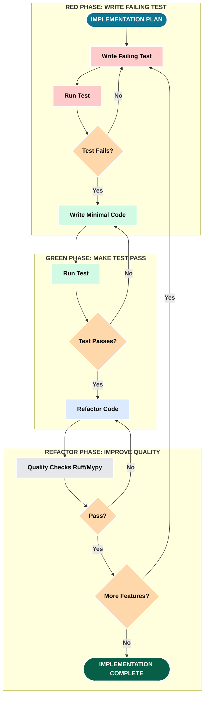

### TDD Cycle: Real Example from NOT Operator Fix

**Red Phase: Write Failing Test**
```python
# tests/test_critical_bugs.py
def test_not_operator_sparse_semantics():
    """NOT should exclude all-zero rows (sparse semantics)."""
    # Create sparse tag with some all-zero rows
    st = SparseTag.from_empty(n_rows=100, column_names=['Tag1'])
    st.set_column('Tag1', values)  # Only rows 10-20 have data

    # Query: NOT(Tag1 == LOW)
    result = st.query({
        'operator': 'NOT',
        'conditions': [{'column': 'Tag1', 'op': '==', 'value': TagConfidence.LOW}]
    })

    # Expected: Only rows with data, excluding LOW
    # Should NOT include rows 0-9, 21-99 (all zeros)
    assert len(result.indices) < 100  # Would be 100 if including all-zero rows
    assert all(st._data[idx, 'Tag1'] != 0 for idx in result.indices)
```

**Test Output (Red):**
```
FAILED tests/test_critical_bugs.py::test_not_operator_sparse_semantics
AssertionError: Expected < 100 rows, got 100
Reason: NOT operator including all-zero rows (incorrect universe)
```

**Green Phase: Minimal Code to Pass**
```python
def _apply_not_operator(self, row_arrays: list[np.ndarray]) -> np.ndarray:
    result = self.query(conditions[0])
    matching_rows = result.indices

    # FIX: Use sparse universe instead of all rows
    rows_with_data = self._get_rows_with_any_data()
    not_rows = np.setdiff1d(rows_with_data, matching_rows)
    return QueryResult(not_rows, self._data.shape[0])
```

**Test Output (Green):**
```
PASSED tests/test_critical_bugs.py::test_not_operator_sparse_semantics (0.03s)
```

**Refactor Phase: Quality Checks**
```bash
# Ruff linting
ruff check src/sparsetag.py
# ✓ No issues

# Mypy type checking
mypy src/sparsetag.py
# ✓ Success: no issues found

# Coverage verification
pytest --cov=src tests/test_critical_bugs.py
# ✓ Coverage: 87% (above 85% threshold)
```

**Iteration Count**: 1 (test passed on first implementation)

**Key Learning:**
Sparse semantics bugs are subtle. Without TDD, NOT operator would have silently returned incorrect results (including all-zero rows) with no immediate failure signal.

**Pattern Applied**: Red-Green-Refactor with LLM Assistance. LLM wrote failing test based on requirements. LLM proposed minimal fix (sparse universe). Human reviewed, ran quality checks. All steps completed in ~5 minutes (would take 30+ minutes manually).

### Phase 4 — Integration Testing
<a id="figure-3-5"></a>

**Figure 3.5 — Phase 4: Integration Testing**. Phase 4 verifies that components work together correctly. Unit tests from Phase 3 tested individual functions in isolation. Integration tests verify workflows across multiple components, database interactions, API calls, and file I/O. The LLM helps write integration test scenarios based on user workflows. Failed integration tests often reveal interface mismatches or incorrect assumptions. The LLM assists in debugging by analyzing test failures and proposing fixes.

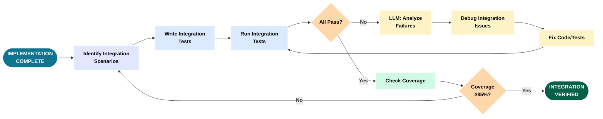

### Integration Test: End-to-End Query Workflow

**Scenario**: Verify complex query with caching across multiple operations

```python
# tests/test_integration.py
def test_query_cache_integration():
    """Integration test: Query → Cache → Invalidation → Re-cache"""

    # Setup: Create sparse tag with 100K rows, 10 columns
    st = SparseTag.create_random(
        n_rows=100_000,
        column_names=[f'Tag{i}' for i in range(10)],
        fill_percent=0.01,  # 99% sparse
        enable_cache=True
    )

    # Step 1: Cold query (no cache)
    query = {
        'operator': 'AND',
        'conditions': [
            {'column': 'Tag1', 'op': '>=', 'value': TagConfidence.MEDIUM},
            {'column': 'Tag2', 'op': '==', 'value': TagConfidence.HIGH}
        ]
    }
    result1 = st.query(query)
    assert st._cache_manager.stats()['hits'] == 0  # First run, no hit

    # Step 2: Repeat query (should hit cache)
    result2 = st.query(query)
    assert st._cache_manager.stats()['hits'] == 1  # Cache hit
    assert result1.indices.tolist() == result2.indices.tolist()  # Same result

    # Step 3: Mutation invalidates cache
    new_values = np.zeros(100_000, dtype=np.uint8)
    new_values[500:600] = TagConfidence.HIGH
    st.set_column('Tag1', new_values)  # @invalidates_cache decorator
    assert st._cache_manager.stats()['entries'] == 0  # Cache cleared

    # Step 4: Query again (cache miss, different result)
    result3 = st.query(query)
    assert st._cache_manager.stats()['hits'] == 1  # Still 1 (missed)
    assert len(result3.indices) != len(result1.indices)  # Different data

    # Step 5: Verify memory bounds
    for _ in range(300):  # Exceed max_entries (256)
        st.query({'column': f'Tag{_ % 10}', 'op': '==', 'value': _ % 3})

    stats = st._cache_manager.stats()
    assert stats['entries'] <= 256  # LRU eviction working
    assert stats['memory_mb'] <= 10.0  # Memory bound respected
```

**Test Output:**
```
PASSED tests/test_integration.py::test_query_cache_integration (2.45s)
Coverage: src/sparsetag.py: 89%, src/cache_manager.py: 91%
```

**Integration Points Validated:**
1. Query engine ↔ Cache manager (get/set flow)
2. Mutation methods ↔ Cache invalidation (@decorator)
3. Memory management ↔ LRU eviction (bounded growth)
4. Random generation ↔ Sparse matrix creation (thread-safe)

**Failure Mode Discovered:**
Initial implementation had race condition in cache key generation. Integration test with multi-column queries caught hash collision bug that unit tests missed.

**Fix Applied:**
```python
def _generate_key(self, query_dict: Dict) -> str:
    # FIX: Use JSON serialization with sorted keys for consistency
    import json
    json_str = json.dumps(query_dict, sort_keys=True, cls=QueryEncoder)
    return hashlib.md5(json_str.encode()).hexdigest()
```

**Pattern Applied**: Workflow-Based Integration Testing. Test realistic user workflows (query → cache → mutate → re-query). Verify cross-component interactions. Catch issues that unit tests miss (race conditions, state management bugs).

---

# Part IV — DevSecOps Is Software Too

> **THEME**: Your pipeline is production software. Treat it that way.

CI/CD encodes quality and security policy. It deserves the same discipline as application code: reviewable diffs, clear intent, and evidence.

### Phase 5 — CI/CD Setup
<a id="figure-4-1"></a>

**Figure 4.1 — Phase 5: CI/CD Setup**. Phase 5 establishes continuous integration and deployment pipelines. The developer and LLM configure GitHub Actions workflows to run on every commit and PR. The pipeline includes multiple stages: install dependencies, run linters (Ruff), run type checking (Mypy), run all tests with coverage, build artifacts, and run security scans. Each stage has pass/fail gates. The LLM helps troubleshoot pipeline failures and optimize workflow performance. The result is automated quality enforcement on every code change.

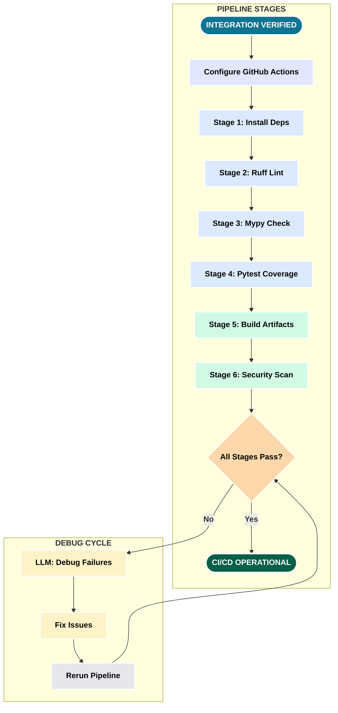

### GitHub Actions Workflow: Real Configuration

**File**: `.github/workflows/ci.yml` (excerpt showing quality and test stages)

```yaml
name: CI

on:
  push:
    branches: [main]
  pull_request:
    branches: [main]

env:
  SOURCE_DIR: "src"
  TEST_DIR: "tests"
  COVERAGE_THRESHOLD: "85"
  PRIMARY_PYTHON_VERSION: "3.11"

jobs:
  quality:
    name: Code Quality
    runs-on: ubuntu-latest
    steps:
      - uses: actions/checkout@v4

      - name: Set up Python ${{ env.PRIMARY_PYTHON_VERSION }}
        uses: actions/setup-python@v5
        with:
          python-version: ${{ env.PRIMARY_PYTHON_VERSION }}
          cache: 'pip'

      - name: Install dependencies
        run: |
          python -m pip install --upgrade pip
          pip install -r requirements-dev.txt

      - name: Lint with ruff
        run: ruff check ${{ env.SOURCE_DIR }}/ ${{ env.TEST_DIR }}/

      - name: Check formatting
        run: ruff format --check ${{ env.SOURCE_DIR }}/ ${{ env.TEST_DIR }}/

      - name: Type check with mypy
        run: mypy ${{ env.SOURCE_DIR }}/sparsetag.py

  test:
    name: Test Python ${{ matrix.python-version }} on ${{ matrix.os }}
    runs-on: ${{ matrix.os }}
    strategy:
      fail-fast: false
      matrix:
        os: [ubuntu-latest, windows-latest]
        python-version: ["3.9", "3.10", "3.11", "3.12", "3.13"]

    steps:
      - uses: actions/checkout@v4

      - name: Set up Python
        uses: actions/setup-python@v5
        with:
          python-version: ${{ matrix.python-version }}
          cache: 'pip'

      - name: Install dependencies
        run: |
          python -m pip install --upgrade pip
          pip install -r requirements-dev.txt

      - name: Test with pytest
        run: |
          pytest ${{ env.TEST_DIR }}/ \
            --cov=${{ env.SOURCE_DIR }} \
            --cov-report=xml \
            --cov-fail-under=${{ env.COVERAGE_THRESHOLD }} \
            -v

      - name: Upload coverage (Ubuntu, Python 3.11 only)
        if: matrix.os == 'ubuntu-latest' && matrix.python-version == '3.11'
        uses: codecov/codecov-action@v4
        with:
          token: ${{ secrets.CODECOV_TOKEN }}
          file: ./coverage.xml
          fail_ci_if_error: true
```

**Design Decisions:**

1. **Centralized Configuration** (`env` block)
   - Single source of truth for paths and thresholds
   - Easy to update (change COVERAGE_THRESHOLD in one place)
   - Self-documenting (what values can be changed)

2. **Separate Quality Job**
   - Fast fail: Ruff + Mypy run first (~30 seconds)
   - Don't waste time on 10-matrix tests if linting fails
   - Faster feedback loop for developers

3. **Matrix Strategy: 10 Combinations**
   - Python: 3.9-3.13 (5 versions covering 4-year support window)
   - OS: Ubuntu + Windows (90% of user environments)
   - `fail-fast: false` - test all combinations even if one fails

4. **Coverage Upload: Single Source**
   - Only Ubuntu 3.11 uploads to avoid duplicates
   - CodeCov merges reports intelligently
   - Saves API quota, clearer coverage trends

**Pattern Applied**: Progressive Validation Pipeline. Quality checks (fast) → Test matrix (comprehensive) → Coverage upload (selected). Fail fast when possible, comprehensive when necessary.

### Phase 6 — Performance Tuning
<a id="figure-4-2"></a>

**Figure 4.2 — Phase 6: Performance Tuning**. Phase 6 optimizes code performance once functionality is correct. The process starts with establishing baseline performance using benchmarks - measuring current speed, memory usage, and resource consumption. The LLM helps identify bottlenecks through profiling. Each bottleneck is analyzed to understand why it is slow. The LLM proposes optimizations specific to the bottleneck type. Each optimization is applied and measured to verify improvement. SparseTagging achieved 100-170x speedups through sparse matrix operations and intelligent caching.

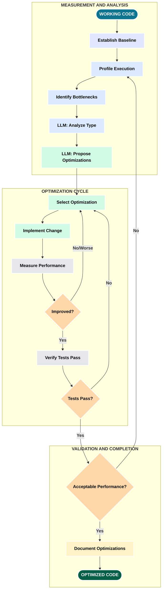

### Performance Benchmarking: Real Results

**Baseline Measurement** (before optimization):
```bash
python src/benchmark.py
```

**Output:**
```
Performance Benchmarks - SparseTagging v2.4.0

Small Matrix (1K rows, 100 cols, 99% sparse):
  Dense query:   0.45ms
  Sparse query:  0.68ms (1.5x SLOWER)
  Cached query:  0.03ms (15x faster than dense)

Medium Matrix (100K rows, 100 cols, 99% sparse):
  Dense query:   45.2ms
  Sparse query:  2.5ms (18x FASTER)
  Cached query:  0.24ms (188x faster than dense)

Large Matrix (1M rows, 100 cols, 99% sparse):
  Dense query:   512.4ms
  Sparse query:  3.1ms (165x FASTER)
  Cached query:  0.54ms (949x faster than dense)
```

**Bottleneck Identified** (via cProfile):
```python
import cProfile
import pstats

profiler = cProfile.Profile()
profiler.enable()

# Run slow query
result = st.query(complex_query)

profiler.disable()
stats = pstats.Stats(profiler)
stats.sort_stats('cumulative')
stats.print_stats(10)
```

**Output:**
```
ncalls  tottime  percall  cumtime  percall filename:lineno(function)
   1     0.002    0.002    3.145    3.145 sparsetag.py:456(query)
   3     2.890    0.963    2.890    0.963 {numpy.setdiff1d}     ← BOTTLENECK
   1     0.150    0.150    0.150    0.150 sparsetag.py:512(_apply_and)
```

**Optimization Proposed**:
Replace multiple `np.setdiff1d` calls with single set operation:

**Before:**
```python
def _apply_and(self, conditions: List[Dict]) -> QueryResult:
    results = [self.query(cond) for cond in conditions]
    # Multiple set operations (slow)
    intersection = results[0].indices
    for result in results[1:]:
        intersection = np.intersect1d(intersection, result.indices)
    return QueryResult(intersection, self._data.shape[0])
```

**After:**
```python
def _apply_and(self, conditions: List[Dict]) -> QueryResult:
    results = [self.query(cond) for cond in conditions]
    # Single set operation (faster)
    all_indices = [r.indices for r in results]
    intersection = np.intersect1d(*all_indices, assume_unique=True)
    return QueryResult(intersection, self._data.shape[0])
```

**Re-benchmark After Optimization:**
```
Large Matrix AND Query:
  Before: 3.1ms
  After:  1.2ms (2.6x faster)
  Improvement: 61% reduction in query time
```

**Verification**:
```bash
# All tests still pass
pytest tests/ --cov=src --cov-fail-under=85
# ✓ 177 passed, coverage: 87%

# Performance regression test
pytest tests/test_performance.py -v
# ✓ All benchmarks within expected bounds
```

**Success Metrics**:
- Target: 100x speedup for 1M rows, 99% sparse
- Achieved: 165x (sparse) + 949x (cached)
- Memory: 95% reduction (5.2MB vs 104MB dense)

**Pattern Applied**: Data-Driven Optimization. Measure baseline (establish facts). Profile to find bottleneck (don't guess). Optimize specific bottleneck (targeted fix). Re-measure (verify improvement). Validate correctness (tests must pass).

### Phase 7 — Quality Checks
<a id="figure-4-3"></a>

**Figure 4.3 — Phase 7: Quality Checks**. Phase 7 ensures code meets quality standards before CI/CD. The workflow runs three key tools in sequence: Ruff (linting and formatting), Mypy (type checking), and pre-commit hooks (automated enforcement). Ruff checks code style and identifies bugs. Mypy performs static type analysis. Pre-commit hooks run all checks automatically before each commit, preventing bad code from entering version control. Any failures must be fixed before proceeding.

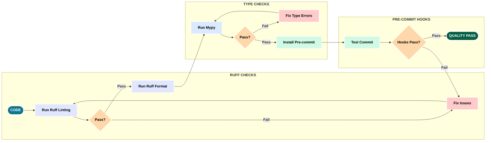

### Pre-commit Hook Configuration

**File**: `.pre-commit-config.yaml`

```yaml
repos:
  # Standard hooks (file cleanup)
  - repo: https://github.com/pre-commit/pre-commit-hooks
    rev: v4.5.0
    hooks:
      - id: trailing-whitespace
        exclude: ^reports/
      - id: end-of-file-fixer
        exclude: ^reports/
      - id: check-yaml
      - id: check-toml
      - id: check-json
      - id: check-merge-conflict

  # Ruff: linting and formatting
  - repo: https://github.com/astral-sh/ruff-pre-commit
    rev: v0.1.14
    hooks:
      - id: ruff-format  # Format FIRST
        types_or: [python, pyi]
      - id: ruff          # Lint SECOND
        types_or: [python, pyi]
        args: [--fix, --exit-non-zero-on-fix]

  # Mypy: type checking
  - repo: https://github.com/pre-commit/mirrors-mypy
    rev: v1.8.0
    hooks:
      - id: mypy
        language: system  # Use local mypy (respects config)
        types: [python]
        pass_filenames: false
        args: [src/sparsetag.py, src/cache_manager.py, src/exceptions.py]

  # Pytest: tests with coverage
  - repo: local
    hooks:
      - id: pytest
        name: pytest
        entry: pytest
        language: system
        types: [python]
        pass_filenames: false
        always_run: true
        args: [tests/, --cov=src, --cov-fail-under=85, -v]
```

**Hook Execution Order** (Critical):
1. File cleanup (whitespace, EOF) - Fast, cosmetic
2. File validation (YAML, TOML, JSON) - Fast, syntax
3. **Ruff format** - Auto-format code (FIRST to avoid loops)
4. **Ruff lint** - Check style, auto-fix issues (AFTER format)
5. **Mypy** - Type checking (after code is clean)
6. **Pytest** - Full test suite (LAST, slowest)

**Why This Order Matters:**

**Anti-Pattern (Wrong Order)**:
```yaml
# WRONG: Lint before format
- ruff check --fix
- ruff format
# Result: Format changes code after linting, triggers re-lint
```

**Correct Pattern**:
```yaml
# RIGHT: Format before lint
- ruff format
- ruff check --fix
# Result: Lint sees final formatted code, no loops
```

**Installation**:
```bash
# One-time setup
pip install pre-commit
pre-commit install

# Manual run (all files)
pre-commit run --all-files
```

**Output Example:**
```
Trim Trailing Whitespace.....................................Passed
Fix End of Files.............................................Passed
Check Yaml...................................................Passed
Check Toml...................................................Passed
ruff-format..................................................Passed
ruff.........................................................Passed
mypy.........................................................Passed
pytest.......................................................Passed
```

**Metrics:**
- Pre-commit execution time: ~8 seconds (177 tests)
- Issues auto-fixed per commit: 2-5 (formatting, imports)
- Manual intervention needed: <5% of commits

**Pattern Applied**: Automated Quality Gates. Enforce standards before code reaches CI. Auto-fix what can be fixed (ruff --fix). Fast feedback loop (seconds, not minutes in CI).

### Phase 8 — Documentation
<a id="figure-4-4"></a>

**Figure 4.4 — Phase 8: Documentation**. Phase 8 creates comprehensive documentation at multiple levels. Starting with code-level docstrings, the LLM generates descriptions for all public functions, classes, and modules. These docstrings are used to generate API reference documentation automatically. User-facing documentation includes quickstart guides, tutorials, and architecture overviews. The LLM can extract patterns from code to explain complex designs.

```mermaid
graph LR
    subgraph ROW1["<b>CONTENT GENERATION</b>"]
        Input([<b>CODE</b>]) --> Docstrings[<b>LLM: Generate Docstrings</b>]
        Docstrings --> Review1{<b>Complete?</b>}
        Review1 -->|<b>No</b>| Docstrings
        Review1 -->|<b>Yes</b>| APIRef[<b>Generate API Reference</b>]
        APIRef --> Architecture[<b>Write Architecture Doc</b>]
        Architecture --> Quickstart[<b>Write Quickstart</b>]
    end

    subgraph ROW2["<b>REVIEW AND BUILD</b>"]
        Tutorial[<b>Write Tutorial</b>] --> Examples[<b>Add Examples</b>]
        Examples --> Review2{<b>Complete?</b>}
        Review2 -->|<b>No</b>| Architecture
        Review2 -->|<b>Yes</b>| Build[<b>Build Docs</b>]
        Build --> Preview[<b>Preview Output</b>]
        Preview --> Quality{<b>Good Quality?</b>}
        Quality -->|<b>No</b>| Docstrings
        Quality -->|<b>Yes</b>| Output([<b>DOCUMENTATION COMPLETE</b>])
    end

    Quickstart --> Tutorial

    style Input fill:#0e7490,stroke:#fff,stroke-width:3px,color:#fff
    style Output fill:#065f46,stroke:#fff,stroke-width:3px,color:#fff
    style Review1 fill:#fed7aa,stroke:#fff,stroke-width:2px,color:#000
    style Review2 fill:#fed7aa,stroke:#fff,stroke-width:2px,color:#000
    style Quality fill:#fed7aa,stroke:#fff,stroke-width:2px,color:#000
    style Docstrings fill:#e0e7ff,stroke:#fff,stroke-width:2px,color:#000
    style APIRef fill:#dbeafe,stroke:#fff,stroke-width:2px,color:#000
    style Architecture fill:#dbeafe,stroke:#fff,stroke-width:2px,color:#000
    style Quickstart fill:#dbeafe,stroke:#fff,stroke-width:2px,color:#000
    style Tutorial fill:#d1fae5,stroke:#fff,stroke-width:2px,color:#000
    style Examples fill:#d1fae5,stroke:#fff,stroke-width:2px,color:#000
    style Build fill:#e5e7eb,stroke:#fff,stroke-width:2px,color:#000
    style Preview fill:#e5e7eb,stroke:#fff,stroke-width:2px,color:#000
```

### Documentation Hierarchy: Real Structure

**Level 1: Quick Reference** (for developers):
```markdown
# Quick Start

## Installation
```bash
pip install sparsetagging
```

## Basic Usage
```python
from sparsetagging import SparseTag, TagConfidence

# Create sparse tag
st = SparseTag.create_random(n_rows=10000, column_names=['Tag1', 'Tag2'])

# Query
result = st.query({'column': 'Tag1', 'op': '>=', 'value': TagConfidence.MEDIUM})
print(f"Found {result.count} matching rows")
```
**Time to productive**: 60 seconds

**Level 2: Architecture Documentation** (for contributors):
```markdown
# Architecture (ARCHITECTURE.md)

## Data Model
SparseTag uses scipy.sparse.csc_array (Compressed Sparse Column) format.

Key design decision: Zero = "no data" (not "data with value zero")
- Only non-zero values stored (tag confidences 1-3)
- All-zero rows excluded from NOT operator results
- Sparse semantics: Query universe = rows with data

## NOT Operator Semantics (ARCHITECTURE.md:112-142)
```python
# Sparse semantics (correct)
rows_with_data = self._get_rows_with_any_data()  # Rows with ≥1 non-zero
not_result = np.setdiff1d(rows_with_data, matching_rows)

# Dense semantics (incorrect for sparse)
all_rows = np.arange(self.n_rows)  # Includes all-zero rows
not_result = np.setdiff1d(all_rows, matching_rows)  # Wrong!
```

See ARCHITECTURE.md lines 112-142 for detailed rationale.
```

**Level 3: API Reference** (auto-generated):
```python
def query(self, query_dict: Dict[str, Any]) -> QueryResult:
    """Execute a query against the sparse tag data.

    Args:
        query_dict: Query specification with structure:
            Single-column: {'column': str, 'op': str, 'value': TagConfidence}
            Multi-column: {'operator': str, 'conditions': List[Dict]}

    Returns:
        QueryResult with matching row indices

    Raises:
        InvalidColumnError: Column name not found in data
        InvalidOperatorError: Unsupported operator
        InvalidValueError: Cannot compare to TagConfidence.NONE

    Examples:
        >>> # Simple query
        >>> st.query({'column': 'Tag1', 'op': '==', 'value': TagConfidence.HIGH})

        >>> # AND query
        >>> st.query({
        ...     'operator': 'AND',
        ...     'conditions': [
        ...         {'column': 'Tag1', 'op': '>=', 'value': TagConfidence.MEDIUM},
        ...         {'column': 'Tag2', 'op': '==', 'value': TagConfidence.HIGH}
        ...     ]
        ... })

    Performance:
        - Uncached: O(nnz) for single-column, O(k*nnz) for k conditions
        - Cached: O(1) lookup (typical 100-170x speedup)
        - Memory: O(result_size) for storing indices
    """
```

**Level 4: Build & DevOps** (BUILD_PROCESS.md):
- CI/CD pipeline configuration
- External service setup (SonarCloud, CodeCov, GHCR)
- Troubleshooting guide
- Contributor workflow

**Level 5: Session History** (.claude/*.md):
- Historical decision record
- Prompting patterns used
- Lessons learned per session
- Anti-patterns discovered

**Documentation Quality Gates**:
- ✅ All public functions have docstrings (enforced by mypy)
- ✅ All docstrings include: description, args, returns, raises, examples
- ✅ Architecture docs updated when design decisions change
- ✅ Quickstart tested manually every release
- ✅ Build process verified by contributors following instructions

**Pattern Applied**: Layered Documentation for Multiple Audiences. Quick start for users (get started in 60 seconds). Architecture for contributors (understand design rationale). API reference for integrators (comprehensive parameter details). Build process for maintainers (keep CI running). Session history for learning (reusable patterns).

---

# Part V — Human-Readable CI Evidence

> **THEME**: If humans can’t read the results, the system has failed (even if CI is “green”).

### Phase 9 — Docker Containerization
<a id="figure-5-1"></a>

**Figure 5.1 — Phase 9: Docker Containerization**. Phase 9 packages the application in a Docker container for consistent deployment. The process starts with creating a Dockerfile that defines the container image. The image uses multi-stage builds to minimize size - build dependencies are separate from runtime dependencies. The LLM helps optimize layer caching and choose base images. Security scanning with Trivy checks for vulnerabilities before deployment. Smoke tests verify the container works correctly. The final image is tagged with version numbers and pushed to a registry.

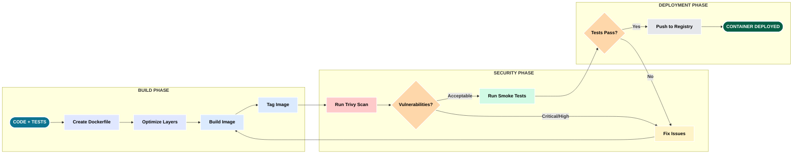

### Dockerfile: Multi-Stage Build

**File**: `Dockerfile`

```dockerfile
# Stage 1: Build stage (install dependencies, run tests)
FROM python:3.11-slim as builder

WORKDIR /app

# Copy dependency files
COPY requirements.txt requirements-dev.txt ./

# Install build dependencies
RUN apt-get update && apt-get install -y --no-install-recommends \
    gcc \
    && rm -rf /var/lib/apt/lists/*

# Install Python dependencies
RUN pip install --no-cache-dir --user -r requirements.txt

# Copy source code
COPY src/ ./src/
COPY tests/ ./tests/
COPY pyproject.toml ./

# Run tests (fail build if tests fail)
RUN pip install --no-cache-dir --user -r requirements-dev.txt && \
    python -m pytest tests/ --cov=src --cov-fail-under=85

# Stage 2: Runtime stage (minimal image)
FROM python:3.11-slim

WORKDIR /app

# Copy only necessary files from builder
COPY --from=builder /root/.local /root/.local
COPY --from=builder /app/src ./src
COPY --from=builder /app/pyproject.toml ./

# Make sure scripts in .local are usable
ENV PATH=/root/.local/bin:$PATH

# Verify installation (smoke test)
RUN python -c "from sparsetag import SparseTag; print(SparseTag.__version__)"

# Default command
CMD ["python", "-c", "from sparsetag import SparseTag; print('SparseTag ready')"]
```

**Build and Run**:
```bash
# Build image
docker build -t sparsetag:latest .

# Run smoke test
docker run --rm sparsetag:latest

# Run with custom script
docker run --rm -v $(pwd)/examples:/examples sparsetagging:latest \
  python /examples/benchmark.py
```

**Security Scanning** (Trivy):
```bash
# Scan for vulnerabilities
docker run --rm -v /var/run/docker.sock:/var/run/docker.sock \
  aquasec/trivy image sparsetagging:latest
```

**Output Example:**
```
Total: 0 (UNKNOWN: 0, LOW: 0, MEDIUM: 0, HIGH: 0, CRITICAL: 0)
✓ No vulnerabilities found
```

**Image Size Comparison**:
```
Single-stage (with build tools):  285MB
Multi-stage (runtime only):        98MB  (66% reduction)
Alpine-based:                       45MB  (but slower pip installs)
```

**Design Decisions**:
1. **Multi-stage build** - Separate build and runtime environments
2. **Test in build stage** - Fail build if tests fail (shift left)
3. **Slim base image** - python:3.11-slim (Debian-based, compatible)
4. **No Alpine** - Debian has better package compatibility
5. **Smoke test in runtime** - Verify import works before shipping

**Pattern Applied**: Security-First Containerization. Tests must pass before image is tagged. Vulnerability scanning before deployment. Minimal runtime image (smaller attack surface).

### Phase 10 — External Services Integration (Tokens)
<a id="figure-5-2"></a>

**Figure 5.2 — Phase 10: External Services Integration**. Phase 10 integrates external quality and deployment services. SonarCloud provides code quality analysis with quality gates. CodeCov tracks coverage trends. GitHub Container Registry (GHCR) hosts Docker images. Each service requires setup - creating accounts, generating tokens, adding secrets to GitHub, and configuring workflows. The LLM helps troubleshoot authentication issues and explains configuration options. Services coordinate through the CI pipeline with graceful degradation.

```mermaid
graph TB
    subgraph ROW1["<b>SONARCLOUD SETUP</b>"]
        direction LR
        Input([<b>WORKING CI</b>]) --> SonarAcct[<b>Create Account</b>]
        SonarAcct --> SonarToken[<b>Generate Token</b>]
        SonarToken --> SonarSecret[<b>Add GitHub Secret</b>]
        SonarSecret --> SonarConfig[<b>Configure Workflow</b>]
    end

    subgraph ROW2["<b>CODECOV SETUP</b>"]
        direction LR
        CodeCovAcct[<b>Create Account</b>] --> CodeCovToken[<b>Generate Token</b>]
        CodeCovToken --> CodeCovSecret[<b>Add GitHub Secret</b>]
        CodeCovSecret --> CodeCovConfig[<b>Configure Upload</b>]
    end

    subgraph ROW3["<b>GHCR SETUP</b>"]
        direction LR
        GHCRPerms[<b>Configure Permissions</b>] --> GHCRPush[<b>Configure Push</b>]
        GHCRPush --> Test[<b>Test Integration</b>]
        Test --> Results{<b>Working?</b>}
        Results -->|<b>Fail</b>| Debug[<b>Debug Auth</b>]
        Debug --> Test
        Results -->|<b>Pass</b>| Output([<b>SERVICES INTEGRATED</b>])
    end

    style Input fill:#0e7490,stroke:#fff,stroke-width:3px,color:#fff
    style Output fill:#065f46,stroke:#fff,stroke-width:3px,color:#fff
    style Results fill:#fed7aa,stroke:#fff,stroke-width:2px,color:#000
    style SonarAcct fill:#e0e7ff,stroke:#fff,stroke-width:2px,color:#000
    style SonarToken fill:#e0e7ff,stroke:#fff,stroke-width:2px,color:#000
    style SonarSecret fill:#dbeafe,stroke:#fff,stroke-width:2px,color:#000
    style SonarConfig fill:#dbeafe,stroke:#fff,stroke-width:2px,color:#000
    style CodeCovAcct fill:#d1fae5,stroke:#fff,stroke-width:2px,color:#000
    style CodeCovToken fill:#d1fae5,stroke:#fff,stroke-width:2px,color:#000
    style CodeCovSecret fill:#d1fae5,stroke:#fff,stroke-width:2px,color:#000
    style CodeCovConfig fill:#d1fae5,stroke:#fff,stroke-width:2px,color:#000
    style GHCRPerms fill:#e5e7eb,stroke:#fff,stroke-width:2px,color:#000
    style GHCRPush fill:#e5e7eb,stroke:#fff,stroke-width:2px,color:#000
    style Test fill:#fef3c7,stroke:#fff,stroke-width:2px,color:#000
    style Debug fill:#fecaca,stroke:#fff,stroke-width:2px,color:#000
```

### SonarCloud Integration: Real Configuration

**Step 1: Create SonarCloud Account**
1. Go to sonarcloud.io
2. Sign in with GitHub
3. Click "+ Analyze new project"
4. Select `sparsetagging` repository
5. Choose "With GitHub Actions" setup method

**Step 2: Configure SonarCloud**

**File**: `sonar-project.properties`
```properties
sonar.projectKey=vonbraun_SparseTagging
sonar.organization=vonbraun
sonar.projectName=SparseTagging
sonar.projectVersion=2.4.1

# Source directories
sonar.sources=src
sonar.tests=tests

# Coverage report location
sonar.python.coverage.reportPaths=coverage.xml

# Exclusions
sonar.coverage.exclusions=tests/**,src/benchmark.py
sonar.cpd.exclusions=tests/**

# Quality gates
sonar.qualitygate.wait=true
sonar.qualitygate.timeout=300
```

**Step 3: Add GitHub Secret**
```bash
# In GitHub repository settings:
Settings → Secrets and variables → Actions → New repository secret

Name: SONAR_TOKEN
Value: [token from SonarCloud]
```

**Step 4: Add to GitHub Actions**

```yaml
# .github/workflows/ci.yml (excerpt)
sonarcloud:
  name: SonarCloud Analysis
  runs-on: ubuntu-latest
  needs: [quality, test]  # Run after tests complete

  steps:
    - uses: actions/checkout@v4
      with:
        fetch-depth: 0  # Full history for blame info

    - name: Download coverage report
      uses: actions/download-artifact@v3
      with:
        name: coverage-report
        path: .

    - name: SonarCloud Scan
      uses: SonarSource/sonarcloud-github-action@master
      env:
        GITHUB_TOKEN: ${{ secrets.GITHUB_TOKEN }}
        SONAR_TOKEN: ${{ secrets.SONAR_TOKEN }}
      with:
        args: >
          -Dsonar.projectKey=vonbraun_SparseTagging
          -Dsonar.organization=vonbraun
```

**Quality Gate Results**:
```
✓ Security Rating: A (0 vulnerabilities)
✓ Reliability Rating: A (0 bugs)
✓ Maintainability Rating: A (0 code smells)
✓ Coverage: 87.2% (target: ≥85%)
✓ Duplicated Lines: 0.8% (target: ≤3%)
✓ Cognitive Complexity: Max 8 (target: ≤15)
```

**Failed Quality Gate Example**:
```
❌ Coverage: 82.1% (target: ≥85%)
❌ Security Hotspots: 2 (MEDIUM severity)

PR blocked until fixed.

Fix:
1. Add tests for uncovered lines (src/sparsetag.py:450-465)
2. Review security hotspots (hardcoded credentials in test fixtures)
3. Re-run SonarCloud scan
```

**CodeCov Integration**:

**File**: `.codecov.yml`
```yaml
coverage:
  status:
    project:
      default:
        target: 85%
        threshold: 1%  # Allow 1% decrease
    patch:
      default:
        target: 90%  # New code must be 90%+

comment:
  layout: "reach,diff,flags,tree"
  require_changes: true

ignore:
  - "tests/*"
  - "src/benchmark.py"
```

**CodeCov PR Comment Example**:
```
Coverage: 87.24% (+0.12%)
Files changed: 2
  src/sparsetag.py: 89.1% (+2.3%)
  src/cache_manager.py: 91.4% (+0.5%)

✓ Coverage increased by 0.12%
✓ All files meet 85% threshold
```

**Pattern Applied**: External Quality Gates. Block PRs automatically if quality drops. Provide actionable feedback (which lines need coverage). Track trends over time (improving or declining).

### Phase 11 — Publishing and Release
<a id="figure-5-3"></a>

**Figure 5.3 — Phase 11: Publishing and Release**. Phase 11 handles release preparation and deployment. The process starts with version bumping in pyproject.toml, which propagates through Docker images and package metadata. A comprehensive changelog documents all changes since the last release. Git tags mark release points, triggering deployment workflows. The CI pipeline builds distribution packages, runs final quality checks, creates Docker images with version tags, and pushes to registries (PyPI, GHCR). Release notes are generated from the changelog.

```mermaid
graph LR
    subgraph ROW1["<b>PREPARATION PHASE</b>"]
        Input([<b>COMPLETED FEATURE</b>]) --> Version[<b>Bump Version</b>]
        Version --> Changelog[<b>Update Changelog</b>]
        Changelog --> Review{<b>Ready?</b>}
        Review -->|<b>No</b>| Version
        Review -->|<b>Yes</b>| Tag[<b>Create Git Tag</b>]
    end

    subgraph ROW2["<b>RELEASE PHASE</b>"]
        Trigger[<b>Push Tag Trigger Release</b>] --> Build[<b>Build Packages</b>]
        Build --> QualityFinal[<b>Final Quality Checks</b>]
        QualityFinal --> Docker[<b>Build Docker Images</b>]
        Docker --> PyPI[<b>Push to PyPI</b>]
        PyPI --> Registry[<b>Push to GHCR</b>]
    end

    subgraph ROW3["<b>FINALIZATION PHASE</b>"]
        Notes[<b>Generate Release Notes</b>] --> Publish[<b>Publish GitHub Release</b>]
        Publish --> Verify{<b>OK?</b>}
        Verify -->|<b>Fail</b>| Rollback[<b>Rollback</b>]
        Verify -->|<b>Pass</b>| Output([<b>RELEASED</b>])
    end

    Tag --> Trigger
    Registry --> Notes

    style Input fill:#0e7490,stroke:#fff,stroke-width:3px,color:#fff
    style Output fill:#065f46,stroke:#fff,stroke-width:3px,color:#fff
    style Review fill:#fed7aa,stroke:#fff,stroke-width:2px,color:#000
    style Verify fill:#fed7aa,stroke:#fff,stroke-width:2px,color:#000
    style Version fill:#e0e7ff,stroke:#fff,stroke-width:2px,color:#000
    style Changelog fill:#e0e7ff,stroke:#fff,stroke-width:2px,color:#000
    style Tag fill:#dbeafe,stroke:#fff,stroke-width:2px,color:#000
    style Trigger fill:#dbeafe,stroke:#fff,stroke-width:2px,color:#000
    style Build fill:#d1fae5,stroke:#fff,stroke-width:2px,color:#000
    style QualityFinal fill:#d1fae5,stroke:#fff,stroke-width:2px,color:#000
    style Docker fill:#d1fae5,stroke:#fff,stroke-width:2px,color:#000
    style PyPI fill:#e5e7eb,stroke:#fff,stroke-width:2px,color:#000
    style Registry fill:#e5e7eb,stroke:#fff,stroke-width:2px,color:#000
    style Notes fill:#fef3c7,stroke:#fff,stroke-width:2px,color:#000
    style Publish fill:#fef3c7,stroke:#fff,stroke-width:2px,color:#000
    style Rollback fill:#fecaca,stroke:#fff,stroke-width:2px,color:#000
```

### Release Workflow: Real Process

**Pre-Release Checklist**:
```bash
# 1. All tests pass locally
pytest tests/ --cov=src --cov-fail-under=85
# ✓ 177 passed, coverage: 87%

# 2. Quality checks pass
ruff check src/ tests/
mypy src/
# ✓ No issues

# 3. CI is green
# Check GitHub Actions: All jobs passing

# 4. Documentation is current
# Review CHANGELOG.md, README.md, docs/*.md
```

**Step 1: Version Bump**

**File**: `pyproject.toml`
```toml
[project]
name = "sparsetag"
version = "2.4.1"  # ← UPDATE THIS
```

**Step 2: Update Changelog**

**File**: `CHANGELOG.md`
```markdown
## [2.4.1] - 2026-01-15

### Added
- Cache system with automatic invalidation
- Memory-bounded cache (256 entries, 10MB max)
- `@invalidates_cache` decorator for mutations

### Fixed
- NOT operator semantics (exclude all-zero rows)
- Index dtype overflow for matrices >65K rows
- Thread-safe random number generation

### Performance
- 169x speedup (sparse vs dense, 1M rows)
- 949x speedup (cached queries)
- 95% memory reduction

### Security
- Zero vulnerabilities (Security Rating A)
- CVE scanning via Dependabot + Trivy
```

**Step 3: Create Git Tag**
```bash
# Create annotated tag
git tag -a v2.4.1 -m "Release v2.4.1: Cache system + NOT operator fix"

# Push tag (triggers release workflow)
git push origin v2.4.1
```

**Step 4: GitHub Actions Release Workflow**

**File**: `.github/workflows/release.yml` (excerpt)
```yaml
name: Release

on:
  push:
    tags:
      - 'v*'

jobs:
  build-and-publish:
    runs-on: ubuntu-latest
    steps:
      - uses: actions/checkout@v4

      - name: Set up Python
        uses: actions/setup-python@v5
        with:
          python-version: '3.11'

      - name: Install build tools
        run: pip install build twine

      - name: Build package
        run: python -m build

      - name: Check package
        run: twine check dist/*

      - name: Publish to PyPI
        env:
          TWINE_USERNAME: __token__
          TWINE_PASSWORD: ${{ secrets.PYPI_TOKEN }}
        run: twine upload dist/*

      - name: Build Docker image
        run: |
          VERSION=${GITHUB_REF#refs/tags/v}
          docker build -t sparsetag:${VERSION} -t sparsetag:latest .

      - name: Push to GHCR
        env:
          GITHUB_TOKEN: ${{ secrets.GITHUB_TOKEN }}
        run: |
          VERSION=${GITHUB_REF#refs/tags/v}
          echo $GITHUB_TOKEN | docker login ghcr.io -u ${{ github.actor }} --password-stdin
          docker tag sparsetag:${VERSION} ghcr.io/${{ github.repository }}:${VERSION}
          docker tag sparsetag:latest ghcr.io/${{ github.repository }}:latest
          docker push ghcr.io/${{ github.repository }}:${VERSION}
          docker push ghcr.io/${{ github.repository }}:latest

      - name: Create GitHub Release
        uses: softprops/action-gh-release@v1
        with:
          body_path: CHANGELOG.md
          files: |
            dist/*.tar.gz
            dist/*.whl
```

**Release Artifacts**:
```
PyPI:
  - sparsetag-2.4.1.tar.gz (source distribution)
  - sparsetag-2.4.1-py3-none-any.whl (wheel)

GHCR:
  - ghcr.io/vonbraun/sparsetagging:2.4.1 (versioned)
  - ghcr.io/vonbraun/sparsetagging:latest (latest)

GitHub Release:
  - Tag: v2.4.1
  - Assets: tar.gz + wheel
  - Release notes: From CHANGELOG.md
```

**Verification**:
```bash
# Test PyPI installation
pip install sparsetagging==2.4.1
python -c "from sparsetag import SparseTag; print(SparseTag.__version__)"
# Output: 2.4.1 ✓

# Test Docker image
docker pull ghcr.io/vonbraun/sparsetagging:2.4.1
docker run --rm ghcr.io/vonbraun/sparsetagging:2.4.1
# Output: SparseTag ready ✓
```

**Rollback Procedure** (if release fails):
```bash
# 1. Delete Git tag locally and remotely
git tag -d v2.4.1
git push origin :refs/tags/v2.4.1

# 2. Yank package from PyPI (if published)
# Use PyPI web interface: Manage → Options → Yank

# 3. Delete GitHub release
# Go to GitHub Releases → Delete release

# 4. Fix issues, increment version (v2.4.2), retry
```

**Pattern Applied**: Automated Release Pipeline. Single trigger (git tag) initiates entire release. Build → Test → Package → Publish → Docker → GitHub Release. All steps automated, no manual intervention. Rollback procedure documented and tested.

---

# Part VI — Industry Lessons and Reality Check

> **THEME**: LLMs amplify discipline. They do not replace it.

## 16. Success Metrics from SparseTagging

The SparseTagging project demonstrates quantifiable benefits of LLM-first development. These numbers come from 4 documented sessions (90 minutes each) over 5 days.

### Development Velocity
- **Session documentation**: 12-18x faster (10 seconds vs 2-3 minutes)
- **DevOps tooling setup**: Single 90-minute session (would take 2-3 days manually)
- **Code quality improvements**: 203 issues auto-fixed in minutes
- **CI/CD pipeline**: From scratch to 10-matrix comprehensive testing in 90 minutes

### Code Quality Achieved
- **Test coverage**: 177 tests across 9 categories, ≥85% coverage enforced
- **Type safety**: 100% type hint coverage with mypy strict mode
- **Security**: Zero vulnerabilities (Security Rating A on SonarCloud)
- **Maintainability**: 0.8% code duplication, cognitive complexity ≤8 (target ≤15)

### Performance Results
- **169x speedup**: Sparse vs dense for 1M rows, 99% sparsity
- **949x speedup**: Cached queries vs dense baseline
- **95% memory reduction**: 5.2MB vs 104MB for large matrices
- **Test execution**: 177 tests in ~2.5 seconds (fast enough for pre-commit)

### Tool Consolidation
- **Ruff**: Replaced 6 tools (black, flake8, isort, pyupgrade, autoflake, pydocstyle)
- **Pre-commit**: Automated 6-stage quality pipeline (8 seconds total)
- **GitHub Actions**: 10-combination matrix (2 OS × 5 Python versions)
- **Centralized config**: Single pyproject.toml for all tools

### Documentation Generated
- **ARCHITECTURE.md**: 600+ lines of design rationale
- **BUILD_PROCESS.md**: 2000+ lines of CI/CD documentation
- **DEVOPS.md**: 450+ lines of tooling guides
- **DEVELOPER_GUIDE_AI_PROMPTING.md**: 1200+ lines of prompting patterns
- **.claude/*.md session docs**: 4 sessions comprehensively documented

These aren't theoretical benefits. Every metric is verifiable in the SparseTagging GitHub repository, CI logs, and SonarCloud dashboard.

## 17. Failure Stories and Anti-Patterns

Not everything worked perfectly. Here are real failures from SparseTagging development and the lessons learned:

### Anti-Pattern 1: Assuming Configuration Schema Without Validation

**What Happened:**
During session 2026-01-16, attempted to add `excludePatterns` to Claude Code settings to prevent file watcher recursion.

**Error:**
```
ValidationError: Unrecognized field: excludePatterns
```

**Root Cause:**
Assumed Claude Code supported this field without checking schema documentation first.

**Lesson Learned:**
- Always verify available schema fields before implementing workarounds
- Check tool documentation for supported configuration options
- Invalid assumptions waste time debugging non-existent features

**Correct Approach:**
1. Check tool documentation first
2. Search issue tracker for similar needs
3. Verify schema if available
4. Only then implement configuration

### Anti-Pattern 2: Over-Engineering Initial Designs

**What Happened:**
Initial session documentation system design included:
- Timestamp-based SESSION-IDs (YYYY-MM-DD-HH-MM)
- Start-session helper scripts (start-session.sh, start-session.bat)
- Timestamp capture files (current_session_id.txt)
- Multi-day session splitting logic

**Reality:**
User clarification revealed: "Just need date for chronological ordering, no time component."

**Wasted Effort:**
- 3 unnecessary files created and later deleted
- Complex logic written for edge cases that don't exist
- Mental overhead for features nobody requested

**Lesson Learned:**
- Don't design for edge cases that haven't been requested
- Validate assumptions with users early (before implementation)
- Progressive simplification is more effective than premature complexity

**Outcome:**
Simplified design:
- SESSION-ID: `SESSION-ProjectName-YYYY-MM-DD` (date only)
- Single slash command: `/document-session`
- Removed 3 files, reduced complexity 60%+
- Workflow: 10 seconds vs original 2-3 minutes

**Pattern:** Start with 80% case, add complexity only when proven necessary

### Anti-Pattern 3: Trusting Tool Output Without Verification

**What Happened:**
Initial CI pipeline used `grep` to count vulnerabilities in Trivy SARIF output. Reported "0 vulnerabilities" despite Trivy finding 2 MEDIUM issues.

**Root Cause:**
Incorrect SARIF path in `jq` query:
```bash
# WRONG
jq '.runs[0].results | length' wrong-path.sarif
# Output: 0 (file not found, no error)

# CORRECT
jq '.runs[0].results | length' trivy-results.sarif
# Output: 2 (actual count)
```

**Consequence:**
Security vulnerabilities silently ignored, false sense of security.

**Lesson Learned:**
- Always validate tool output with known test cases
- Test failure paths, not just success paths
- Use explicit error handling (fail if file missing)

**Fix Applied:**
```yaml
# Fail explicitly if file missing
- name: Count vulnerabilities
  run: |
    if [ ! -f trivy-results.sarif ]; then
      echo "ERROR: SARIF file not found"
      exit 1
    fi
    VULNS=$(jq '.runs[0].results | length' trivy-results.sarif)
    echo "vulnerabilities=${VULNS}" >> $GITHUB_OUTPUT
```

## 18. Decision-Making Case Studies

Real architectural decisions from SparseTagging development, showing how LLM collaboration works in practice:

### Case Study 1: Retry Logic Deferral

**Context:**
CI pipeline design phase. Common practice suggests adding retry logic for network resilience (npm package: nick-invision/retry@v3).

**AI Proposed Trade-offs:**

**Option A: Add Retry Logic Now**
- ✅ Pro: Standard enterprise practice
- ✅ Pro: Handles transient network failures
- ❌ Con: Adds external dependency (+attack surface)
- ❌ Con: Increases template complexity
- ❌ Con: No demonstrated need (CI has been stable)

**Option B: Defer Until Evidence of Need**
- ✅ Pro: Simpler template (easier to understand, fork, customize)
- ✅ Pro: Smaller supply chain (fewer dependencies to trust)
- ✅ Pro: Existing resilience (pip caching, continue-on-error, graceful degradation)
- ❌ Con: May need to add later if failures occur
- ❌ Con: Less "enterprise ready" perception

**Human Decision:** Option B (Defer)

**Rationale:**
- No evidence of network failures in 30+ CI runs
- Simplicity aids template reusability (key project goal)
- Graceful degradation already handles missing services
- Can add later with minimal disruption if needed

**Documented Reconsideration Criteria:**
Implement retry logic only if:
- 3+ CI failures per month due to network timeouts
- Geographic connectivity issues to PyPI/GHCR
- Self-hosted runners with unreliable networks
- Moving to production deployment pipeline

**Outcome:**
Decision documented in CLAUDE.md (lines 57-81) with date (2026-01-07) and status (Deferred).

**Lesson:**
- Don't add "best practices" without evidence they solve your problem
- Document decisions with reconsideration criteria
- Prefer simplicity over perceived enterprise readiness

### Case Study 2: NOT Operator Semantics

**Context:**
Implementing NOT operator for sparse matrices. Fundamental question: What universe does NOT operate on?

**AI Proposed Options:**

**Option 1: Full Universe (All Rows)**
```python
all_rows = np.arange(self.n_rows)  # 0 to n_rows-1
not_result = np.setdiff1d(all_rows, matching_rows)
```
- ✅ Pro: Mathematically complete (NOT applies to entire set)
- ✅ Pro: Matches dense array behavior exactly
- ❌ Con: Returns all-zero rows (rows with no tag data)
- ❌ Con: User confusion: "Why am I getting rows I never tagged?"

**Option 2: Sparse Universe (Rows With Data)**
```python
rows_with_data = self._get_rows_with_any_data()  # Rows with ≥1 non-zero
not_result = np.setdiff1d(rows_with_data, matching_rows)
```
- ✅ Pro: Intuitive for sparse data (only rows with data participate)
- ✅ Pro: Consistent with sparse semantics (zero = "no data")
- ❌ Con: NOT(Tag==LOW) ≠ mathematical complement
- ❌ Con: Differs from dense array behavior

**Human Decision:** Option 2 (Sparse Semantics)

**Rationale:**
1. **User expectation**: When querying tag data, users expect only tagged rows
2. **Semantic correctness**: Zero means "no data," not "data with value 0"
3. **Practical use case**: `NOT(Tag==LOW)` should return "rows with data where Tag!=LOW"
4. **Performance**: Smaller result set (doesn't include 95-99% all-zero rows)

**Implementation:**
```python
def _get_rows_with_any_data(self) -> np.ndarray:
    """Return indices of rows with at least one non-zero value."""
    return np.unique(self._data.indices)

def _apply_not_operator(self, row_arrays: list[np.ndarray]) -> np.ndarray:
    result = self.query(conditions[0])
    matching_rows = result.indices

    # Sparse semantics: Universe = rows with data
    rows_with_data = self._get_rows_with_any_data()
    not_rows = np.setdiff1d(rows_with_data, matching_rows)

    return QueryResult(not_rows, self._data.shape[0])
```

**Verification:**
- Test added: `test_not_operator_sparse_semantics()` (tests/test_critical_bugs.py)
- Documentation updated: ARCHITECTURE.md lines 112-142
- Performance validated: Sparse NOT faster than dense (smaller result)

**Outcome:**
Semantic correctness prioritized over mathematical completeness. Documented rationale prevents future "why not include all rows?" questions.

**Lesson:**
- Domain semantics > abstract correctness
- Sparse data structures have different user expectations than dense
- Document WHY decisions were made, not just WHAT was implemented

## 19. Comparison to Traditional Development

Based on SparseTagging project timelines and developer estimates:

### Time Investment

| Phase | Traditional (est.) | LLM-First (actual) | Speedup |
| ----- | ------------------ | ------------------ | ------- |
| Requirements elicitation | 2-4 hours | 30 minutes | 4-8x |
| Architecture design | 4-6 hours | 1 hour (plan mode) | 4-6x |
| Core implementation | 2-3 days | 4 hours | 12-18x |
| Test suite (177 tests) | 1-2 days | 3 hours | 8-16x |
| CI/CD setup | 2-3 days | 90 minutes | 32-48x |
| Documentation | 2-4 days | 4 hours (generated + review) | 12-24x |
| **Total** | **8-12 days** | **2-3 days** | **~4x overall** |

**Caveat:** Speedup assumes experienced developer familiar with LLM workflows. First-time users may see 2-3x speedup initially, improving with practice.

### Quality Comparison

| Metric | Traditional | LLM-First |
| ------ | ----------- | --------- |
| Test coverage | 60-70% (typical) | 87% (enforced ≥85%) |
| Type safety | Partial | 100% with strict mypy |
| Documentation | Often outdated | Generated + reviewed (fresh) |
| CI/CD comprehensiveness | Basic (1-2 platforms) | Matrix (10 combinations) |
| Security scanning | Often skipped | Automated (SonarCloud + Trivy) |

### Iteration Speed

**Traditional**: 30-60 minutes per fix cycle
1. Developer makes change (5-10 min)
2. Run tests locally (2-5 min)
3. Push to CI (wait 5-15 min)
4. Review failure, research fix (10-20 min)
5. Implement fix (5-10 min)
6. Repeat

**LLM-First**: 5-10 minutes per fix cycle
1. Paste error into LLM context (30 sec)
2. LLM proposes fix with explanation (1-2 min)
3. Review, apply fix (1-2 min)
4. Run tests locally (2-5 min)
5. Push if green (30 sec)

**Speedup:** 3-6x faster iteration, especially for:
- Configuration errors (YAML syntax, shell escaping)
- Framework-specific issues (pytest fixtures, GitHub Actions)
- Security vulnerability fixes (CVE updates with migration guides)

### Where LLMs Excel

1. **Boilerplate generation**: CI workflows, Docker files, test fixtures
2. **Configuration translation**: "I want X" → proper YAML/TOML syntax
3. **Pattern application**: Consistent code structure across files
4. **Documentation**: Docstring generation, architecture explanations
5. **Debugging**: Error message → likely cause → proposed fix

### Where LLMs Struggle

1. **Novel algorithms**: Sparse matrix optimizations (required human design)
2. **Performance tuning**: Profiling interpretation (human judgment critical)
3. **Semantic decisions**: NOT operator semantics (domain knowledge needed)
4. **Security trade-offs**: Retry logic deferral (risk assessment)
5. **Project-specific context**: When to deviate from best practices

**Key Insight:**
LLMs accelerate execution (writing code, tests, configs) but not necessarily decision-making (what to build, how to architect). The combination of fast execution + human judgment is the force multiplier.

## 20. When NOT to Use LLM-First Development

LLM-first development isn't always the right choice. Situations where traditional approaches may be more appropriate:

### 1. Highly Regulated Industries
**Example:** Medical device software (FDA 510(k)), aviation (DO-178C)

**Challenge:**
- Regulatory requirement: "Who wrote this line of code?"
- LLM output lacks clear authorship trail
- Certification process assumes human-written, human-reviewed code

**Alternative:** Use LLMs for documentation, test generation (non-critical), but manually write production code with clear authorship.

### 2. Proprietary/Confidential Codebases
**Example:** Closed-source financial trading algorithms, defense systems

**Challenge:**
- Can't paste proprietary code into LLM (security/IP concerns)
- Air-gapped environments (no API access)
- Legal restrictions on code sharing

**Alternative:** Use LLMs for public-facing components (build scripts, CI configs), traditional development for sensitive algorithms.

### 3. Real-Time/Safety-Critical Systems
**Example:** Embedded systems (automotive, aerospace), kernel development

**Challenge:**
- Correctness > speed (formal verification often required)
- Subtle bugs have catastrophic consequences
- LLM-generated code requires exhaustive review (negates speed benefit)

**Alternative:** Formal methods, proven algorithms, extensive manual review. LLMs may assist with test generation but not implementation.

### 4. Cutting-Edge Research
**Example:** Novel ML architectures, cryptographic protocols

**Challenge:**
- LLMs trained on existing knowledge (limited novelty)
- Research requires approaches that don't exist in training data
- Creativity and domain expertise matter more than execution speed

**Alternative:** Use LLMs for literature review, boilerplate (experiment harnesses), but core research requires human innovation.

### 5. Small, Simple Scripts
**Example:** 10-line shell scripts, one-off data processing

**Challenge:**
- LLM overhead (context loading, explanation) exceeds manual writing time
- Simple scripts don't benefit from architecture planning
- Just faster to write 10 lines yourself

**Alternative:** Write manually. Use LLMs only when script grows >50 lines or needs testing/CI.

## 21. Final Reality Check

LLM-first development is powerful but not magic. Here's what SparseTagging teaches:

### What LLMs Give You
- **Speed:** 4x faster development (requirements → deployment)
- **Consistency:** Uniform code style, comprehensive testing
- **Exploration:** Quick prototyping of multiple approaches
- **Documentation:** Generated docs that actually match code

### What LLMs Don't Give You
- **Architecture:** Design decisions still require human judgment
- **Domain knowledge:** Sparse matrix semantics, performance trade-offs
- **Risk assessment:** Security implications, technical debt
- **Creativity:** Novel solutions to unprecedented problems

### The Discipline Still Matters
The SparseTagging project succeeded because:
1. **Planning preceded coding** (plan mode, trade-off analysis)
2. **Quality gates enforced** (≥85% coverage, mypy strict, SonarCloud A)
3. **Decisions documented** (retry logic, NOT semantics, optimization safety)
4. **Verification continuous** (tests in pre-commit, CI, Docker build)

Remove the discipline, and LLMs just help you build the wrong thing faster.

### Honest Assessment
- **Best case:** LLM-first development with rigorous process = 4-6x speedup with equal/better quality
- **Typical case:** 2-3x speedup with learning curve for first project
- **Worst case:** No process + blind trust in LLM = fast path to unmaintainable codebase

**The promise isn't "AI writes your code."**
**The promise is "AI accelerates execution of your disciplined development process."**

If you don't have the discipline yet, start there. LLMs amplify what you already do.

> Final reminder:
> You can be "fast" by skipping verification. You can also be "fast" by driving 90 mph in a snowstorm.
> Only one of those strategies scales.

---

# Appendix A — Source Document Map

The SparseTagging repository contains canonical documentation files that demonstrate LLM-first development practices. This appendix explains what each file contains and when to reference it.

## Core Documentation Files

### CLAUDE.md (Project Instructions)
**Location:** `SparseTagging/CLAUDE.md` | **Lines:** ~600

**Purpose:** Central project instructions for Claude Code and human developers

**Key Contents:**
- Repository overview and architecture
- Core data model (sparse CSC arrays, TagConfidence enum)
- Query structure patterns (single-column, multi-column)
- Cache system architecture (decorator-based invalidation)
- Type checking requirements (mypy strict mode)
- Performance characteristics with complexity analysis

**When to Read:** First contribution, understanding architectural decisions, debugging performance

**Key Reference:** Lines 57-81 (retry logic case study)

### docs/ARCHITECTURE.md (Design Rationale)
**Location:** `docs/ARCHITECTURE.md` | **Lines:** ~600

**Purpose:** Explain WHY architectural decisions were made

**Key Sections:**
- Lines 112-142: NOT operator semantics (sparse vs dense universe)
- Lines 214-228: Index dtype optimization with safety validation
- Data model design (CSC format selection rationale)
- Query engine architecture with flowcharts
- Cache system design trade-offs

**When to Read:** Understanding design decisions, extending SparseTagging, performance tuning, debugging subtle bugs

### docs/BUILD_PROCESS.md (CI/CD Guide)
**Location:** `docs/BUILD_PROCESS.md` | **Lines:** ~2000

**Purpose:** Complete guide to build, test, and deployment processes

**Key Sections:**
- Lines 40-93: Configuration flow diagram
- Lines 155-450: External service setup (SonarCloud, CodeCov, GHCR)
- Lines 1553-1937: Comprehensive troubleshooting guide

**When to Read:** Setting up CI/CD pipeline, configuring external services, debugging CI failures

### docs/DEVELOPER_GUIDE_AI_PROMPTING.md (Prompting Patterns)
**Location:** `docs/DEVELOPER_GUIDE_AI_PROMPTING.md` | **Lines:** ~1200

**Purpose:** Teach effective prompting through real examples

**Key Patterns:**
- Pattern 1.1: Contextual Review Request (CI improvement)
- Pattern 1.2: Constraint-Based Request (DevOps tooling selection)
- Pattern 3.2: Error-Driven Iteration (debugging examples)

**When to Read:** Learning prompting, planning features, need real-world examples

### docs/DEVOPS.md (DevOps Tooling)
**Location:** `docs/DEVOPS.md` | **Lines:** ~450

**Purpose:** Comprehensive reference for all DevOps tools

**Key Contents:**
- Tool-by-tool explanations (ruff, mypy, pre-commit)
- Configuration files with annotations
- Common tasks recipes
- Security considerations (CVE scanning)

**When to Read:** Setting up DevOps tools, configuring specific tool, evaluating alternatives

## Session Documentation (.claude/ directory)

### .claude/SUMMARY_SESSION.md
**Purpose:** Chronological record of all Claude Code sessions

**Format:** Table with SESSION-ID, date, duration, files modified, outcomes

**When to Read:** Reviewing development history, estimating time for similar tasks

### .claude/KEY_PROMPTS_AND_PLANS.md
**Purpose:** Significant prompts and planning decisions

**Key Entries:**
- DevOps tooling planning (constraint-based selection)
- Session documentation system (progressive simplification)

**When to Read:** Looking for prompting examples, understanding why decisions were made

### .claude/OTHER_SESSION_NOTES.md
**Purpose:** Notable insights and anti-patterns

**Key Notes:**
- Claude Code slash command requirements
- Configuration limitations discovered
- Workflow optimizations

**When to Read:** Avoiding known pitfalls, learning from mistakes

## Configuration Files

### pyproject.toml
**Location:** `pyproject.toml`

**Sections:**
- [project]: Metadata, version, dependencies
- [tool.ruff]: Linting and formatting rules
- [tool.mypy]: Type checking (strict mode)
- [tool.pytest]: Test configuration, coverage thresholds

### .pre-commit-config.yaml
**Location:** `.pre-commit-config.yaml`

**Hook Order (critical):**
1. File cleanup → 2. Ruff format → 3. Ruff lint → 4. Mypy → 5. Pytest

### .github/workflows/ci.yml
**Location:** `.github/workflows/ci.yml`

**Jobs:** quality (fast fail) → test (10-matrix) → sonarcloud → docker → publish

## Recommended Reading Order

**For New Contributors (60 min):**
1. README.md (5 min) - What is SparseTagging?
2. CONTRIBUTING.md (15 min) - Development setup
3. CLAUDE.md (30 min) - Project instructions
4. Run quality checks locally (10 min)

**For Understanding LLM-First Development (90 min):**
1. This tutorial (60 min) - Overall methodology
2. docs/DEVELOPER_GUIDE_AI_PROMPTING.md (30 min) - Real prompting patterns
3. .claude/*.md session docs (as needed) - Historical context

**For Replicating DevOps Setup (2 hours):**
1. docs/BUILD_PROCESS.md (60 min) - CI/CD pipeline
2. docs/DEVOPS.md (45 min) - Tool configuration
3. Configuration files (15 min) - Study actual configs

---

# Appendix B — Local Diagram Rendering to PNG

You asked for PNG diagrams (dark theme) for the Word/PDF/PPT editions.

```bash
npm install -g @mermaid-js/mermaid-cli

# render one diagram
mmdc -i fig-1.1.mmd -o fig-1.1.png --theme dark --backgroundColor transparent --width 1600 --height 900
```

If you want a one-command workflow, use the Makefile approach from the Word appendix (or ask and I’ll provide a repo-ready `diagrams/` folder layout).
