# Tutorial Diagrams - LLM-First Development (Slide-Optimized)

## Overview

This document contains slide-optimized versions of the tutorial diagrams, formatted for standard 8x10 PPT 4:3 layout with:
- **Minimum font size**: 14pt bold (16pt+ preferred)
- **Layout**: 4:3 aspect ratio, horizontal/landscape orientation
- **Color palette**: Academic/Technical (neutral tones with accent colors)
- **Text**: Always bold; white text on dark backgrounds, black text on light backgrounds
- **Borders**: White outlines for visibility on dark backgrounds

## Color Palette

- **Primary Actions**: Dark Blue/Cyan (#0e7490) - **WHITE BOLD TEXT**
- **Success/Complete**: Dark Green (#065f46) - **WHITE BOLD TEXT**
- **Decisions**: Muted Orange (#b45309) - **WHITE BOLD TEXT**
- **Light Backgrounds**: Pastels - **BLACK BOLD TEXT**
- **Borders**: White (2-3px) for shape outlines

## Table of Contents

### Master/Big Picture
1. [Complete Development Lifecycle](#1-complete-development-lifecycle)
2. [Tool Ecosystem Map](#2-tool-ecosystem-map)
3. [LLM Plan-Execute-Refine Loop](#3-llm-plan-execute-refine-loop)

---

## Master/Big Picture

### 1. Complete Development Lifecycle

**Summary**: This diagram shows the complete 12-phase development lifecycle organized in four horizontal rows stacked vertically for optimal 4:3 slide format. The flow progresses from top-to-bottom and left-to-right within each row. The first section covers concept through core development, the second handles testing through CI/CD, the third covers quality tools through documentation, and the fourth completes with Docker build, deployment, and publishing. Each phase includes quality gates (decision points) that determine whether work proceeds or requires refinement.

The lifecycle follows logical progression but shows the reality of development: failed tests trigger refactoring, security issues force architectural changes, and documentation gaps reveal requirements ambiguities. Feedback loops connect upward to earlier phases when quality gates fail, routing around intermediate sections. This represents the rigorous, quality-focused approach where LLM assistance accelerates iteration speed without compromising standards.

**Purpose**: Provide 10,000-foot view of entire development process with quality checkpoints.

**Usage**: Tutorial introduction to show complete journey from idea to published package.


---

### 2. Tool Ecosystem Map

**Summary**: This diagram maps the complete tool ecosystem organized by functional layers, showing how tools interconnect through data flows and API integrations. The foundation layer contains development tools (Claude Code, ChatGPT) that interact with version control (Git/GitHub). The quality layer shows how code flows through pre-commit hooks (Ruff, Mypy) before reaching CI/CD, which then coordinates with external scanning services (SonarCloud, CodeCov, Trivy). The deployment layer shows the build-publish pipeline from Docker to GHCR, with security validation at each step.

The diagram emphasizes data flow and interdependencies: test results flow to CodeCov, code flows to SonarCloud, vulnerabilities flow from Trivy to PR checks. This helps developers understand which tools to configure first and how changes propagate through the system.

**Purpose**: Show interconnected tool landscape organized by functional layers and data flows.

**Usage**: Architecture overview to understand tool selection, configuration order, and integration points.


---

### 3. LLM Plan-Execute-Refine Loop

**Summary**: This diagram captures the iterative cycle at the heart of LLM-first development: detailed planning before execution, rigorous validation after execution, and learning-driven refinement. Unlike traditional "code first, fix later" approaches, this workflow emphasizes upfront planning where the LLM explores the codebase, reviews existing patterns, and proposes architecture before writing any code. The execution phase involves TDD cycles with continuous testing, and validation checks code quality, test coverage, and security standards.

The refinement loop is critical: failed validation triggers analysis and learning rather than abandonment. The LLM examines what went wrong and refines the implementation. This cycle repeats until all quality gates pass. LLM speed makes multiple iterations practical - what would take hours manually takes minutes with AI assistance.

**Purpose**: Show iterative planning-execution-validation cycle with learning feedback loops.

**Usage**: Core methodology section explaining how LLM assistance enables rigorous iterative development.


---


## Phase-Specific Flows

### 4. Phase 0: Concept to Requirements

**Summary**: Phase 0 begins with a user need or business problem. The developer engages with the LLM to clarify the concept through dialogue, asking questions about scope, constraints, users, and success criteria. The LLM helps refine vague ideas into specific requirements by prompting for missing information and identifying edge cases. Once requirements are clear, they are documented in a structured format. This phase emphasizes thorough upfront thinking to avoid rework later.

**Purpose**: Transform vague concepts into clear, documented requirements through LLM-assisted dialogue.

**Usage**: Phase 0 chapter - teaches readers how to use LLMs to clarify requirements before writing code.


---

### 5. Phase 1: Feature Specification

**Summary**: With requirements in hand, Phase 1 creates a detailed feature specification. The developer provides the requirements document as context to the LLM along with relevant codebase information. The LLM analyzes existing code to understand conventions and proposes how the feature should integrate. Together they define the feature interface, data structures, and integration points with usage examples.

**Purpose**: Create detailed feature specification with usage examples and integration points.

**Usage**: Phase 1 chapter - shows how to leverage LLM knowledge of codebase to create consistent designs.


---

### 6. Phase 2: Planning & Design

**Summary**: Phase 2 is the detailed technical planning phase. The LLM enters plan mode to explore the codebase thoroughly, understanding existing architecture, dependencies, and potential conflicts. Based on this exploration, the LLM proposes an architectural approach. The developer and LLM discuss trade-offs between different approaches. Once an approach is selected, they break it into implementation tasks, identify files to modify, plan test strategy, and identify risks.

**Purpose**: Create detailed technical implementation plan through LLM-assisted architecture exploration.

**Usage**: Phase 2 chapter - demonstrates the critical planning phase that determines implementation success.


---

### 7. Phase 3: Implementation (TDD Cycle)

**Summary**: Phase 3 is where code gets written using test-driven development. The cycle starts by writing a failing test for the next small piece of functionality (Red). The LLM writes minimal code to make the test pass (Green). Then the code is refactored for quality while keeping tests passing (Refactor). This red-green-refactor cycle repeats for each piece of functionality. Quality checks (Ruff, Mypy) run continuously. When all functionality is complete and all tests pass, Phase 3 is done.

**Purpose**: Show test-driven development cycle with LLM writing tests and implementation code.

**Usage**: Phase 3 chapter - demonstrates rigorous TDD approach with immediate quality feedback.


---

### 8. Phase 4: Integration Testing

**Summary**: Phase 4 verifies that components work together correctly. Unit tests from Phase 3 tested individual functions in isolation. Integration tests verify workflows across multiple components, database interactions, API calls, and file I/O. The LLM helps write integration test scenarios based on user workflows. Failed integration tests often reveal interface mismatches or incorrect assumptions. The LLM assists in debugging by analyzing test failures and proposing fixes.

**Purpose**: Validate cross-component interactions and end-to-end workflows.

**Usage**: Phase 4 chapter - shows how to design and debug integration tests with LLM assistance.

```mermaid
graph LR
    Start([<b>IMPLEMENTATION<br/>COMPLETE</b>]) --> Identify[<b>Identify Integration<br/>Scenarios</b>]
    Identify --> WriteTests[<b>Write Integration<br/>Tests</b>]
    WriteTests --> RunTests[<b>Run Integration<br/>Tests</b>]
    RunTests --> Results{<b>All Pass?</b>}
    Results -->|<b>No</b>| Analyze[<b>LLM: Analyze<br/>Failures</b>]
    Analyze --> Debug[<b>Debug Integration<br/>Issues</b>]
    Debug --> Fix[<b>Fix Code/Tests</b>]
    Fix --> RunTests
    Results -->|<b>Yes</b>| Coverage[<b>Check Coverage</b>]
    Coverage --> CovGate{<b>Coverage<br/>≥85%?</b>}
    CovGate -->|<b>No</b>| Identify
    CovGate -->|<b>Yes</b>| Complete([<b>INTEGRATION<br/>VERIFIED</b>])

    style Start fill:#0e7490,stroke:#fff,stroke-width:3px,color:#fff
    style Complete fill:#065f46,stroke:#fff,stroke-width:3px,color:#fff
    style Results fill:#fed7aa,stroke:#fff,stroke-width:2px,color:#000
    style CovGate fill:#fed7aa,stroke:#fff,stroke-width:2px,color:#000
    style Identify fill:#e0e7ff,stroke:#fff,stroke-width:2px,color:#000
    style WriteTests fill:#dbeafe,stroke:#fff,stroke-width:2px,color:#000
    style RunTests fill:#dbeafe,stroke:#fff,stroke-width:2px,color:#000
    style Analyze fill:#fef3c7,stroke:#fff,stroke-width:2px,color:#000
    style Debug fill:#fef3c7,stroke:#fff,stroke-width:2px,color:#000
    style Fix fill:#fef3c7,stroke:#fff,stroke-width:2px,color:#000
    style Coverage fill:#d1fae5,stroke:#fff,stroke-width:2px,color:#000
```



---

### 9. Phase 5: CI/CD Setup

**Summary**: Phase 5 establishes continuous integration and deployment pipelines. The developer and LLM configure GitHub Actions workflows to run on every commit and PR. The pipeline includes multiple stages: install dependencies, run linters (Ruff), run type checking (Mypy), run all tests with coverage, build artifacts, and run security scans. Each stage has pass/fail gates. The LLM helps troubleshoot pipeline failures and optimize workflow performance. The result is automated quality enforcement on every code change.

**Purpose**: Establish automated testing, quality checks, and deployment pipelines.

**Usage**: Phase 5 chapter - demonstrates setting up robust CI/CD with multiple quality gates.


---
### 10. Phase 6: Performance Tuning

**Summary**: Phase 6 optimizes code performance once functionality is correct. The process starts with establishing baseline performance using benchmarks - measuring current speed, memory usage, and resource consumption. The LLM helps identify bottlenecks through profiling. Each bottleneck is analyzed to understand why it is slow. The LLM proposes optimizations specific to the bottleneck type. Each optimization is applied and measured to verify improvement. SparseTagging achieved 100-170x speedups through sparse matrix operations and intelligent caching.

**Purpose**: Systematically optimize performance using benchmarking, profiling, and targeted improvements.

**Usage**: Phase 6 chapter - teaches data-driven performance optimization with measurable improvements.


---

### 11. Phase 7: Quality Checks

**Summary**: Phase 7 ensures code meets quality standards before CI/CD. The workflow runs three key tools in sequence: Ruff (linting and formatting), Mypy (type checking), and pre-commit hooks (automated enforcement). Ruff checks code style and identifies bugs. Mypy performs static type analysis. Pre-commit hooks run all checks automatically before each commit, preventing bad code from entering version control. Any failures must be fixed before proceeding.

**Purpose**: Enforce code quality standards locally before pushing to CI.

**Usage**: Phase 7 chapter - establishes local quality workflow that mirrors CI checks.


---

### 12. Phase 8: Documentation

**Summary**: Phase 8 creates comprehensive documentation at multiple levels. Starting with code-level docstrings, the LLM generates descriptions for all public functions, classes, and modules. These docstrings are used to generate API reference documentation automatically. User-facing documentation includes quickstart guides, tutorials, and architecture overviews. The LLM can extract patterns from code to explain complex designs.

**Purpose**: Create multi-level documentation from docstrings through user guides.

**Usage**: Phase 8 chapter - shows how LLMs can generate consistent, comprehensive documentation.


---

### 13. Phase 9: Docker Containerization

**Summary**: Phase 9 packages the application in a Docker container for consistent deployment. The process starts with creating a Dockerfile that defines the container image. The image uses multi-stage builds to minimize size - build dependencies are separate from runtime dependencies. The LLM helps optimize layer caching and choose base images. Security scanning with Trivy checks for vulnerabilities before deployment. Smoke tests verify the container works correctly. The final image is tagged with version numbers and pushed to a registry.

**Purpose**: Create production-ready Docker containers with security validation.

**Usage**: Phase 9 chapter - demonstrates containerization best practices and security scanning.


---

### 14. Phase 10: External Services Integration

**Summary**: Phase 10 integrates external quality and deployment services. SonarCloud provides code quality analysis with quality gates. CodeCov tracks coverage trends. GitHub Container Registry (GHCR) hosts Docker images. Each service requires setup - creating accounts, generating tokens, adding secrets to GitHub, and configuring workflows. The LLM helps troubleshoot authentication issues and explains configuration options. Services coordinate through the CI pipeline with graceful degradation.

**Purpose**: Integrate SonarCloud, CodeCov, GHCR, and other external services with CI pipeline.

**Usage**: Phase 10 chapter - step-by-step external service setup with troubleshooting guidance.


---

### 15. Phase 11: Publishing and Release

**Summary**: Phase 11 handles release preparation and deployment. The process starts with version bumping in pyproject.toml, which propagates through Docker images and package metadata. A comprehensive changelog documents all changes since the last release. Git tags mark release points, triggering deployment workflows. The CI pipeline builds distribution packages, runs final quality checks, creates Docker images with version tags, and pushes to registries (PyPI, GHCR). Release notes are generated from the changelog.

**Purpose**: Prepare and execute releases with versioning, tagging, and deployment automation.

**Usage**: Phase 11 chapter - demonstrates complete release workflow from version bump to deployment.


---

## Interaction Groups

### 16. Scanning Services Interaction

**Summary**: Multiple scanning and quality services coordinate during the CI pipeline through shared data formats. Pytest generates coverage data consumed by both CodeCov and SonarCloud. Ruff and Mypy results feed into SonarCloud's quality gate. Trivy scans Docker images and uploads SARIF results to GitHub Security. This data sharing creates a comprehensive quality picture.

**Purpose**: Show coordination between scanning services through shared data formats.

**Usage**: External Services chapter - explains service integration and data flow.


---

### 17. Build & Deploy Pipeline

**Summary**: Docker build and deployment pipeline with quality gates. Extracts version from pyproject.toml, builds image, runs three Trivy scans (SARIF, table, SBOM), executes smoke tests (import, version, functionality), then pushes to GHCR. Failed steps prevent deployment.

**Purpose**: Show Docker build-to-deploy workflow with quality gates.

**Usage**: CI/CD and Publishing chapters - production container deployment.


---

### 18. Quality Tools Integration

**Summary**: Three-layer quality enforcement: local development (manual runs), pre-commit hooks (automatic enforcement), and CI pipeline (clean environment). Same tools (Ruff, Mypy, Pytest) at all layers with consistent configurations. Catches issues progressively earlier, reducing fix cost.

**Purpose**: Show defense-in-depth quality strategy across three layers.

**Usage**: Quality Checks and CI/CD chapters - establishes layered quality approach.


---

## New Content

### 19. Development Artifacts Map

**Summary**: Maps artifacts generated at each development phase. Planning phases (0-2) produce documents. Implementation (3-4) generates code and tests. Refinement (5-6) creates reports. Quality (7) produces tool outputs. Documentation (8) generates guides. CI/CD (9-11) produces workflow files, images, and packages.

**Purpose**: Show artifacts created at each phase and by which processes.

**Usage**: Cross-cutting reference - tracks deliverables at each stage.


---

### 20. Tool Category Comparison Matrix

**Summary**: Development tool categories with top alternatives. SparseTagging choices marked with ⭐. Categories include Linting (Ruff⭐), Type Checking (Mypy⭐), Testing (Pytest⭐), Coverage (pytest-cov⭐), CI/CD (GitHub Actions⭐), Quality Platforms (SonarCloud⭐), Container Tools (Docker⭐), Security Scanning (Trivy⭐), Container Registry (GHCR⭐), and Pre-commit (pre-commit⭐). Blue = local tools, Yellow = external services.

**Purpose**: Compare tool options with SparseTagging choices highlighted.

**Usage**: Tool Selection chapter - evaluate alternatives and trade-offs.

```mermaid
graph TB
    subgraph LOCAL["<b>LOCAL TOOLS</b>"]
        direction LR
        Lint[<b>LINTING</b><br/>1. Ruff ⭐<br/>2. Flake8<br/>3. Pylint]
        Type[<b>TYPE CHECK</b><br/>1. Mypy ⭐<br/>2. Pyright<br/>3. Pyre]
        Test[<b>TESTING</b><br/>1. Pytest ⭐<br/>2. unittest<br/>3. nose2]
        Cov[<b>COVERAGE</b><br/>1. pytest-cov ⭐<br/>2. coverage.py<br/>3. codecov]
        Pre[<b>PRE-COMMIT</b><br/>1. pre-commit ⭐<br/>2. husky<br/>3. hooks]
    end

    subgraph SERVICES["<b>EXTERNAL SERVICES</b>"]
        direction LR
        CICD[<b>CI/CD</b><br/>1. GH Actions ⭐<br/>2. GitLab CI<br/>3. CircleCI]
        Qual[<b>QUALITY</b><br/>1. SonarCloud ⭐<br/>2. Code Climate<br/>3. Scrutinizer]
        Cont[<b>CONTAINERS</b><br/>1. Docker ⭐<br/>2. Podman<br/>3. Buildah]
        Sec[<b>SECURITY</b><br/>1. Trivy ⭐<br/>2. Snyk<br/>3. Grype]
        Reg[<b>REGISTRY</b><br/>1. GHCR ⭐<br/>2. Docker Hub<br/>3. ECR]
    end

    style Lint fill:#dbeafe,stroke:#fff,stroke-width:2px,color:#000
    style Type fill:#dbeafe,stroke:#fff,stroke-width:2px,color:#000
    style Test fill:#dbeafe,stroke:#fff,stroke-width:2px,color:#000
    style Cov fill:#dbeafe,stroke:#fff,stroke-width:2px,color:#000
    style Pre fill:#dbeafe,stroke:#fff,stroke-width:2px,color:#000
    style CICD fill:#fef3c7,stroke:#fff,stroke-width:2px,color:#000
    style Qual fill:#fef3c7,stroke:#fff,stroke-width:2px,color:#000
    style Cont fill:#fef3c7,stroke:#fff,stroke-width:2px,color:#000
    style Sec fill:#fef3c7,stroke:#fff,stroke-width:2px,color:#000
    style Reg fill:#fef3c7,stroke:#fff,stroke-width:2px,color:#000
```



**Legend**: ⭐ = Used in SparseTagging | Blue = Local | Yellow = External

---

### 21. LLM Prompting Best Practices

**Summary**: Visual synthesis of effective prompting patterns. Golden template: Context (current state, why) → Request (specific action) → Constraints (requirements) → Guidance (boundaries) → Collaboration (ask questions). Success patterns include specificity, structure, context, and permission. Anti-patterns include vagueness, no context, early implementation, assuming memory, and too many changes.

**Purpose**: Visualize effective LLM prompting patterns and anti-patterns.

**Usage**: Prompting chapter - teaches effective prompt crafting.

```mermaid
graph LR
    subgraph TEMPLATE["<b>GOLDEN TEMPLATE</b>"]
        direction TB
        Context[<b>CONTEXT</b><br/>Current state<br/>Why needed]
        Context --> Request[<b>REQUEST</b><br/>Specific action<br/>Clear scope]
        Request --> Constraints[<b>CONSTRAINTS</b><br/>Requirements<br/>Specific values]
        Constraints --> Guidance[<b>GUIDANCE</b><br/>Boundaries<br/>Exclusions]
        Guidance --> Collab[<b>COLLABORATE</b><br/>Ask questions<br/>Iterate]
    end

    subgraph SUCCESS["<b>SUCCESS PATTERNS</b>"]
        direction TB
        S1[<b>✅ Specificity</b><br/>5min not short]
        S2[<b>✅ Structure</b><br/>Numbered lists]
        S3[<b>✅ Context</b><br/>Explain why]
        S4[<b>✅ Permission</b><br/>Invite questions]
    end

    subgraph ANTI["<b>ANTI-PATTERNS</b>"]
        direction TB
        A1[<b>❌ Vague</b><br/>Make it better]
        A2[<b>❌ No Context</b><br/>Fix line 690]
        A3[<b>❌ Too Early</b><br/>Use library X]
        A4[<b>❌ Assume Memory</b><br/>Do that thing]
    end

    Collab --> Results{<b>Good?</b>}
    Results -->|<b>Yes</b>| Success([<b>ZERO FAILURES</b>])
    Results -->|<b>No</b>| Context

    style Context fill:#d1fae5,stroke:#fff,stroke-width:2px,color:#000
    style Request fill:#d1fae5,stroke:#fff,stroke-width:2px,color:#000
    style Constraints fill:#d1fae5,stroke:#fff,stroke-width:2px,color:#000
    style Guidance fill:#d1fae5,stroke:#fff,stroke-width:2px,color:#000
    style Collab fill:#d1fae5,stroke:#fff,stroke-width:2px,color:#000
    style Results fill:#fed7aa,stroke:#fff,stroke-width:2px,color:#000
    style Success fill:#065f46,stroke:#fff,stroke-width:3px,color:#fff
    style S1 fill:#e0e7ff,stroke:#fff,stroke-width:2px,color:#000
    style S2 fill:#e0e7ff,stroke:#fff,stroke-width:2px,color:#000
    style S3 fill:#e0e7ff,stroke:#fff,stroke-width:2px,color:#000
    style S4 fill:#e0e7ff,stroke:#fff,stroke-width:2px,color:#000
    style A1 fill:#fecaca,stroke:#fff,stroke-width:2px,color:#000
    style A2 fill:#fecaca,stroke:#fff,stroke-width:2px,color:#000
    style A3 fill:#fecaca,stroke:#fff,stroke-width:2px,color:#000
    style A4 fill:#fecaca,stroke:#fff,stroke-width:2px,color:#000
```

---

### 22. Claude Code Cheat Sheet

**Summary**: Quick reference for Claude Code keyboard shortcuts, slash commands, and workflow patterns.

**Purpose**: Quick reference for Claude Code features.

**Usage**: Getting Started and throughout - efficient Claude Code usage.

| **Category** | **Item** | **Description** |
|---|---|---|
| **Essential Shortcuts** | Tab | Accept suggestion |
| | Shift+Tab | Toggle auto-accept |
| | Ctrl+R | Show full output |
| | Ctrl+B | Background task |
| | Ctrl+O | Transcript mode |
| | Ctrl+C | Interrupt |
| | Ctrl+Z | Undo input |
| | Alt+T | Toggle thinking |
| **Slash Commands** | /plan | Enter plan mode |
| | /commit | Create commit |
| | /pr | Create pull request |
| | /context | Show context usage |
| | /model | Switch model |
| | /permissions | Manage tool access |
| | /resume | Resume session |
| | /clear | Clear conversation |
| **@-Mention Features** | @file.py | Reference file |
| | @folder/ | Reference directory |
| | @agent | Invoke custom agent |
| **Workflow Patterns** | Plan First | Use /plan for complex changes |
| | Background Tasks | Ctrl+B for dev servers |
| | Iterative Refinement | Give feedback on results |
| | Context Management | Check /context regularly |
| | Permission Management | Set per-project tool access |

---

### 23. ChatGPT Codex Cheat Sheet

**Summary**: Quick reference for ChatGPT integration patterns and when to use ChatGPT vs Claude Code.

**Purpose**: Quick reference for ChatGPT usage patterns.

**Usage**: Tool Selection chapter - when to use ChatGPT vs Claude Code.

| **Category** | **Pattern** | **Description** |
|---|---|---|
| **ChatGPT Strengths** | Algorithm Design | Design data structures and algorithms |
| | Code Explanation | Understand complex code |
| | Research Tasks | Compare approaches and libraries |
| | Boilerplate Generation | Generate templates and scaffolding |
| | Refactoring Ideas | Suggest improvements and patterns |
| **Effective Patterns** | Provide Context | Share relevant files and dependencies |
| | Specify Format | Code only, markdown, step-by-step |
| | Break Down Tasks | Smaller focused prompts |
| | Give Examples | Show desired output format |
| | Iterate | Refine responses through dialogue |
| **Best Use Cases** | Research Phase | Explore options before implementation |
| | Algorithm Help | Design efficient solutions |
| | Code Review | Get feedback on approach |
| | Documentation | Generate explanations and guides |
| **Integration with Claude** | ChatGPT: Research | Claude Code: Implement |
| | ChatGPT: Design | Claude Code: Integrate |
| | ChatGPT: Explain | Claude Code: Refactor |
| | ChatGPT: Explore | Claude Code: Execute |

---

### 24. CI Pipeline Evolution

**Summary**: Progressive enhancement of ci.yml from basic build to production pipeline. Stage 1: Build and test. Stage 2: Test matrix. Stage 3: Save artifacts. Stage 4: Security scanning. Stage 5: Docker smoke tests. Stage 6: External services. Stage 7: Result summary. Stage 8: Graceful degradation. SparseTagging evolved through these stages over 66 PRs.

**Purpose**: Show progressive CI improvement from basic to production-grade.

**Usage**: CI/CD chapter - demonstrates incremental improvement approach.

```mermaid
graph LR
    subgraph BASIC["<b>BASIC (1-3)</b>"]
        direction TB
        S1[<b>Stage 1</b><br/>Build<br/>Test]
        S1 --> S2[<b>Stage 2</b><br/>Test Matrix<br/>Multi-OS]
        S2 --> S3[<b>Stage 3</b><br/>Save Artifacts<br/>Results]
    end

    subgraph SECURE["<b>SECURITY (4-5)</b>"]
        direction TB
        S4[<b>Stage 4</b><br/>Trivy Scan<br/>SARIF Upload]
        S4 --> S5[<b>Stage 5</b><br/>Docker Smoke<br/>Tests]
    end

    subgraph SERVICES["<b>SERVICES (6-7)</b>"]
        direction TB
        S6[<b>Stage 6</b><br/>SonarCloud<br/>CodeCov]
        S6 --> S7[<b>Stage 7</b><br/>Result Summary<br/>README]
    end

    subgraph ROBUST["<b>ROBUST (8)</b>"]
        direction TB
        S8[<b>Stage 8</b><br/>Graceful Degrade<br/>Continue on Error]
        S8 --> Prod([<b>PRODUCTION<br/>READY</b>])
    end

    S3 --> S4
    S5 --> S6
    S7 --> S8

    style S1 fill:#fecaca,stroke:#fff,stroke-width:2px,color:#000
    style S2 fill:#fed7aa,stroke:#fff,stroke-width:2px,color:#000
    style S3 fill:#fef3c7,stroke:#fff,stroke-width:2px,color:#000
    style S4 fill:#dbeafe,stroke:#fff,stroke-width:2px,color:#000
    style S5 fill:#d1fae5,stroke:#fff,stroke-width:2px,color:#000
    style S6 fill:#e0e7ff,stroke:#fff,stroke-width:2px,color:#000
    style S7 fill:#e5e7eb,stroke:#fff,stroke-width:2px,color:#000
    style S8 fill:#d4edda,stroke:#fff,stroke-width:2px,color:#000
    style Prod fill:#065f46,stroke:#fff,stroke-width:3px,color:#fff
```

---

### 25. Iterative Development Reality

**Summary**: Non-linear reality of software development with multiple concurrent work streams, frequent backtracking, and iterative refinement. SparseTagging had 66 PRs demonstrating this reality. Features reveal bugs, performance issues trigger optimization, new features break old ones, quality issues require refactoring. This is normal and expected.

**Purpose**: Show realistic non-linear development with multiple refinement cycles.

**Usage**: Introduction - sets realistic expectations about development process.

```mermaid
graph TB
    subgraph WEEK1["<b>WEEK 1</b>"]
        direction LR
        S1([<b>PROJECT START</b>]) --> F1[<b>Feature 1</b>]
        F1 --> B1[<b>Bug Found</b>]
        B1 --> FIX1[<b>Fix Bug</b>]
        FIX1 --> P1[<b>Perf Issue</b>]
        P1 --> OPT1[<b>Optimize</b>]
    end

    subgraph WEEK2["<b>WEEK 2</b>"]
        direction LR
        F2[<b>Feature 2</b>] --> B2[<b>Breaks F1</b>]
        B2 --> REF[<b>Refactor Both</b>]
        REF --> CI[<b>Setup CI</b>]
        CI --> B3[<b>CI Fails</b>]
        B3 --> FIX2[<b>Fix CI</b>]
    end

    subgraph WEEK3["<b>WEEK 3</b>"]
        direction LR
        SC[<b>Add SonarCloud</b>] --> Q1[<b>Quality Issues</b>]
        Q1 --> FIXQ[<b>Fix Quality</b>]
        FIXQ --> F3[<b>Feature 3</b>]
        F3 --> EDGE[<b>Edge Case</b>]
        EDGE --> TESTS[<b>Add Tests</b>]
    end

    subgraph WEEK4["<b>WEEK 4</b>"]
        direction LR
        DOCS[<b>Write Docs</b>] --> API[<b>API Issue</b>]
        API --> REDES[<b>Redesign API</b>]
        REDES --> F4[<b>Feature 4</b>]
        F4 --> P2[<b>Perf Regression</b>]
        P2 --> OPT2[<b>Re-Optimize</b>]
        OPT2 --> END([<b>66 PRS LATER</b>])
    end

    OPT1 -.-> F2
    FIX2 -.-> SC
    TESTS -.-> DOCS

    style S1 fill:#065f46,stroke:#fff,stroke-width:3px,color:#fff
    style END fill:#065f46,stroke:#fff,stroke-width:3px,color:#fff
    style B1 fill:#fecaca,stroke:#fff,stroke-width:2px,color:#000
    style B2 fill:#fecaca,stroke:#fff,stroke-width:2px,color:#000
    style B3 fill:#fecaca,stroke:#fff,stroke-width:2px,color:#000
    style P1 fill:#fed7aa,stroke:#fff,stroke-width:2px,color:#000
    style P2 fill:#fed7aa,stroke:#fff,stroke-width:2px,color:#000
    style Q1 fill:#fed7aa,stroke:#fff,stroke-width:2px,color:#000
    style API fill:#fecaca,stroke:#fff,stroke-width:2px,color:#000

    linkStyle 21,22,23 stroke-width:0px
```

**Note**: Each box could expand into multiple PRs. This is normal, not failure.

---

### 26. Configuration Consolidation Map

**Summary**: Unified view of all configuration sources. Single source of truth: pyproject.toml (version, dependencies, metadata). Secrets flow from external services through GitHub Secrets into CI workflow. Environment variables defined in ci.yml. Configuration files include sonar-project.properties, .codecov.yml, mypy.ini, .pre-commit-config.yaml. Workflow ci.yml orchestrates everything.

**Purpose**: Unified view of all configuration sources and their relationships.

**Usage**: Configuration chapter - understand settings sources and interactions.

```mermaid
graph TB
    subgraph TRUTH["<b>SOURCE OF TRUTH</b>"]
        direction TB
        PyProj[<b>pyproject.toml</b><br/>version: 2.4.1<br/>dependencies<br/>metadata]
    end

    subgraph SECRETS["<b>SECRETS</b>"]
        direction TB
        GHSecrets[<b>GitHub Secrets</b><br/>SONAR_TOKEN<br/>CODECOV_TOKEN<br/>GITHUB_TOKEN]
    end

    subgraph ENV["<b>ENVIRONMENT</b>"]
        direction TB
        EnvVars[<b>ci.yml env:</b><br/>SOURCE_DIR: src<br/>TEST_DIR: tests<br/>COVERAGE: 85<br/>PYTHON: 3.11]
    end

    subgraph CONFIG["<b>CONFIG FILES</b>"]
        direction TB
        Sonar[<b>sonar-project</b><br/>.properties]
        CodeCov[<b>.codecov.yml</b>]
        Mypy[<b>mypy.ini</b>]
        PreCom[<b>.pre-commit-</b><br/>config.yaml]
    end

    subgraph ORCH["<b>ORCHESTRATION</b>"]
        direction TB
        Workflow[<b>ci.yml</b><br/>Reads all configs<br/>Coordinates execution]
    end

    subgraph BUILD["<b>BUILD</b>"]
        direction TB
        Docker[<b>Dockerfile</b><br/>APP_VERSION arg<br/>Base image]
    end

    PyProj --> Workflow
    PyProj --> Docker
    GHSecrets --> Workflow
    EnvVars --> Workflow
    Sonar --> Workflow
    CodeCov --> Workflow
    Mypy --> Workflow
    PreCom --> Workflow
    Workflow --> BuildProc([<b>BUILD PROCESS</b>])
    Docker --> BuildProc

    style PyProj fill:#fef3c7,stroke:#fff,stroke-width:2px,color:#000
    style GHSecrets fill:#fecaca,stroke:#fff,stroke-width:2px,color:#000
    style EnvVars fill:#dbeafe,stroke:#fff,stroke-width:2px,color:#000
    style Workflow fill:#065f46,stroke:#fff,stroke-width:3px,color:#fff
    style BuildProc fill:#0e7490,stroke:#fff,stroke-width:3px,color:#fff
```

**Key Insight**: Version in pyproject.toml flows through entire system.

---

## Documentation Consolidations

### 27. Troubleshooting Decision Trees

**Summary**: Consolidated troubleshooting guide combining scattered debugging information into decision trees. Starting with symptom identification (test failures, CI failures, memory issues, slow queries, type errors), the tree guides users through systematic diagnosis with actionable solutions.

**Purpose**: Systematic diagnostic approach for common issues.

**Usage**: Troubleshooting chapter - provides diagnostic decision trees.

```mermaid
graph TB
    Start{<b>SYMPTOM?</b>} --> TestFail[<b>Tests Failing</b>]
    Start --> CIFail[<b>CI Failing</b>]
    Start --> Memory[<b>High Memory</b>]
    Start --> Slow[<b>Slow Queries</b>]
    Start --> TypeError[<b>Type Errors</b>]

    TestFail --> Platform{<b>Local<br/>or CI?</b>}
    Platform -->|<b>CI Only</b>| Matrix[<b>Check matrix job</b><br/>Python version<br/>OS platform]
    Platform -->|<b>Both</b>| Deps[<b>Check deps<br/>versions</b>]

    CIFail --> WhichJob{<b>Which<br/>job?</b>}
    WhichJob -->|<b>Quality</b>| Ruff[<b>Run ruff<br/>Fix issues</b>]
    WhichJob -->|<b>Test</b>| Coverage[<b>Check coverage<br/>Add tests</b>]
    WhichJob -->|<b>SonarCloud</b>| Token[<b>Check token<br/>Verify config</b>]

    Memory --> CheckCache[<b>Check cache<br/>stats</b>]
    CheckCache --> CacheBig{<b>Cache<br/>>8MB?</b>}
    CacheBig -->|<b>Yes</b>| ClearCache[<b>Clear cache<br/>Reduce limits</b>]
    CacheBig -->|<b>No</b>| Indices[<b>Optimize<br/>indices dtype</b>]

    Slow --> Cached{<b>Cache<br/>enabled?</b>}
    Cached -->|<b>No</b>| EnableCache[<b>Enable caching</b>]
    Cached -->|<b>Yes</b>| HitRate{<b>Hit rate<br/>>60%?</b>}
    HitRate -->|<b>No</b>| QueryPattern[<b>Analyze query<br/>patterns</b>]

    TypeError --> RunMypy[<b>Run mypy</b>]
    RunMypy --> MypyErrors{<b>Errors?</b>}
    MypyErrors -->|<b>Yes</b>| FixTypes[<b>Add type hints<br/>Fix errors</b>]

    style Start fill:#fef3c7,stroke:#fff,stroke-width:2px,color:#000
    style Platform fill:#fed7aa,stroke:#fff,stroke-width:2px,color:#000
    style WhichJob fill:#fed7aa,stroke:#fff,stroke-width:2px,color:#000
    style CacheBig fill:#fed7aa,stroke:#fff,stroke-width:2px,color:#000
    style Cached fill:#fed7aa,stroke:#fff,stroke-width:2px,color:#000
    style HitRate fill:#fed7aa,stroke:#fff,stroke-width:2px,color:#000
    style MypyErrors fill:#fed7aa,stroke:#fff,stroke-width:2px,color:#000
    style Matrix fill:#e0e7ff,stroke:#fff,stroke-width:2px,color:#000
    style Deps fill:#e0e7ff,stroke:#fff,stroke-width:2px,color:#000
    style Ruff fill:#d1fae5,stroke:#fff,stroke-width:2px,color:#000
    style Coverage fill:#d1fae5,stroke:#fff,stroke-width:2px,color:#000
    style Token fill:#d1fae5,stroke:#fff,stroke-width:2px,color:#000
    style ClearCache fill:#d1fae5,stroke:#fff,stroke-width:2px,color:#000
    style EnableCache fill:#d1fae5,stroke:#fff,stroke-width:2px,color:#000
    style FixTypes fill:#d1fae5,stroke:#fff,stroke-width:2px,color:#000
```

---

### 28. Service Setup Dependencies

**Summary**: Prerequisite chain for setting up external services. Foundation is GitHub account. Creating repository enables GitHub Actions. SonarCloud requires account creation, organization setup, project creation, and token generation. CodeCov requires account and repository connection. GHCR uses GitHub but needs permissions. Dependabot needs enabling.

**Purpose**: Show prerequisite chain for external service setup.

**Usage**: External Services chapter - understand setup order and dependencies.

```mermaid
graph TB
    Start([<b>DEVELOPER</b>]) --> GH[<b>1. GitHub Account</b>]
    GH --> Repo[<b>2. Create Repository</b>]
    Repo --> Actions[<b>3. GitHub Actions<br/>Automatic</b>]

    Repo --> SC1[<b>4a. SonarCloud Account</b>]
    SC1 --> SC2[<b>4b. Link GitHub</b>]
    SC2 --> SC3[<b>4c. Create Org</b>]
    SC3 --> SC4[<b>4d. Create Project</b>]
    SC4 --> SC5[<b>4e. Generate Token</b>]
    SC5 --> SCSecret[<b>4f. Add Secret</b>]

    Repo --> CC1[<b>5a. CodeCov Account</b>]
    CC1 --> CC2[<b>5b. Connect Repo</b>]
    CC2 --> CC3[<b>5c. Copy Token</b>]
    CC3 --> CCSecret[<b>5d. Add Secret</b>]

    Repo --> GHC1[<b>6a. GHCR Access<br/>Automatic</b>]
    GHC1 --> GHC2[<b>6b. Configure Perms</b>]
    GHC2 --> GHC3[<b>6c. Enable Write</b>]

    Repo --> Dep1[<b>7a. Enable Dependabot</b>]
    Dep1 --> Dep2[<b>7b. Configure YAML</b>]

    SCSecret --> Config[<b>8. Configure<br/>Workflows</b>]
    CCSecret --> Config
    GHC3 --> Config
    Dep2 --> Config

    Config --> Test[<b>9. Test Integration</b>]
    Test --> Done([<b>ALL SERVICES<br/>INTEGRATED</b>])

    style Start fill:#0e7490,stroke:#fff,stroke-width:3px,color:#fff
    style Done fill:#065f46,stroke:#fff,stroke-width:3px,color:#fff
    style GH fill:#dbeafe,stroke:#fff,stroke-width:2px,color:#000
    style Repo fill:#dbeafe,stroke:#fff,stroke-width:2px,color:#000
    style Actions fill:#d1fae5,stroke:#fff,stroke-width:2px,color:#000
    style SCSecret fill:#fef3c7,stroke:#fff,stroke-width:2px,color:#000
    style CCSecret fill:#fef3c7,stroke:#fff,stroke-width:2px,color:#000
    style Config fill:#e0e7ff,stroke:#fff,stroke-width:2px,color:#000
```

**Critical Path**: GitHub → Repository → Individual Services → Secrets → Workflow → Test

---

### 29. Version/Release Propagation

**Summary**: How a single version number in pyproject.toml propagates through the entire system. Version 2.4.1 in pyproject.toml becomes Docker build arg, image tag, git tag, PyPI release version, and appears in changelog and release notes. Single source of truth prevents version mismatches.

**Purpose**: Trace version from pyproject.toml through entire release process.

**Usage**: Publishing chapter - demonstrates version management best practices.

```mermaid
graph TB
    Dev[<b>Developer Edits<br/>pyproject.toml</b>] --> Version[<b>version = '2.4.1'</b>]
    Version --> Git[<b>Git Commit & Push</b>]
    Git --> CI[<b>CI Triggered</b>]

    CI --> Extract[<b>extract-version.py</b>]
    Extract --> CIVar[<b>VERSION=2.4.1</b>]

    CIVar --> Docker[<b>Docker Build</b>]
    Docker --> BuildArg[<b>APP_VERSION=2.4.1</b>]
    BuildArg --> ImageEnv[<b>Image Env Var</b>]

    CIVar --> Tag1[<b>Tag: 2.4.1</b>]
    CIVar --> Tag2[<b>Tag: latest</b>]

    Version --> GitTag[<b>Git Tag: v2.4.1</b>]
    GitTag --> Release[<b>GitHub Release</b>]

    Version --> PackageMeta[<b>__version__</b>]
    PackageMeta --> PyPI[<b>PyPI: 2.4.1</b>]

    Version --> Changelog[<b>CHANGELOG.md</b>]
    Changelog --> ReleaseNotes[<b>Release Notes</b>]

    Tag1 --> GHCR[<b>Push to GHCR</b>]
    Tag2 --> GHCR

    style Version fill:#fef3c7,stroke:#fff,stroke-width:3px,color:#000
    style CIVar fill:#dbeafe,stroke:#fff,stroke-width:2px,color:#000
    style GitTag fill:#d1fae5,stroke:#fff,stroke-width:2px,color:#000
    style PyPI fill:#065f46,stroke:#fff,stroke-width:2px,color:#fff
    style GHCR fill:#065f46,stroke:#fff,stroke-width:2px,color:#fff
    style Extract fill:#e0e7ff,stroke:#fff,stroke-width:2px,color:#000
    style BuildArg fill:#e5e7eb,stroke:#fff,stroke-width:2px,color:#000
```

**Key Principle**: Single source of truth in pyproject.toml - change once, propagates everywhere.

---

### 30. Quality Metrics Dashboard

**Summary**: Unified dashboard consolidating quality metrics from all sources. Security: Vulnerabilities (0 Critical, 0 High, A rating). Reliability: 0 bugs, A rating. Maintainability: 12 code smells, 0.3% tech debt, max cognitive complexity 12, A rating. Coverage: 88% line, 82% branch, 92% new code. Performance: 0.19ms uncached, 0.009ms cached, 95% memory savings, 65% cache hit rate. Quality: 0.8% duplication, max cyclomatic complexity 8. Overall: 9/10 metrics meeting targets.

**Purpose**: Unified view of all quality metrics in single dashboard.

**Usage**: Quality Assessment chapter - track and improve project health holistically.

```mermaid
graph TB
    Dashboard[<b>QUALITY METRICS<br/>DASHBOARD</b>]

    subgraph SEC["<b>SECURITY</b>"]
        direction TB
        Vuln[<b>Vulnerabilities</b><br/>Critical: 0<br/>High: 0<br/>Rating: A ✅]
    end

    subgraph REL["<b>RELIABILITY</b>"]
        direction TB
        Bugs[<b>Bugs</b><br/>Count: 0<br/>Rating: A ✅]
    end

    subgraph MAINT["<b>MAINTAINABILITY</b>"]
        direction TB
        Smells[<b>Code Smells: 12</b><br/>Tech Debt: 0.3%<br/>Cognitive: ≤15<br/>Rating: A ✅]
    end

    subgraph COV["<b>COVERAGE</b>"]
        direction TB
        LineCov[<b>Line: 88%</b><br/>Branch: 82%<br/>New: 92%<br/>Target: ≥85% ✅]
    end

    subgraph PERF["<b>PERFORMANCE</b>"]
        direction TB
        QueryTime[<b>Query Time</b><br/>Uncached: 0.19ms<br/>Cached: 0.009ms<br/>Savings: 95% ✅]
    end

    subgraph QUAL["<b>QUALITY</b>"]
        direction TB
        Dup[<b>Duplication: 0.8%</b><br/>Cyclomatic: ≤8<br/>Target: ≤3% ✅]
    end

    Dashboard --> Vuln
    Dashboard --> Bugs
    Dashboard --> Smells
    Dashboard --> LineCov
    Dashboard --> QueryTime
    Dashboard --> Dup

    style Dashboard fill:#fef3c7,stroke:#fff,stroke-width:3px,color:#000
    style Vuln fill:#d1fae5,stroke:#fff,stroke-width:2px,color:#000
    style Bugs fill:#d1fae5,stroke:#fff,stroke-width:2px,color:#000
    style Smells fill:#d1fae5,stroke:#fff,stroke-width:2px,color:#000
    style LineCov fill:#d1fae5,stroke:#fff,stroke-width:2px,color:#000
    style QueryTime fill:#d1fae5,stroke:#fff,stroke-width:2px,color:#000
    style Dup fill:#d1fae5,stroke:#fff,stroke-width:2px,color:#000
```

**Overall Health**: 9/10 metrics meeting targets - Production-Ready Quality ✅

---
