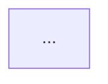

# Mermaid Diagram Converter

Convert Mermaid diagrams from markdown documentation to PNG images with metadata.

## Overview

This utility extracts Mermaid diagrams from `docs/TUTORIAL_DIAGRAMS_SLIDES.md`, renders them as PNG images using mermaid-cli (mmdc), and generates a JSON manifest file containing metadata for each diagram.

**Purpose**: This is a standalone utility tool intended for future extraction into a separate project. It provides diagram conversion functionality independent of the main SparseTag application.

## Features

- **Automated extraction**: Parses markdown to find all Mermaid diagram sections
- **Metadata capture**: Extracts title, summary, purpose, and usage information
- **PNG rendering**: Uses mermaid-cli for high-quality 1024x768px output
- **Manifest generation**: Creates `manifest.json` with all diagram metadata
- **Descriptive filenames**: Generates URL-friendly slugs from diagram titles

## Prerequisites

1. **Python 3.9+** (installed)
2. **Node.js and npm** (installed)
3. **mermaid-cli**: Install globally with:
   ```bash
   npm install -g @mermaid-js/mermaid-cli
   ```

## Installation

No installation required - this is a standalone script. Just ensure prerequisites are met.

## Usage

### Basic Usage

From the project root:

```bash
python tools/diagram-converter/convert_diagrams.py
```

### Output

The script generates:

1. **PNG files** in `docs/diagrams/`:
   - Named using descriptive slugs (e.g., `complete-development-lifecycle.png`)
   - 1024x768px resolution (4:3 aspect ratio)
   - Transparent background
   - 2x scale factor for quality

2. **manifest.json** in `docs/diagrams/`:
   ```json
   {
     "metadata": {
       "total_diagrams": 15,
       "source_file": "docs/TUTORIAL_DIAGRAMS_SLIDES.md",
       "generated_by": "tools/diagram-converter/convert_diagrams.py"
     },
     "diagrams": [
       {
         "number": 1,
         "title": "Complete Development Lifecycle",
         "slug": "complete-development-lifecycle",
         "filename": "complete-development-lifecycle.png",
         "path": "docs/diagrams/complete-development-lifecycle.png",
         "summary": "...",
         "purpose": "...",
         "usage": "..."
       }
     ]
   }
   ```

## How It Works

### 1. Extraction Phase

The script parses `TUTORIAL_DIAGRAMS_SLIDES.md` looking for diagram sections:

```markdown
### 1. Complete Development Lifecycle

**Summary**: This diagram shows...

**Purpose**: Provide 10,000-foot view...

**Usage**: Tutorial introduction...


```

For each section, it extracts:
- **Number**: Diagram sequence number
- **Title**: Section heading text
- **Summary**: Detailed description (after `**Summary**:`)
- **Purpose**: High-level goal (after `**Purpose**:`)
- **Usage**: When/where to use (after `**Usage**:`)
- **Mermaid code**: Content between ` ```mermaid` and ` ``` `

### 2. Slug Generation

Titles are converted to URL-friendly slugs:
- `"Phase 0: Concept to Requirements"` → `"phase-0-concept-to-requirements"`
- `"LLM Plan-Execute-Refine Loop"` → `"llm-plan-execute-refine-loop"`

### 3. Rendering Phase

For each diagram:
1. Write Mermaid code to temporary `.mmd` file
2. Call `mmdc` command-line tool:
   ```bash
   mmdc -i diagram.mmd -o diagram.png -b transparent -w 1024 -H 768 -s 2
   ```
3. Save PNG to `docs/diagrams/{slug}.png`
4. Clean up temporary files

### 4. Manifest Generation

Creates `manifest.json` with:
- Metadata (total count, source file, generator)
- Array of diagram objects with all extracted information
- Relative paths for easy linking

## Configuration

### Image Specifications

Default settings (in `DiagramRenderer.render_diagram()`):
- **Width**: 1024px
- **Height**: 768px (4:3 aspect ratio)
- **Background**: Transparent
- **Scale**: 2x (for quality)

To modify, edit the `mmdc` command parameters in `convert_diagrams.py`:

```python
cmd = [
    'mmdc',
    '-i', str(temp_mmd),
    '-o', str(output_png),
    '-b', 'white',        # Change background color
    '-w', '1920',         # Change width
    '-H', '1080',         # Change height
    '-s', '3'             # Change scale factor
]
```

### Output Directory

Default: `docs/diagrams/`

To change, modify `main()` function:

```python
output_dir = project_root / "docs" / "diagrams"  # Change this path
```

## Troubleshooting

### Error: mermaid-cli (mmdc) not installed

**Solution**: Install mermaid-cli globally:
```bash
npm install -g @mermaid-js/mermaid-cli
```

Verify installation:
```bash
mmdc --version
```

### Error: No diagrams found in markdown file

**Cause**: The markdown file structure doesn't match expected format.

**Expected format**:
- Diagram sections start with `### N. Title`
- Contain `**Summary**:`, `**Purpose**:`, `**Usage**:` sections
- Include ` ```mermaid` code block

### Error: Failed to render diagram

**Common causes**:
1. **Invalid Mermaid syntax**: Check the diagram code renders in Mermaid Live Editor
2. **Missing node_modules**: Ensure mermaid-cli is installed globally, not locally
3. **Path issues**: Run from project root, not from tools directory

### Warning: Diagram rendering succeeds but PNG is blank

**Cause**: Mermaid syntax errors or unsupported features

**Solution**:
1. Copy the Mermaid code to [Mermaid Live Editor](https://mermaid.live)
2. Fix any syntax errors
3. Update the diagram in the markdown file
4. Re-run the converter

## File Structure

```
SparseTagging/
├── tools/
│   └── diagram-converter/
│       ├── convert_diagrams.py    # Main conversion script
│       └── README.md              # This file
├── docs/
│   ├── TUTORIAL_DIAGRAMS_SLIDES.md   # Source markdown file
│   └── diagrams/                     # Generated output
│       ├── .temp/                    # Temporary .mmd files (auto-cleaned)
│       ├── complete-development-lifecycle.png
│       ├── tool-ecosystem-map.png
│       ├── ...                       # All 15+ diagram PNGs
│       └── manifest.json             # Metadata manifest
```

## Future Enhancements

This tool is designed as a standalone utility for potential extraction to a separate project. Future enhancements could include:

- **Batch processing**: Process multiple markdown files
- **Custom templates**: Support different markdown formats
- **Multiple output formats**: SVG, PDF, high-res variants
- **CI/CD integration**: GitHub Actions workflow for automatic regeneration
- **Diagram diffing**: Detect changes and only re-render modified diagrams
- **Web interface**: GUI for diagram management
- **Mermaid validation**: Pre-render syntax checking

## Integration with Tutorial

The generated PNGs and manifest.json are designed for easy integration into tutorial documents:

### Markdown Integration

```markdown
# Phase 0: Requirements


**Summary**: This diagram shows the complete 12-phase development lifecycle...
```

### PowerPoint Integration

1. Import PNG files into slides
2. Use manifest.json metadata as speaker notes or slide text
3. Maintain consistent formatting across all diagrams

### Programmatic Access

```python
import json

# Load manifest
with open('docs/diagrams/manifest.json') as f:
    manifest = json.load(f)

# Find diagram by title
diagram = next(d for d in manifest['diagrams'] if 'Phase 0' in d['title'])
print(f"Path: {diagram['path']}")
print(f"Summary: {diagram['summary']}")
```

## License

This tool follows the same license as the parent SparseTag project.

## Contributing

This is a utility tool intended for future extraction. Contributions should focus on:
- Making it more generic (less SparseTag-specific)
- Improving error handling
- Adding configuration options
- Supporting additional formats

## Related Documentation

- [TUTORIAL_DIAGRAMS_SLIDES.md](../../docs/TUTORIAL_DIAGRAMS_SLIDES.md) - Source markdown with diagrams
- [Mermaid Documentation](https://mermaid.js.org/) - Mermaid diagram syntax reference
- [mermaid-cli Documentation](https://github.com/mermaid-js/mermaid-cli) - CLI tool documentation
